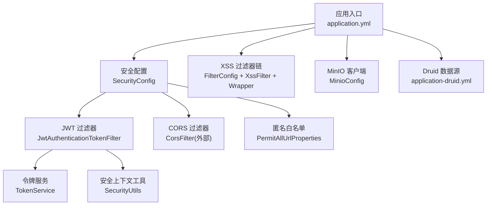
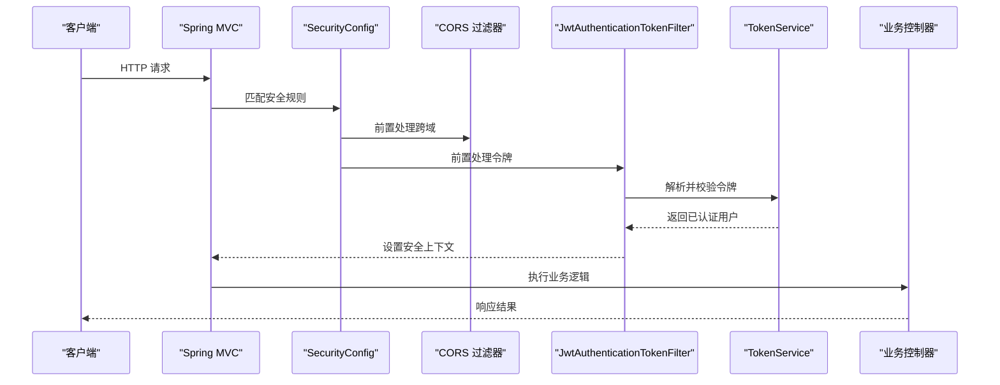
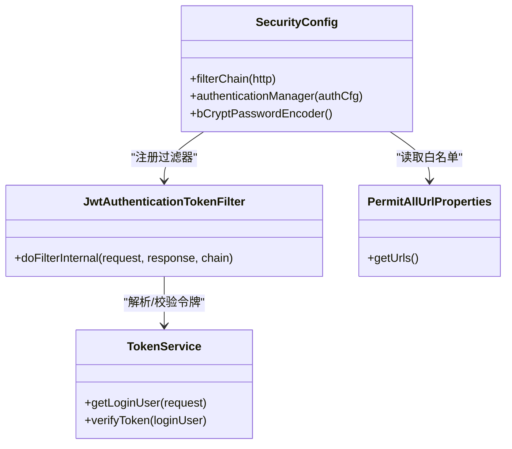
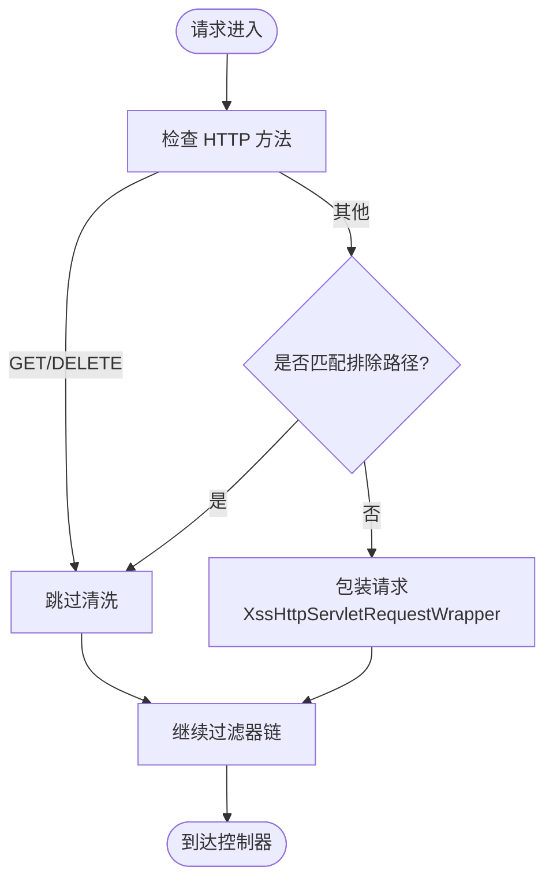
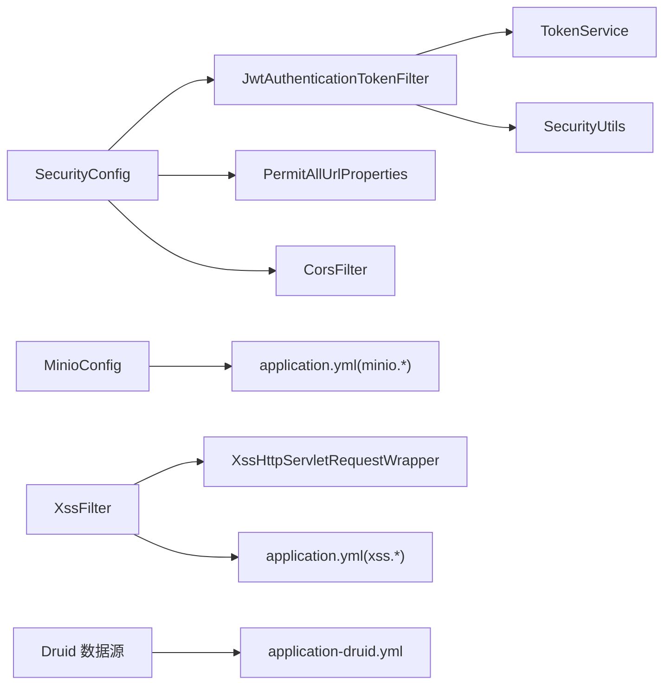

# 安全加固

<cite>
**本文引用的文件**   
- [SecurityConfig.java](file://PezMax-Backend/ruoyi-framework/src/main/java/com/ruoyi/framework/config/SecurityConfig.java)
- [JwtAuthenticationTokenFilter.java](file://PezMax-Backend/ruoyi-framework/src/main/java/com/ruoyi/framework/security/filter/JwtAuthenticationTokenFilter.java)
- [application.yml](file://PezMax-Backend/ruoyi-admin/src/main/resources/application.yml)
- [application-druid.yml](file://PezMax-Backend/ruoyi-admin/src/main/resources/application-druid.yml)
- [MinioConfig.java](file://PezMax-Backend/ruoyi-common/src/main/java/com/ruoyi/common/config/MinioConfig.java)
- [XssFilter.java](file://PezMax-Backend/ruoyi-common/src/main/java/com/ruoyi/common/filter/XssFilter.java)
- [XssHttpServletRequestWrapper.java](file://PezMax-Backend/ruoyi-common/src/main/java/com/ruoyi/common/filter/XssHttpServletRequestWrapper.java)
- [FilterConfig.java](file://PezMax-Backend/ruoyi-framework/src/main/java/com/ruoyi/framework/config/FilterConfig.java)
- [PermitAllUrlProperties.java](file://PezMax-Backend/ruoyi-framework/src/main/java/com/ruoyi/framework/config/properties/PermitAllUrlProperties.java)
- [TokenService.java](file://PezMax-Backend/ruoyi-framework/src/main/java/com/ruoyi/framework/web/service/TokenService.java)
- [SecurityUtils.java](file://PezMax-Backend/ruoyi-common/src/main/java/com/ruoyi/common/utils/SecurityUtils.java)
- [minio-public-policy.json](file://PezMax-Backend/ptmj-datum/src/main/resources/minio-public-policy.json)
</cite>

## 目录
1. [简介](#简介)
2. [项目结构](#项目结构)
3. [核心组件](#核心组件)
4. [架构总览](#架构总览)
5. [详细组件分析](#详细组件分析)
6. [依赖关系分析](#依赖关系分析)
7. [性能与安全权衡](#性能与安全权衡)
8. [故障排查指南](#故障排查指南)
9. [结论](#结论)
10. [附录](#附录)

## 简介
本指南面向企业级安全加固，围绕 Spring Security、JWT 令牌认证、权限控制、CSRF 防护、XSS 防护与输入校验、MinIO 对象存储访问控制与加密传输、SSL/TLS 与 HTTPS 强制跳转、数据库安全配置、敏感信息保护、API 接口防护以及漏洞扫描与渗透测试建议等方面，提供可落地的最佳实践与落地路径。文档同时结合仓库中现有实现进行对照说明，帮助读者快速定位并完善安全策略。

## 项目结构
后端采用多模块组织，安全相关能力主要分布在以下位置：
- 框架层安全配置与过滤器：SecurityConfig、JwtAuthenticationTokenFilter、FilterConfig、PermitAllUrlProperties
- 通用层 XSS 过滤与请求包装：XssFilter、XssHttpServletRequestWrapper
- 应用配置：application.yml（含 token、xss、minio、referer 等）、application-druid.yml（数据源与 Druid）
- MinIO 客户端配置：MinioConfig
- 令牌服务与工具：TokenService、SecurityUtils
- MinIO 桶策略示例：minio-public-policy.json

图表来源
- [SecurityConfig.java:86-120](file://PezMax-Backend/ruoyi-framework/src/main/java/com/ruoyi/framework/config/SecurityConfig.java#L86-L120)
- [JwtAuthenticationTokenFilter.java:31-43](file://PezMax-Backend/ruoyi-framework/src/main/java/com/ruoyi/framework/security/filter/JwtAuthenticationTokenFilter.java#L31-L43)
- [application.yml:95-147](file://PezMax-Backend/ruoyi-admin/src/main/resources/application.yml#L95-L147)
- [application-druid.yml:1-62](file://PezMax-Backend/ruoyi-admin/src/main/resources/application-druid.yml#L1-L62)
- [MinioConfig.java:20-26](file://PezMax-Backend/ruoyi-common/src/main/java/com/ruoyi/common/config/MinioConfig.java#L20-L26)
- [XssFilter.java:44-56](file://PezMax-Backend/ruoyi-common/src/main/java/com/ruoyi/common/filter/XssFilter.java#L44-L56)
- [FilterConfig.java](file://PezMax-Backend/ruoyi-framework/src/main/java/com/ruoyi/framework/config/FilterConfig.java)
- [PermitAllUrlProperties.java](file://PezMax-Backend/ruoyi-framework/src/main/java/com/ruoyi/framework/config/properties/PermitAllUrlProperties.java)
- [TokenService.java](file://PezMax-Backend/ruoyi-framework/src/main/java/com/ruoyi/framework/web/service/TokenService.java)
- [SecurityUtils.java](file://PezMax-Backend/ruoyi-common/src/main/java/com/ruoyi/common/utils/SecurityUtils.java)

章节来源
- [SecurityConfig.java:86-120](file://PezMax-Backend/ruoyi-framework/src/main/java/com/ruoyi/framework/config/SecurityConfig.java#L86-L120)
- [application.yml:95-147](file://PezMax-Backend/ruoyi-admin/src/main/resources/application.yml#L95-L147)
- [application-druid.yml:1-62](file://PezMax-Backend/ruoyi-admin/src/main/resources/application-druid.yml#L1-L62)
- [MinioConfig.java:20-26](file://PezMax-Backend/ruoyi-common/src/main/java/com/ruoyi/common/config/MinioConfig.java#L20-L26)
- [XssFilter.java:44-56](file://PezMax-Backend/ruoyi-common/src/main/java/com/ruoyi/common/filter/XssFilter.java#L44-L56)

## 核心组件
- Spring Security 主配置：禁用 CSRF、无状态会话、异常处理、匿名白名单、静态资源放行、Swagger/Druid 放行、添加 JWT 与 CORS 过滤器、方法级注解启用。
- JWT 过滤器：从请求头解析用户，校验令牌有效性，写入 SecurityContext。
- XSS 过滤器与包装器：对非 GET/DELETE 的请求体参数进行清洗，支持排除路径。
- MinIO 客户端：通过配置注入端点与凭据，构建客户端实例。
- 数据源与监控：Druid 连接池、慢 SQL 记录、控制台登录账号密码。
- 令牌与服务：token 标识、密钥、过期时间；令牌服务负责登录用户获取与校验。

章节来源
- [SecurityConfig.java:86-120](file://PezMax-Backend/ruoyi-framework/src/main/java/com/ruoyi/framework/config/SecurityConfig.java#L86-L120)
- [JwtAuthenticationTokenFilter.java:31-43](file://PezMax-Backend/ruoyi-framework/src/main/java/com/ruoyi/framework/security/filter/JwtAuthenticationTokenFilter.java#L31-L43)
- [XssFilter.java:44-56](file://PezMax-Backend/ruoyi-common/src/main/java/com/ruoyi/common/filter/XssFilter.java#L44-L56)
- [MinioConfig.java:20-26](file://PezMax-Backend/ruoyi-common/src/main/java/com/ruoyi/common/config/MinioConfig.java#L20-L26)
- [application-druid.yml:43-62](file://PezMax-Backend/ruoyi-admin/src/main/resources/application-druid.yml#L43-L62)
- [application.yml:95-102](file://PezMax-Backend/ruoyi-admin/src/main/resources/application.yml#L95-L102)

## 架构总览
下图展示了请求进入后的安全处理链路：CORS → JWT 鉴权 → 业务逻辑；XSS 过滤在 Servlet 层拦截请求体；MinIO 客户端由配置驱动；数据库通过 Druid 管理连接与审计。

图表来源
- [SecurityConfig.java:86-120](file://PezMax-Backend/ruoyi-framework/src/main/java/com/ruoyi/framework/config/SecurityConfig.java#L86-L120)
- [JwtAuthenticationTokenFilter.java:31-43](file://PezMax-Backend/ruoyi-framework/src/main/java/com/ruoyi/framework/security/filter/JwtAuthenticationTokenFilter.java#L31-L43)
- [TokenService.java](file://PezMax-Backend/ruoyi-framework/src/main/java/com/ruoyi/framework/web/service/TokenService.java)

## 详细组件分析

### Spring Security 与 JWT 认证
- 无状态会话：使用 STATELESS 策略，避免服务端保存会话。
- CSRF 防护：当前为禁用状态，适用于纯 API 场景；若引入表单或页面交互需重新评估。
- 匿名白名单：通过 PermitAllUrlProperties 动态加载，并在配置中显式放行登录、注册、验证码、部分找回密码接口、静态资源与 Swagger/Druid。
- 方法级安全：启用 @PreAuthorize/@Secured 等注解，便于细粒度授权。
- 异常处理：自定义未认证处理器，统一返回错误格式。
- 过滤器顺序：CORS 先于 JWT，确保跨域预检正常；Logout 也受 CORS 影响。

图表来源
- [SecurityConfig.java:86-120](file://PezMax-Backend/ruoyi-framework/src/main/java/com/ruoyi/framework/config/SecurityConfig.java#L86-L120)
- [JwtAuthenticationTokenFilter.java:31-43](file://PezMax-Backend/ruoyi-framework/src/main/java/com/ruoyi/framework/security/filter/JwtAuthenticationTokenFilter.java#L31-L43)
- [PermitAllUrlProperties.java](file://PezMax-Backend/ruoyi-framework/src/main/java/com/ruoyi/framework/config/properties/PermitAllUrlProperties.java)
- [TokenService.java](file://PezMax-Backend/ruoyi-framework/src/main/java/com/ruoyi/framework/web/service/TokenService.java)

章节来源
- [SecurityConfig.java:86-120](file://PezMax-Backend/ruoyi-framework/src/main/java/com/ruoyi/framework/config/SecurityConfig.java#L86-L120)
- [JwtAuthenticationTokenFilter.java:31-43](file://PezMax-Backend/ruoyi-framework/src/main/java/com/ruoyi/framework/security/filter/JwtAuthenticationTokenFilter.java#L31-L43)
- [application.yml:95-102](file://PezMax-Backend/ruoyi-admin/src/main/resources/application.yml#L95-L102)

### 权限控制与访问策略
- URL 级控制：基于 permitAll 与 anyRequest().authenticated() 的默认拒绝策略。
- 方法级控制：启用 prePostEnabled/securedEnabled，可在 Controller 方法上使用注解进行角色/权限校验。
- 数据范围控制：项目中存在数据权限切面，可按部门/角色限制数据可见范围（具体实现见对应切面类）。

章节来源
- [SecurityConfig.java:86-120](file://PezMax-Backend/ruoyi-framework/src/main/java/com/ruoyi/framework/config/SecurityConfig.java#L86-L120)
- [SecurityConfig.java:27-27](file://PezMax-Backend/ruoyi-framework/src/main/java/com/ruoyi/framework/config/SecurityConfig.java#L27-L27)

### CSRF 防护现状与建议
- 现状：已禁用 CSRF，适合前后端分离且仅使用无状态令牌的场景。
- 建议：
  - 若前端为 SPA 并通过 Authorization 头携带令牌，保持禁用是合理的。
  - 若存在传统表单提交或 Cookie 认证，应恢复 CSRF 保护或使用 SameSite Cookie 策略配合。

章节来源
- [SecurityConfig.java:89-90](file://PezMax-Backend/ruoyi-framework/src/main/java/com/ruoyi/framework/config/SecurityConfig.java#L89-L90)

### XSS 攻击防护与输入验证
- 过滤器：XssFilter 针对非 GET/DELETE 请求进行参数清洗，支持 excludes 列表跳过特定路径。
- 包装器：XssHttpServletRequestWrapper 对请求参数进行转义/清理。
- 开关与匹配：application.yml 中 xss.enabled/urlPatterns/excludes 控制生效范围。
- 建议：
  - 对富文本场景谨慎开启全局过滤，必要时按接口精细化控制。
  - 输出侧仍需做 HTML 转义或 CSP 策略，形成纵深防御。

图表来源
- [XssFilter.java:44-68](file://PezMax-Backend/ruoyi-common/src/main/java/com/ruoyi/common/filter/XssFilter.java#L44-L68)
- [XssHttpServletRequestWrapper.java](file://PezMax-Backend/ruoyi-common/src/main/java/com/ruoyi/common/filter/XssHttpServletRequestWrapper.java)
- [application.yml:140-147](file://PezMax-Backend/ruoyi-admin/src/main/resources/application.yml#L140-L147)

章节来源
- [XssFilter.java:44-68](file://PezMax-Backend/ruoyi-common/src/main/java/com/ruoyi/common/filter/XssFilter.java#L44-L68)
- [application.yml:140-147](file://PezMax-Backend/ruoyi-admin/src/main/resources/application.yml#L140-L147)

### MinIO 对象存储安全策略
- 客户端配置：MinioConfig 从 application.yml 读取 endpoint、accessKey、secretKey 并构建客户端。
- 访问控制：建议为不同业务创建独立 Bucket，最小权限原则分配策略；公开读可通过 minio-public-policy.json 定义，但需谨慎暴露。
- 加密传输：MinIO 部署建议使用 HTTPS（TLS），客户端通过 https://endpoint 访问；若内网可信环境可使用 http，但需网络隔离。
- 建议：
  - 将 accessKey/secretKey 放入环境变量或密钥管理服务，避免硬编码。
  - 为上传/下载生成短期签名 URL，减少长期凭据暴露风险。

章节来源
- [MinioConfig.java:20-26](file://PezMax-Backend/ruoyi-common/src/main/java/com/ruoyi/common/config/MinioConfig.java#L20-L26)
- [application.yml:149-154](file://PezMax-Backend/ruoyi-admin/src/main/resources/application.yml#L149-L154)
- [minio-public-policy.json](file://PezMax-Backend/ptmj-datum/src/main/resources/minio-public-policy.json)

### SSL/TLS 证书与 HTTPS 强制跳转
- 现状：application.yml 未配置 server.ssl.*，默认以 HTTP 运行。
- 建议：
  - 在 application.yml 中启用 server.ssl，配置 keystore-path、keystore-password、key-alias 等。
  - 在网关/Nginx 层强制 HTTPS 跳转，并启用 HSTS、安全响应头（如 X-Content-Type-Options、X-Frame-Options、Referrer-Policy、Content-Security-Policy）。
  - 若容器化部署，推荐由反向代理统一管理证书与 TLS 终止。

章节来源
- [application.yml:17-32](file://PezMax-Backend/ruoyi-admin/src/main/resources/application.yml#L17-L32)

### 数据库安全配置
- 连接参数：application-druid.yml 中 master.url 包含 useUnicode、characterEncoding、serverTimezone 等；useSSL=false 表示未启用数据库 TLS。
- 凭据管理：用户名与密码明文配置，建议迁移至环境变量或密钥管理系统。
- 连接池与审计：Druid 统计、慢 SQL 记录已启用；控制台登录账号密码需强口令并限制访问 IP。
- 建议：
  - 启用数据库 TLS（useSSL=true，配置 truststore/cacerts）。
  - 最小权限原则授予数据库账户。
  - 定期轮换凭据，禁止共享账号。

章节来源
- [application-druid.yml:8-11](file://PezMax-Backend/ruoyi-admin/src/main/resources/application-druid.yml#L8-L11)
- [application-druid.yml:43-62](file://PezMax-Backend/ruoyi-admin/src/main/resources/application-druid.yml#L43-L62)

### 敏感信息加密与日志脱敏
- 密码哈希：SecurityConfig 提供 BCryptPasswordEncoder Bean，用于密码强散列。
- 敏感字段序列化：common 模块提供敏感字段序列化器，可对输出进行脱敏。
- 建议：
  - 对所有敏感配置（DB、Redis、MinIO、第三方 API）使用环境变量或密钥管理服务。
  - 日志中避免打印完整令牌、密码、身份证号等敏感信息。

章节来源
- [SecurityConfig.java:125-129](file://PezMax-Backend/ruoyi-framework/src/main/java/com/ruoyi/framework/config/SecurityConfig.java#L125-L129)
- [application.yml:95-102](file://PezMax-Backend/ruoyi-admin/src/main/resources/application.yml#L95-L102)

### API 接口安全防护
- 防重放/重复提交：项目包含重复提交拦截器与切面，可用于幂等性保护。
- 限流：RateLimiter 注解与切面可用于接口级别限流。
- 防盗链：referer 开关与允许域名列表，可限制非法来源。
- 建议：
  - 对关键写接口增加签名校验与时间戳校验。
  - 统一错误码与最小化错误信息输出。
  - 对大文件上传增加大小限制与类型白名单。

章节来源
- [application.yml:133-138](file://PezMax-Backend/ruoyi-admin/src/main/resources/application.yml#L133-L138)
- [application.yml:57-62](file://PezMax-Backend/ruoyi-admin/src/main/resources/application.yml#L57-L62)

## 依赖关系分析
- SecurityConfig 依赖 JwtAuthenticationTokenFilter、PermitAllUrlProperties、CorsFilter、LogoutSuccessHandlerImpl、AuthenticationEntryPointImpl。
- JwtAuthenticationTokenFilter 依赖 TokenService 与 SecurityUtils。
- MinioConfig 依赖 application.yml 中的 minio.* 配置。
- XssFilter 依赖 XssHttpServletRequestWrapper 与配置项 xss.*。
- Druid 数据源依赖 application-druid.yml 中的连接与监控配置。

图表来源
- [SecurityConfig.java:86-120](file://PezMax-Backend/ruoyi-framework/src/main/java/com/ruoyi/framework/config/SecurityConfig.java#L86-L120)
- [JwtAuthenticationTokenFilter.java:31-43](file://PezMax-Backend/ruoyi-framework/src/main/java/com/ruoyi/framework/security/filter/JwtAuthenticationTokenFilter.java#L31-L43)
- [MinioConfig.java:20-26](file://PezMax-Backend/ruoyi-common/src/main/java/com/ruoyi/common/config/MinioConfig.java#L20-L26)
- [XssFilter.java:44-56](file://PezMax-Backend/ruoyi-common/src/main/java/com/ruoyi/common/filter/XssFilter.java#L44-L56)
- [application.yml:95-147](file://PezMax-Backend/ruoyi-admin/src/main/resources/application.yml#L95-L147)
- [application-druid.yml:1-62](file://PezMax-Backend/ruoyi-admin/src/main/resources/application-druid.yml#L1-L62)

## 性能与安全权衡
- 无状态令牌：提升水平扩展能力，但需妥善管理令牌刷新与黑名单机制。
- XSS 过滤：全局过滤可能带来额外 CPU 开销，建议按接口精准开启。
- Druid 监控：慢 SQL 记录有助于优化，但生产环境需限制控制台访问并关闭不必要功能。
- 文件上传：合理设置 max-file-size/max-request-size，防止资源耗尽。

[本节为通用指导，不直接分析具体文件]

## 故障排查指南
- 401/403 问题：检查 JWT 过滤器是否正确解析请求头、TokenService 校验逻辑、白名单配置与路由匹配。
- 跨域失败：确认 CORS 过滤器顺序与允许的 Origin/Methods/Headers。
- XSS 误伤：核对 xss.excludes 与 urlPatterns，必要时缩小过滤范围。
- MinIO 连接失败：检查 endpoint、accessKey、secretKey 与网络连通性，确认是否使用 https。
- 数据库连接异常：核对 useSSL、serverTimezone、allowPublicKeyRetrieval 等参数，检查凭据与防火墙。

章节来源
- [JwtAuthenticationTokenFilter.java:31-43](file://PezMax-Backend/ruoyi-framework/src/main/java/com/ruoyi/framework/security/filter/JwtAuthenticationTokenFilter.java#L31-L43)
- [application.yml:95-147](file://PezMax-Backend/ruoyi-admin/src/main/resources/application.yml#L95-L147)
- [application-druid.yml:8-11](file://PezMax-Backend/ruoyi-admin/src/main/resources/application-druid.yml#L8-L11)

## 结论
本项目已具备基础的安全能力：无状态 JWT 认证、XSS 过滤、MinIO 客户端、Druid 监控与基本白名单策略。为达到企业级安全标准，建议进一步完善 HTTPS 强制跳转、数据库 TLS、敏感信息外置、最小权限策略、签名与限流、安全响应头与内容安全策略，并建立常态化的漏洞扫描与渗透测试流程。

[本节为总结性内容，不直接分析具体文件]

## 附录
- 安全清单建议
  - 启用 HTTPS 与 HSTS，配置安全响应头
  - 令牌签名算法与密钥强度升级，定期轮换
  - 数据库启用 TLS，最小权限账户，定期审计
  - MinIO 使用 HTTPS，分桶分权限，短期签名链接
  - 接口签名、限流、防重放、IP 白名单
  - 日志脱敏与集中审计
  - 依赖组件漏洞扫描与基线核查
  - 渗透测试覆盖：认证绕过、越权、注入、XSS、CSRF、文件上传、SSRF、反序列化等

[本节为通用建议，不直接分析具体文件]