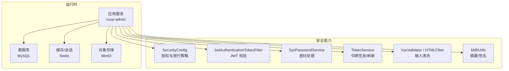
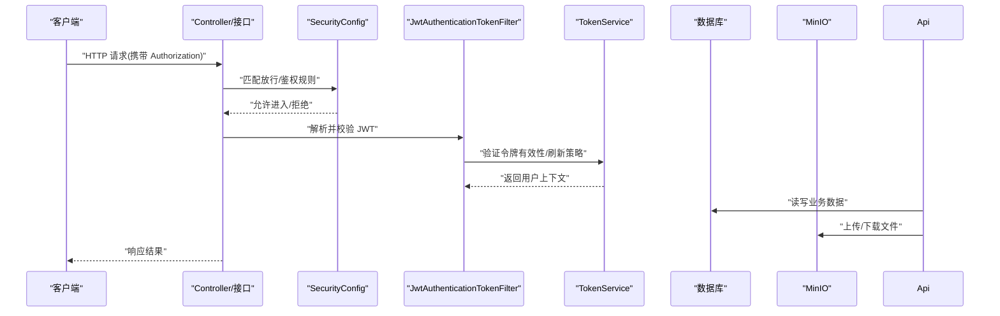
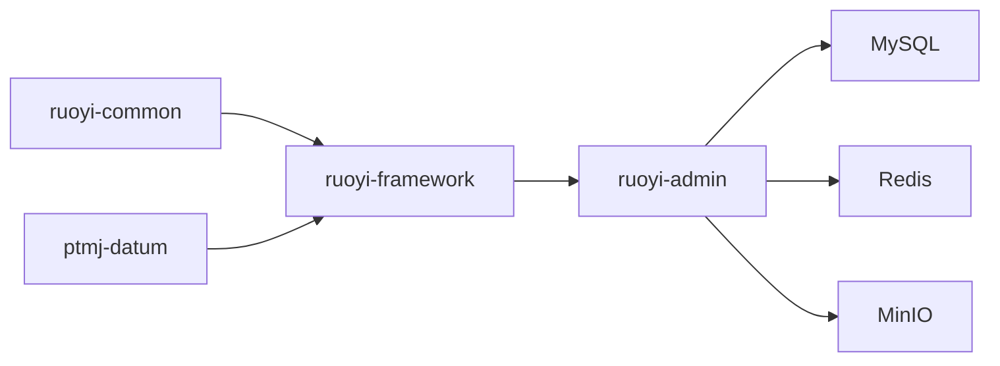

# 安全最佳实践

<cite>
**本文引用的文件**   
- [PezMax-Backend/README.md](file://PezMax-Backend/README.md)
- [PezMax-Backend/compose.yaml](file://PezMax-Backend/compose.yaml)
- [PezMax-Backend/Dockerfile](file://PezMax-Backend/Dockerfile)
- [PezMax-Backend/.dockerignore](file://PezMax-Backend/.dockerignore)
- [PezMax-Backend/pom.xml](file://PezMax-Backend/pom.xml)
- [PezMax-Backend/ruoyi-admin/src/main/resources/application.yml](file://PezMax-Backend/ruoyi-admin/src/main/resources/application.yml)
- [PezMax-Backend/ruoyi-admin/src/main/resources/application-druid.yml](file://PezMax-Backend/ruoyi-admin/src/main/resources/application-druid.yml)
- [PezMax-Backend/ruoyi-framework/src/main/java/com/ruoyi/framework/config/SecurityConfig.java](file://PezMax-Backend/ruoyi-framework/src/main/java/com/ruoyi/framework/config/SecurityConfig.java)
- [PezMax-Backend/ruoyi-framework/src/main/java/com/ruoyi/framework/security/filter/JwtAuthenticationTokenFilter.java](file://PezMax-Backend/ruoyi-framework/src/main/java/com/ruoyi/framework/security/filter/JwtAuthenticationTokenFilter.java)
- [PezMax-Backend/ruoyi-framework/src/main/java/com/ruoyi/framework/web/service/SysPasswordService.java](file://PezMax-Backend/ruoyi-framework/src/main/java/com/ruoyi/framework/web/service/SysPasswordService.java)
- [PezMax-Backend/ruoyi-framework/src/main/java/com/ruoyi/framework/web/service/TokenService.java](file://PezMax-Backend/ruoyi-framework/src/main/java/com/ruoyi/framework/web/service/TokenService.java)
- [PezMax-Backend/ruoyi-common/src/main/java/com/ruoyi/common/xss/XssValidator.java](file://PezMax-Backend/ruoyi-common/src/main/java/com/ruoyi/common/xss/XssValidator.java)
- [PezMax-Backend/ruoyi-common/src/main/java/com/ruoyi/common/utils/html/HTMLFilter.java](file://PezMax-Backend/ruoyi-common/src/main/java/com/ruoyi/common/utils/html/HTMLFilter.java)
- [PezMax-Backend/ruoyi-common/src/main/java/com/ruoyi/common/utils/sign/Md5Utils.java](file://PezMax-Backend/ruoyi-common/src/main/java/com/ruoyi/common/utils/sign/Md5Utils.java)
- [PezMax-Backend/ptmj-datum/src/main/resources/minio-public-policy.json](file://PezMax-Backend/ptmj-datum/src/main/resources/minio-public-policy.json)
</cite>

## 目录
1. [简介](#简介)
2. [项目结构](#项目结构)
3. [核心组件](#核心组件)
4. [架构总览](#架构总览)
5. [详细组件分析](#详细组件分析)
6. [依赖关系分析](#依赖关系分析)
7. [性能与安全权衡](#性能与安全权衡)
8. [故障排查指南](#故障排查指南)
9. [结论](#结论)
10. [附录](#附录)

## 简介
本指南面向企业级应用的安全开发，结合当前仓库（基于 Spring Boot + Spring Security + JWT + Redis + MinIO）的实际实现，沉淀密码安全策略、会话安全管理、API 安全设计原则、漏洞扫描与渗透测试流程、安全编码规范、配置检查清单、代码审查要点、事件应急响应流程，以及第三方依赖审计、容器加固与云原生安全部署等现代实践。目标是帮助团队在研发全生命周期中持续降低安全风险、提升可观测性与可恢复性。

## 项目结构
后端采用多模块 Maven 工程，核心安全能力集中在框架层与通用工具层：
- 框架层：Spring Security 配置、JWT 过滤器、登录/密码服务、令牌服务
- 通用层：XSS 校验与过滤、HTML 清理、签名与哈希工具
- 业务层：对象存储策略（MinIO）、匿名访问控制注解
- 运行环境：Docker Compose 编排、镜像构建与忽略规则

图表来源
- [PezMax-Backend/ruoyi-framework/src/main/java/com/ruoyi/framework/config/SecurityConfig.java](file://PezMax-Backend/ruoyi-framework/src/main/java/com/ruoyi/framework/config/SecurityConfig.java)
- [PezMax-Backend/ruoyi-framework/src/main/java/com/ruoyi/framework/security/filter/JwtAuthenticationTokenFilter.java](file://PezMax-Backend/ruoyi-framework/src/main/java/com/ruoyi/framework/security/filter/JwtAuthenticationTokenFilter.java)
- [PezMax-Backend/ruoyi-framework/src/main/java/com/ruoyi/framework/web/service/SysPasswordService.java](file://PezMax-Backend/ruoyi-framework/src/main/java/com/ruoyi/framework/web/service/SysPasswordService.java)
- [PezMax-Backend/ruoyi-framework/src/main/java/com/ruoyi/framework/web/service/TokenService.java](file://PezMax-Backend/ruoyi-framework/src/main/java/com/ruoyi/framework/web/service/TokenService.java)
- [PezMax-Backend/ruoyi-common/src/main/java/com/ruoyi/common/xss/XssValidator.java](file://PezMax-Backend/ruoyi-common/src/main/java/com/ruoyi/common/xss/XssValidator.java)
- [PezMax-Backend/ruoyi-common/src/main/java/com/ruoyi/common/utils/html/HTMLFilter.java](file://PezMax-Backend/ruoyi-common/src/main/java/com/ruoyi/common/utils/html/HTMLFilter.java)
- [PezMax-Backend/ruoyi-common/src/main/java/com/ruoyi/common/utils/sign/Md5Utils.java](file://PezMax-Backend/ruoyi-common/src/main/java/com/ruoyi/common/utils/sign/Md5Utils.java)

章节来源
- [PezMax-Backend/README.md:13-44](file://PezMax-Backend/README.md#L13-L44)
- [PezMax-Backend/README.md:76-89](file://PezMax-Backend/README.md#L76-L89)

## 核心组件
- 认证与授权
  - SecurityConfig：集中定义放行路径、鉴权规则、跨域与异常处理
  - JwtAuthenticationTokenFilter：请求进入时解析并校验 JWT，填充认证上下文
  - TokenService：负责令牌生成、刷新、过期管理与黑名单/失效策略
  - SysPasswordService：负责密码加盐、强度校验与比对
- 输入与输出安全
  - XssValidator：对入参进行 XSS 检测与拦截
  - HTMLFilter：对富文本/HTML 内容进行白名单过滤
  - Md5Utils：提供摘要计算（注意：仅用于非敏感场景或作为签名辅助）
- 外部依赖与存储
  - MinIO 公开策略：minio-public-policy.json 控制桶的读权限
  - Docker 编排与镜像：compose.yaml、Dockerfile、.dockerignore

章节来源
- [PezMax-Backend/ruoyi-framework/src/main/java/com/ruoyi/framework/config/SecurityConfig.java](file://PezMax-Backend/ruoyi-framework/src/main/java/com/ruoyi/framework/config/SecurityConfig.java)
- [PezMax-Backend/ruoyi-framework/src/main/java/com/ruoyi/framework/security/filter/JwtAuthenticationTokenFilter.java](file://PezMax-Backend/ruoyi-framework/src/main/java/com/ruoyi/framework/security/filter/JwtAuthenticationTokenFilter.java)
- [PezMax-Backend/ruoyi-framework/src/main/java/com/ruoyi/framework/web/service/TokenService.java](file://PezMax-Backend/ruoyi-framework/src/main/java/com/ruoyi/framework/web/service/TokenService.java)
- [PezMax-Backend/ruoyi-framework/src/main/java/com/ruoyi/framework/web/service/SysPasswordService.java](file://PezMax-Backend/ruoyi-framework/src/main/java/com/ruoyi/framework/web/service/SysPasswordService.java)
- [PezMax-Backend/ruoyi-common/src/main/java/com/ruoyi/common/xss/XssValidator.java](file://PezMax-Backend/ruoyi-common/src/main/java/com/ruoyi/common/xss/XssValidator.java)
- [PezMax-Backend/ruoyi-common/src/main/java/com/ruoyi/common/utils/html/HTMLFilter.java](file://PezMax-Backend/ruoyi-common/src/main/java/com/ruoyi/common/utils/html/HTMLFilter.java)
- [PezMax-Backend/ruoyi-common/src/main/java/com/ruoyi/common/utils/sign/Md5Utils.java](file://PezMax-Backend/ruoyi-common/src/main/java/com/ruoyi/common/utils/sign/Md5Utils.java)
- [PezMax-Backend/ptmj-datum/src/main/resources/minio-public-policy.json](file://PezMax-Backend/ptmj-datum/src/main/resources/minio-public-policy.json)

## 架构总览
下图展示一次受保护的 API 调用从客户端到后端的完整链路，包括 JWT 校验、权限判定与数据落盘/对象存储交互。

图表来源
- [PezMax-Backend/ruoyi-framework/src/main/java/com/ruoyi/framework/config/SecurityConfig.java](file://PezMax-Backend/ruoyi-framework/src/main/java/com/ruoyi/framework/config/SecurityConfig.java)
- [PezMax-Backend/ruoyi-framework/src/main/java/com/ruoyi/framework/security/filter/JwtAuthenticationTokenFilter.java](file://PezMax-Backend/ruoyi-framework/src/main/java/com/ruoyi/framework/security/filter/JwtAuthenticationTokenFilter.java)
- [PezMax-Backend/ruoyi-framework/src/main/java/com/ruoyi/framework/web/service/TokenService.java](file://PezMax-Backend/ruoyi-framework/src/main/java/com/ruoyi/framework/web/service/TokenService.java)

## 详细组件分析

### 密码安全策略
- 密码存储与校验
  - 使用不可逆算法进行加盐与散列，禁止明文存储；建议采用强哈希算法（如 BCrypt/Argon2），避免仅用 MD5 存储密码
  - 密码强度校验：长度、复杂度、历史重复、常见弱口令检测
- 传输与本地保护
  - 强制 HTTPS/TLS，前端对敏感字段进行加密后再发送
  - 本地不持久化明文密码，必要时使用系统密钥管理服务
- 防暴力破解
  - 登录失败次数限制、验证码、IP 封禁、账号锁定策略
- 参考实现位置
  - 密码服务：[SysPasswordService.java](file://PezMax-Backend/ruoyi-framework/src/main/java/com/ruoyi/framework/web/service/SysPasswordService.java)
  - 摘要工具：[Md5Utils.java](file://PezMax-Backend/ruoyi-common/src/main/java/com/ruoyi/common/utils/sign/Md5Utils.java)

章节来源
- [PezMax-Backend/ruoyi-framework/src/main/java/com/ruoyi/framework/web/service/SysPasswordService.java](file://PezMax-Backend/ruoyi-framework/src/main/java/com/ruoyi/framework/web/service/SysPasswordService.java)
- [PezMax-Backend/ruoyi-common/src/main/java/com/ruoyi/common/utils/sign/Md5Utils.java](file://PezMax-Backend/ruoyi-common/src/main/java/com/ruoyi/common/utils/sign/Md5Utils.java)

### 会话与令牌管理
- JWT 生命周期
  - 签发：包含最小必要声明、短期有效期、可刷新机制
  - 校验：统一过滤器解析、验签、时间戳与黑名单检查
  - 刷新：滑动窗口或主动刷新，避免长驻令牌泄露风险
- 会话状态
  - 将关键状态（如黑名单、在线列表）置于 Redis，支持分布式一致性
- 参考实现位置
  - 过滤器：[JwtAuthenticationTokenFilter.java](file://PezMax-Backend/ruoyi-framework/src/main/java/com/ruoyi/framework/security/filter/JwtAuthenticationTokenFilter.java)
  - 令牌服务：[TokenService.java](file://PezMax-Backend/ruoyi-framework/src/main/java/com/ruoyi/framework/web/service/TokenService.java)

章节来源
- [PezMax-Backend/ruoyi-framework/src/main/java/com/ruoyi/framework/security/filter/JwtAuthenticationTokenFilter.java](file://PezMax-Backend/ruoyi-framework/src/main/java/com/ruoyi/framework/security/filter/JwtAuthenticationTokenFilter.java)
- [PezMax-Backend/ruoyi-framework/src/main/java/com/ruoyi/framework/web/service/TokenService.java](file://PezMax-Backend/ruoyi-framework/src/main/java/com/ruoyi/framework/web/service/TokenService.java)

### API 安全设计原则
- 最小权限与默认拒绝
  - 通过 SecurityConfig 显式放行必要路径，其余默认拒绝
- 输入验证与输出编码
  - 统一 XSS 校验与 HTML 过滤，避免注入与渲染型攻击
- 速率限制与幂等
  - 针对登录、注册、文件上传等高危接口限流与防重放
- 参考实现位置
  - 安全配置：[SecurityConfig.java](file://PezMax-Backend/ruoyi-framework/src/main/java/com/ruoyi/framework/config/SecurityConfig.java)
  - XSS 校验：[XssValidator.java](file://PezMax-Backend/ruoyi-common/src/main/java/com/ruoyi/common/xss/XssValidator.java)
  - HTML 过滤：[HTMLFilter.java](file://PezMax-Backend/ruoyi-common/src/main/java/com/ruoyi/common/utils/html/HTMLFilter.java)

章节来源
- [PezMax-Backend/ruoyi-framework/src/main/java/com/ruoyi/framework/config/SecurityConfig.java](file://PezMax-Backend/ruoyi-framework/src/main/java/com/ruoyi/framework/config/SecurityConfig.java)
- [PezMax-Backend/ruoyi-common/src/main/java/com/ruoyi/common/xss/XssValidator.java](file://PezMax-Backend/ruoyi-common/src/main/java/com/ruoyi/common/xss/XssValidator.java)
- [PezMax-Backend/ruoyi-common/src/main/java/com/ruoyi/common/utils/html/HTMLFilter.java](file://PezMax-Backend/ruoyi-common/src/main/java/com/ruoyi/common/utils/html/HTMLFilter.java)

### 对象存储安全（MinIO）
- 桶策略最小化
  - 仅开放必要的读取权限，避免全局公开；私有桶需带签名访问
- 网络隔离
  - 内网访问优先，控制台端口仅对内暴露
- 参考实现位置
  - 公开策略示例：[minio-public-policy.json](file://PezMax-Backend/ptmj-datum/src/main/resources/minio-public-policy.json)

章节来源
- [PezMax-Backend/ptmj-datum/src/main/resources/minio-public-policy.json](file://PezMax-Backend/ptmj-datum/src/main/resources/minio-public-policy.json)

### 安全编码规范
- 输入验证
  - 服务端严格校验类型、长度、格式、枚举值；对富文本走白名单过滤
- 输出编码
  - 按上下文进行 HTML/JS/CSS 编码，防止 XSS
- 错误处理
  - 统一异常处理器，对外只返回必要信息，内部记录详细日志
- 参考实现位置
  - XSS 校验：[XssValidator.java](file://PezMax-Backend/ruoyi-common/src/main/java/com/ruoyi/common/xss/XssValidator.java)
  - HTML 过滤：[HTMLFilter.java](file://PezMax-Backend/ruoyi-common/src/main/java/com/ruoyi/common/utils/html/HTMLFilter.java)

章节来源
- [PezMax-Backend/ruoyi-common/src/main/java/com/ruoyi/common/xss/XssValidator.java](file://PezMax-Backend/ruoyi-common/src/main/java/com/ruoyi/common/xss/XssValidator.java)
- [PezMax-Backend/ruoyi-common/src/main/java/com/ruoyi/common/utils/html/HTMLFilter.java](file://PezMax-Backend/ruoyi-common/src/main/java/com/ruoyi/common/utils/html/HTMLFilter.java)

### 安全配置检查清单
- 应用配置
  - 关闭调试端点、禁用危险 Actuator 端点、开启 HTTPS
  - 数据库连接池启用 SSL、最小连接数与最大空闲合理设置
  - Redis 启用认证与绑定内网地址
- 参考实现位置
  - 应用主配置：[application.yml](file://PezMax-Backend/ruoyi-admin/src/main/resources/application.yml)
  - 数据源配置：[application-druid.yml](file://PezMax-Backend/ruoyi-admin/src/main/resources/application-druid.yml)

章节来源
- [PezMax-Backend/ruoyi-admin/src/main/resources/application.yml](file://PezMax-Backend/ruoyi-admin/src/main/resources/application.yml)
- [PezMax-Backend/ruoyi-admin/src/main/resources/application-druid.yml](file://PezMax-Backend/ruoyi-admin/src/main/resources/application-druid.yml)

### 安全代码审查要点
- 鉴权与授权
  - 是否遵循“默认拒绝”；是否对敏感操作做二次校验
- 令牌与会话
  - 是否短时效、可刷新、可撤销；是否记录关键审计日志
- 输入输出
  - 是否统一校验与过滤；是否存在直接拼接 SQL/命令/模板
- 第三方依赖
  - 是否引入已知高危版本；是否定期更新与替换
- 参考实现位置
  - 安全配置与过滤器：[SecurityConfig.java](file://PezMax-Backend/ruoyi-framework/src/main/java/com/ruoyi/framework/config/SecurityConfig.java)、[JwtAuthenticationTokenFilter.java](file://PezMax-Backend/ruoyi-framework/src/main/java/com/ruoyi/framework/security/filter/JwtAuthenticationTokenFilter.java)

章节来源
- [PezMax-Backend/ruoyi-framework/src/main/java/com/ruoyi/framework/config/SecurityConfig.java](file://PezMax-Backend/ruoyi-framework/src/main/java/com/ruoyi/framework/config/SecurityConfig.java)
- [PezMax-Backend/ruoyi-framework/src/main/java/com/ruoyi/framework/security/filter/JwtAuthenticationTokenFilter.java](file://PezMax-Backend/ruoyi-framework/src/main/java/com/ruoyi/framework/security/filter/JwtAuthenticationTokenFilter.java)

### 安全事件应急响应流程
- 发现与分级
  - 监控告警、日志审计、威胁情报触发；按影响面与敏感度分级
- 抑制与处置
  - 快速封禁 IP/账号、吊销令牌、下线受影响接口或服务
- 根因分析与修复
  - 复现问题、定位漏洞、发布补丁与回滚预案
- 复盘与改进
  - 更新基线、完善检测规则、补充演练用例
- 参考实现位置
  - 令牌吊销/黑名单：[TokenService.java](file://PezMax-Backend/ruoyi-framework/src/main/java/com/ruoyi/framework/web/service/TokenService.java)

章节来源
- [PezMax-Backend/ruoyi-framework/src/main/java/com/ruoyi/framework/web/service/TokenService.java](file://PezMax-Backend/ruoyi-framework/src/main/java/com/ruoyi/framework/web/service/TokenService.java)

### 漏洞扫描与渗透测试流程
- 静态扫描（SAST）
  - 集成至 CI，对 Java/JS 源码进行规则扫描，阻断高危缺陷合并
- 动态扫描（DAST）
  - 对预发/测试环境进行自动化扫描，覆盖登录、文件上传、导出等高危入口
- 依赖扫描（SCA）
  - 对 Maven/Node 依赖进行 CVE 扫描，设定阈值与自动 PR
- 渗透测试
  - 红蓝对抗、授权渗透、回归验证；形成报告与整改闭环
- 参考实现位置
  - 依赖与构建：[pom.xml](file://PezMax-Backend/pom.xml)

章节来源
- [PezMax-Backend/pom.xml](file://PezMax-Backend/pom.xml)

### 容器安全加固与云原生部署
- 镜像构建
  - 使用多阶段构建、最小基础镜像、非 root 用户运行、固定依赖版本
- 编排与网络
  - 仅暴露必要端口、内网互通、健康检查与资源限制
- 安全基线
  - 镜像签名、漏洞扫描门禁、运行时最小权限
- 参考实现位置
  - 编排：[compose.yaml](file://PezMax-Backend/compose.yaml)
  - 镜像：[Dockerfile](file://PezMax-Backend/Dockerfile)
  - 忽略规则：[.dockerignore](file://PezMax-Backend/.dockerignore)

章节来源
- [PezMax-Backend/compose.yaml](file://PezMax-Backend/compose.yaml)
- [PezMax-Backend/Dockerfile](file://PezMax-Backend/Dockerfile)
- [PezMax-Backend/.dockerignore](file://PezMax-Backend/.dockerignore)

## 依赖关系分析
- 模块耦合
  - ruoyi-framework 依赖 ruoyi-common 提供的工具与过滤器
  - 业务模块 ptmj-datum 依赖框架层安全能力与对象存储策略
- 外部依赖
  - MySQL、Redis、MinIO 为关键外部依赖，需纳入安全基线与监控
- 潜在风险
  - 过度开放的匿名访问路径、过大的公开桶策略、未限制的管理端口

图表来源
- [PezMax-Backend/ruoyi-common/src/main/java/com/ruoyi/common/xss/XssValidator.java](file://PezMax-Backend/ruoyi-common/src/main/java/com/ruoyi/common/xss/XssValidator.java)
- [PezMax-Backend/ruoyi-framework/src/main/java/com/ruoyi/framework/config/SecurityConfig.java](file://PezMax-Backend/ruoyi-framework/src/main/java/com/ruoyi/framework/config/SecurityConfig.java)
- [PezMax-Backend/ptmj-datum/src/main/resources/minio-public-policy.json](file://PezMax-Backend/ptmj-datum/src/main/resources/minio-public-policy.json)

章节来源
- [PezMax-Backend/README.md:76-89](file://PezMax-Backend/README.md#L76-L89)

## 性能与安全权衡
- 令牌刷新与黑名单查询
  - 高频校验可能带来 Redis 压力，建议分层缓存与批量策略
- 输入校验与过滤
  - 复杂正则与 HTML 过滤有 CPU 开销，应结合白名单与缓存策略
- 对象存储
  - 大文件上传/下载需分片与断点续传，同时加强签名与防盗链

## 故障排查指南
- 常见问题
  - 401/403：检查 JWT 签名、过期时间与放行路径
  - 登录失败频繁：查看验证码与重试限制策略
  - 文件无法访问：核对 MinIO 桶策略与网络连通性
- 定位手段
  - 开启审计日志、追踪请求 ID、对比安全配置差异
- 参考实现位置
  - 安全配置与过滤器：[SecurityConfig.java](file://PezMax-Backend/ruoyi-framework/src/main/java/com/ruoyi/framework/config/SecurityConfig.java)、[JwtAuthenticationTokenFilter.java](file://PezMax-Backend/ruoyi-framework/src/main/java/com/ruoyi/framework/security/filter/JwtAuthenticationTokenFilter.java)
  - 令牌服务：[TokenService.java](file://PezMax-Backend/ruoyi-framework/src/main/java/com/ruoyi/framework/web/service/TokenService.java)

章节来源
- [PezMax-Backend/ruoyi-framework/src/main/java/com/ruoyi/framework/config/SecurityConfig.java](file://PezMax-Backend/ruoyi-framework/src/main/java/com/ruoyi/framework/config/SecurityConfig.java)
- [PezMax-Backend/ruoyi-framework/src/main/java/com/ruoyi/framework/security/filter/JwtAuthenticationTokenFilter.java](file://PezMax-Backend/ruoyi-framework/src/main/java/com/ruoyi/framework/security/filter/JwtAuthenticationTokenFilter.java)
- [PezMax-Backend/ruoyi-framework/src/main/java/com/ruoyi/framework/web/service/TokenService.java](file://PezMax-Backend/ruoyi-framework/src/main/java/com/ruoyi/framework/web/service/TokenService.java)

## 结论
通过将安全能力下沉到框架层与通用工具层，并在容器与编排层面落实最小权限与可观测性，本项目已具备企业级安全基座。后续建议持续完善 SAST/DAST/SCA 流水线、强化密码与令牌策略、收敛匿名访问与对象存储权限，并通过常态化演练与审计保障长期安全。

## 附录
- 快速开始与环境说明
  - 端口与一键部署请参考 README
- 参考实现位置
  - 平台简介与技术栈：[PezMax-Backend/README.md](file://PezMax-Backend/README.md)

章节来源
- [PezMax-Backend/README.md:13-44](file://PezMax-Backend/README.md#L13-L44)
- [PezMax-Backend/README.md:45-74](file://PezMax-Backend/README.md#L45-L74)