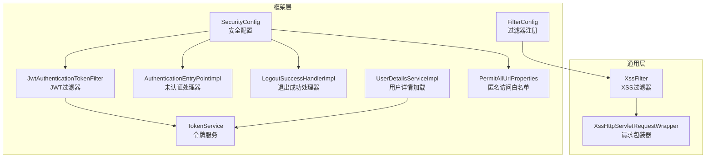
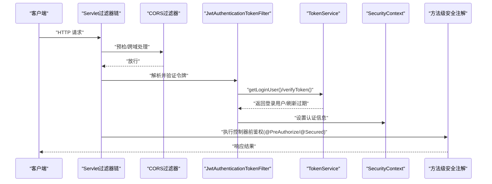
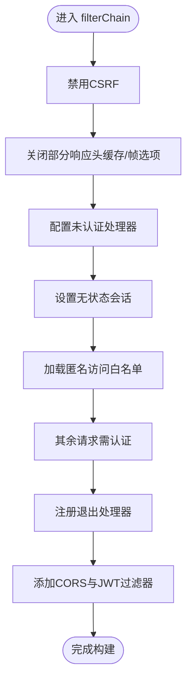
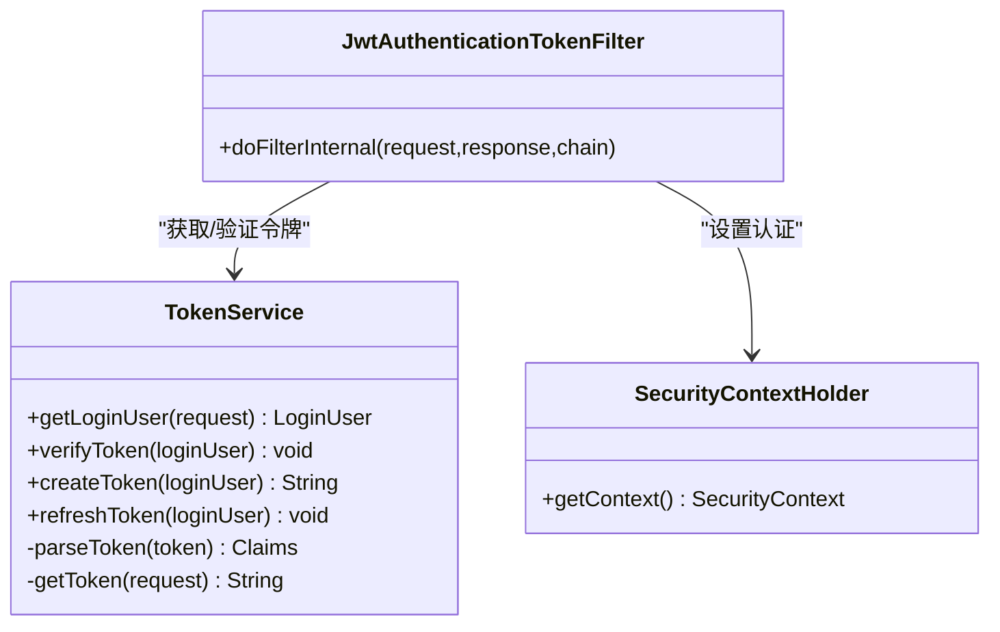
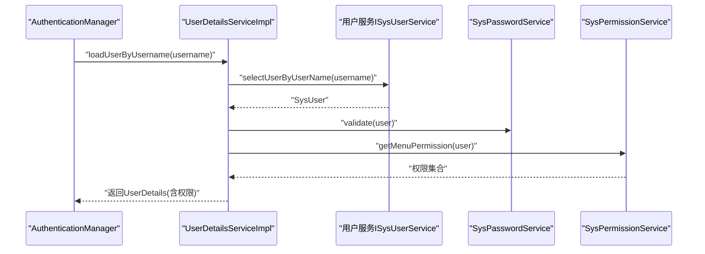
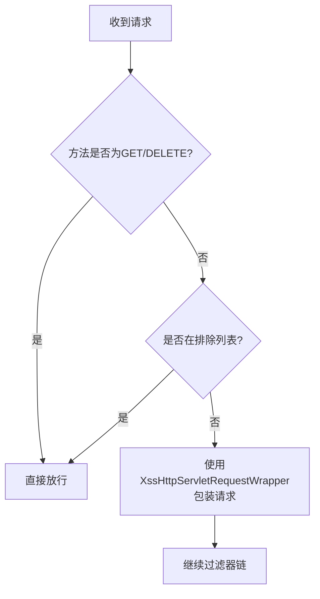
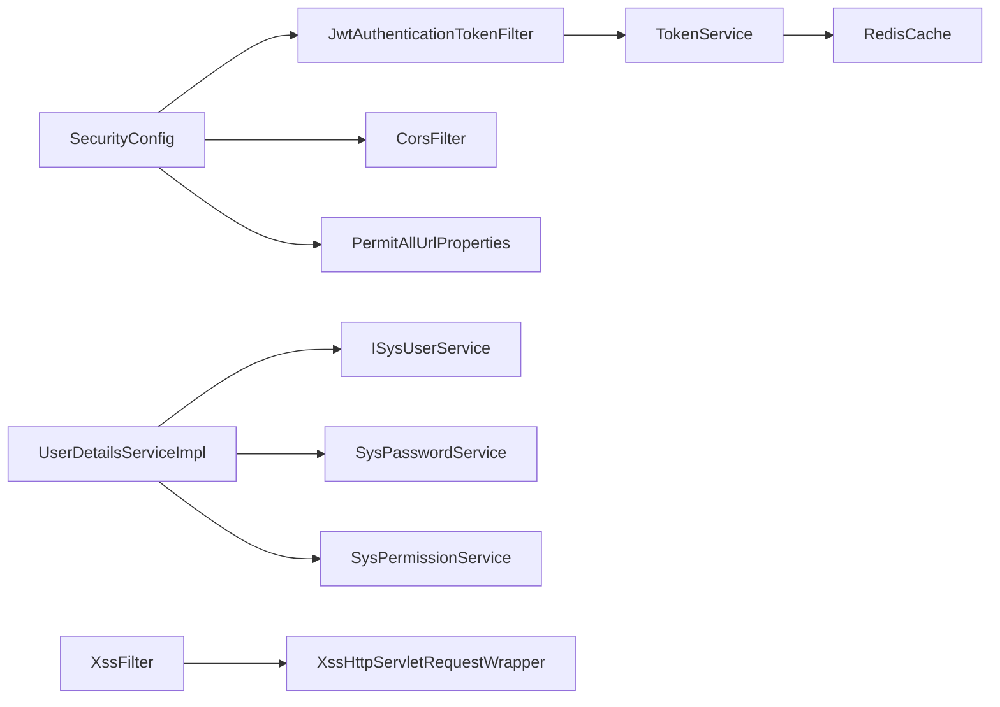

# 应用安全配置

<cite>
**本文引用的文件**   
- [SecurityConfig.java](file://PezMax-Backend/ruoyi-framework/src/main/java/com/ruoyi/framework/config/SecurityConfig.java)
- [JwtAuthenticationTokenFilter.java](file://PezMax-Backend/ruoyi-framework/src/main/java/com/ruoyi/framework/security/filter/JwtAuthenticationTokenFilter.java)
- [XssFilter.java](file://PezMax-Backend/ruoyi-common/src/main/java/com/ruoyi/common/filter/XssFilter.java)
- [XssHttpServletRequestWrapper.java](file://PezMax-Backend/ruoyi-common/src/main/java/com/ruoyi/common/filter/XssHttpServletRequestWrapper.java)
- [FilterConfig.java](file://PezMax-Backend/ruoyi-framework/src/main/java/com/ruoyi/framework/config/FilterConfig.java)
- [PermitAllUrlProperties.java](file://PezMax-Backend/ruoyi-framework/src/main/java/com/ruoyi/framework/config/properties/PermitAllUrlProperties.java)
- [TokenService.java](file://PezMax-Backend/ruoyi-framework/src/main/java/com/ruoyi/framework/web/service/TokenService.java)
- [UserDetailsServiceImpl.java](file://PezMax-Backend/ruoyi-framework/src/main/java/com/ruoyi/framework/web/service/UserDetailsServiceImpl.java)
- [AuthenticationEntryPointImpl.java](file://PezMax-Backend/ruoyi-framework/src/main/java/com/ruoyi/framework/security/handle/AuthenticationEntryPointImpl.java)
- [LogoutSuccessHandlerImpl.java](file://PezMax-Backend/ruoyi-framework/src/main/java/com/ruoyi/framework/security/handle/LogoutSuccessHandlerImpl.java)
</cite>

## 目录
1. [简介](#简介)
2. [项目结构](#项目结构)
3. [核心组件](#核心组件)
4. [架构总览](#架构总览)
5. [详细组件分析](#详细组件分析)
6. [依赖关系分析](#依赖关系分析)
7. [性能与安全考量](#性能与安全考量)
8. [故障排查指南](#故障排查指南)
9. [结论](#结论)
10. [附录](#附录)

## 简介
本文件面向后端应用的安全配置，聚焦以下目标：
- Spring Security 核心配置与过滤器链顺序
- JWT 令牌认证机制的实现原理、校验与无状态会话管理
- 权限控制策略：URL 级与方法级（@PreAuthorize、@Secured）
- XSS 防护过滤器的实现与请求参数清洗
- CSRF 禁用原因与无状态会话的安全考虑
- 安全最佳实践与常见漏洞防护方案

## 项目结构
本项目采用模块化分层组织，安全相关能力主要分布在框架层与通用层：
- 框架层负责 Spring Security 配置、JWT 过滤器、异常处理与退出处理器
- 通用层提供 XSS 过滤器及请求包装器、常量与工具类
- 业务服务层提供用户详情加载与权限数据组装

图表来源
- [SecurityConfig.java:86-119](file://PezMax-Backend/ruoyi-framework/src/main/java/com/ruoyi/framework/config/SecurityConfig.java#L86-L119)
- [JwtAuthenticationTokenFilter.java:30-43](file://PezMax-Backend/ruoyi-framework/src/main/java/com/ruoyi/framework/security/filter/JwtAuthenticationTokenFilter.java#L30-L43)
- [TokenService.java:62-83](file://PezMax-Backend/ruoyi-framework/src/main/java/com/ruoyi/framework/web/service/TokenService.java#L62-L83)
- [UserDetailsServiceImpl.java:37-65](file://PezMax-Backend/ruoyi-framework/src/main/java/com/ruoyi/framework/web/service/UserDetailsServiceImpl.java#L37-L65)
- [XssFilter.java:44-56](file://PezMax-Backend/ruoyi-common/src/main/java/com/ruoyi/common/filter/XssFilter.java#L44-L56)
- [FilterConfig.java](file://PezMax-Backend/ruoyi-framework/src/main/java/com/ruoyi/framework/config/FilterConfig.java)
- [PermitAllUrlProperties.java](file://PezMax-Backend/ruoyi-framework/src/main/java/com/ruoyi/framework/config/properties/PermitAllUrlProperties.java)

章节来源
- [SecurityConfig.java:86-119](file://PezMax-Backend/ruoyi-framework/src/main/java/com/ruoyi/framework/config/SecurityConfig.java#L86-L119)
- [JwtAuthenticationTokenFilter.java:30-43](file://PezMax-Backend/ruoyi-framework/src/main/java/com/ruoyi/framework/security/filter/JwtAuthenticationTokenFilter.java#L30-L43)
- [XssFilter.java:44-56](file://PezMax-Backend/ruoyi-common/src/main/java/com/ruoyi/common/filter/XssFilter.java#L44-L56)
- [FilterConfig.java](file://PezMax-Backend/ruoyi-framework/src/main/java/com/ruoyi/framework/config/FilterConfig.java)
- [PermitAllUrlProperties.java](file://PezMax-Backend/ruoyi-framework/src/main/java/com/ruoyi/framework/config/properties/PermitAllUrlProperties.java)

## 核心组件
- 安全配置中心：集中定义认证失败处理、会话策略、匿名访问白名单、过滤器链顺序等
- JWT 过滤器：在每次请求中解析并验证令牌，将认证信息写入上下文
- 令牌服务：负责令牌的创建、解析、刷新与缓存同步
- 用户详情加载：从数据库加载用户并构建包含权限的登录主体
- XSS 过滤器：对非 GET/DELETE 的请求进行参数清洗，防止脚本注入
- 过滤器注册：将自定义过滤器纳入容器生命周期

章节来源
- [SecurityConfig.java:86-119](file://PezMax-Backend/ruoyi-framework/src/main/java/com/ruoyi/framework/config/SecurityConfig.java#L86-L119)
- [JwtAuthenticationTokenFilter.java:30-43](file://PezMax-Backend/ruoyi-framework/src/main/java/com/ruoyi/framework/security/filter/JwtAuthenticationTokenFilter.java#L30-L43)
- [TokenService.java:114-155](file://PezMax-Backend/ruoyi-framework/src/main/java/com/ruoyi/framework/web/service/TokenService.java#L114-L155)
- [UserDetailsServiceImpl.java:37-65](file://PezMax-Backend/ruoyi-framework/src/main/java/com/ruoyi/framework/web/service/UserDetailsServiceImpl.java#L37-L65)
- [XssFilter.java:44-56](file://PezMax-Backend/ruoyi-common/src/main/java/com/ruoyi/common/filter/XssFilter.java#L44-L56)
- [FilterConfig.java](file://PezMax-Backend/ruoyi-framework/src/main/java/com/ruoyi/framework/config/FilterConfig.java)

## 架构总览
下图展示了典型请求进入后的安全处理流程：CORS → JWT 校验 → 方法级授权注解生效。

图表来源
- [SecurityConfig.java:114-118](file://PezMax-Backend/ruoyi-framework/src/main/java/com/ruoyi/framework/config/SecurityConfig.java#L114-L118)
- [JwtAuthenticationTokenFilter.java:30-43](file://PezMax-Backend/ruoyi-framework/src/main/java/com/ruoyi/framework/security/filter/JwtAuthenticationTokenFilter.java#L30-L43)
- [TokenService.java:62-83](file://PezMax-Backend/ruoyi-framework/src/main/java/com/ruoyi/framework/web/service/TokenService.java#L62-L83)

## 详细组件分析

### Spring Security 核心配置
- 启用方法级安全：支持 @PreAuthorize 与 @Secured
- 会话策略：STATELESS，不维护服务端会话
- 匿名访问白名单：通过 PermitAllUrlProperties 动态加载，同时内置登录、注册、验证码、静态资源与文档接口
- 过滤器链顺序：CORS 先于 JWT 过滤器；JWT 先于默认表单登录过滤器；退出处理器独立注册
- 异常处理：统一未认证/未授权响应由 AuthenticationEntryPointImpl 处理

图表来源
- [SecurityConfig.java:86-119](file://PezMax-Backend/ruoyi-framework/src/main/java/com/ruoyi/framework/config/SecurityConfig.java#L86-L119)
- [PermitAllUrlProperties.java](file://PezMax-Backend/ruoyi-framework/src/main/java/com/ruoyi/framework/config/properties/PermitAllUrlProperties.java)

章节来源
- [SecurityConfig.java:27-27](file://PezMax-Backend/ruoyi-framework/src/main/java/com/ruoyi/framework/config/SecurityConfig.java#L27-L27)
- [SecurityConfig.java:86-119](file://PezMax-Backend/ruoyi-framework/src/main/java/com/ruoyi/framework/config/SecurityConfig.java#L86-L119)
- [AuthenticationEntryPointImpl.java](file://PezMax-Backend/ruoyi-framework/src/main/java/com/ruoyi/framework/security/handle/AuthenticationEntryPointImpl.java)
- [LogoutSuccessHandlerImpl.java](file://PezMax-Backend/ruoyi-framework/src/main/java/com/ruoyi/framework/security/handle/LogoutSuccessHandlerImpl.java)
- [PermitAllUrlProperties.java](file://PezMax-Backend/ruoyi-framework/src/main/java/com/ruoyi/framework/config/properties/PermitAllUrlProperties.java)

### JWT 令牌认证机制
- 令牌来源：请求头携带，按约定前缀剥离后使用
- 令牌载荷：包含用户标识与用户名等声明，签名算法为 HS512
- 令牌校验：解析签名与有效期；若接近过期则自动刷新缓存中的会话信息
- 上下文注入：校验通过后构造认证对象并写入 SecurityContext
- 无状态设计：服务端仅以 Redis 缓存登录态，不依赖 ServletSession

图表来源
- [JwtAuthenticationTokenFilter.java:30-43](file://PezMax-Backend/ruoyi-framework/src/main/java/com/ruoyi/framework/security/filter/JwtAuthenticationTokenFilter.java#L30-L43)
- [TokenService.java:62-83](file://PezMax-Backend/ruoyi-framework/src/main/java/com/ruoyi/framework/web/service/TokenService.java#L62-L83)
- [TokenService.java:114-155](file://PezMax-Backend/ruoyi-framework/src/main/java/com/ruoyi/framework/web/service/TokenService.java#L114-L155)
- [TokenService.java:178-198](file://PezMax-Backend/ruoyi-framework/src/main/java/com/ruoyi/framework/web/service/TokenService.java#L178-L198)

章节来源
- [JwtAuthenticationTokenFilter.java:30-43](file://PezMax-Backend/ruoyi-framework/src/main/java/com/ruoyi/framework/security/filter/JwtAuthenticationTokenFilter.java#L30-L43)
- [TokenService.java:62-83](file://PezMax-Backend/ruoyi-framework/src/main/java/com/ruoyi/framework/web/service/TokenService.java#L62-L83)
- [TokenService.java:114-155](file://PezMax-Backend/ruoyi-framework/src/main/java/com/ruoyi/framework/web/service/TokenService.java#L114-L155)
- [TokenService.java:178-198](file://PezMax-Backend/ruoyi-framework/src/main/java/com/ruoyi/framework/web/service/TokenService.java#L178-L198)

### 用户详情加载与权限数据
- 用户加载：根据用户名查询用户实体，校验删除/停用状态
- 密码校验：调用密码服务进行一致性校验
- 权限装配：基于用户角色/菜单生成权限集合，封装为登录主体供后续鉴权使用

图表来源
- [UserDetailsServiceImpl.java:37-65](file://PezMax-Backend/ruoyi-framework/src/main/java/com/ruoyi/framework/web/service/UserDetailsServiceImpl.java#L37-L65)

章节来源
- [UserDetailsServiceImpl.java:37-65](file://PezMax-Backend/ruoyi-framework/src/main/java/com/ruoyi/framework/web/service/UserDetailsServiceImpl.java#L37-L65)

### URL 级别访问控制
- 匿名访问白名单：通过 PermitAllUrlProperties 动态加载，结合内置规则覆盖登录、注册、验证码、静态资源与文档接口
- 默认策略：除白名单外的所有请求均需认证
- 扩展方式：新增白名单路径可通过配置项注入，无需修改代码

章节来源
- [SecurityConfig.java:100-111](file://PezMax-Backend/ruoyi-framework/src/main/java/com/ruoyi/framework/config/SecurityConfig.java#L100-L111)
- [PermitAllUrlProperties.java](file://PezMax-Backend/ruoyi-framework/src/main/java/com/ruoyi/framework/config/properties/PermitAllUrlProperties.java)

### 方法级安全控制（@PreAuthorize、@Secured）
- 启用开关：通过配置开启 prePostEnabled 与 securedEnabled
- 使用方式：在控制器或 Service 方法上标注注解，依据表达式或角色/权限判定是否允许访问
- 决策时机：在请求到达目标方法前由 Spring Security 拦截并评估

章节来源
- [SecurityConfig.java:27-27](file://PezMax-Backend/ruoyi-framework/src/main/java/com/ruoyi/framework/config/SecurityConfig.java#L27-L27)

### XSS 攻击防护过滤器
- 触发条件：非 GET/DELETE 请求且不在排除列表内
- 处理方式：用包装器替换原始请求，对所有输入参数进行 HTML 转义与危险标签过滤
- 集成方式：通过过滤器注册类加入容器，确保在业务逻辑之前执行

图表来源
- [XssFilter.java:58-68](file://PezMax-Backend/ruoyi-common/src/main/java/com/ruoyi/common/filter/XssFilter.java#L58-L68)
- [XssFilter.java:44-56](file://PezMax-Backend/ruoyi-common/src/main/java/com/ruoyi/common/filter/XssFilter.java#L44-L56)
- [XssHttpServletRequestWrapper.java](file://PezMax-Backend/ruoyi-common/src/main/java/com/ruoyi/common/filter/XssHttpServletRequestWrapper.java)
- [FilterConfig.java](file://PezMax-Backend/ruoyi-framework/src/main/java/com/ruoyi/framework/config/FilterConfig.java)

章节来源
- [XssFilter.java:44-56](file://PezMax-Backend/ruoyi-common/src/main/java/com/ruoyi/common/filter/XssFilter.java#L44-L56)
- [XssFilter.java:58-68](file://PezMax-Backend/ruoyi-common/src/main/java/com/ruoyi/common/filter/XssFilter.java#L58-L68)
- [XssHttpServletRequestWrapper.java](file://PezMax-Backend/ruoyi-common/src/main/java/com/ruoyi/common/filter/XssHttpServletRequestWrapper.java)
- [FilterConfig.java](file://PezMax-Backend/ruoyi-framework/src/main/java/com/ruoyi/framework/config/FilterConfig.java)

### CSRF 禁用与无状态会话管理
- CSRF 禁用原因：采用无状态会话（STATELESS），不使用 Cookie 与会话，因此传统 CSRF 保护不再适用
- 无状态安全考虑：
  - 令牌必须通过 HTTPS 传输，避免中间人窃听
  - 合理设置令牌有效期与刷新策略，降低泄露窗口
  - 严格限制匿名访问范围，最小化暴露面
  - 对敏感操作增加二次确认或额外校验（如设备指纹、IP 白名单）

章节来源
- [SecurityConfig.java:89-98](file://PezMax-Backend/ruoyi-framework/src/main/java/com/ruoyi/framework/config/SecurityConfig.java#L89-L98)

## 依赖关系分析
- 组件耦合
  - SecurityConfig 依赖 JwtAuthenticationTokenFilter、CorsFilter、PermitAllUrlProperties、异常与退出处理器
  - JwtAuthenticationTokenFilter 依赖 TokenService 与 SecurityUtils
  - TokenService 依赖 RedisCache 与若干工具类
  - UserDetailsServiceImpl 依赖用户服务、密码服务与权限服务
  - XssFilter 依赖 XssHttpServletRequestWrapper 与 HTTP 方法枚举
- 外部依赖
  - JSON Web Token 库用于签发与解析
  - Redis 用于存储登录态与令牌映射

图表来源
- [SecurityConfig.java:86-119](file://PezMax-Backend/ruoyi-framework/src/main/java/com/ruoyi/framework/config/SecurityConfig.java#L86-L119)
- [JwtAuthenticationTokenFilter.java:30-43](file://PezMax-Backend/ruoyi-framework/src/main/java/com/ruoyi/framework/security/filter/JwtAuthenticationTokenFilter.java#L30-L43)
- [TokenService.java:62-83](file://PezMax-Backend/ruoyi-framework/src/main/java/com/ruoyi/framework/web/service/TokenService.java#L62-L83)
- [UserDetailsServiceImpl.java:37-65](file://PezMax-Backend/ruoyi-framework/src/main/java/com/ruoyi/framework/web/service/UserDetailsServiceImpl.java#L37-L65)
- [XssFilter.java:44-56](file://PezMax-Backend/ruoyi-common/src/main/java/com/ruoyi/common/filter/XssFilter.java#L44-L56)

章节来源
- [SecurityConfig.java:86-119](file://PezMax-Backend/ruoyi-framework/src/main/java/com/ruoyi/framework/config/SecurityConfig.java#L86-L119)
- [JwtAuthenticationTokenFilter.java:30-43](file://PezMax-Backend/ruoyi-framework/src/main/java/com/ruoyi/framework/security/filter/JwtAuthenticationTokenFilter.java#L30-L43)
- [TokenService.java:62-83](file://PezMax-Backend/ruoyi-framework/src/main/java/com/ruoyi/framework/web/service/TokenService.java#L62-L83)
- [UserDetailsServiceImpl.java:37-65](file://PezMax-Backend/ruoyi-framework/src/main/java/com/ruoyi/framework/web/service/UserDetailsServiceImpl.java#L37-L65)
- [XssFilter.java:44-56](file://PezMax-Backend/ruoyi-common/src/main/java/com/ruoyi/common/filter/XssFilter.java#L44-L56)

## 性能与安全考量
- 性能
  - 无状态会话减少服务端内存占用，但引入 Redis 读写开销；建议合理设置过期时间与批量刷新策略
  - JWT 解析与签名校验为 CPU 密集型操作，应控制令牌大小与字段数量
  - XSS 过滤会遍历请求参数，建议在白名单中排除大体积上传接口
- 安全
  - 令牌密钥需保密且定期轮换；建议使用强随机秘钥与合适的哈希算法
  - 严格最小权限原则，匿名访问仅开放必要接口
  - 对敏感接口增加速率限制与审计日志
  - 输出侧进行内容编码，避免反射型 XSS

[本节为通用指导，不直接分析具体文件]

## 故障排查指南
- 常见问题
  - 401/403：检查匿名白名单是否正确配置；确认请求头令牌格式与前缀
  - 令牌频繁失效：核对过期时间配置与刷新逻辑；关注 Redis 连接与键空间清理
  - XSS 误伤：确认排除列表与方法判断逻辑；必要时调整包装器过滤规则
- 定位步骤
  - 查看未认证处理器与全局异常处理器的返回体
  - 在 JWT 过滤器入口打印关键上下文（令牌存在性、解析结果、认证对象）
  - 核对过滤器链顺序，确保 CORS 与 XSS 过滤器位置正确

章节来源
- [AuthenticationEntryPointImpl.java](file://PezMax-Backend/ruoyi-framework/src/main/java/com/ruoyi/framework/security/handle/AuthenticationEntryPointImpl.java)
- [JwtAuthenticationTokenFilter.java:30-43](file://PezMax-Backend/ruoyi-framework/src/main/java/com/ruoyi/framework/security/filter/JwtAuthenticationTokenFilter.java#L30-L43)
- [XssFilter.java:44-56](file://PezMax-Backend/ruoyi-common/src/main/java/com/ruoyi/common/filter/XssFilter.java#L44-L56)

## 结论
本项目的安全体系围绕“无状态 + JWT + 细粒度权限”展开：通过 Spring Security 统一管控过滤器链与访问策略，借助 JWT 实现跨端认证与无状态会话，配合方法级注解实现灵活的方法级授权；同时以 XSS 过滤器作为输入侧防线，降低注入风险。建议在生产环境持续完善密钥管理、限流审计与最小权限策略，以应对更复杂的安全威胁。

[本节为总结性内容，不直接分析具体文件]

## 附录
- 术语
  - STATELESS：无状态会话，服务端不保存会话
  - 匿名访问：无需认证即可访问的路径集合
  - 方法级安全：基于注解在方法调用前进行权限判定
- 参考实现路径
  - 安全配置与过滤器链：[SecurityConfig.java](file://PezMax-Backend/ruoyi-framework/src/main/java/com/ruoyi/framework/config/SecurityConfig.java)
  - JWT 过滤器与服务：[JwtAuthenticationTokenFilter.java](file://PezMax-Backend/ruoyi-framework/src/main/java/com/ruoyi/framework/security/filter/JwtAuthenticationTokenFilter.java)、[TokenService.java](file://PezMax-Backend/ruoyi-framework/src/main/java/com/ruoyi/framework/web/service/TokenService.java)
  - 用户详情与权限：[UserDetailsServiceImpl.java](file://PezMax-Backend/ruoyi-framework/src/main/java/com/ruoyi/framework/web/service/UserDetailsServiceImpl.java)
  - XSS 防护：[XssFilter.java](file://PezMax-Backend/ruoyi-common/src/main/java/com/ruoyi/common/filter/XssFilter.java)、[XssHttpServletRequestWrapper.java](file://PezMax-Backend/ruoyi-common/src/main/java/com/ruoyi/common/filter/XssHttpServletRequestWrapper.java)
  - 过滤器注册：[FilterConfig.java](file://PezMax-Backend/ruoyi-framework/src/main/java/com/ruoyi/framework/config/FilterConfig.java)
  - 匿名白名单：[PermitAllUrlProperties.java](file://PezMax-Backend/ruoyi-framework/src/main/java/com/ruoyi/framework/config/properties/PermitAllUrlProperties.java)