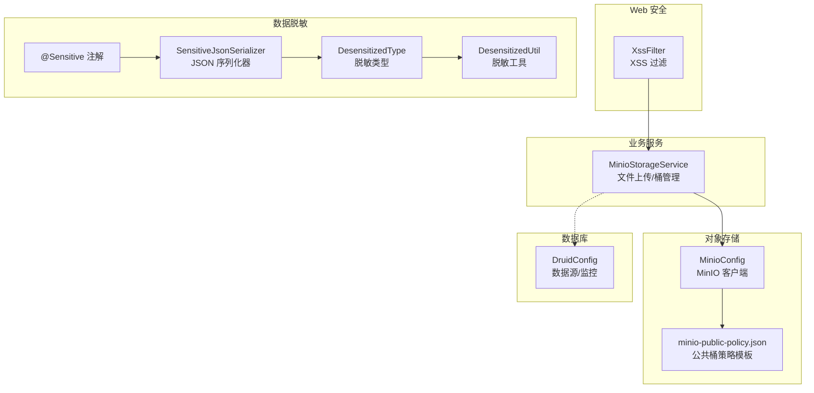
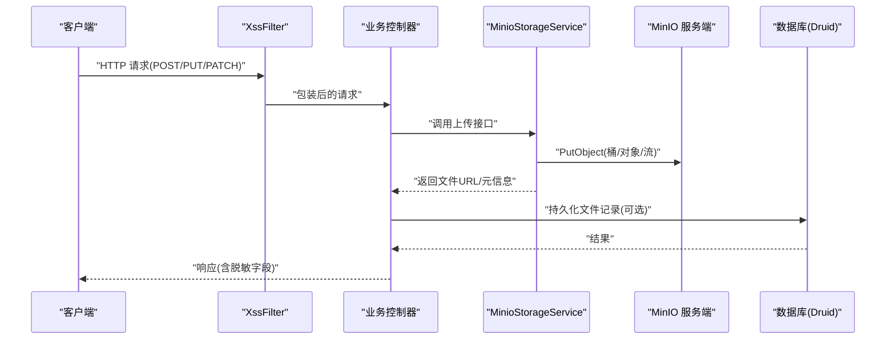
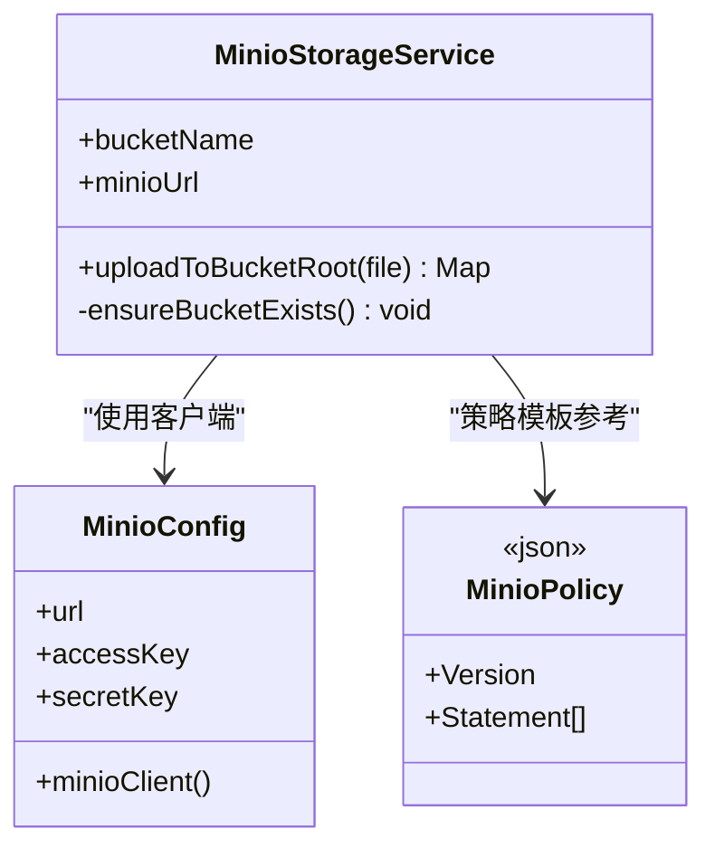
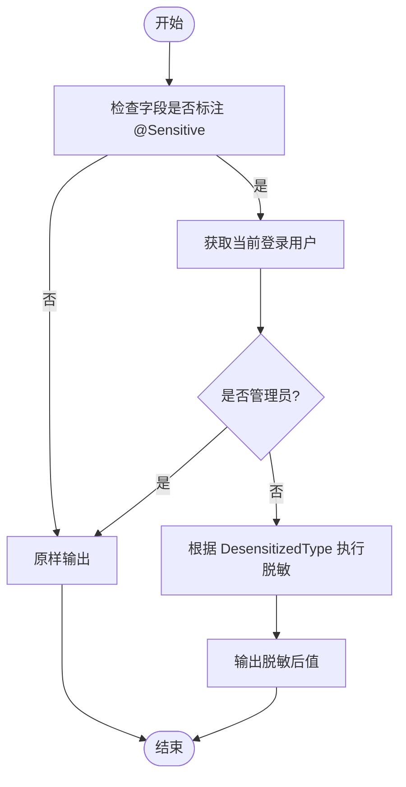
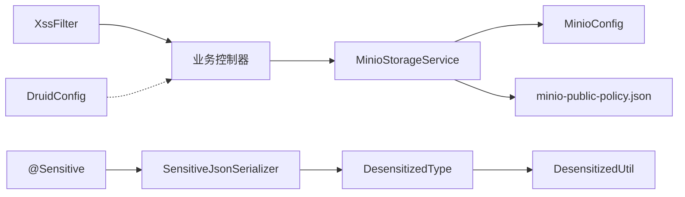

# 数据安全保护

<cite>
**本文引用的文件**   
- [MinioConfig.java](file://PezMax-Backend/ruoyi-common/src/main/java/com/ruoyi/common/config/MinioConfig.java)
- [MinioStorageService.java](file://PezMax-Backend/ruoyi-common/src/main/java/com/ruoyi/common/utils/file/MinioStorageService.java)
- [minio-public-policy.json](file://PezMax-Backend/ptmj-datum/src/main/resources/minio-public-policy.json)
- [Sensitive.java](file://PezMax-Backend/ruoyi-common/src/main/java/com/ruoyi/common/annotation/Sensitive.java)
- [SensitiveJsonSerializer.java](file://PezMax-Backend/ruoyi-common/src/main/java/com/ruoyi/common/config/serializer/SensitiveJsonSerializer.java)
- [DesensitizedType.java](file://PezMax-Backend/ruoyi-common/src/main/java/com/ruoyi/common/enums/DesensitizedType.java)
- [DesensitizedUtil.java](file://PezMax-Backend/ruoyi-common/src/main/java/com/ruoyi/common/utils/DesensitizedUtil.java)
- [DruidConfig.java](file://PezMax-Backend/ruoyi-framework/src/main/java/com/ruoyi/framework/config/DruidConfig.java)
- [XssFilter.java](file://PezMax-Backend/ruoyi-common/src/main/java/com/ruoyi/common/filter/XssFilter.java)
</cite>

## 目录
1. [引言](#引言)
2. [项目结构](#项目结构)
3. [核心组件](#核心组件)
4. [架构总览](#架构总览)
5. [详细组件分析](#详细组件分析)
6. [依赖分析](#依赖分析)
7. [性能考虑](#性能考虑)
8. [故障排查指南](#故障排查指南)
9. [结论](#结论)
10. [附录](#附录)

## 引言
本指南聚焦企业级数据安全，围绕以下主题提供可落地的策略与实践：
- MinIO 对象存储的安全策略配置（公共桶与私有桶访问控制、预签名 URL 机制）
- 敏感数据脱敏处理（用户信息、联系方式等字段的自动脱敏规则）
- 数据库连接加密、SQL 注入防护、敏感配置信息加密存储
- 数据传输加密、静态数据加密、备份加密等企业级方案
- 数据泄露防护与审计日志记录

## 项目结构
本项目后端采用模块化分层设计，与安全相关的关键位置如下：
- 对象存储接入层：MinIO 客户端配置与上传服务
- 数据脱敏层：注解 + JSON 序列化器 + 脱敏类型枚举 + 工具类
- 数据库层：Druid 数据源与动态数据源配置
- Web 安全层：XSS 过滤与请求包装

图表来源
- [MinioConfig.java:1-28](file://PezMax-Backend/ruoyi-common/src/main/java/com/ruoyi/common/config/MinioConfig.java#L1-L28)
- [MinioStorageService.java:1-88](file://PezMax-Backend/ruoyi-common/src/main/java/com/ruoyi/common/utils/file/MinioStorageService.java#L1-L88)
- [minio-public-policy.json:1-17](file://PezMax-Backend/ptmj-datum/src/main/resources/minio-public-policy.json#L1-L17)
- [Sensitive.java:1-25](file://PezMax-Backend/ruoyi-common/src/main/java/com/ruoyi/common/annotation/Sensitive.java#L1-L25)
- [SensitiveJsonSerializer.java:1-68](file://PezMax-Backend/ruoyi-common/src/main/java/com/ruoyi/common/config/serializer/SensitiveJsonSerializer.java#L1-L68)
- [DesensitizedType.java:1-60](file://PezMax-Backend/ruoyi-common/src/main/java/com/ruoyi/common/enums/DesensitizedType.java#L1-L60)
- [DesensitizedUtil.java:1-50](file://PezMax-Backend/ruoyi-common/src/main/java/com/ruoyi/common/utils/DesensitizedUtil.java#L1-L50)
- [DruidConfig.java:1-127](file://PezMax-Backend/ruoyi-framework/src/main/java/com/ruoyi/framework/config/DruidConfig.java#L1-L127)
- [XssFilter.java:1-75](file://PezMax-Backend/ruoyi-common/src/main/java/com/ruoyi/common/filter/XssFilter.java#L1-L75)

章节来源
- [MinioConfig.java:1-28](file://PezMax-Backend/ruoyi-common/src/main/java/com/ruoyi/common/config/MinioConfig.java#L1-L28)
- [MinioStorageService.java:1-88](file://PezMax-Backend/ruoyi-common/src/main/java/com/ruoyi/common/utils/file/MinioStorageService.java#L1-L88)
- [minio-public-policy.json:1-17](file://PezMax-Backend/ptmj-datum/src/main/resources/minio-public-policy.json#L1-L17)
- [Sensitive.java:1-25](file://PezMax-Backend/ruoyi-common/src/main/java/com/ruoyi/common/annotation/Sensitive.java#L1-L25)
- [SensitiveJsonSerializer.java:1-68](file://PezMax-Backend/ruoyi-common/src/main/java/com/ruoyi/common/config/serializer/SensitiveJsonSerializer.java#L1-L68)
- [DesensitizedType.java:1-60](file://PezMax-Backend/ruoyi-common/src/main/java/com/ruoyi/common/enums/DesensitizedType.java#L1-L60)
- [DesensitizedUtil.java:1-50](file://PezMax-Backend/ruoyi-common/src/main/java/com/ruoyi/common/utils/DesensitizedUtil.java#L1-L50)
- [DruidConfig.java:1-127](file://PezMax-Backend/ruoyi-framework/src/main/java/com/ruoyi/framework/config/DruidConfig.java#L1-L127)
- [XssFilter.java:1-75](file://PezMax-Backend/ruoyi-common/src/main/java/com/ruoyi/common/filter/XssFilter.java#L1-L75)

## 核心组件
- MinIO 客户端与上传服务：负责连接 MinIO、创建桶、上传对象并返回访问地址。
- 脱敏体系：通过 @Sensitive 注解在 JSON 序列化阶段对敏感字段进行按需脱敏，管理员不脱敏。
- 数据库配置：基于 Druid 的多数据源与监控页面定制。
- XSS 过滤：针对非 GET/DELETE 的请求进行参数清洗与包装。

章节来源
- [MinioConfig.java:1-28](file://PezMax-Backend/ruoyi-common/src/main/java/com/ruoyi/common/config/MinioConfig.java#L1-L28)
- [MinioStorageService.java:1-88](file://PezMax-Backend/ruoyi-common/src/main/java/com/ruoyi/common/utils/file/MinioStorageService.java#L1-L88)
- [Sensitive.java:1-25](file://PezMax-Backend/ruoyi-common/src/main/java/com/ruoyi/common/annotation/Sensitive.java#L1-L25)
- [SensitiveJsonSerializer.java:1-68](file://PezMax-Backend/ruoyi-common/src/main/java/com/ruoyi/common/config/serializer/SensitiveJsonSerializer.java#L1-L68)
- [DesensitizedType.java:1-60](file://PezMax-Backend/ruoyi-common/src/main/java/com/ruoyi/common/enums/DesensitizedType.java#L1-L60)
- [DesensitizedUtil.java:1-50](file://PezMax-Backend/ruoyi-common/src/main/java/com/ruoyi/common/utils/DesensitizedUtil.java#L1-L50)
- [DruidConfig.java:1-127](file://PezMax-Backend/ruoyi-framework/src/main/java/com/ruoyi/framework/config/DruidConfig.java#L1-L127)
- [XssFilter.java:1-75](file://PezMax-Backend/ruoyi-common/src/main/java/com/ruoyi/common/filter/XssFilter.java#L1-L75)

## 架构总览
下图展示从 Web 请求到对象存储与数据库的端到端路径，以及脱敏与安全防护的介入点。

图表来源
- [XssFilter.java:1-75](file://PezMax-Backend/ruoyi-common/src/main/java/com/ruoyi/common/filter/XssFilter.java#L1-L75)
- [MinioStorageService.java:1-88](file://PezMax-Backend/ruoyi-common/src/main/java/com/ruoyi/common/utils/file/MinioStorageService.java#L1-L88)
- [DruidConfig.java:1-127](file://PezMax-Backend/ruoyi-framework/src/main/java/com/ruoyi/framework/config/DruidConfig.java#L1-L127)

## 详细组件分析

### MinIO 对象存储安全策略与访问控制
- 客户端配置
  - 通过配置项注入 endpoint、accessKey、secretKey，构建 MinioClient 单例。
  - 建议将 endpoint 使用 HTTPS，并在部署环境以受管密钥管理服务注入凭据。
- 上传流程
  - 自动确保桶存在；生成随机 objectName；设置 contentType；写入对象；拼接直链 URL。
- 公共桶策略
  - 提供公共读取策略模板，允许匿名获取桶位置与对象内容。
  - 适用于公开资源（如头像、静态资源），但需配合 CDN/WAF 做速率限制与防盗链。
- 私有桶策略
  - 对于私密数据，应移除或禁用公共策略，仅允许应用服务账号读写。
  - 结合最小权限原则，为不同业务域划分独立桶与子目录，避免跨域越权。
- 预签名 URL 机制
  - 当前实现未包含预签名 URL 生成逻辑。建议在服务层引入 MinIO SDK 的 presignedGetObject/presignedPutObject，按角色与时间窗口签发短期令牌，用于前端直传/直下。
  - 建议策略要点：限定方法、IP 白名单、过期时间、Content-Type 校验、大小上限。

图表来源
- [MinioConfig.java:1-28](file://PezMax-Backend/ruoyi-common/src/main/java/com/ruoyi/common/config/MinioConfig.java#L1-L28)
- [MinioStorageService.java:1-88](file://PezMax-Backend/ruoyi-common/src/main/java/com/ruoyi/common/utils/file/MinioStorageService.java#L1-L88)
- [minio-public-policy.json:1-17](file://PezMax-Backend/ptmj-datum/src/main/resources/minio-public-policy.json#L1-L17)

章节来源
- [MinioConfig.java:1-28](file://PezMax-Backend/ruoyi-common/src/main/java/com/ruoyi/common/config/MinioConfig.java#L1-L28)
- [MinioStorageService.java:1-88](file://PezMax-Backend/ruoyi-common/src/main/java/com/ruoyi/common/utils/file/MinioStorageService.java#L1-L88)
- [minio-public-policy.json:1-17](file://PezMax-Backend/ptmj-datum/src/main/resources/minio-public-policy.json#L1-L17)

### 敏感数据脱敏处理
- 注解驱动
  - 在实体字段上标注 @Sensitive，指定 DesensitizedType，即可在 JSON 输出时自动脱敏。
- 序列化器
  - SensitiveJsonSerializer 根据当前登录用户判断是否脱敏：管理员不脱敏，普通用户按类型脱敏。
- 脱敏类型
  - 内置类型包括姓名、密码、身份证、手机号、邮箱、银行卡号、车牌号等，均提供正则或工具函数实现。
- 工具能力
  - 提供通用脱敏工具方法（如密码掩码、车牌号中间隐藏）。

图表来源
- [Sensitive.java:1-25](file://PezMax-Backend/ruoyi-common/src/main/java/com/ruoyi/common/annotation/Sensitive.java#L1-L25)
- [SensitiveJsonSerializer.java:1-68](file://PezMax-Backend/ruoyi-common/src/main/java/com/ruoyi/common/config/serializer/SensitiveJsonSerializer.java#L1-L68)
- [DesensitizedType.java:1-60](file://PezMax-Backend/ruoyi-common/src/main/java/com/ruoyi/common/enums/DesensitizedType.java#L1-L60)
- [DesensitizedUtil.java:1-50](file://PezMax-Backend/ruoyi-common/src/main/java/com/ruoyi/common/utils/DesensitizedUtil.java#L1-L50)

章节来源
- [Sensitive.java:1-25](file://PezMax-Backend/ruoyi-common/src/main/java/com/ruoyi/common/annotation/Sensitive.java#L1-L25)
- [SensitiveJsonSerializer.java:1-68](file://PezMax-Backend/ruoyi-common/src/main/java/com/ruoyi/common/config/serializer/SensitiveJsonSerializer.java#L1-L68)
- [DesensitizedType.java:1-60](file://PezMax-Backend/ruoyi-common/src/main/java/com/ruoyi/common/enums/DesensitizedType.java#L1-L60)
- [DesensitizedUtil.java:1-50](file://PezMax-Backend/ruoyi-common/src/main/java/com/ruoyi/common/utils/DesensitizedUtil.java#L1-L50)

### 数据库连接加密与 SQL 注入防护
- 连接加密
  - 通过 Druid 数据源配置启用 SSL/TLS（由 spring.datasource.druid.* 属性注入），确保传输链路加密。
  - 生产环境建议使用证书双向认证与受管密钥库。
- SQL 注入防护
  - 项目已集成 XSS 过滤器，对非 GET/DELETE 请求进行包装与清洗，降低输入型攻击面。
  - 建议统一使用参数化查询（MyBatis #{}），禁止字符串拼接 SQL。
- 监控与审计
  - Druid 提供 SQL 监控面板，可按需开启并限制访问来源与鉴权。

章节来源
- [DruidConfig.java:1-127](file://PezMax-Backend/ruoyi-framework/src/main/java/com/ruoyi/framework/config/DruidConfig.java#L1-L127)
- [XssFilter.java:1-75](file://PezMax-Backend/ruoyi-common/src/main/java/com/ruoyi/common/filter/XssFilter.java#L1-L75)

### 敏感配置信息加密存储
- 建议实践
  - 将 MinIO 凭据、数据库密码等敏感配置交由外部密钥管理服务（KMS/Secrets Manager）注入，避免明文落地。
  - 若必须本地存放，使用加密配置文件与启动期解密，运行时仅持有解密密钥。
- 注意
  - 当前代码通过 @Value 注入配置，建议结合环境变量或配置中心完成机密管理。

[本节为通用最佳实践说明，不直接分析具体文件]

### 数据传输加密与静态数据加密
- 传输加密
  - 对外暴露 API 强制 HTTPS；MinIO 客户端 endpoint 使用 https；数据库连接启用 ssl=true。
- 静态数据加密
  - 对高敏感对象（如证件照、合同扫描件）在上传前在服务端进行加密后再写入 MinIO，下载时再解密。
  - 密钥与密文分离管理，遵循最小可见范围。

[本节为通用最佳实践说明，不直接分析具体文件]

### 数据备份加密
- 建议实践
  - 数据库定期全量/增量备份，并对备份文件进行 AES-GCM 加密。
  - 备份介质异地容灾，保留周期与恢复演练纳入合规要求。
- 对象存储备份
  - 利用 MinIO 版本控制与跨区域复制，结合生命周期策略归档冷数据。

[本节为通用最佳实践说明，不直接分析具体文件]

### 数据泄露防护与审计日志
- 数据泄露防护
  - 全面启用脱敏输出；对导出功能增加水印与二次审批；限制大流量下载与异常访问。
- 审计日志
  - 记录关键操作（上传、删除、策略变更、登录登出、权限变更）的不可篡改日志，集中收集至日志平台。
  - 对敏感字段在日志中默认脱敏。

[本节为通用最佳实践说明，不直接分析具体文件]

## 依赖分析
- 组件耦合
  - MinioStorageService 依赖 MinioConfig 提供的客户端实例；上传流程无外部强依赖，便于替换存储后端。
  - 脱敏体系内聚于注解、序列化器与枚举，扩展新类型仅需新增枚举项。
  - DruidConfig 负责数据源装配与监控页面定制，与业务解耦。
  - XssFilter 作为全局前置过滤，拦截高风险 HTTP 方法。

图表来源
- [XssFilter.java:1-75](file://PezMax-Backend/ruoyi-common/src/main/java/com/ruoyi/common/filter/XssFilter.java#L1-L75)
- [MinioStorageService.java:1-88](file://PezMax-Backend/ruoyi-common/src/main/java/com/ruoyi/common/utils/file/MinioStorageService.java#L1-L88)
- [MinioConfig.java:1-28](file://PezMax-Backend/ruoyi-common/src/main/java/com/ruoyi/common/config/MinioConfig.java#L1-L28)
- [minio-public-policy.json:1-17](file://PezMax-Backend/ptmj-datum/src/main/resources/minio-public-policy.json#L1-L17)
- [Sensitive.java:1-25](file://PezMax-Backend/ruoyi-common/src/main/java/com/ruoyi/common/annotation/Sensitive.java#L1-L25)
- [SensitiveJsonSerializer.java:1-68](file://PezMax-Backend/ruoyi-common/src/main/java/com/ruoyi/common/config/serializer/SensitiveJsonSerializer.java#L1-L68)
- [DesensitizedType.java:1-60](file://PezMax-Backend/ruoyi-common/src/main/java/com/ruoyi/common/enums/DesensitizedType.java#L1-L60)
- [DesensitizedUtil.java:1-50](file://PezMax-Backend/ruoyi-common/src/main/java/com/ruoyi/common/utils/DesensitizedUtil.java#L1-L50)
- [DruidConfig.java:1-127](file://PezMax-Backend/ruoyi-framework/src/main/java/com/ruoyi/framework/config/DruidConfig.java#L1-L127)

章节来源
- [XssFilter.java:1-75](file://PezMax-Backend/ruoyi-common/src/main/java/com/ruoyi/common/filter/XssFilter.java#L1-L75)
- [MinioStorageService.java:1-88](file://PezMax-Backend/ruoyi-common/src/main/java/com/ruoyi/common/utils/file/MinioStorageService.java#L1-L88)
- [MinioConfig.java:1-28](file://PezMax-Backend/ruoyi-common/src/main/java/com/ruoyi/common/config/MinioConfig.java#L1-L28)
- [minio-public-policy.json:1-17](file://PezMax-Backend/ptmj-datum/src/main/resources/minio-public-policy.json#L1-L17)
- [Sensitive.java:1-25](file://PezMax-Backend/ruoyi-common/src/main/java/com/ruoyi/common/annotation/Sensitive.java#L1-L25)
- [SensitiveJsonSerializer.java:1-68](file://PezMax-Backend/ruoyi-common/src/main/java/com/ruoyi/common/config/serializer/SensitiveJsonSerializer.java#L1-L68)
- [DesensitizedType.java:1-60](file://PezMax-Backend/ruoyi-common/src/main/java/com/ruoyi/common/enums/DesensitizedType.java#L1-L60)
- [DesensitizedUtil.java:1-50](file://PezMax-Backend/ruoyi-common/src/main/java/com/ruoyi/common/utils/DesensitizedUtil.java#L1-L50)
- [DruidConfig.java:1-127](file://PezMax-Backend/ruoyi-framework/src/main/java/com/ruoyi/framework/config/DruidConfig.java#L1-L127)

## 性能考虑
- MinIO 上传
  - 使用流式上传减少内存占用；合理设置并发度与连接池；为大对象启用分片上传。
- 脱敏序列化
  - 仅在需要输出的字段加 @Sensitive，避免全量扫描带来的额外开销。
- 数据库
  - 合理配置连接池大小与超时；开启慢 SQL 告警；避免在事务中进行网络 IO。

[本节为通用指导，不直接分析具体文件]

## 故障排查指南
- MinIO 上传失败
  - 检查 endpoint、accessKey、secretKey 是否正确；确认目标桶是否存在与策略是否允许 PutObject。
- 公共桶无法匿名访问
  - 核对 minio-public-policy.json 是否已应用到对应桶；确认浏览器/CDN 缓存与跨域设置。
- 脱敏未生效
  - 确认字段是否标注 @Sensitive 且类型为 String；检查当前用户是否为管理员；确认 JSON 序列化链路是否被自定义覆盖。
- XSS 过滤误拦截
  - 检查 excludes 列表与方法白名单；确认请求路径与方法是否符合预期。
- 数据库连接异常
  - 检查 Druid 配置项（主机、端口、用户名、密码、SSL 参数）；查看监控面板错误统计。

章节来源
- [MinioConfig.java:1-28](file://PezMax-Backend/ruoyi-common/src/main/java/com/ruoyi/common/config/MinioConfig.java#L1-L28)
- [MinioStorageService.java:1-88](file://PezMax-Backend/ruoyi-common/src/main/java/com/ruoyi/common/utils/file/MinioStorageService.java#L1-L88)
- [minio-public-policy.json:1-17](file://PezMax-Backend/ptmj-datum/src/main/resources/minio-public-policy.json#L1-L17)
- [Sensitive.java:1-25](file://PezMax-Backend/ruoyi-common/src/main/java/com/ruoyi/common/annotation/Sensitive.java#L1-L25)
- [SensitiveJsonSerializer.java:1-68](file://PezMax-Backend/ruoyi-common/src/main/java/com/ruoyi/common/config/serializer/SensitiveJsonSerializer.java#L1-L68)
- [XssFilter.java:1-75](file://PezMax-Backend/ruoyi-common/src/main/java/com/ruoyi/common/filter/XssFilter.java#L1-L75)
- [DruidConfig.java:1-127](file://PezMax-Backend/ruoyi-framework/src/main/java/com/ruoyi/framework/config/DruidConfig.java#L1-L127)

## 结论
本项目已具备对象存储接入、敏感字段脱敏、XSS 过滤与 Druid 数据源等基础安全能力。面向企业级场景，建议进一步补齐：
- MinIO 预签名 URL 与细粒度策略
- 传输与静态数据加密、备份加密
- 统一的密钥管理与审计日志体系
- 更完善的输入校验与输出脱敏策略

[本节为总结性内容，不直接分析具体文件]

## 附录
- 术语
  - 预签名 URL：带有时效与权限约束的临时访问链接
  - 静态数据加密：对落盘数据进行加密存储
  - 传输加密：使用 TLS/SSL 保障链路安全
- 参考实现位置
  - MinIO 客户端与上传：[MinioConfig.java](file://PezMax-Backend/ruoyi-common/src/main/java/com/ruoyi/common/config/MinioConfig.java)、[MinioStorageService.java](file://PezMax-Backend/ruoyi-common/src/main/java/com/ruoyi/common/utils/file/MinioStorageService.java)
  - 公共桶策略模板：[minio-public-policy.json](file://PezMax-Backend/ptmj-datum/src/main/resources/minio-public-policy.json)
  - 脱敏注解与序列化器：[Sensitive.java](file://PezMax-Backend/ruoyi-common/src/main/java/com/ruoyi/common/annotation/Sensitive.java)、[SensitiveJsonSerializer.java](file://PezMax-Backend/ruoyi-common/src/main/java/com/ruoyi/common/config/serializer/SensitiveJsonSerializer.java)
  - 脱敏类型与工具：[DesensitizedType.java](file://PezMax-Backend/ruoyi-common/src/main/java/com/ruoyi/common/enums/DesensitizedType.java)、[DesensitizedUtil.java](file://PezMax-Backend/ruoyi-common/src/main/java/com/ruoyi/common/utils/DesensitizedUtil.java)
  - 数据源与监控：[DruidConfig.java](file://PezMax-Backend/ruoyi-framework/src/main/java/com/ruoyi/framework/config/DruidConfig.java)
  - XSS 过滤：[XssFilter.java](file://PezMax-Backend/ruoyi-common/src/main/java/com/ruoyi/common/filter/XssFilter.java)