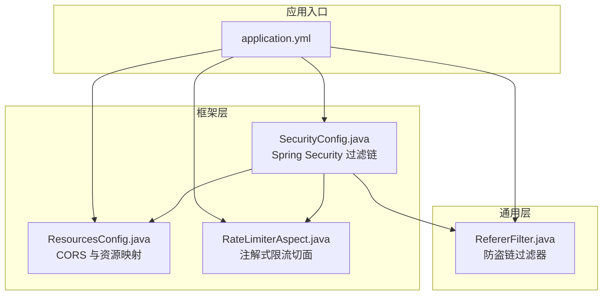
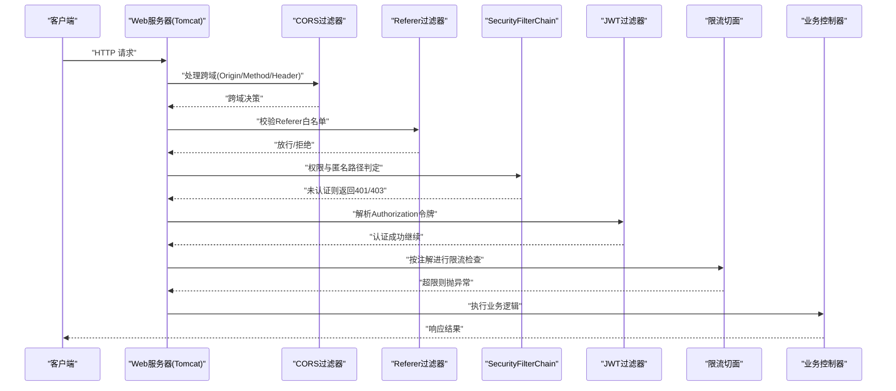
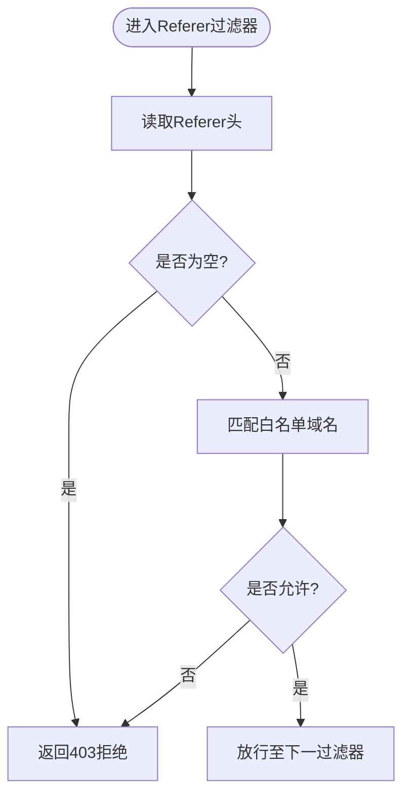
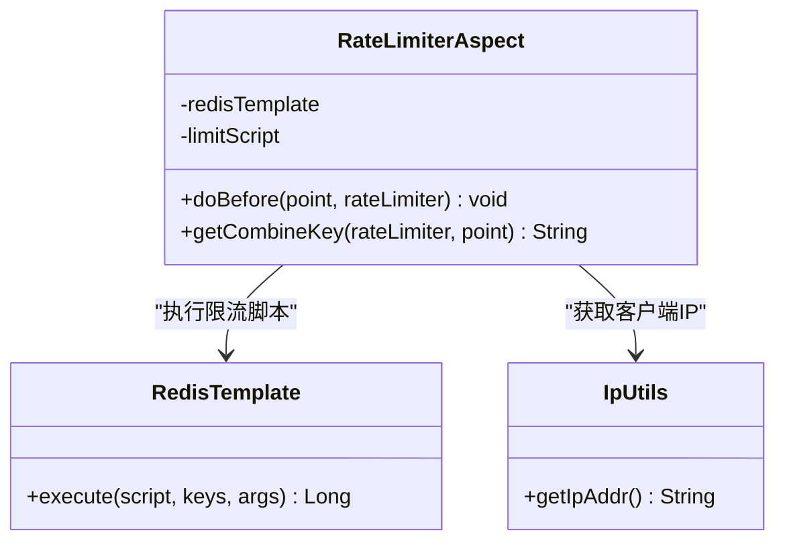
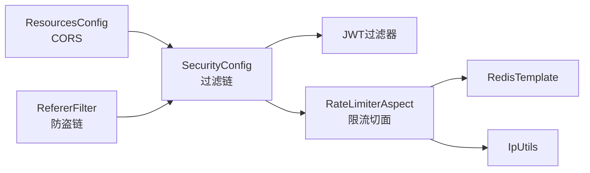

# 网络安全防护

<cite>
**本文引用的文件**   
- [SecurityConfig.java](file://PezMax-Backend/ruoyi-framework/src/main/java/com/ruoyi/framework/config/SecurityConfig.java)
- [ResourcesConfig.java](file://PezMax-Backend/ruoyi-framework/src/main/java/com/ruoyi/framework/config/ResourcesConfig.java)
- [RefererFilter.java](file://PezMax-Backend/ruoyi-common/src/main/java/com/ruoyi/common/filter/RefererFilter.java)
- [application.yml](file://PezMax-Backend/ruoyi-admin/src/main/resources/application.yml)
- [RateLimiterAspect.java](file://PezMax-Backend/ruoyi-framework/src/main/java/com/ruoyi/framework/aspectj/RateLimiterAspect.java)
</cite>

## 目录
1. [简介](#简介)
2. [项目结构](#项目结构)
3. [核心组件](#核心组件)
4. [架构总览](#架构总览)
5. [详细组件分析](#详细组件分析)
6. [依赖关系分析](#依赖关系分析)
7. [性能考虑](#性能考虑)
8. [故障排查指南](#故障排查指南)
9. [结论](#结论)
10. [附录](#附录)

## 简介
本指南聚焦于后端项目的网络安全防护配置，覆盖跨域资源共享（CORS）安全策略、防盗链（Referer）校验、HTTPS 强制跳转与证书配置建议、安全响应头设置、API 限流与频率控制、IP 白名单思路、以及 DDoS 防护与恶意请求检测等高级安全能力。文档基于仓库中现有实现进行梳理，并给出可操作的加固建议与落地步骤。

## 项目结构
本项目为多模块 Spring Boot 应用，与安全相关的核心代码主要分布在以下位置：
- 框架层安全与跨域配置：ruoyi-framework
- 通用过滤器与工具：ruoyi-common
- 应用配置：ruoyi-admin 的 application.yml

图表来源
- [SecurityConfig.java:85-120](file://PezMax-Backend/ruoyi-framework/src/main/java/com/ruoyi/framework/config/SecurityConfig.java#L85-L120)
- [ResourcesConfig.java:54-71](file://PezMax-Backend/ruoyi-framework/src/main/java/com/ruoyi/framework/config/ResourcesConfig.java#L54-L71)
- [RateLimiterAspect.java:49-74](file://PezMax-Backend/ruoyi-framework/src/main/java/com/ruoyi/framework/aspectj/RateLimiterAspect.java#L49-L74)
- [RefererFilter.java:27-70](file://PezMax-Backend/ruoyi-common/src/main/java/com/ruoyi/common/filter/RefererFilter.java#L27-L70)
- [application.yml:133-148](file://PezMax-Backend/ruoyi-admin/src/main/resources/application.yml#L133-L148)

章节来源
- [SecurityConfig.java:85-120](file://PezMax-Backend/ruoyi-framework/src/main/java/com/ruoyi/framework/config/SecurityConfig.java#L85-L120)
- [ResourcesConfig.java:54-71](file://PezMax-Backend/ruoyi-framework/src/main/java/com/ruoyi/framework/config/ResourcesConfig.java#L54-L71)
- [RefererFilter.java:27-70](file://PezMax-Backend/ruoyi-common/src/main/java/com/ruoyi/common/filter/RefererFilter.java#L27-L70)
- [application.yml:133-148](file://PezMax-Backend/ruoyi-admin/src/main/resources/application.yml#L133-L148)
- [RateLimiterAspect.java:49-74](file://PezMax-Backend/ruoyi-framework/src/main/java/com/ruoyi/framework/aspectj/RateLimiterAspect.java#L49-L74)

## 核心组件
- CORS 跨域配置：通过 WebMvcConfigurer 提供 CorsFilter，当前允许所有来源、方法与头部，适合开发环境；生产需收紧白名单与方法集，并谨慎开启凭证传递。
- Spring Security 过滤链：禁用 CSRF、无状态会话、匿名访问路径白名单、添加 JWT 认证过滤器与 CORS 过滤器。
- Referer 防盗链过滤器：根据初始化参数中的域名白名单校验 Referer 头，拒绝非法来源。
- 注解式限流：基于 Redis 脚本对接口或 IP 维度进行速率限制，超限抛出服务异常。
- 应用配置：包含防盗链开关与白名单、XSS 过滤开关与匹配规则、Redis 连接等。

章节来源
- [ResourcesConfig.java:54-71](file://PezMax-Backend/ruoyi-framework/src/main/java/com/ruoyi/framework/config/ResourcesConfig.java#L54-L71)
- [SecurityConfig.java:85-120](file://PezMax-Backend/ruoyi-framework/src/main/java/com/ruoyi/framework/config/SecurityConfig.java#L85-L120)
- [RefererFilter.java:27-70](file://PezMax-Backend/ruoyi-common/src/main/java/com/ruoyi/common/filter/RefererFilter.java#L27-L70)
- [RateLimiterAspect.java:49-74](file://PezMax-Backend/ruoyi-framework/src/main/java/com/ruoyi/framework/aspectj/RateLimiterAspect.java#L49-L74)
- [application.yml:133-148](file://PezMax-Backend/ruoyi-admin/src/main/resources/application.yml#L133-L148)

## 架构总览
下图展示了请求进入后的关键安全处理链路：CORS 预检与跨域放行 → Referer 防盗链校验 → Spring Security 鉴权与匿名放行 → JWT 令牌校验 → 业务方法执行前的限流拦截。

图表来源
- [ResourcesConfig.java:54-71](file://PezMax-Backend/ruoyi-framework/src/main/java/com/ruoyi/framework/config/ResourcesConfig.java#L54-L71)
- [RefererFilter.java:27-70](file://PezMax-Backend/ruoyi-common/src/main/java/com/ruoyi/common/filter/RefererFilter.java#L27-L70)
- [SecurityConfig.java:85-120](file://PezMax-Backend/ruoyi-framework/src/main/java/com/ruoyi/framework/config/SecurityConfig.java#L85-L120)
- [RateLimiterAspect.java:49-74](file://PezMax-Backend/ruoyi-framework/src/main/java/com/ruoyi/framework/aspectj/RateLimiterAspect.java#L49-L74)

## 详细组件分析

### CORS 跨域资源共享安全配置
- 现状
  - 允许任意来源、方法与头部，最大缓存时间 1800 秒。
  - 在 Spring Security 过滤链中注册了 CORS 过滤器，位于 JWT 过滤器之前。
- 风险与建议
  - 将通配来源替换为精确的域名白名单，避免使用 *。
  - 仅开放必要的 HTTP 方法（如 GET/POST），禁止 PUT/DELETE/PATCH 除非确需。
  - 谨慎启用 allowCredentials；若启用，必须关闭通配来源，且明确指定 Origin。
  - 结合 Referer 校验与前端 SameSite Cookie 策略，降低 CSRF 风险。
- 落地要点
  - 在跨域配置中将 allowedOriginPattern 改为具体域名列表。
  - 限定 allowedMethods 为必要集合。
  - 如需携带 Cookie/授权头，按需开启 allowCredentials 并严格白名单来源。

章节来源
- [ResourcesConfig.java:54-71](file://PezMax-Backend/ruoyi-framework/src/main/java/com/ruoyi/framework/config/ResourcesConfig.java#L54-L71)
- [SecurityConfig.java:116-118](file://PezMax-Backend/ruoyi-framework/src/main/java/com/ruoyi/framework/config/SecurityConfig.java#L116-L118)

### Referer 头验证机制（防盗链）
- 现状
  - 提供 RefererFilter，支持通过初始化参数注入允许的域名列表。
  - 当 Referer 为空或不在白名单时直接拒绝访问。
  - 应用配置中存在 referer.enabled 与 referer.allowed-domains 开关与白名单。
- 风险与建议
  - Referer 可被浏览器或代理修改/省略，不应作为唯一信任依据，应配合其他手段（如签名、Token）。
  - 建议增加对 HTTPS 来源的强制校验，防止降级攻击。
  - 建议支持通配子域与端口白名单，便于多环境管理。
- 落地要点
  - 在 Filter 初始化阶段读取 allowedDomains 并做规范化处理。
  - 对空 Referer 的请求，区分场景：部分公开接口可放行，敏感接口应拒绝。
  - 记录拒绝日志，便于审计与告警。

图表来源
- [RefererFilter.java:27-70](file://PezMax-Backend/ruoyi-common/src/main/java/com/ruoyi/common/filter/RefererFilter.java#L27-L70)
- [application.yml:133-138](file://PezMax-Backend/ruoyi-admin/src/main/resources/application.yml#L133-L138)

章节来源
- [RefererFilter.java:27-70](file://PezMax-Backend/ruoyi-common/src/main/java/com/ruoyi/common/filter/RefererFilter.java#L27-L70)
- [application.yml:133-138](file://PezMax-Backend/ruoyi-admin/src/main/resources/application.yml#L133-L138)

### HTTPS 强制跳转、SSL/TLS 证书与安全响应头
- 现状
  - 当前未显式配置 HTTPS 强制跳转与安全响应头（如 HSTS、X-Frame-Options、Content-Security-Policy 等）。
  - Spring Security 已禁用部分默认响应头，并保留 frameOptions.sameOrigin。
- 建议
  - 在反向代理（Nginx/网关）层面强制 HTTPS 跳转，并启用 HSTS。
  - 在应用内补充安全响应头：Strict-Transport-Security、X-Content-Type-Options、X-Frame-Options、Content-Security-Policy、Referrer-Policy 等。
  - 使用受信任 CA 签发的证书，定期轮换，禁用弱加密套件与过时协议版本。
  - 针对静态资源启用缓存控制与内容完整性校验。

章节来源
- [SecurityConfig.java:92-94](file://PezMax-Backend/ruoyi-framework/src/main/java/com/ruoyi/framework/config/SecurityConfig.java#L92-L94)

### API 接口限流与频率控制
- 现状
  - 提供 @RateLimiter 注解与 RateLimiterAspect 切面，基于 Redis 脚本实现原子计数。
  - 支持按方法名与可选的 IP 维度组合 key，超限抛出服务异常。
- 风险与建议
  - 确保 Redis 高可用与持久化，避免限流失效。
  - 针对不同接口设置差异化阈值，敏感接口更严格。
  - 结合全局限流与分片键，避免热点 key 导致单点瓶颈。
- 落地要点
  - 在关键接口上标注限流注解，合理设置 time/count。
  - 对登录、验证码、重置密码等高敏接口启用 IP 维度的强限流。
  - 监控限流触发率，联动告警与熔断。

图表来源
- [RateLimiterAspect.java:49-88](file://PezMax-Backend/ruoyi-framework/src/main/java/com/ruoyi/framework/aspectj/RateLimiterAspect.java#L49-L88)

章节来源
- [RateLimiterAspect.java:49-88](file://PezMax-Backend/ruoyi-framework/src/main/java/com/ruoyi/framework/aspectj/RateLimiterAspect.java#L49-L88)

### IP 白名单与访问控制
- 现状
  - Spring Security 支持 hasIpAddress 表达式，可用于细粒度 IP 白名单控制。
  - 当前未在生产环境中启用该特性。
- 建议
  - 对管理后台、运维接口、内部工具接口启用 IP 白名单。
  - 结合地理位置与威胁情报，动态更新黑名单/白名单。
  - 注意代理与负载均衡场景下的真实 IP 获取（X-Forwarded-For 等）。

章节来源
- [SecurityConfig.java:79-80](file://PezMax-Backend/ruoyi-framework/src/main/java/com/ruoyi/framework/config/SecurityConfig.java#L79-L80)

### DDoS 防护与恶意请求检测
- 现状
  - 应用层具备基础限流能力，但未内置复杂恶意请求识别与 DDoS 缓解策略。
- 建议
  - 在网络边界部署 WAF/CDN/DDoS 防护服务，进行流量清洗与速率整形。
  - 在应用层实施：
    - 全局限流与分级限流（按路由、用户、IP）。
    - 行为分析与异常检测（高频失败、异常 UA、畸形请求体）。
    - 验证码与滑块挑战用于高风险操作。
    - 请求体大小限制与超时控制，防止资源耗尽。
  - 建立监控与告警体系，联动自动封禁与弹性扩容。

[本节为通用建议，不直接分析具体文件]

## 依赖关系分析
- 组件耦合
  - SecurityConfig 依赖 ResourcesConfig 提供的 CorsFilter，并在过滤链中将其置于 JWT 过滤器之前。
  - RateLimiterAspect 依赖 RedisTemplate 与 IpUtils，通过注解驱动限流。
  - RefererFilter 通过 Servlet Filter 生命周期加载配置，独立于 Spring MVC 拦截器。
- 外部依赖
  - Redis：限流与未来缓存/黑名单存储。
  - Tomcat：线程池与连接数影响抗 DDoS 能力。
  - 反向代理/Nginx：HTTPS 终止、HSTS、WAF、DDoS 清洗。

图表来源
- [ResourcesConfig.java:54-71](file://PezMax-Backend/ruoyi-framework/src/main/java/com/ruoyi/framework/config/ResourcesConfig.java#L54-L71)
- [SecurityConfig.java:116-118](file://PezMax-Backend/ruoyi-framework/src/main/java/com/ruoyi/framework/config/SecurityConfig.java#L116-L118)
- [RateLimiterAspect.java:49-88](file://PezMax-Backend/ruoyi-framework/src/main/java/com/ruoyi/framework/aspectj/RateLimiterAspect.java#L49-L88)

章节来源
- [ResourcesConfig.java:54-71](file://PezMax-Backend/ruoyi-framework/src/main/java/com/ruoyi/framework/config/ResourcesConfig.java#L54-L71)
- [SecurityConfig.java:116-118](file://PezMax-Backend/ruoyi-framework/src/main/java/com/ruoyi/framework/config/SecurityConfig.java#L116-L118)
- [RateLimiterAspect.java:49-88](file://PezMax-Backend/ruoyi-framework/src/main/java/com/ruoyi/framework/aspectj/RateLimiterAspect.java#L49-L88)

## 性能考虑
- CORS 预检请求较多时，适当增大 Max-Age 可减少重复预检，但需权衡策略变更的生效延迟。
- 限流脚本在 Redis 中执行，需关注网络往返与序列化开销；建议批量与本地缓存辅助。
- Tomcat 线程池与 accept-count 需根据压测结果调优，避免在高并发下队列过长。
- 静态资源缓存与压缩可降低带宽压力，提升首屏性能。

[本节为通用指导，不直接分析具体文件]

## 故障排查指南
- CORS 相关问题
  - 现象：浏览器控制台报跨域错误。
  - 排查：确认前端 Origin 是否在白名单；检查是否误用通配来源；核对方法与头部是否受限。
  - 参考：跨域配置与过滤链注册位置。
- Referer 防盗链问题
  - 现象：Referer 缺失或被代理改写导致 403。
  - 排查：确认 referer.enabled 与 allowed-domains；检查移动端/第三方嵌入场景是否携带 Referer。
- 限流触发
  - 现象：频繁出现“访问过于频繁”提示。
  - 排查：查看限流 key 组成（方法/IP）；评估阈值是否过低；检查 Redis 连通性与脚本执行耗时。
- 安全响应头
  - 现象：安全扫描提示缺少 HSTS 等头。
  - 排查：在反向代理或应用层补充相应响应头；确认未被中间件覆盖。

章节来源
- [ResourcesConfig.java:54-71](file://PezMax-Backend/ruoyi-framework/src/main/java/com/ruoyi/framework/config/ResourcesConfig.java#L54-L71)
- [RefererFilter.java:27-70](file://PezMax-Backend/ruoyi-common/src/main/java/com/ruoyi/common/filter/RefererFilter.java#L27-L70)
- [RateLimiterAspect.java:49-74](file://PezMax-Backend/ruoyi-framework/src/main/java/com/ruoyi/framework/aspectj/RateLimiterAspect.java#L49-L74)
- [SecurityConfig.java:92-94](file://PezMax-Backend/ruoyi-framework/src/main/java/com/ruoyi/framework/config/SecurityConfig.java#L92-L94)

## 结论
当前项目在 CORS、防盗链、限流等方面具备基础能力，但生产环境仍需进一步收敛跨域策略、完善安全响应头、强化 HTTPS 与证书管理，并在网络边界引入 WAF/DDoS 防护。建议以最小权限原则配置白名单与限流阈值，结合监控告警持续优化。

[本节为总结性内容，不直接分析具体文件]

## 附录
- 配置项速查
  - CORS：allowedOriginPattern、allowedHeader、allowedMethod、maxAge
  - Referer：enabled、allowed-domains
  - XSS：enabled、excludes、urlPatterns
  - Redis：host、port、database、password、timeout、pool 参数
  - Token：header、secret、expireTime

章节来源
- [application.yml:133-148](file://PezMax-Backend/ruoyi-admin/src/main/resources/application.yml#L133-148)
- [application.yml:72-93](file://PezMax-Backend/ruoyi-admin/src/main/resources/application.yml#L72-93)
- [application.yml:95-102](file://PezMax-Backend/ruoyi-admin/src/main/resources/application.yml#L95-102)