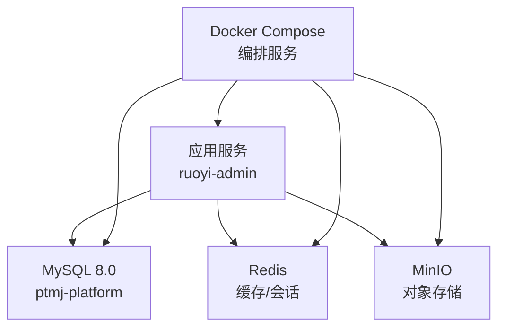
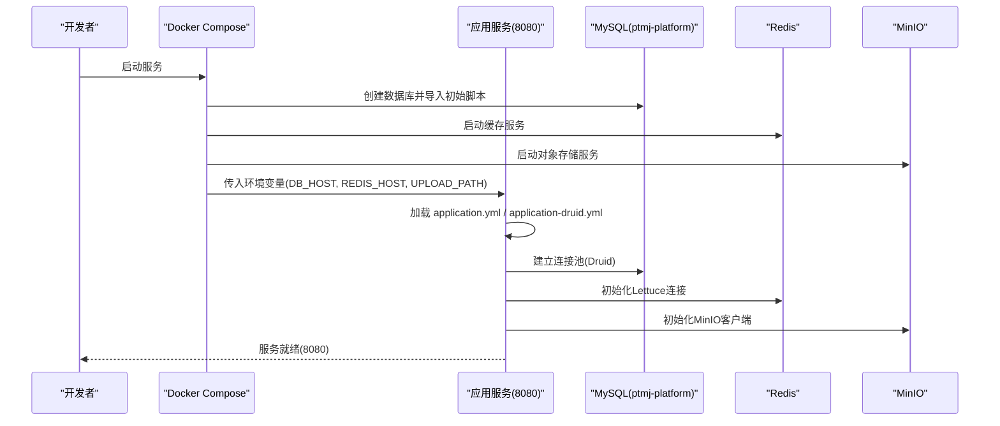
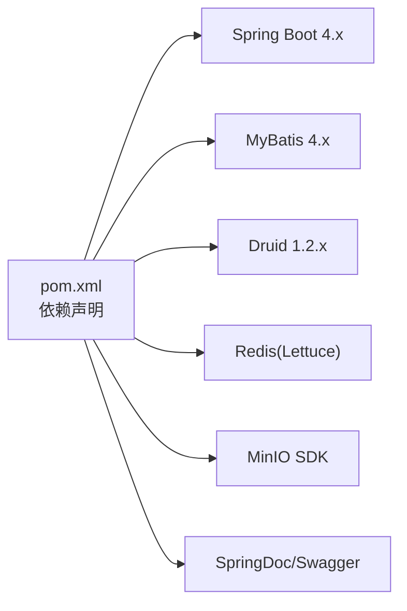

# 环境搭建

<cite>
**本文引用的文件**   
- [application.yml](file://PezMax-Backend/ruoyi-admin/src/main/resources/application.yml)
- [application-druid.yml](file://PezMax-Backend/ruoyi-admin/src/main/resources/application-druid.yml)
- [compose.yaml](file://PezMax-Backend/compose.yaml)
- [Dockerfile](file://PezMax-Backend/Dockerfile)
- [pom.xml](file://PezMax-Backend/pom.xml)
- [pezmax.sql](file://PezMax-Backend/sql/pezmax.sql)
- [quartz.sql](file://PezMax-Backend/sql/quartz.sql)
- [ry_20260321.sql](file://PezMax-Backend/sql/ry_20260321.sql)
- [alter_ptmj_file_add_school.sql](file://PezMax-Backend/sql/alter_ptmj_file_add_school.sql)
- [update_file_url_add_school.sql](file://PezMax-Backend/sql/update_file_url_add_school.sql)
</cite>

## 目录
1. [简介](#简介)
2. [项目结构](#项目结构)
3. [核心组件](#核心组件)
4. [架构总览](#架构总览)
5. [详细组件分析](#详细组件分析)
6. [依赖分析](#依赖分析)
7. [性能考虑](#性能考虑)
8. [故障排查指南](#故障排查指南)
9. [结论](#结论)
10. [附录](#附录)

## 简介
本指南面向开发与生产环境的快速落地，覆盖 JDK、MySQL、Redis、MinIO 等依赖服务的安装与配置；说明数据库初始化脚本的执行顺序与注意事项；详解 application.yml 与 application-druid.yml 的关键参数（数据库连接池、Redis、文件存储路径等）；并提供常见问题排查方法、环境变量最佳实践与安全建议。

## 项目结构
后端采用 Spring Boot + MyBatis + Druid + Redis + MinIO 的常见企业级组合，使用 Docker Compose 一键拉起 MySQL、Redis、MinIO 与应用服务。关键位置：
- 应用入口与打包产物由 Maven 构建生成，运行端口默认 8080
- 配置文件位于 ruoyi-admin 模块 resources 下
- SQL 脚本集中于 sql 目录，包含业务库、定时任务表结构与增量升级脚本
- compose.yaml 提供本地/测试环境的一键启动能力

图表来源
- [compose.yaml:1-84](file://PezMax-Backend/compose.yaml#L1-L84)
- [Dockerfile:1-114](file://PezMax-Backend/Dockerfile#L1-L114)

章节来源
- [compose.yaml:1-84](file://PezMax-Backend/compose.yaml#L1-L84)
- [Dockerfile:1-114](file://PezMax-Backend/Dockerfile#L1-L114)

## 核心组件
- 运行时要求
  - JDK 17（Maven 编译与运行）
  - MySQL 8.0（数据库）
  - Redis（缓存与会话）
  - MinIO（对象存储）
- 构建与运行
  - 使用 Maven 构建并打包为可执行 JAR
  - 支持通过 Docker 镜像运行，内置 LibreOffice 与中文字体用于文档处理
- 外部依赖
  - 数据库驱动：com.mysql.cj.jdbc.Driver
  - 连接池：Druid
  - 缓存客户端：Lettuce（Spring Data Redis）
  - 对象存储：MinIO SDK（通过配置注入）

章节来源
- [pom.xml:15-35](file://PezMax-Backend/pom.xml#L15-L35)
- [application-druid.yml:1-12](file://PezMax-Backend/ruoyi-admin/src/main/resources/application-druid.yml#L1-L12)
- [application.yml:71-93](file://PezMax-Backend/ruoyi-admin/src/main/resources/application.yml#L71-L93)
- [Dockerfile:82-87](file://PezMax-Backend/Dockerfile#L82-L87)

## 架构总览
下图展示了开发/测试环境下，Compose 编排的应用与依赖关系，以及应用对配置与环境变量的读取方式。

图表来源
- [compose.yaml:55-79](file://PezMax-Backend/compose.yaml#L55-L79)
- [application.yml:9-11](file://PezMax-Backend/ruoyi-admin/src/main/resources/application.yml#L9-L11)
- [application.yml:74-93](file://PezMax-Backend/ruoyi-admin/src/main/resources/application.yml#L74-L93)
- [application-druid.yml:8-11](file://PezMax-Backend/ruoyi-admin/src/main/resources/application-druid.yml#L8-L11)

## 详细组件分析

### 一、JDK 与构建环境
- 版本要求：JDK 17
- 构建工具：Maven（项目内自带 mvnw 包装器）
- 构建命令示例（在仓库根目录执行）：
  - 清理并打包：mvn clean package -pl ruoyi-admin -am -DskipTests
  - 直接运行：java -jar ruoyi-admin/target/ruoyi-admin.jar

章节来源
- [pom.xml:19](file://PezMax-Backend/pom.xml#L19)
- [Dockerfile:30-31](file://PezMax-Backend/Dockerfile#L30-L31)
- [Dockerfile:50-53](file://PezMax-Backend/Dockerfile#L50-L53)

### 二、MySQL 8.0 安装与配置
- 推荐方式：使用 Compose 一键启动（自动创建数据库 ptmj-platform 并挂载数据卷）
- 手动安装要点：
  - 字符集与排序规则：建议使用 utf8mb4/utf8mb4_0900_ai_ci（脚本已按此设计）
  - 时区：GMT+8（URL 参数已设置 serverTimezone=GMT%2B8）
  - 允许公钥检索：allowPublicKeyRetrieval=true（适配 MySQL 8 认证插件）
- 端口映射：默认 3306
- 健康检查：通过 mysqladmin ping 检测

章节来源
- [compose.yaml:3-20](file://PezMax-Backend/compose.yaml#L3-L20)
- [application-druid.yml:9](file://PezMax-Backend/ruoyi-admin/src/main/resources/application-druid.yml#L9)

### 三、Redis 安装与配置
- 推荐方式：使用 Compose 一键启动（持久化数据卷）
- 端口映射：默认 6379
- 应用侧连接：host/port/database/password/超时/Lettuce 连接池等均在 application.yml 中配置
- 健康检查：redis-cli ping

章节来源
- [compose.yaml:22-35](file://PezMax-Backend/compose.yaml#L22-L35)
- [application.yml:74-93](file://PezMax-Backend/ruoyi-admin/src/main/resources/application.yml#L74-L93)

### 四、MinIO 安装与配置
- 推荐方式：使用 Compose 一键启动（控制台 9001，API 9000）
- 访问地址：http://minio:9000（容器网络），或 http://localhost:9000（宿主机）
- 桶名称：ptmj（与 application.yml 一致）
- 健康检查：/minio/health/live

章节来源
- [compose.yaml:36-53](file://PezMax-Backend/compose.yaml#L36-L53)
- [application.yml:149-154](file://PezMax-Backend/ruoyi-admin/src/main/resources/application.yml#L149-L154)

### 五、数据库初始化步骤与顺序
请按以下顺序执行 SQL 脚本，确保依赖表与字典数据完整：
1. 基础系统表与字典数据
   - 执行 ry_20260321.sql（部门、用户、角色、菜单、字典、日志、任务等基础表及数据）
2. 业务主库表结构
   - 执行 pezmax.sql（业务表结构，如 ptmj_user、ptmj_file、ptmj_bookmark 等）
3. 定时任务 Quartz 表结构
   - 执行 quartz.sql（Quartz 调度所需表）
4. 增量升级脚本（按需）
   - alter_ptmj_file_add_school.sql：为 ptmj_file 添加 file_school 字段并补默认值
   - update_file_url_add_school.sql：将现有 URL 路径插入学校层级（谨慎执行，先验证再更新）

注意事项
- 首次部署建议先在测试库验证所有脚本
- 涉及数据变更的脚本（如 update_file_url_add_school.sql）务必先备份数据
- 若使用 Compose，MySQL 会自动导入 pezmax.sql（见 compose 挂载），但 ry_20260321.sql 与 quartz.sql 需手动导入或通过自定义初始化流程

章节来源
- [ry_20260321.sql:1-722](file://PezMax-Backend/sql/ry_20260321.sql#L1-L722)
- [pezmax.sql:1-799](file://PezMax-Backend/sql/pezmax.sql#L1-L799)
- [quartz.sql:1-174](file://PezMax-Backend/sql/quartz.sql#L1-L174)
- [alter_ptmj_file_add_school.sql:1-29](file://PezMax-Backend/sql/alter_ptmj_file_add_school.sql#L1-L29)
- [update_file_url_add_school.sql:1-100](file://PezMax-Backend/sql/update_file_url_add_school.sql#L1-L100)
- [compose.yaml:14](file://PezMax-Backend/compose.yaml#L14)

### 六、配置文件详解（application.yml 与 application-druid.yml）
以下为关键参数说明与定位路径（不展示具体值）：
- 服务器与上下文
  - 服务端口、上下文路径、Tomcat 线程与队列等
  - 参考：[application.yml:17-32](file://PezMax-Backend/ruoyi-admin/src/main/resources/application.yml#L17-L32)
- 文件上传与本地存储路径
  - 单文件大小、请求大小限制
  - 本地上传目录 profile（可通过环境变量 UPLOAD_PATH 覆盖）
  - 参考：[application.yml:57-62](file://PezMax-Backend/ruoyi-admin/src/main/resources/application.yml#L57-L62)、[application.yml:9-11](file://PezMax-Backend/ruoyi-admin/src/main/resources/application.yml#L9-L11)
- Redis 连接与连接池
  - host/port/database/password/timeout
  - Lettuce 连接池 min-idle/max-idle/max-active/max-wait
  - 参考：[application.yml:74-93](file://PezMax-Backend/ruoyi-admin/src/main/resources/application.yml#L74-L93)
- 数据库连接池（Druid）
  - 主库 URL（含时区、字符集、公钥检索等）、用户名、密码
  - 连接池大小、等待超时、空闲回收策略、慢 SQL 记录、监控页面
  - 参考：[application-druid.yml:1-62](file://PezMax-Backend/ruoyi-admin/src/main/resources/application-druid.yml#L1-L62)
- MinIO 对象存储
  - url/accessKey/secretKey/bucketName
  - 参考：[application.yml:149-154](file://PezMax-Backend/ruoyi-admin/src/main/resources/application.yml#L149-L154)
- 其他安全与功能开关
  - Referer 防盗链、XSS 过滤、Captcha 类型、Token 密钥与过期时间等
  - 参考：[application.yml:133-148](file://PezMax-Backend/ruoyi-admin/src/main/resources/application.yml#L133-L148)、[application.yml:95-102](file://PezMax-Backend/ruoyi-admin/src/main/resources/application.yml#L95-L102)

章节来源
- [application.yml:1-162](file://PezMax-Backend/ruoyi-admin/src/main/resources/application.yml#L1-L162)
- [application-druid.yml:1-62](file://PezMax-Backend/ruoyi-admin/src/main/resources/application-druid.yml#L1-L62)

### 七、环境变量与 Compose 集成
- 应用服务通过环境变量注入外部依赖地址与本地路径：
  - SPRING_PROFILES_ACTIVE：激活 druid 数据源配置
  - DB_HOST：MySQL 主机名（Compose 内部为 mysql）
  - REDIS_HOST：Redis 主机名（Compose 内部为 redis）
  - UPLOAD_PATH：应用本地上传目录（容器内映射到宿主目录）
  - JAVA_OPTS：JVM 内存参数
- 参考：[compose.yaml:63-68](file://PezMax-Backend/compose.yaml#L63-L68)

章节来源
- [compose.yaml:55-79](file://PezMax-Backend/compose.yaml#L55-L79)
- [application.yml:9-11](file://PezMax-Backend/ruoyi-admin/src/main/resources/application.yml#L9-L11)
- [application.yml:74-75](file://PezMax-Backend/ruoyi-admin/src/main/resources/application.yml#L74-L75)
- [application-druid.yml:9](file://PezMax-Backend/ruoyi-admin/src/main/resources/application-druid.yml#L9)

### 八、Docker 构建与运行
- 多阶段构建：依赖下载 -> 打包 -> 分层提取 -> 最小运行时镜像
- 运行时镜像基于 JRE 17，预装 LibreOffice 与中文字体
- 暴露端口：8080
- 参考：[Dockerfile:10-113](file://PezMax-Backend/Dockerfile#L10-L113)

章节来源
- [Dockerfile:10-113](file://PezMax-Backend/Dockerfile#L10-L113)

## 依赖分析
- 语言与框架
  - Java 17、Spring Boot 4.x、MyBatis、PageHelper、Fastjson2、SpringDoc/Swagger
- 中间件
  - MySQL 8.0（cj 驱动）、Druid 连接池、Redis（Lettuce）、MinIO
- 构建与发布
  - Maven 插件、Spring Boot 打包、Docker 多阶段构建

图表来源
- [pom.xml:15-35](file://PezMax-Backend/pom.xml#L15-L35)

章节来源
- [pom.xml:15-35](file://PezMax-Backend/pom.xml#L15-L35)

## 性能考虑
- 数据库连接池（Druid）
  - 根据并发量调整 maxActive/minIdle/maxWait 等参数
  - 开启慢 SQL 统计与合并 SQL，便于定位瓶颈
- Redis 连接池（Lettuce）
  - 合理设置 max-active/max-idle，避免连接耗尽
- Tomcat 线程
  - 根据 CPU 核数与 IO 特征调优 max/min-spare
- 文件上传
  - 控制 max-file-size 与 max-request-size，防止大文件拖垮服务
- 对象存储
  - 合理设置 MinIO 桶策略与分片上传策略，提升大文件吞吐

[本节为通用指导，无需源码引用]

## 故障排查指南
- 无法连接数据库
  - 检查 DB_HOST、端口、账号密码、时区与 allowPublicKeyRetrieval 参数
  - 确认 MySQL 健康检查通过
  - 参考：[application-druid.yml:9-11](file://PezMax-Backend/ruoyi-admin/src/main/resources/application-druid.yml#L9-L11)、[compose.yaml:15-20](file://PezMax-Backend/compose.yaml#L15-L20)
- Redis 连接失败
  - 检查 REDIS_HOST、端口、密码与防火墙
  - 查看应用日志中的 Lettuce 连接错误
  - 参考：[application.yml:74-93](file://PezMax-Backend/ruoyi-admin/src/main/resources/application.yml#L74-L93)
- MinIO 上传/下载异常
  - 校验 url/accessKey/secretKey/bucketName 是否一致
  - 确认 MinIO 健康检查通过，控制台可登录
  - 参考：[application.yml:149-154](file://PezMax-Backend/ruoyi-admin/src/main/resources/application.yml#L149-L154)、[compose.yaml:49-53](file://PezMax-Backend/compose.yaml#L49-L53)
- 本地上传目录无权限
  - 检查 UPLOAD_PATH 指向的宿主目录是否存在且可写
  - 参考：[compose.yaml:76-78](file://PezMax-Backend/compose.yaml#L76-L78)、[application.yml:9-11](file://PezMax-Backend/ruoyi-admin/src/main/resources/application.yml#L9-L11)
- 定时任务未执行
  - 确认 quartz.sql 已导入，sys_job/sys_job_log 表存在
  - 参考：[quartz.sql:1-174](file://PezMax-Backend/sql/quartz.sql#L1-L174)

章节来源
- [application-druid.yml:9-11](file://PezMax-Backend/ruoyi-admin/src/main/resources/application-druid.yml#L9-L11)
- [application.yml:74-93](file://PezMax-Backend/ruoyi-admin/src/main/resources/application.yml#L74-L93)
- [application.yml:149-154](file://PezMax-Backend/ruoyi-admin/src/main/resources/application.yml#L149-L154)
- [compose.yaml:49-78](file://PezMax-Backend/compose.yaml#L49-L78)
- [quartz.sql:1-174](file://PezMax-Backend/sql/quartz.sql#L1-L174)

## 结论
通过本指南，您可以快速完成 JDK、MySQL、Redis、MinIO 的安装与配置，正确执行数据库初始化脚本，理解并调整关键配置文件，掌握常见问题排查方法与生产安全建议。推荐使用 Compose 进行本地与测试环境部署，结合环境变量实现不同环境差异化配置。

## 附录

### A. 环境变量最佳实践与安全建议
- 敏感信息外置
  - 数据库密码、Redis 密码、MinIO 密钥等不要硬编码在配置文件中，统一通过环境变量注入
  - 参考：[compose.yaml:63-68](file://PezMax-Backend/compose.yaml#L63-L68)
- 最小权限原则
  - 为应用创建专用数据库账户，仅授予必要权限
  - MinIO 使用独立 AccessKey/SecretKey，并限定桶访问策略
- 网络安全
  - 对外暴露端口前，增加反向代理与 HTTPS 终止
  - 限制 Druid 监控页面访问白名单
  - 参考：[application-druid.yml:45-52](file://PezMax-Backend/ruoyi-admin/src/main/resources/application-druid.yml#L45-L52)
- 资源隔离
  - 为各服务分配独立容器与资源配额，避免相互影响
- 日志与审计
  - 集中收集应用与中间件日志，定期归档与轮转
- 备份与回滚
  - 数据库与对象存储定期快照备份
  - 升级脚本（尤其是数据变更类）必须附带回滚方案

章节来源
- [compose.yaml:63-68](file://PezMax-Backend/compose.yaml#L63-L68)
- [application-druid.yml:45-52](file://PezMax-Backend/ruoyi-admin/src/main/resources/application-druid.yml#L45-L52)