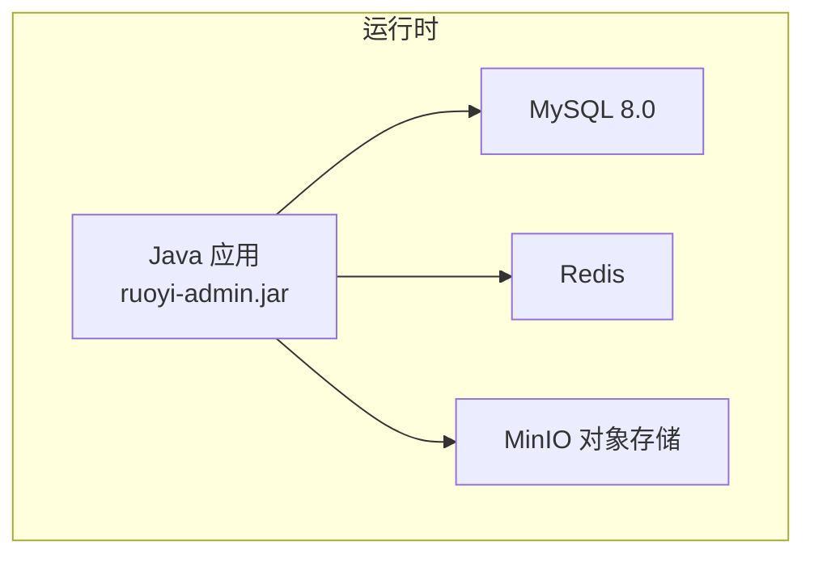
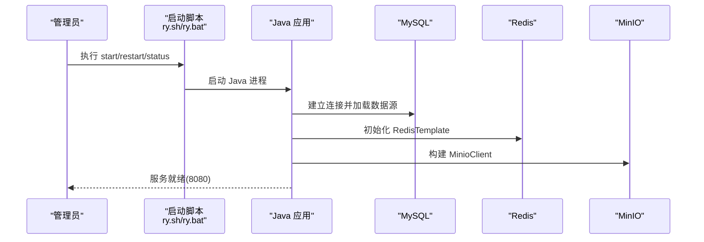
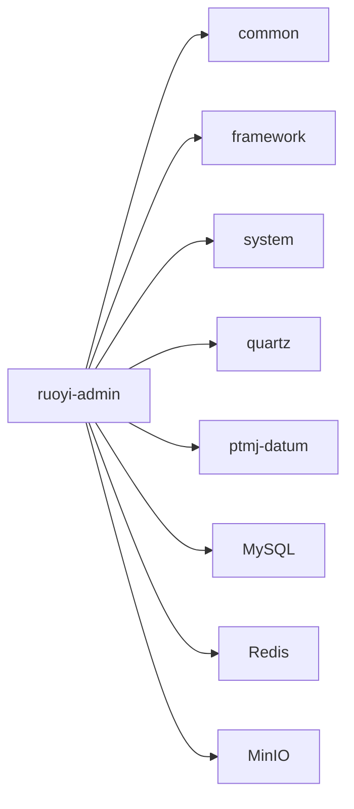

# 单机部署

<cite>
**本文引用的文件**   
- [ry.sh](file://PezMax-Backend/ry.sh)
- [ry.bat](file://PezMax-Backend/ry.bat)
- [application.yml](file://PezMax-Backend/ruoyi-admin/src/main/resources/application.yml)
- [application-druid.yml](file://PezMax-Backend/ruoyi-admin/src/main/resources/application-druid.yml)
- [pezmax.sql](file://PezMax-Backend/sql/pezmax.sql)
- [quartz.sql](file://PezMax-Backend/sql/quartz.sql)
- [compose.yaml](file://PezMax-Backend/compose.yaml)
- [MinioConfig.java](file://PezMax-Backend/ruoyi-common/src/main/java/com/ruoyi/common/config/MinioConfig.java)
- [RedisConfig.java](file://PezMax-Backend/ruoyi-framework/src/main/java/com/ruoyi/framework/config/RedisConfig.java)
</cite>

## 目录
1. [简介](#简介)
2. [项目结构](#项目结构)
3. [核心组件](#核心组件)
4. [架构总览](#架构总览)
5. [详细组件分析](#详细组件分析)
6. [依赖分析](#依赖分析)
7. [性能考虑](#性能考虑)
8. [故障排查指南](#故障排查指南)
9. [结论](#结论)
10. [附录](#附录)

## 简介
本指南面向在单台服务器上完整部署后端系统，涵盖环境准备（JDK、MySQL、Redis、MinIO）、数据库初始化、配置文件修改、应用启动与运维脚本使用，以及生产环境的参数调优建议与常见问题排查。

## 项目结构
后端采用多模块结构，Web 入口位于 ruoyi-admin，业务逻辑分布在 ptmj-datum 等模块；配置集中在 application*.yml；数据脚本位于 sql 目录；提供 Linux/Windows 启动脚本 ry.sh 与 ry.bat；并提供 compose.yaml 用于容器化一键部署。

图表来源
- [compose.yaml:1-84](file://PezMax-Backend/compose.yaml#L1-L84)
- [application.yml:1-162](file://PezMax-Backend/ruoyi-admin/src/main/resources/application.yml#L1-L162)
- [application-druid.yml:1-62](file://PezMax-Backend/ruoyi-admin/src/main/resources/application-druid.yml#L1-L62)

章节来源
- [compose.yaml:1-84](file://PezMax-Backend/compose.yaml#L1-L84)
- [application.yml:1-162](file://PezMax-Backend/ruoyi-admin/src/main/resources/application.yml#L1-L162)
- [application-druid.yml:1-62](file://PezMax-Backend/ruoyi-admin/src/main/resources/application-druid.yml#L1-L62)

## 核心组件
- Web 服务：Spring Boot 应用，默认端口 8080，上下文路径 /。
- 数据库：MySQL 8.0，连接池使用 Druid，主库地址、用户名、密码通过 application-druid.yml 配置。
- 缓存：Redis，连接信息在 application.yml 中配置。
- 对象存储：MinIO，客户端由 MinioConfig 注入，URL、密钥、桶名在 application.yml 中配置。
- 任务调度：Quartz 持久化表由 quartz.sql 提供。

章节来源
- [application.yml:17-33](file://PezMax-Backend/ruoyi-admin/src/main/resources/application.yml#L17-L33)
- [application-druid.yml:1-62](file://PezMax-Backend/ruoyi-admin/src/main/resources/application-druid.yml#L1-L62)
- [application.yml:71-93](file://PezMax-Backend/ruoyi-admin/src/main/resources/application.yml#L71-L93)
- [application.yml:149-155](file://PezMax-Backend/ruoyi-admin/src/main/resources/application.yml#L149-L155)
- [MinioConfig.java:1-28](file://PezMax-Backend/ruoyi-common/src/main/java/com/ruoyi/common/config/MinioConfig.java#L1-L28)
- [quartz.sql:1-174](file://PezMax-Backend/sql/quartz.sql#L1-L174)

## 架构总览
单机部署时，所有中间件与应用运行在同一主机上。应用通过 JDBC 访问 MySQL，通过 Redis 客户端访问缓存，通过 MinIO 客户端进行对象存取。

图表来源
- [ry.sh:1-87](file://PezMax-Backend/ry.sh#L1-L87)
- [ry.bat:1-68](file://PezMax-Backend/ry.bat#L1-L68)
- [application.yml:17-33](file://PezMax-Backend/ruoyi-admin/src/main/resources/application.yml#L17-L33)
- [application-druid.yml:1-62](file://PezMax-Backend/ruoyi-admin/src/main/resources/application-druid.yml#L1-L62)
- [application.yml:71-93](file://PezMax-Backend/ruoyi-admin/src/main/resources/application.yml#L71-L93)
- [application.yml:149-155](file://PezMax-Backend/ruoyi-admin/src/main/resources/application.yml#L149-L155)

## 详细组件分析

### 启动脚本使用说明（Linux）
- 功能：支持 start、stop、restart、status 四种操作。
- 关键行为：
  - 通过进程名匹配判断是否已运行。
  - stop 发送终止信号并等待进程退出。
  - restart 先停止再启动。
  - status 统计进程数输出状态。
- 日志：默认将标准输出重定向到 logs 目录下以应用名为名的日志文件。

章节来源
- [ry.sh:1-87](file://PezMax-Backend/ry.sh#L1-L87)

### 启动脚本使用说明（Windows）
- 功能：交互式菜单选择 1 启动、2 关闭、3 重启、4 查看状态、5 退出。
- 关键行为：
  - 使用 jps 查找进程 ID。
  - 启动使用 javaw 后台运行。
  - 关闭使用 taskkill 强制结束进程。
  - 状态查询显示进程是否存在。

章节来源
- [ry.bat:1-68](file://PezMax-Backend/ry.bat#L1-L68)

### 数据库初始化
- 业务数据库：创建数据库 ptmj-platform，导入 pezmax.sql。
- 定时任务表：如需 Quartz 持久化，导入 quartz.sql。
- 注意：确保字符集为 utf8mb4，时区 GMT+8。

章节来源
- [pezmax.sql:1-799](file://PezMax-Backend/sql/pezmax.sql#L1-L799)
- [quartz.sql:1-174](file://PezMax-Backend/sql/quartz.sql#L1-L174)

### 配置文件修改
- 服务器端口与上下文路径：application.yml 的 server.port 与 server.servlet.context-path。
- 文件上传路径：ruoyi.profile 环境变量或配置项，影响本地文件存储位置。
- 数据库连接：application-druid.yml 的主库 url、username、password。
- Redis 连接：application.yml 的 spring.data.redis.host/port/password/pool 等。
- MinIO 连接：application.yml 的 minio.url/accessKey/secretKey/bucketName。
- 其他：XSS 过滤开关、Referer 白名单、Swagger 开关等可按需调整。

章节来源
- [application.yml:17-33](file://PezMax-Backend/ruoyi-admin/src/main/resources/application.yml#L17-L33)
- [application.yml:9-14](file://PezMax-Backend/ruoyi-admin/src/main/resources/application.yml#L9-L14)
- [application-druid.yml:1-62](file://PezMax-Backend/ruoyi-admin/src/main/resources/application-druid.yml#L1-L62)
- [application.yml:71-93](file://PezMax-Backend/ruoyi-admin/src/main/resources/application.yml#L71-L93)
- [application.yml:149-155](file://PezMax-Backend/ruoyi-admin/src/main/resources/application.yml#L149-L155)

### 应用启动流程
- 启动后应用会加载 Spring 配置，初始化数据源、Redis 连接、MinIO 客户端，并暴露 HTTP 服务。
- 若使用 Docker Compose，可通过 compose.yaml 一键拉起 MySQL、Redis、MinIO 与应用服务。

章节来源
- [compose.yaml:1-84](file://PezMax-Backend/compose.yaml#L1-L84)
- [application.yml:17-33](file://PezMax-Backend/ruoyi-admin/src/main/resources/application.yml#L17-L33)

### MinIO 客户端装配
- MinioConfig 从配置读取 endpoint、accessKey、secretKey，并创建 MinioClient Bean。
- 应用通过该 Bean 进行对象存储操作。

章节来源
- [MinioConfig.java:1-28](file://PezMax-Backend/ruoyi-common/src/main/java/com/ruoyi/common/config/MinioConfig.java#L1-L28)
- [application.yml:149-155](file://PezMax-Backend/ruoyi-admin/src/main/resources/application.yml#L149-L155)

### Redis 配置与限流脚本
- RedisConfig 启用缓存，配置 RedisTemplate 序列化策略，并提供限流 Lua 脚本 Bean。
- 限流脚本基于 key/count/time 实现原子计数与过期控制。

章节来源
- [RedisConfig.java:1-71](file://PezMax-Backend/ruoyi-framework/src/main/java/com/ruoyi/framework/config/RedisConfig.java#L1-L71)
- [application.yml:71-93](file://PezMax-Backend/ruoyi-admin/src/main/resources/application.yml#L71-L93)

## 依赖分析
- 外部依赖：MySQL、Redis、MinIO。
- 内部依赖：ruoyi-admin 依赖 common、framework、system、quartz、ptmj-datum 等模块。
- 配置依赖：application.yml 与 application-druid.yml 共同决定运行时行为。

图表来源
- [compose.yaml:1-84](file://PezMax-Backend/compose.yaml#L1-L84)
- [application.yml:1-162](file://PezMax-Backend/ruoyi-admin/src/main/resources/application.yml#L1-L162)
- [application-druid.yml:1-62](file://PezMax-Backend/ruoyi-admin/src/main/resources/application-druid.yml#L1-L62)

章节来源
- [compose.yaml:1-84](file://PezMax-Backend/compose.yaml#L1-L84)
- [application.yml:1-162](file://PezMax-Backend/ruoyi-admin/src/main/resources/application.yml#L1-L162)
- [application-druid.yml:1-62](file://PezMax-Backend/ruoyi-admin/src/main/resources/application-druid.yml#L1-L62)

## 性能考虑
- JVM 参数（Linux）：ry.sh 中设置堆大小、元空间、GC 类型与打印选项，可根据内存与负载调整。
- Tomcat 线程：server.tomcat.threads.max/min-spare 可提升并发处理能力。
- 数据库连接池：Druid 的 initialSize/minIdle/maxActive/maxWait/connectTimeout/socketTimeout 等按实际 QPS 与延迟目标调优。
- Redis 连接池：lettuce pool 的 max-active/min-idle/max-idle 根据热点键与读写频率调整。
- 文件上传限制：spring.servlet.multipart.max-file-size/max-request-size 按需增大。
- 日志级别：logging.level.com.ruoyi 在生产环境建议调整为 warn 或 info。

章节来源
- [ry.sh:1-87](file://PezMax-Backend/ry.sh#L1-L87)
- [application.yml:17-33](file://PezMax-Backend/ruoyi-admin/src/main/resources/application.yml#L17-L33)
- [application.yml:56-62](file://PezMax-Backend/ruoyi-admin/src/main/resources/application.yml#L56-L62)
- [application.yml:35-38](file://PezMax-Backend/ruoyi-admin/src/main/resources/application.yml#L35-L38)
- [application-druid.yml:1-62](file://PezMax-Backend/ruoyi-admin/src/main/resources/application-druid.yml#L1-L62)
- [application.yml:71-93](file://PezMax-Backend/ruoyi-admin/src/main/resources/application.yml#L71-L93)

## 故障排查指南
- 无法连接数据库
  - 检查 application-druid.yml 中的 url、username、password 是否正确。
  - 确认 MySQL 服务已启动且端口可达。
  - 确认数据库与表已正确初始化（pezmax.sql、quartz.sql）。
- 无法连接 Redis
  - 检查 application.yml 中 redis.host/port/password 是否与本机一致。
  - 确认 Redis 服务已启动并可 ping。
- MinIO 不可用
  - 检查 application.yml 中 minio.url/accessKey/secretKey/bucketName。
  - 确认 MinIO 服务健康，API 端口可达。
- 启动失败或无响应
  - 查看 logs 目录下的应用日志文件。
  - 使用 ry.sh status 或 ry.bat 状态查看进程是否存在。
  - 检查端口占用与防火墙规则。
- 文件上传失败
  - 检查 spring.servlet.multipart 大小限制。
  - 检查 ruoyi.profile 指向的磁盘空间与权限。
- 定时任务不执行
  - 确认 quartz 表已初始化。
  - 检查 Quartz 相关配置与任务定义。

章节来源
- [application-druid.yml:1-62](file://PezMax-Backend/ruoyi-admin/src/main/resources/application-druid.yml#L1-L62)
- [application.yml:71-93](file://PezMax-Backend/ruoyi-admin/src/main/resources/application.yml#L71-L93)
- [application.yml:149-155](file://PezMax-Backend/ruoyi-admin/src/main/resources/application.yml#L149-L155)
- [ry.sh:1-87](file://PezMax-Backend/ry.sh#L1-L87)
- [ry.bat:1-68](file://PezMax-Backend/ry.bat#L1-L68)
- [pezmax.sql:1-799](file://PezMax-Backend/sql/pezmax.sql#L1-L799)
- [quartz.sql:1-174](file://PezMax-Backend/sql/quartz.sql#L1-L174)

## 结论
按照本指南完成环境准备、数据库初始化、配置修改与启动后，可在单机环境下稳定运行后端系统。生产环境建议结合性能章节对 JVM、Tomcat、数据库连接池与 Redis 连接池进行针对性调优，并通过日志与监控持续优化。

## 附录
- 常用命令（Linux）
  - 启动：./ry.sh start
  - 停止：./ry.sh stop
  - 重启：./ry.sh restart
  - 状态：./ry.sh status
- 常用命令（Windows）
  - 运行 ry.bat，按提示选择 1 启动、2 关闭、3 重启、4 状态、5 退出
- 容器化部署
  - 使用 compose.yaml 一键拉起 MySQL、Redis、MinIO 与应用服务

章节来源
- [ry.sh:1-87](file://PezMax-Backend/ry.sh#L1-L87)
- [ry.bat:1-68](file://PezMax-Backend/ry.bat#L1-L68)
- [compose.yaml:1-84](file://PezMax-Backend/compose.yaml#L1-L84)