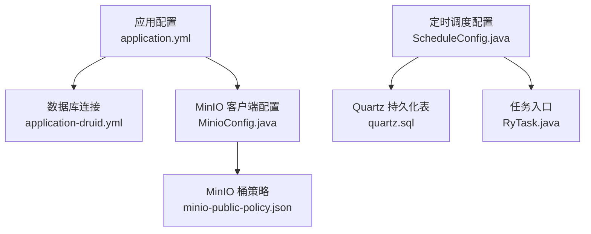
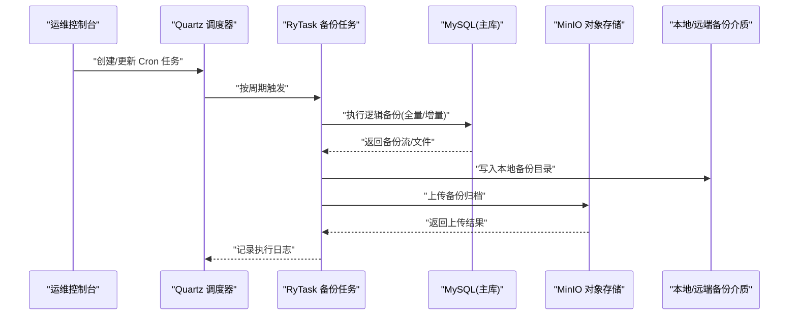
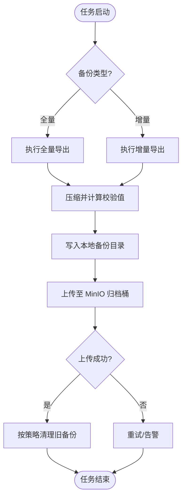
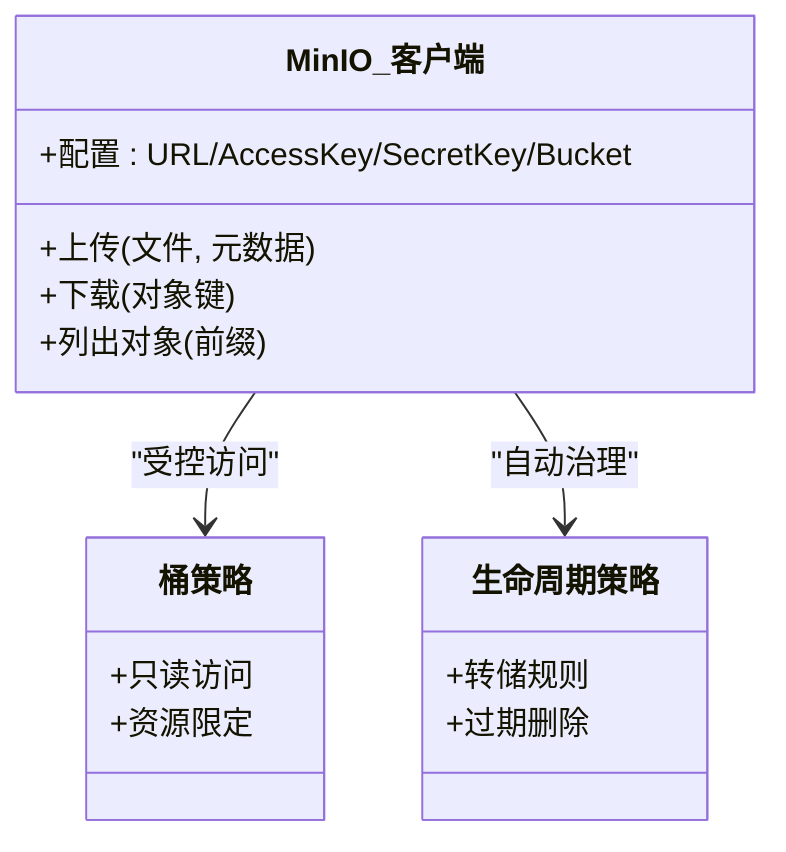
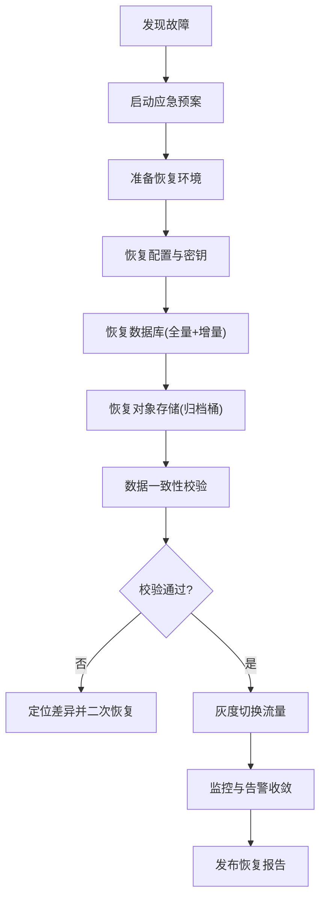
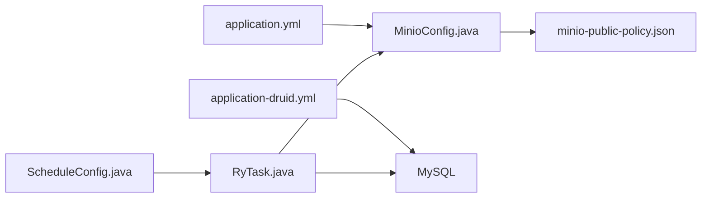

# 备份恢复

<cite>
**本文引用的文件**   
- [application.yml](file://PezMax-Backend/ruoyi-admin/src/main/resources/application.yml)
- [application-druid.yml](file://PezMax-Backend/ruoyi-admin/src/main/resources/application-druid.yml)
- [minio-public-policy.json](file://PezMax-Backend/ptmj-datum/src/main/resources/minio-public-policy.json)
- [quartz.sql](file://PezMax-Backend/sql/quartz.sql)
- [MinioConfig.java](file://PezMax-Backend/ruoyi-common/src/main/java/com/ruoyi/common/config/MinioConfig.java)
- [RuoYiConfig.java](file://PezMax-Backend/ruoyi-common/src/main/java/com/ruoyi/common/config/RuoYiConfig.java)
- [ScheduleConfig.java](file://PezMax-Backend/ruoyi-quartz/src/main/java/com/ruoyi/quartz/config/ScheduleConfig.java)
- [RyTask.java](file://PezMax-Backend/ruoyi-quartz/src/main/java/com/ruoyi/quartz/task/RyTask.java)
</cite>

## 目录
1. [简介](#简介)
2. [项目结构](#项目结构)
3. [核心组件](#核心组件)
4. [架构总览](#架构总览)
5. [详细组件分析](#详细组件分析)
6. [依赖分析](#依赖分析)
7. [性能考虑](#性能考虑)
8. [故障排查指南](#故障排查指南)
9. [结论](#结论)
10. [附录](#附录)

## 简介
本指南面向企业级容灾与数据保护，围绕以下目标提供可落地的策略与流程：
- 数据库自动备份方案：全量备份、增量备份、定时任务配置与执行链路。
- MinIO 对象存储备份策略：跨区域复制、版本控制、生命周期管理。
- 系统配置文件与敏感信息管理：环境变量、密钥、证书等的安全备份与轮换。
- 灾难恢复流程：数据恢复验证、服务切换、业务连续性保障。

## 项目结构
本项目采用多模块后端（Spring Boot + MyBatis + Quartz）+ 桌面端前端架构。与备份恢复相关的关键位置包括：
- 应用配置与外部依赖连接信息：application.yml、application-druid.yml
- MinIO 客户端配置与公开策略：MinioConfig.java、minio-public-policy.json
- 定时调度框架与表结构：ScheduleConfig.java、RyTask.java、quartz.sql
- 通用配置类：RuoYiConfig.java

图表来源
- [application.yml:149-154](file://PezMax-Backend/ruoyi-admin/src/main/resources/application.yml#L149-L154)
- [application-druid.yml:1-20](file://PezMax-Backend/ruoyi-admin/src/main/resources/application-druid.yml#L1-L20)
- [MinioConfig.java](file://PezMax-Backend/ruoyi-common/src/main/java/com/ruoyi/common/config/MinioConfig.java)
- [ScheduleConfig.java](file://PezMax-Backend/ruoyi-quartz/src/main/java/com/ruoyi/quartz/config/ScheduleConfig.java)
- [RyTask.java](file://PezMax-Backend/ruoyi-quartz/src/main/java/com/ruoyi/quartz/task/RyTask.java)
- [quartz.sql:1-174](file://PezMax-Backend/sql/quartz.sql#L1-L174)
- [minio-public-policy.json:1-17](file://PezMax-Backend/ptmj-datum/src/main/resources/minio-public-policy.json#L1-L17)

章节来源
- [application.yml:1-162](file://PezMax-Backend/ruoyi-admin/src/main/resources/application.yml#L1-L162)
- [application-druid.yml:1-62](file://PezMax-Backend/ruoyi-admin/src/main/resources/application-druid.yml#L1-L62)
- [quartz.sql:1-174](file://PezMax-Backend/sql/quartz.sql#L1-L174)

## 核心组件
- 数据库连接与监控
  - 使用 Druid 数据源，包含主库配置、可选从库开关、连接池参数与监控面板访问路径。
  - 建议将密码通过环境变量注入，避免硬编码；开启慢 SQL 日志便于定位备份窗口内的性能影响。
- MinIO 对象存储
  - 通过 application.yml 的 minio.* 配置项与 MinioConfig.java 完成客户端初始化。
  - 桶策略 minio-public-policy.json 定义了只读访问策略，用于下载或导出场景。
- 定时任务
  - 基于 Quartz 实现，持久化表由 quartz.sql 提供。
  - ScheduleConfig.java 负责调度器装配，RyTask.java 作为任务入口，适合承载备份脚本调用。

章节来源
- [application-druid.yml:1-62](file://PezMax-Backend/ruoyi-admin/src/main/resources/application-druid.yml#L1-L62)
- [application.yml:149-154](file://PezMax-Backend/ruoyi-admin/src/main/resources/application.yml#L149-L154)
- [MinioConfig.java](file://PezMax-Backend/ruoyi-common/src/main/java/com/ruoyi/common/config/MinioConfig.java)
- [minio-public-policy.json:1-17](file://PezMax-Backend/ptmj-d datum/src/main/resources/minio-public-policy.json#L1-L17)
- [ScheduleConfig.java](file://PezMax-Backend/ruoyi-quartz/src/main/java/com/ruoyi/quartz/config/ScheduleConfig.java)
- [RyTask.java](file://PezMax-Backend/ruoyi-quartz/src/main/java/com/ruoyi/quartz/task/RyTask.java)
- [quartz.sql:1-174](file://PezMax-Backend/sql/quartz.sql#L1-L174)

## 架构总览
下图展示备份恢复在系统中的关键交互：应用读取配置，通过 Quartz 触发备份任务，分别对数据库与 MinIO 进行备份，并将结果落盘或上传至远端存储。

图表来源
- [ScheduleConfig.java](file://PezMax-Backend/ruoyi-quartz/src/main/java/com/ruoyi/quartz/config/ScheduleConfig.java)
- [RyTask.java](file://PezMax-Backend/ruoyi-quartz/src/main/java/com/ruoyi/quartz/task/RyTask.java)
- [quartz.sql:1-174](file://PezMax-Backend/sql/quartz.sql#L1-L174)
- [application.yml:149-154](file://PezMax-Backend/ruoyi-admin/src/main/resources/application.yml#L149-L154)

## 详细组件分析

### 数据库备份策略（全量/增量/定时）
- 全量备份
  - 适用场景：首次完整快照、定期冷备。
  - 建议方式：使用数据库厂商提供的逻辑备份工具生成结构化导出，结合压缩与校验。
  - 存储位置：本地磁盘 + MinIO 归档（跨区复制）。
- 增量备份
  - 适用场景：降低 RPO，缩短备份窗口。
  - 建议方式：基于事务日志或增量导出机制，按时间窗口滚动保留。
- 定时任务配置
  - 使用 Quartz 持久化表（见 quartz.sql），通过 ScheduleConfig.java 装配调度器，RyTask.java 作为任务入口。
  - 建议在任务中记录开始/结束时间、文件大小、校验和、上传状态，便于审计与排障。
- 安全与合规
  - 备份文件加密传输与静态加密。
  - 最小权限原则：仅授予备份账号必要的 SELECT 或日志读取权限。

图表来源
- [RyTask.java](file://PezMax-Backend/ruoyi-quartz/src/main/java/com/ruoyi/quartz/task/RyTask.java)
- [ScheduleConfig.java](file://PezMax-Backend/ruoyi-quartz/src/main/java/com/ruoyi/quartz/config/ScheduleConfig.java)
- [quartz.sql:1-174](file://PezMax-Backend/sql/quartz.sql#L1-L174)

章节来源
- [quartz.sql:1-174](file://PezMax-Backend/sql/quartz.sql#L1-L174)
- [ScheduleConfig.java](file://PezMax-Backend/ruoyi-quartz/src/main/java/com/ruoyi/quartz/config/ScheduleConfig.java)
- [RyTask.java](file://PezMax-Backend/ruoyi-quartz/src/main/java/com/ruoyi/quartz/task/RyTask.java)

### MinIO 对象存储备份策略
- 版本控制
  - 为关键桶启用版本控制，防止误删与覆盖，支持回滚到历史版本。
- 生命周期管理
  - 设置规则：近线存储、归档存储与过期删除，平衡成本与保留期要求。
- 跨区域复制
  - 将备份桶配置跨区域复制，满足异地容灾与合规要求。
- 访问控制
  - 使用 minio-public-policy.json 定义只读策略，配合独立账号与最小权限原则。
- 备份工件
  - 将数据库导出文件、配置文件打包后上传至专用“备份”桶，命名遵循“日期+类型+哈希”。

图表来源
- [MinioConfig.java](file://PezMax-Backend/ruoyi-common/src/main/java/com/ruoyi/common/config/MinioConfig.java)
- [application.yml:149-154](file://PezMax-Backend/ruoyi-admin/src/main/resources/application.yml#L149-L154)
- [minio-public-policy.json:1-17](file://PezMax-Backend/ptmj-datum/src/main/resources/minio-public-policy.json#L1-L17)

章节来源
- [application.yml:149-154](file://PezMax-Backend/ruoyi-admin/src/main/resources/application.yml#L149-L154)
- [MinioConfig.java](file://PezMax-Backend/ruoyi-common/src/main/java/com/ruoyi/common/config/MinioConfig.java)
- [minio-public-policy.json:1-17](file://PezMax-Backend/ptmj-datum/src/main/resources/minio-public-policy.json#L1-L17)

### 系统配置文件与敏感数据备份
- 需纳入备份范围
  - 应用配置：application.yml、application-druid.yml
  - 运行时环境变量：数据库、Redis、MinIO、第三方服务凭据
  - 密钥与证书：TLS 证书、签名密钥、第三方 API Key
- 保护建议
  - 使用环境变量或密钥管理服务注入，不在代码仓库中存放明文。
  - 备份文件必须加密存储，限制访问权限，保留审计日志。
  - 定期轮换密钥与证书，并在变更后同步更新备份集。

章节来源
- [application.yml:1-162](file://PezMax-Backend/ruoyi-admin/src/main/resources/application.yml#L1-L162)
- [application-druid.yml:1-62](file://PezMax-Backend/ruoyi-admin/src/main/resources/application-druid.yml#L1-L62)

### 灾难恢复流程（DR）
- 恢复目标
  - RTO（恢复时间目标）：明确各组件最大允许停机时长。
  - RPO（恢复点目标）：根据备份频率与增量策略确定数据丢失上限。
- 恢复步骤
  1) 评估影响面：确认需要恢复的数据域与依赖服务。
  2) 准备环境：搭建或扩容目标集群，确保网络连通与权限正确。
  3) 恢复顺序：先基础配置与密钥，再数据库，最后对象存储与缓存预热。
  4) 数据校验：比对校验和、抽样查询、冒烟测试。
  5) 流量切换：灰度切流，观察错误率与延迟指标。
  6) 回滚预案：若异常则快速回退至上一稳定版本。
- 演练与持续改进
  - 定期开展桌面推演与实战演练，复盘并优化 SOP。

[此图为概念性流程图，不直接映射具体源码文件]

## 依赖分析
- 配置依赖
  - application.yml 提供 MinIO 连接信息与通用运行参数。
  - application-druid.yml 提供数据库连接与监控面板配置。
- 组件耦合
  - RyTask 依赖 Quartz 调度器与外部存储（数据库/MinIO）。
  - MinioConfig 读取 application.yml 中的 MinIO 配置。
- 潜在风险
  - 硬编码凭据：应改为环境变量注入。
  - 单点故障：Quartz 与数据库建议集群化部署，MinIO 启用多副本与跨区域复制。

图表来源
- [application.yml:149-154](file://PezMax-Backend/ruoyi-admin/src/main/resources/application.yml#L149-L154)
- [application-druid.yml:1-20](file://PezMax-Backend/ruoyi-admin/src/main/resources/application-druid.yml#L1-L20)
- [MinioConfig.java](file://PezMax-Backend/ruoyi-common/src/main/java/com/ruoyi/common/config/MinioConfig.java)
- [ScheduleConfig.java](file://PezMax-Backend/ruoyi-quartz/src/main/java/com/ruoyi/quartz/config/ScheduleConfig.java)
- [RyTask.java](file://PezMax-Backend/ruoyi-quartz/src/main/java/com/ruoyi/quartz/task/RyTask.java)
- [minio-public-policy.json:1-17](file://PezMax-Backend/ptmj-datum/src/main/resources/minio-public-policy.json#L1-L17)

章节来源
- [application.yml:1-162](file://PezMax-Backend/ruoyi-admin/src/main/resources/application.yml#L1-L162)
- [application-druid.yml:1-62](file://PezMax-Backend/ruoyi-admin/src/main/resources/application-druid.yml#L1-L62)
- [MinioConfig.java](file://PezMax-Backend/ruoyi-common/src/main/java/com/ruoyi/common/config/MinioConfig.java)
- [ScheduleConfig.java](file://PezMax-Backend/ruoyi-quartz/src/main/java/com/ruoyi/quartz/config/ScheduleConfig.java)
- [RyTask.java](file://PezMax-Backend/ruoyi-quartz/src/main/java/com/ruoyi/quartz/task/RyTask.java)
- [minio-public-policy.json:1-17](file://PezMax-Backend/ptmj-datum/src/main/resources/minio-public-policy.json#L1-L17)

## 性能考虑
- 备份窗口
  - 选择低峰时段执行全量备份；增量备份尽量短小频繁。
- 并发与限流
  - 控制备份任务的并发度，避免与在线读写争抢资源。
- 网络与吞吐
  - 就近上传至 MinIO 节点，必要时启用分片上传与断点续传。
- 监控与告警
  - 记录备份耗时、失败次数、大小变化趋势，设置阈值告警。

[本节为通用指导，无需源码引用]

## 故障排查指南
- 常见问题
  - 数据库连接失败：检查 application-druid.yml 中主机、端口、用户名、密码及网络连通性。
  - MinIO 上传失败：核对 application.yml 中 MinIO 地址、凭据与桶名，确认策略与权限。
  - 任务未触发：查看 Quartz 表状态与日志，确认 Cron 表达式与时区。
- 定位手段
  - 查看应用日志与 Quartz 执行日志。
  - 使用数据库监控面板（Druid）观察慢 SQL 与连接池占用。
  - 使用 MinIO 控制台检查对象是否存在与访问策略是否生效。

章节来源
- [application-druid.yml:1-62](file://PezMax-Backend/ruoyi-admin/src/main/resources/application-druid.yml#L1-L62)
- [application.yml:149-154](file://PezMax-Backend/ruoyi-admin/src/main/resources/application.yml#L149-L154)
- [quartz.sql:1-174](file://PezMax-Backend/sql/quartz.sql#L1-L174)

## 结论
通过“数据库全量+增量 + MinIO 归档 + 定时任务 + 严格权限与加密”的组合策略，可实现高可用、可追溯、可演练的企业级备份与恢复体系。建议结合业务 SLA 设定合理的 RTO/RPO，并定期演练以持续优化。

[本节为总结性内容，无需源码引用]

## 附录
- 术语
  - RTO：恢复时间目标
  - RPO：恢复点目标
  - 全量备份：一次性完整数据导出
  - 增量备份：仅导出自上次备份以来的变更
- 参考清单
  - 配置项清单：application.yml、application-druid.yml
  - 调度表结构：quartz.sql
  - MinIO 策略：minio-public-policy.json

[本节为补充说明，无需源码引用]