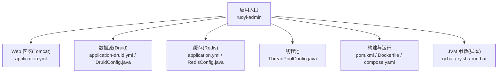
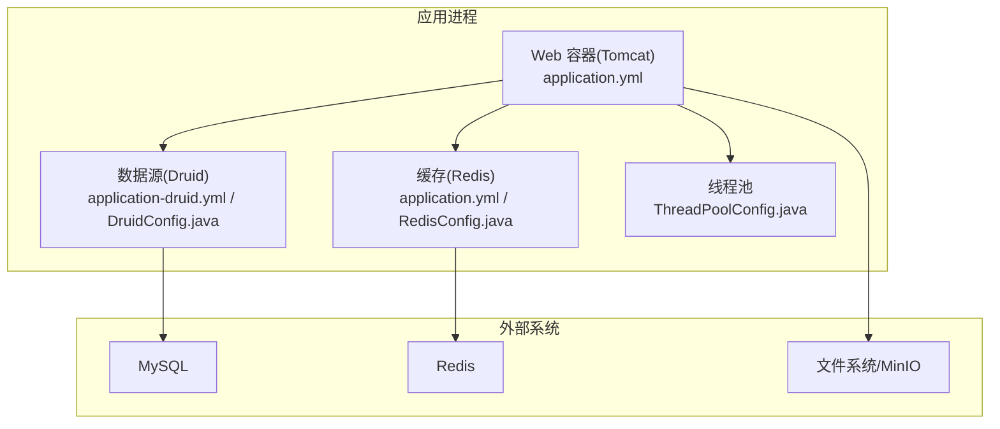
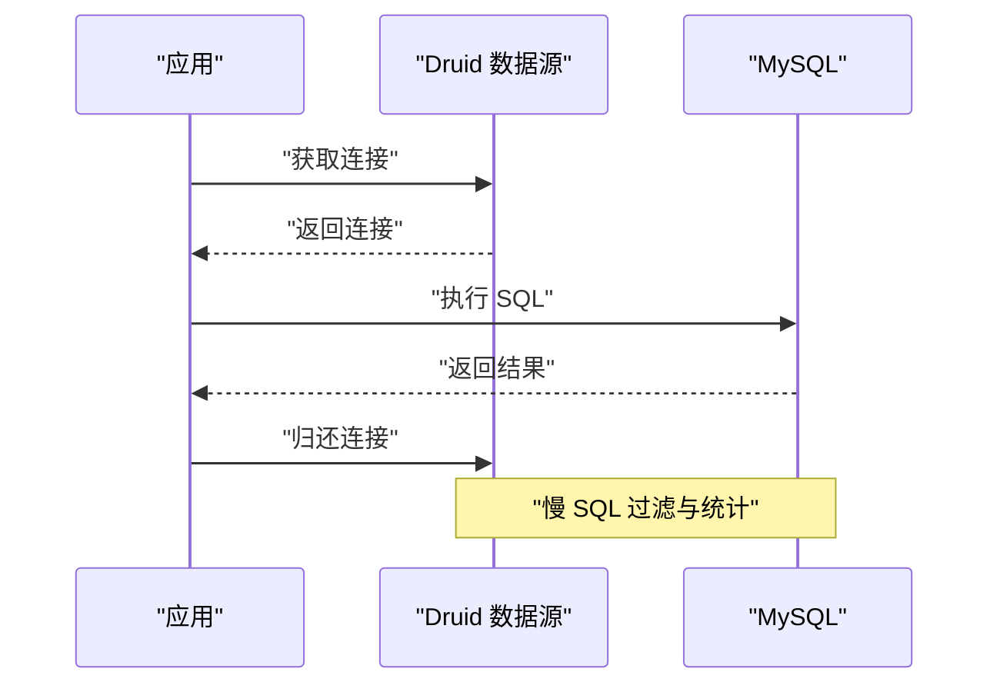
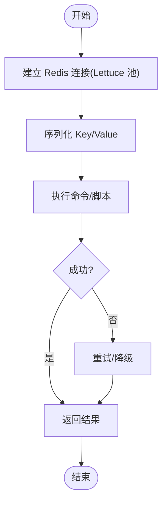
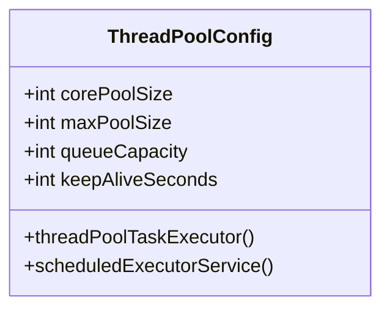
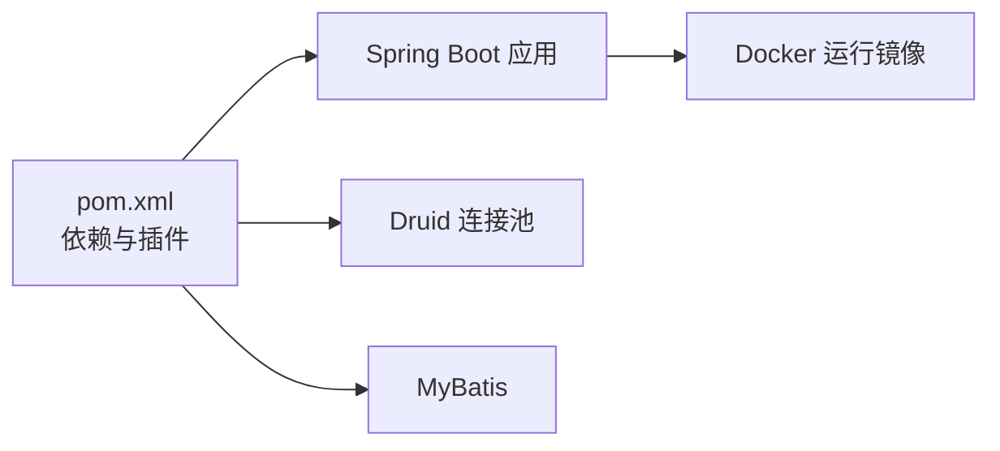

# 性能调优

<cite>
**本文引用的文件**   
- [application.yml](file://PezMax-Backend/ruoyi-admin/src/main/resources/application.yml)
- [application-druid.yml](file://PezMax-Backend/ruoyi-admin/src/main/resources/application-druid.yml)
- [DruidConfig.java](file://PezMax-Backend/ruoyi-framework/src/main/java/com/ruoyi/framework/config/DruidConfig.java)
- [RedisConfig.java](file://PezMax-Backend/ruoyi-framework/src/main/java/com/ruoyi/framework/config/RedisConfig.java)
- [ThreadPoolConfig.java](file://PezMax-Backend/ruoyi-framework/src/main/java/com/ruoyi/framework/config/ThreadPoolConfig.java)
- [pom.xml](file://PezMax-Backend/pom.xml)
- [Dockerfile](file://PezMax-Backend/Dockerfile)
- [ry.bat](file://PezMax-Backend/ry.bat)
- [ry.sh](file://PezMax-Backend/ry.sh)
- [run.bat](file://PezMax-Backend/bin/run.bat)
- [compose.yaml](file://PezMax-Backend/compose.yaml)
</cite>

## 目录
1. [简介](#简介)
2. [项目结构](#项目结构)
3. [核心组件](#核心组件)
4. [架构总览](#架构总览)
5. [详细组件分析](#详细组件分析)
6. [依赖关系分析](#依赖关系分析)
7. [性能考虑](#性能考虑)
8. [故障排查指南](#故障排查指南)
9. [结论](#结论)
10. [附录](#附录)

## 简介
本指南面向生产环境，聚焦于 JVM、数据库连接池（Druid）、缓存（Redis）、文件系统 I/O、线程池与网络参数等关键维度的性能调优。文档基于仓库中现有配置与代码进行说明，并提供可操作的优化建议、监控手段与基准测试方法，帮助在生产环境中获得稳定且高效的运行表现。

## 项目结构
后端采用 Spring Boot + MyBatis + Druid + Redis 的典型企业级架构，应用入口位于 ruoyi-admin 模块，框架能力集中在 ruoyi-framework 模块，数据源与缓存相关配置分别由 DruidConfig 与 RedisConfig 提供，线程池由 ThreadPoolConfig 定义。JVM 启动参数在 Windows 与 Linux 启动脚本以及 Docker 编排文件中均有体现。

图表来源
- [application.yml:17-33](file://PezMax-Backend/ruoyi-admin/src/main/resources/application.yml#L17-L33)
- [application-druid.yml:1-62](file://PezMax-Backend/ruoyi-admin/src/main/resources/application-druid.yml#L1-L62)
- [DruidConfig.java:32-60](file://PezMax-Backend/ruoyi-framework/src/main/java/com/ruoyi/framework/config/DruidConfig.java#L32-L60)
- [RedisConfig.java:17-41](file://PezMax-Backend/ruoyi-framework/src/main/java/com/ruoyi/framework/config/RedisConfig.java#L17-L41)
- [ThreadPoolConfig.java:17-43](file://PezMax-Backend/ruoyi-framework/src/main/java/com/ruoyi/framework/config/ThreadPoolConfig.java#L17-L43)
- [pom.xml:188-207](file://PezMax-Backend/pom.xml#L188-L207)
- [Dockerfile:80-114](file://PezMax-Backend/Dockerfile#L80-L114)
- [ry.bat:6-6](file://PezMax-Backend/ry.bat#L6-L6)
- [ry.sh:5-5](file://PezMax-Backend/ry.sh#L5-L5)
- [run.bat:8-8](file://PezMax-Backend/bin/run.bat#L8-L8)
- [compose.yaml:67-67](file://PezMax-Backend/compose.yaml#L67-L67)

章节来源
- [application.yml:17-33](file://PezMax-Backend/ruoyi-admin/src/main/resources/application.yml#L17-L33)
- [application-druid.yml:1-62](file://PezMax-Backend/ruoyi-admin/src/main/resources/application-druid.yml#L1-L62)
- [DruidConfig.java:32-60](file://PezMax-Backend/ruoyi-framework/src/main/java/com/ruoyi/framework/config/DruidConfig.java#L32-L60)
- [RedisConfig.java:17-41](file://PezMax-Backend/ruoyi-framework/src/main/java/com/ruoyi/framework/config/RedisConfig.java#L17-L41)
- [ThreadPoolConfig.java:17-43](file://PezMax-Backend/ruoyi-framework/src/main/java/com/ruoyi/framework/config/ThreadPoolConfig.java#L17-L43)
- [pom.xml:188-207](file://PezMax-Backend/pom.xml#L188-L207)
- [Dockerfile:80-114](file://PezMax-Backend/Dockerfile#L80-L114)
- [ry.bat:6-6](file://PezMax-Backend/ry.bat#L6-L6)
- [ry.sh:5-5](file://PezMax-Backend/ry.sh#L5-L5)
- [run.bat:8-8](file://PezMax-Backend/bin/run.bat#L8-L8)
- [compose.yaml:67-67](file://PezMax-Backend/compose.yaml#L67-L67)

## 核心组件
- Web 容器与网络：Tomcat 端口、上下文路径、URI 编码、最大线程数、最小空闲线程、接受队列长度等。
- 数据源与连接池：Druid 主从数据源、连接池大小、超时、健康检查、SQL 监控与慢查询阈值、控制台访问控制。
- 缓存：Redis 连接地址、数据库索引、密码、超时、Lettuce 连接池大小与等待策略、序列化器与限流脚本。
- 线程池：通用任务线程池与定时任务调度线程池的核心参数与拒绝策略。
- 构建与运行：Maven 插件、Spring Boot 分层打包、Docker 镜像基础镜像与用户权限、JVM 参数注入方式。

章节来源
- [application.yml:17-33](file://PezMax-Backend/ruoyi-admin/src/main/resources/application.yml#L17-L33)
- [application.yml:71-93](file://PezMax-Backend/ruoyi-admin/src/main/resources/application.yml#L71-L93)
- [application-druid.yml:1-62](file://PezMax-Backend/ruoyi-admin/src/main/resources/application-druid.yml#L1-L62)
- [DruidConfig.java:32-60](file://PezMax-Backend/ruoyi-framework/src/main/java/com/ruoyi/framework/config/DruidConfig.java#L32-L60)
- [RedisConfig.java:17-41](file://PezMax-Backend/ruoyi-framework/src/main/java/com/ruoyi/framework/config/RedisConfig.java#L17-L41)
- [ThreadPoolConfig.java:17-43](file://PezMax-Backend/ruoyi-framework/src/main/java/com/ruoyi/framework/config/ThreadPoolConfig.java#L17-L43)
- [pom.xml:188-207](file://PezMax-Backend/pom.xml#L188-L207)
- [Dockerfile:80-114](file://PezMax-Backend/Dockerfile#L80-L114)

## 架构总览
下图展示了生产环境下关键组件的交互关系与配置来源，包括 Web 层、数据源、缓存、线程池与运行时环境。

图表来源
- [application.yml:17-33](file://PezMax-Backend/ruoyi-admin/src/main/resources/application.yml#L17-L33)
- [application.yml:71-93](file://PezMax-Backend/ruoyi-admin/src/main/resources/application.yml#L71-L93)
- [application-druid.yml:1-62](file://PezMax-Backend/ruoyi-admin/src/main/resources/application-druid.yml#L1-L62)
- [DruidConfig.java:32-60](file://PezMax-Backend/ruoyi-framework/src/main/java/com/ruoyi/framework/config/DruidConfig.java#L32-L60)
- [RedisConfig.java:17-41](file://PezMax-Backend/ruoyi-framework/src/main/java/com/ruoyi/framework/config/RedisConfig.java#L17-L41)
- [ThreadPoolConfig.java:17-43](file://PezMax-Backend/ruoyi-framework/src/main/java/com/ruoyi/framework/config/ThreadPoolConfig.java#L17-L43)

## 详细组件分析

### JVM 参数优化配置
- 堆内存设置
  - 当前脚本中设置了初始堆与最大堆，建议根据实际负载与机器内存比例调整，避免过小导致频繁 GC 或过大引发长停顿。
- 元空间配置
  - 已设置初始与最大元空间，需结合类加载量与动态代理使用情况进行评估，防止元空间不足导致的 OOM。
- GC 选择与日志
  - 脚本中启用了并行 GC 与 GC 日志输出，便于定位停顿问题；生产环境可根据延迟要求评估是否切换至 G1/ZGC。
- 其他
  - 包含堆转储开关与时间戳打印，有助于线上异常回溯。

优化建议
- 将初始堆与最大堆设置为相同值以减少堆扩容开销。
- 合理设置元空间上限，避免无界增长。
- 启用并定期采集 GC 日志，结合工具分析停顿与吞吐。
- 在容器化部署时通过环境变量统一注入 JVM 参数，确保一致性。

章节来源
- [ry.bat:6-6](file://PezMax-Backend/ry.bat#L6-L6)
- [ry.sh:5-5](file://PezMax-Backend/ry.sh#L5-L5)
- [run.bat:8-8](file://PezMax-Backend/bin/run.bat#L8-L8)
- [compose.yaml:67-67](file://PezMax-Backend/compose.yaml#L67-L67)

### 数据库连接池调优（Druid）
- 连接池规模
  - 初始连接、最小空闲、最大连接与获取连接等待超时均已配置，应依据并发度与数据库容量进行估算。
- 超时与健康检查
  - 连接超时、Socket 超时、空闲检测间隔、最小/最大存活时间、验证查询与借还连接时的检测策略均已有默认值。
- SQL 监控与慢查询
  - 已开启统计过滤器与慢 SQL 记录，慢阈值可结合业务 SLA 调整；合并 SQL 有助于降低监控开销。
- 控制台与安全
  - 控制台访问白名单、URL 模式、登录凭据已配置；生产环境建议限制访问来源并修改默认口令。
- 多数据源
  - 支持主从数据源注册与动态切换，从库默认关闭，可按需启用。

优化建议
- 根据 QPS 与平均响应时间估算 maxActive，避免连接耗尽。
- 适当提高 testWhileIdle 与合理的 validationQuery，减少脏连接。
- 将慢 SQL 阈值按接口 SLA 分级设定，配合 SQL 审计与索引优化。
- 对控制台访问进行 IP 白名单与鉴权加固。

图表来源
- [application-druid.yml:1-62](file://PezMax-Backend/ruoyi-admin/src/main/resources/application-druid.yml#L1-L62)
- [DruidConfig.java:32-60](file://PezMax-Backend/ruoyi-framework/src/main/java/com/ruoyi/framework/config/DruidConfig.java#L32-L60)

章节来源
- [application-druid.yml:1-62](file://PezMax-Backend/ruoyi-admin/src/main/resources/application-druid.yml#L1-L62)
- [DruidConfig.java:32-60](file://PezMax-Backend/ruoyi-framework/src/main/java/com/ruoyi/framework/config/DruidConfig.java#L32-L60)

### Redis 缓存性能优化
- 连接与超时
  - 主机、端口、数据库索引、密码、连接超时与 Lettuce 连接池大小均已配置，应根据热点键数量与并发读写的压力调整。
- 序列化与脚本
  - 使用 FastJson2 作为值序列化器，Key 使用字符串序列化；内置限流 Lua 脚本用于分布式限流。
- 持久化与集群
  - 仓库未提供 Redis 服务端持久化与集群配置，建议在 Redis 侧按需开启 RDB/AOF 与集群拓扑。

优化建议
- 根据热点键与读写比调整 min-idle/max-active，避免连接抖动。
- 合理设置 timeout，避免长事务或批量操作阻塞连接。
- 针对大对象与高并发场景评估序列化成本，必要时自定义序列化策略。
- 在 Redis 侧配置合适的内存淘汰策略与持久化方案，保障可用性与恢复性。

图表来源
- [application.yml:71-93](file://PezMax-Backend/ruoyi-admin/src/main/resources/application.yml#L71-L93)
- [RedisConfig.java:17-41](file://PezMax-Backend/ruoyi-framework/src/main/java/com/ruoyi/framework/config/RedisConfig.java#L17-L41)

章节来源
- [application.yml:71-93](file://PezMax-Backend/ruoyi-admin/src/main/resources/application.yml#L71-L93)
- [RedisConfig.java:17-41](file://PezMax-Backend/ruoyi-framework/src/main/java/com/ruoyi/framework/config/RedisConfig.java#L17-L41)

### 文件系统 I/O 优化
- 上传与存储
  - 单文件与请求总大小限制已配置；MinIO 客户端已集成，适合海量小文件或大文件的对象存储场景。
- 本地路径
  - 上传目录与日志目录在镜像中创建，建议挂载独立磁盘以提升吞吐与可靠性。

优化建议
- 对于大文件上传，启用分片与断点续传，减少单次传输失败影响。
- 使用 MinIO 的分片上传与压缩传输，降低带宽占用。
- 将上传目录与日志目录分离到高性能磁盘，避免与系统盘争用。

章节来源
- [application.yml:57-62](file://PezMax-Backend/ruoyi-admin/src/main/resources/application.yml#L57-L62)
- [application.yml:149-155](file://PezMax-Backend/ruoyi-admin/src/main/resources/application.yml#L149-L155)
- [Dockerfile:100-103](file://PezMax-Backend/Dockerfile#L100-L103)

### 线程池配置
- 通用任务线程池
  - 核心线程数、最大线程数、队列容量、空闲回收时间与拒绝策略均已配置，适用于异步任务与后台处理。
- 定时任务线程池
  - 使用 ScheduledThreadPoolExecutor，命名规范与守护线程，异常捕获与打印增强。

优化建议
- 根据 CPU 核数与 IO 密集程度调整 corePoolSize 与 maxPoolSize。
- 队列容量不宜过大，避免内存压力；必要时采用有界队列与拒绝策略组合。
- 为不同业务域拆分线程池，避免相互影响。

图表来源
- [ThreadPoolConfig.java:17-63](file://PezMax-Backend/ruoyi-framework/src/main/java/com/ruoyi/framework/config/ThreadPoolConfig.java#L17-L63)

章节来源
- [ThreadPoolConfig.java:17-63](file://PezMax-Backend/ruoyi-framework/src/main/java/com/ruoyi/framework/config/ThreadPoolConfig.java#L17-L63)

### 网络参数调优
- Tomcat 线程模型
  - 最大线程数、最小空闲线程与 accept-count 已配置，应根据并发峰值与 CPU 核数进行调整。
- URI 编码与上下文路径
  - 统一 UTF-8 编码与根路径，避免额外转换开销。

优化建议
- 在高并发下适当提升 max 与 min-spare，观察线程排队与 CPU 使用率。
- 合理设置 accept-count，避免连接被拒绝。
- 结合操作系统 TCP 参数（如 backlog、TIME_WAIT 回收）进行整体调优。

章节来源
- [application.yml:17-33](file://PezMax-Backend/ruoyi-admin/src/main/resources/application.yml#L17-L33)

## 依赖关系分析
- 版本与依赖管理
  - Spring Boot、MyBatis、Druid、Fastjson2、oshi 等关键依赖在父 POM 中集中声明，便于统一升级与治理。
- 构建与运行
  - Maven 编译与 Spring Boot 打包插件已配置；Docker 使用分层提取以加速镜像构建与部署。

图表来源
- [pom.xml:188-207](file://PezMax-Backend/pom.xml#L188-L207)
- [Dockerfile:62-67](file://PezMax-Backend/Dockerfile#L62-L67)

章节来源
- [pom.xml:188-207](file://PezMax-Backend/pom.xml#L188-L207)
- [Dockerfile:62-67](file://PezMax-Backend/Dockerfile#L62-L67)

## 性能考虑
- JVM 层面
  - 堆与元空间比例、GC 选择与日志、堆转储策略。
- 数据库层面
  - 连接池规模、超时与健康检查、慢 SQL 阈值与索引优化。
- 缓存层面
  - 连接池大小、序列化成本、持久化与淘汰策略。
- I/O 与线程
  - 上传与对象存储策略、线程池隔离与容量规划。
- 网络层面
  - Tomcat 线程模型与操作系统 TCP 参数协同调优。

[本节为通用指导，不直接分析具体文件]

## 故障排查指南
- GC 与内存
  - 利用已启用的 GC 日志与堆转储，结合工具分析停顿原因与内存泄漏。
- 数据库连接
  - 关注连接池耗尽、连接超时与慢 SQL，结合 Druid 控制台与 SQL 审计定位瓶颈。
- 缓存异常
  - 检查 Redis 连接池与超时配置，确认序列化与脚本执行是否正确。
- 线程与任务
  - 观察线程池队列堆积与拒绝策略触发情况，区分 CPU 密集型与 IO 密集型任务。

章节来源
- [ry.bat:6-6](file://PezMax-Backend/ry.bat#L6-L6)
- [ry.sh:5-5](file://PezMax-Backend/ry.sh#L5-L5)
- [application-druid.yml:43-62](file://PezMax-Backend/ruoyi-admin/src/main/resources/application-druid.yml#L43-L62)
- [application.yml:71-93](file://PezMax-Backend/ruoyi-admin/src/main/resources/application.yml#L71-L93)
- [ThreadPoolConfig.java:45-63](file://PezMax-Backend/ruoyi-framework/src/main/java/com/ruoyi/framework/config/ThreadPoolConfig.java#L45-L63)

## 结论
通过对 JVM、数据库连接池、缓存、I/O、线程池与网络的系统化调优，并结合监控与基准测试，可在生产环境中显著提升系统的稳定性与吞吐能力。建议以压测驱动参数迭代，持续观测关键指标并逐步收敛最优配置。

[本节为总结性内容，不直接分析具体文件]

## 附录
- 基准测试方法
  - 使用压测工具模拟真实流量，关注 QPS、P99/P95 延迟、错误率与资源利用率。
  - 针对热点接口与慢 SQL 单独压测，结合 Druid 慢 SQL 报告与索引优化。
  - 对缓存命中率与序列化耗时进行评估，必要时调整序列化策略。
- 监控与告警
  - 接入 JVM 与系统指标监控，结合 GC 日志与堆转储进行深度分析。
  - 对数据库连接池、Redis 连接池与线程池队列进行阈值告警。

[本节为通用指导，不直接分析具体文件]