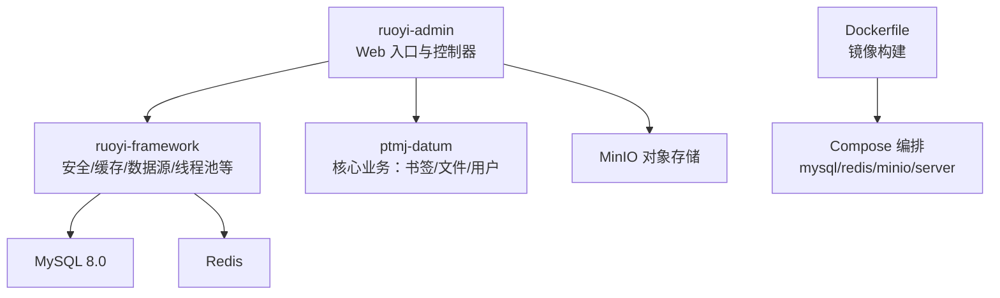
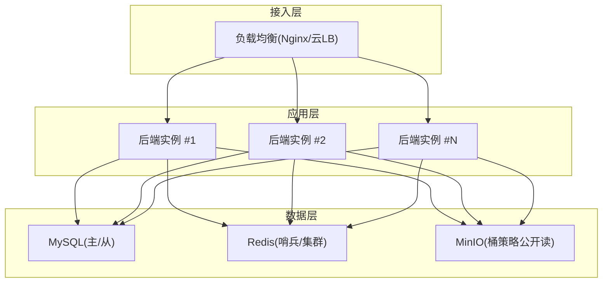
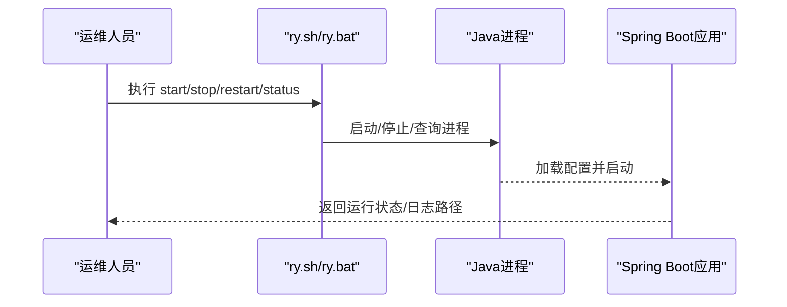
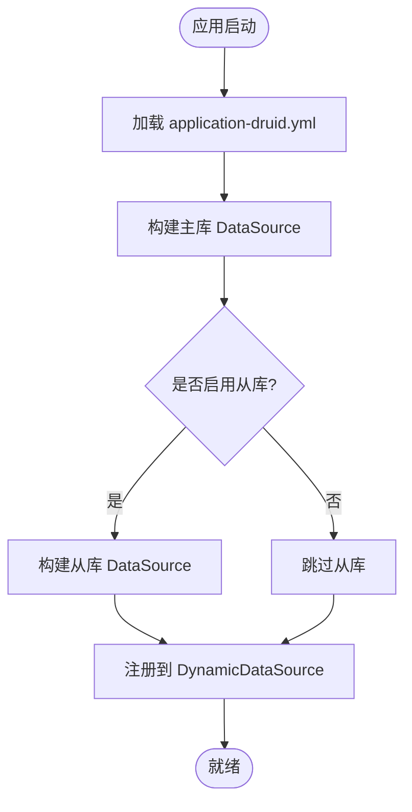
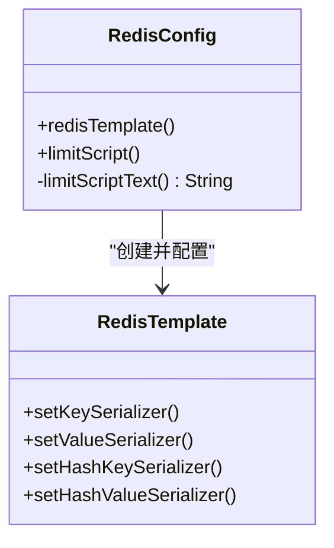
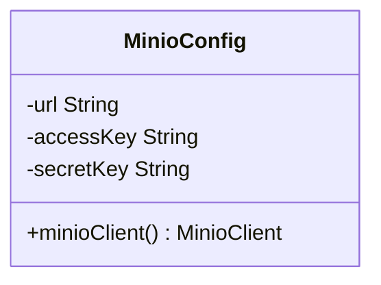
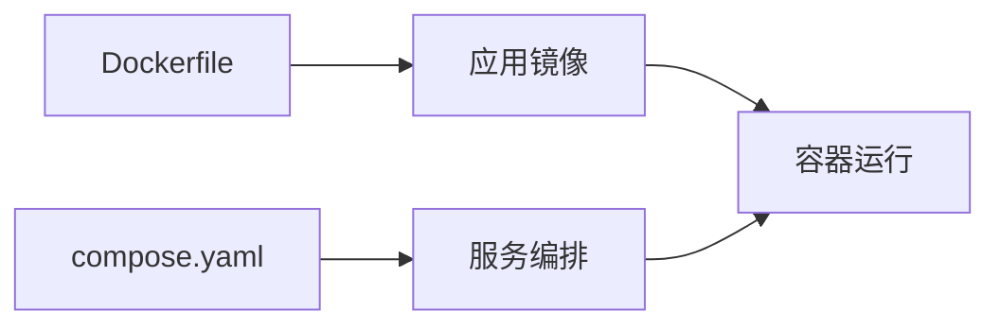
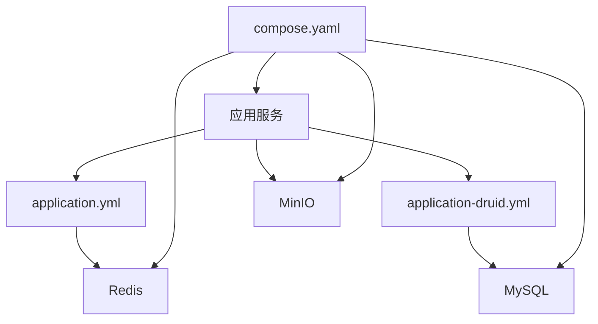

# 生产环境部署

<cite>
**本文引用的文件**   
- [README.md](file://PezMax-Backend/README.md)
- [ry.sh](file://PezMax-Backend/ry.sh)
- [ry.bat](file://PezMax-Backend/ry.bat)
- [Dockerfile](file://PezMax-Backend/Dockerfile)
- [compose.yaml](file://PezMax-Backend/compose.yaml)
- [application.yml](file://PezMax-Backend/ruoyi-admin/src/main/resources/application.yml)
- [application-druid.yml](file://PezMax-Backend/ruoyi-admin/src/main/resources/application-druid.yml)
- [DruidConfig.java](file://PezMax-Backend/ruoyi-framework/src/main/java/com/ruoyi/framework/config/DruidConfig.java)
- [RedisConfig.java](file://PezMax-Backend/ruoyi-framework/src/main/java/com/ruoyi/framework/config/RedisConfig.java)
- [MinioConfig.java](file://PezMax-Backend/ruoyi-common/src/main/java/com/ruoyi/common/config/MinioConfig.java)
- [pezmax.sql](file://PezMax-Backend/sql/pezmax.sql)
</cite>

## 目录
1. [简介](#简介)
2. [项目结构](#项目结构)
3. [核心组件](#核心组件)
4. [架构总览](#架构总览)
5. [详细组件分析](#详细组件分析)
6. [依赖关系分析](#依赖关系分析)
7. [性能调优与资源规划](#性能调优与资源规划)
8. [高可用与容灾方案](#高可用与容灾方案)
9. [故障排查指南](#故障排查指南)
10. [结论](#结论)

## 简介
本指南面向生产环境，提供单机与集群两种部署方案，涵盖负载均衡、数据库主从复制、Redis 集群、对象存储（MinIO）等关键组件的架构设计与配置要点。文档同时说明应用启动脚本的使用方法与参数、JVM 与中间件的性能调优建议、系统资源估算方法，以及高可用、故障转移、数据备份恢复等企业级实践。

## 项目结构
后端采用多模块 Maven 工程，核心服务入口位于 ruoyi-admin 模块；框架能力集中在 ruoyi-framework；通用能力在 ruoyi-common；业务域 ptmj-datum 提供书签、文件、用户等核心功能。容器化构建与编排通过 Dockerfile 与 compose.yaml 提供。

图示来源
- [compose.yaml:1-84](file://PezMax-Backend/compose.yaml#L1-L84)
- [Dockerfile:1-114](file://PezMax-Backend/Dockerfile#L1-L114)

章节来源
- [README.md:76-89](file://PezMax-Backend/README.md#L76-L89)

## 核心组件
- Web 服务与配置
  - 端口、上下文路径、Tomcat 线程池、上传大小、日志级别、国际化、Jackson 时区等均在 application.yml 中定义。
  - MinIO 客户端由 MinioConfig 装配，读取 minio.url/accessKey/secretKey/bucketName。
- 数据访问
  - Druid 连接池与监控在 application-druid.yml 中配置，DruidConfig 支持主从动态数据源（默认仅主库启用）。
  - SQL 初始化脚本 pezmax.sql 用于创建业务表结构。
- 缓存与限流
  - Redis 连接与序列化策略在 application.yml 与 RedisConfig 中定义；内置 Lua 限流脚本 Bean。
- 容器化
  - Dockerfile 使用分层构建与 Spring Boot Layer Tools 优化镜像；compose.yaml 编排 MySQL、Redis、MinIO 与应用服务。

章节来源
- [application.yml:17-94](file://PezMax-Backend/ruoyi-admin/src/main/resources/application.yml#L17-L94)
- [application.yml:149-162](file://PezMax-Backend/ruoyi-admin/src/main/resources/application.yml#L149-L162)
- [application-druid.yml:1-62](file://PezMax-Backend/ruoyi-admin/src/main/resources/application-druid.yml#L1-L62)
- [DruidConfig.java:32-79](file://PezMax-Backend/ruoyi-framework/src/main/java/com/ruoyi/framework/config/DruidConfig.java#L32-L79)
- [RedisConfig.java:17-71](file://PezMax-Backend/ruoyi-framework/src/main/java/com/ruoyi/framework/config/RedisConfig.java#L17-L71)
- [MinioConfig.java:8-27](file://PezMax-Backend/ruoyi-common/src/main/java/com/ruoyi/common/config/MinioConfig.java#L8-L27)
- [pezmax.sql:1-200](file://PezMax-Backend/sql/pezmax.sql#L1-L200)

## 架构总览
下图展示生产环境的典型拓扑：前端或网关经负载均衡接入多个后端实例，后端访问共享的数据库、缓存与对象存储。

[此图为概念性架构图，不直接映射具体源码文件]

## 详细组件分析

### 应用启动脚本与运行方式
- Linux 启动脚本 ry.sh
  - 支持 start/stop/restart/status 四种操作；内部通过 nohup 后台运行 jar，并包含 JVM 参数与日志输出位置。
  - 可通过修改脚本中的 JVM_OPTS 调整堆大小、元空间、GC 类型等。
- Windows 启动脚本 ry.bat
  - 交互式菜单选择启动/停止/重启/状态；基于 jps 定位进程并调用 taskkill 结束。
- Docker 一键部署
  - 使用 compose.yaml 拉起 mysql、redis、minio、server 四个服务；server 依赖健康检查完成后再启动。
  - 环境变量 SPRING_PROFILES_ACTIVE、DB_HOST、REDIS_HOST、UPLOAD_PATH、JAVA_OPTS 可覆盖默认配置。
- 本地开发
  - 执行 sql/pezmax.sql 初始化数据库；修改 application-druid.yml 中数据库连接；运行 com.ruoyi.RuoYiApplication。

图示来源
- [ry.sh:1-87](file://PezMax-Backend/ry.sh#L1-L87)
- [ry.bat:1-68](file://PezMax-Backend/ry.bat#L1-L68)
- [compose.yaml:55-78](file://PezMax-Backend/compose.yaml#L55-L78)

章节来源
- [ry.sh:1-87](file://PezMax-Backend/ry.sh#L1-L87)
- [ry.bat:1-68](file://PezMax-Backend/ry.bat#L1-L68)
- [compose.yaml:1-84](file://PezMax-Backend/compose.yaml#L1-L84)
- [README.md:45-74](file://PezMax-Backend/README.md#L45-L74)

### 数据库与连接池（Druid）
- 主从支持
  - DruidConfig 根据配置条件注册 slave 数据源，并通过 DynamicDataSource 进行路由；默认仅 master 启用。
- 连接池参数
  - application-druid.yml 定义了初始连接数、最小/最大空闲、最大活跃、超时、检测间隔、存活时间、验证语句、慢SQL记录等。
- 监控面板
  - 开启 statViewServlet 后暴露 /druid/* 管理页面，可设置白名单与登录凭据。

图示来源
- [DruidConfig.java:32-79](file://PezMax-Backend/ruoyi-framework/src/main/java/com/ruoyi/framework/config/DruidConfig.java#L32-L79)
- [application-druid.yml:1-62](file://PezMax-Backend/ruoyi-admin/src/main/resources/application-druid.yml#L1-L62)

章节来源
- [DruidConfig.java:32-79](file://PezMax-Backend/ruoyi-framework/src/main/java/com/ruoyi/framework/config/DruidConfig.java#L32-L79)
- [application-druid.yml:1-62](file://PezMax-Backend/ruoyi-admin/src/main/resources/application-druid.yml#L1-L62)

### 缓存与限流（Redis）
- 连接与序列化
  - application.yml 定义 host/port/database/password/timeout 及 Lettuce 连接池参数；RedisConfig 配置 Key/Value 序列化器。
- 限流脚本
  - RedisConfig 提供 DefaultRedisScript<Long> limitScript，实现基于键的计数与过期控制。

图示来源
- [RedisConfig.java:17-71](file://PezMax-Backend/ruoyi-framework/src/main/java/com/ruoyi/framework/config/RedisConfig.java#L17-L71)
- [application.yml:72-94](file://PezMax-Backend/ruoyi-admin/src/main/resources/application.yml#L72-L94)

章节来源
- [RedisConfig.java:17-71](file://PezMax-Backend/ruoyi-framework/src/main/java/com/ruoyi/framework/config/RedisConfig.java#L17-L71)
- [application.yml:72-94](file://PezMax-Backend/ruoyi-admin/src/main/resources/application.yml#L72-L94)

### 对象存储（MinIO）
- 客户端装配
  - MinioConfig 读取 minio.url/accessKey/secretKey 并构建 MinioClient Bean。
- 桶策略
  - README 提示需确保桶策略为公开读以支持匿名访问。

图示来源
- [MinioConfig.java:8-27](file://PezMax-Backend/ruoyi-common/src/main/java/com/ruoyi/common/config/MinioConfig.java#L8-L27)
- [application.yml:149-155](file://PezMax-Backend/ruoyi-admin/src/main/resources/application.yml#L149-L155)
- [README.md:91-95](file://PezMax-Backend/README.md#L91-L95)

章节来源
- [MinioConfig.java:8-27](file://PezMax-Backend/ruoyi-common/src/main/java/com/ruoyi/common/config/MinioConfig.java#L8-L27)
- [application.yml:149-155](file://PezMax-Backend/ruoyi-admin/src/main/resources/application.yml#L149-L155)
- [README.md:91-95](file://PezMax-Backend/README.md#L91-L95)

### 容器化与编排
- Dockerfile
  - 多阶段构建：依赖下载、打包、分层提取；最终镜像安装 LibreOffice 与中文字体，创建非特权用户，暴露 8080 端口。
- Compose
  - 定义 mysql、redis、minio、server 四服务；挂载数据卷与健康检查；server 依赖其他服务健康后再启动。

图示来源
- [Dockerfile:1-114](file://PezMax-Backend/Dockerfile#L1-L114)
- [compose.yaml:1-84](file://PezMax-Backend/compose.yaml#L1-L84)

章节来源
- [Dockerfile:1-114](file://PezMax-Backend/Dockerfile#L1-L114)
- [compose.yaml:1-84](file://PezMax-Backend/compose.yaml#L1-L84)

## 依赖关系分析
- 运行时依赖
  - MySQL 8.0、Redis、MinIO 为外部依赖；LibreOffice 用于文档处理。
- 配置注入
  - application.yml 与 application-druid.yml 分别负责通用与数据源配置；DruidConfig/RedisConfig/MinioConfig 将配置装配为 Bean。
- 容器编排
  - compose.yaml 声明服务间依赖与健康检查，保证启动顺序。

图示来源
- [application.yml:17-94](file://PezMax-Backend/ruoyi-admin/src/main/resources/application.yml#L17-L94)
- [application-druid.yml:1-62](file://PezMax-Backend/ruoyi-admin/src/main/resources/application-druid.yml#L1-L62)
- [compose.yaml:1-84](file://PezMax-Backend/compose.yaml#L1-L84)

章节来源
- [application.yml:17-94](file://PezMax-Backend/ruoyi-admin/src/main/resources/application.yml#L17-L94)
- [application-druid.yml:1-62](file://PezMax-Backend/ruoyi-admin/src/main/resources/application-druid.yml#L1-L62)
- [compose.yaml:1-84](file://PezMax-Backend/compose.yaml#L1-L84)

## 性能调优与资源规划

### JVM 参数与 GC
- 脚本内默认参数
  - ry.sh/ry.bat 中包含堆大小、元空间、GC 类型、OOM Dump 等参数，可按服务器规格调整。
- 容器内参数
  - compose.yaml 通过 JAVA_OPTS 传入堆大小，建议与宿主机内存匹配。

章节来源
- [ry.sh:5-6](file://PezMax-Backend/ry.sh#L5-L6)
- [ry.bat:6-7](file://PezMax-Backend/ry.bat#L6-L7)
- [compose.yaml:63-68](file://PezMax-Backend/compose.yaml#L63-L68)

### Tomcat 线程与请求队列
- 线程池
  - application.yml 中 server.tomcat.threads.max/min-spare 与 accept-count 决定并发处理能力。
- 上传限制
  - spring.servlet.multipart.max-file-size/max-request-size 控制单文件与总请求大小。

章节来源
- [application.yml:23-32](file://PezMax-Backend/ruoyi-admin/src/main/resources/application.yml#L23-L32)
- [application.yml:57-62](file://PezMax-Backend/ruoyi-admin/src/main/resources/application.yml#L57-L62)

### 数据库连接池（Druid）
- 连接规模
  - initialSize/minIdle/maxActive 需结合 QPS 与平均响应时间评估；maxWait/connectTimeout/socketTimeout 保障稳定性。
- 监控与诊断
  - statViewServlet 与 stat/wall filter 便于观察慢 SQL 与异常 SQL。

章节来源
- [application-druid.yml:20-62](file://PezMax-Backend/ruoyi-admin/src/main/resources/application-druid.yml#L20-L62)

### 缓存（Redis）
- 连接池
  - lettuce.pool.min-idle/max-idle/max-active/max-wait 影响并发读写与等待行为。
- 序列化
  - RedisConfig 使用 FastJson2JsonRedisSerializer 作为值序列化器，注意跨语言兼容性与版本一致性。

章节来源
- [application.yml:84-94](file://PezMax-Backend/ruoyi-admin/src/main/resources/application.yml#L84-L94)
- [RedisConfig.java:24-41](file://PezMax-Backend/ruoyi-framework/src/main/java/com/ruoyi/framework/config/RedisConfig.java#L24-L41)

### 系统资源规划建议
- CPU
  - 按 QPS×平均耗时估算所需核数；Web 层与计算密集任务（如文档转换）建议分离。
- 内存
  - JVM 堆大小建议为物理内存的 50%-70%；预留 OS 与中间件内存；容器场景下通过 JAVA_OPTS 控制。
- 磁盘
  - 日志与上传目录需独立分区；MinIO 数据盘容量按峰值文件量与保留策略估算；MySQL 数据盘考虑增长与备份占用。
- I/O
  - 数据库与对象存储建议使用 SSD；日志异步写入避免阻塞。

[本节为通用指导，不直接分析具体文件]

## 高可用与容灾方案

### 负载均衡
- 推荐 Nginx 或云厂商 LB，对后端多实例做轮询或加权策略；配置健康检查与优雅下线。
- 会话无状态化：鉴权令牌存 Redis，避免粘性会话。

[本节为通用指导，不直接分析具体文件]

### 数据库主从复制
- 架构
  - 一主多从，写主读从；应用侧通过 DynamicDataSource 切换数据源。
- 配置要点
  - 在 application-druid.yml 中启用 slave 并填写连接信息；DruidConfig 会按需注册从库数据源。
- 注意事项
  - 主从延迟敏感场景需评估；必要时强制走主库。

章节来源
- [application-druid.yml:12-19](file://PezMax-Backend/ruoyi-admin/src/main/resources/application-druid.yml#L12-L19)
- [DruidConfig.java:43-59](file://PezMax-Backend/ruoyi-framework/src/main/java/com/ruoyi/framework/config/DruidConfig.java#L43-L59)

### Redis 高可用
- 哨兵模式
  - 配置多个哨兵节点监控主节点，客户端自动故障转移。
- 集群模式
  - 分片存储提升吞吐；注意 Key 分布与热点键治理。
- 持久化
  - 开启 AOF/RDB 组合策略，定期快照与增量同步。

[本节为通用指导，不直接分析具体文件]

### MinIO 高可用
- 纠删码（Erasure Coding）部署多节点，容忍部分节点故障。
- 桶策略设置为公开读以满足匿名访问需求。

章节来源
- [README.md:91-95](file://PezMax-Backend/README.md#L91-L95)

### 故障转移与优雅停机
- 应用层
  - 优雅停机：停止接收新请求，等待在途请求完成后再退出。
- 中间件
  - 数据库/缓存连接重试与熔断；对象存储 SDK 重试策略。

[本节为通用指导，不直接分析具体文件]

### 数据备份与恢复
- MySQL
  - 全量+增量备份；定期演练恢复流程；主从切换预案。
- MinIO
  - 跨地域复制与版本控制；定期导出清单与校验。
- 应用日志与上传文件
  - 集中采集与归档；冷数据转储至低成本存储。

[本节为通用指导，不直接分析具体文件]

## 故障排查指南
- 启动失败
  - 检查端口占用、JDK 版本、配置文件占位符（DB_HOST/REDIS_HOST/UPLOAD_PATH）。
- 数据库连接问题
  - 核对 application-druid.yml 中 URL/用户名/密码；确认防火墙与安全组放行 3306。
- Redis 连接问题
  - 核对 application.yml 中 host/port/database/password；确认 6379 可达。
- MinIO 访问异常
  - 核对 minio.url/accessKey/secretKey；确认桶策略公开读。
- 日志定位
  - Linux 默认日志路径在应用根目录 logs 下；容器内挂载 ./logs 便于查看。

章节来源
- [compose.yaml:63-78](file://PezMax-Backend/compose.yaml#L63-L78)
- [application-druid.yml:8-19](file://PezMax-Backend/ruoyi-admin/src/main/resources/application-druid.yml#L8-L19)
- [application.yml:72-94](file://PezMax-Backend/ruoyi-admin/src/main/resources/application.yml#L72-L94)
- [application.yml:149-155](file://PezMax-Backend/ruoyi-admin/src/main/resources/application.yml#L149-L155)

## 结论
本项目提供了完善的单机与容器化部署基础，具备主从数据源、Redis 缓存与 MinIO 对象存储集成能力。生产环境建议在负载均衡、数据库主从、Redis 高可用与对象存储纠删码基础上，完善监控告警、灰度发布、备份恢复与容量规划，以实现稳定、可扩展的企业级交付。