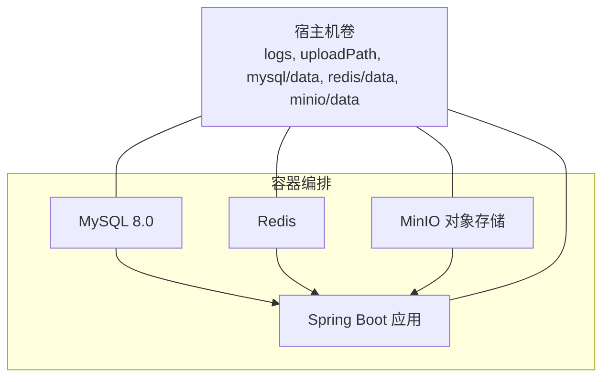
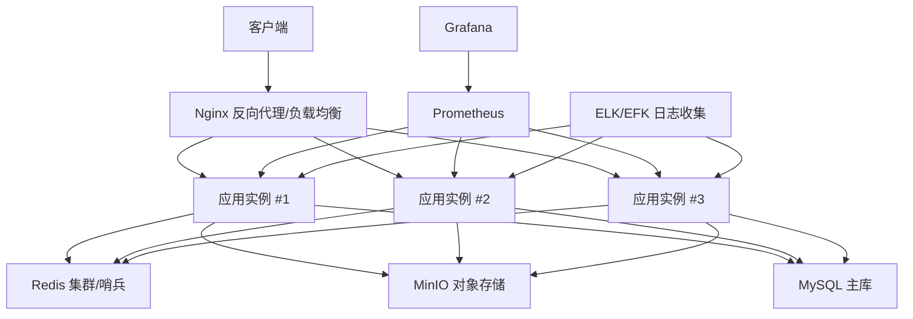
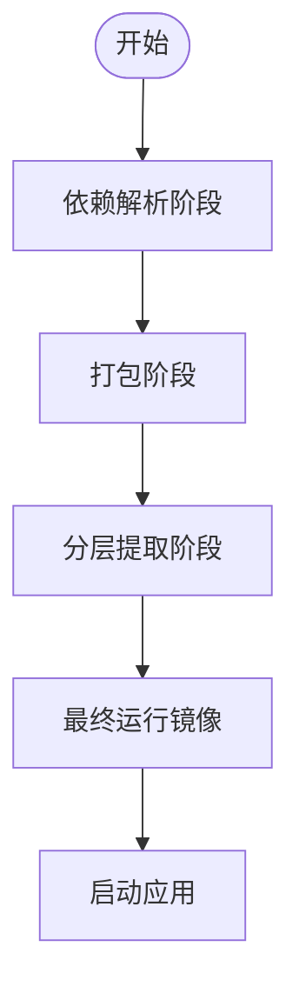
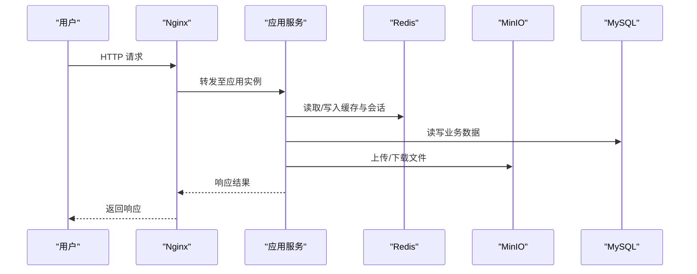
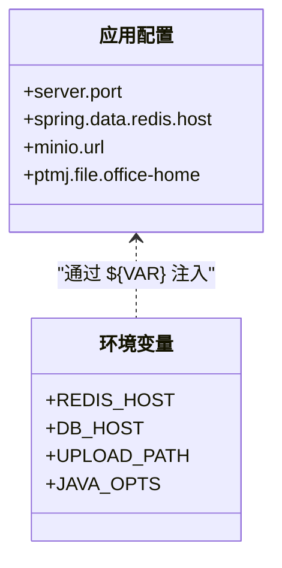
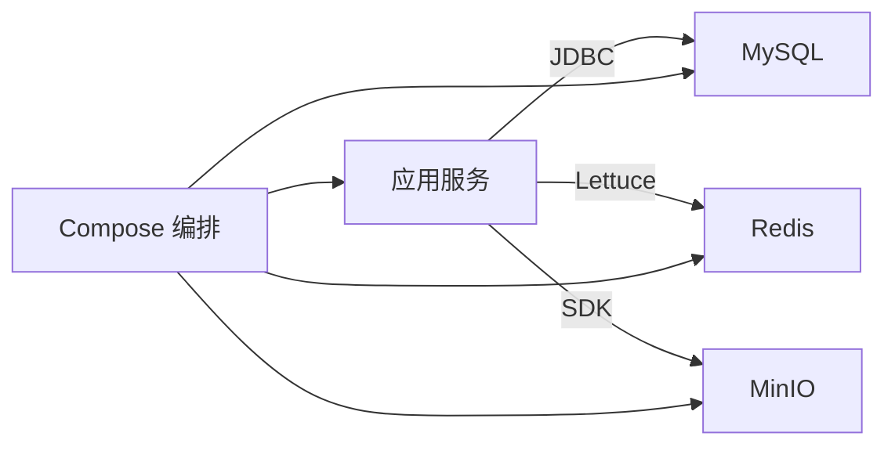

# 集群部署

<cite>
**本文引用的文件**   
- [compose.yaml](file://PezMax-Backend/compose.yaml)
- [Dockerfile](file://PezMax-Backend/Dockerfile)
- [README.Docker.md](file://PezMax-Backend/README.Docker.md)
- [application.yml](file://PezMax-Backend/ruoyi-admin/src/main/resources/application.yml)
- [application-druid.yml](file://PezMax-Backend/ruoyi-admin/src/main/resources/application-druid.yml)
</cite>

## 目录
1. [简介](#简介)
2. [项目结构](#项目结构)
3. [核心组件](#核心组件)
4. [架构总览](#架构总览)
5. [详细组件分析](#详细组件分析)
6. [依赖关系分析](#依赖关系分析)
7. [性能考虑](#性能考虑)
8. [故障排查指南](#故障排查指南)
9. [结论](#结论)
10. [附录](#附录)

## 简介
本指南面向在集群环境中部署 PezMax 后端服务，提供多节点架构设计、负载均衡与反向代理（Nginx）配置、服务发现与会话共享方案、基于 Docker Compose 的容器化编排、网络与数据持久化策略，以及监控与日志收集方案。文档同时给出关键流程的可视化图示，帮助读者快速理解并落地生产级部署。

## 项目结构
本项目采用前后端分离与模块化后端结构：
- 后端为 Spring Boot 应用，使用 MySQL 作为主存储、Redis 作为缓存与会话共享介质、MinIO 作为对象存储。
- 通过 Dockerfile 构建镜像，使用 compose.yaml 编排本地或开发环境的多服务运行。
- 前端（桌面版与 Web 版）在本仓库中独立存在，但本指南聚焦于后端集群部署。

图表来源
- [compose.yaml:1-84](file://PezMax-Backend/compose.yaml#L1-L84)
- [Dockerfile:1-114](file://PezMax-Backend/Dockerfile#L1-L114)

章节来源
- [compose.yaml:1-84](file://PezMax-Backend/compose.yaml#L1-L84)
- [Dockerfile:1-114](file://PezMax-Backend/Dockerfile#L1-L114)

## 核心组件
- 数据库（MySQL）：业务数据存储，包含初始化脚本挂载与健康检查。
- 缓存与会话（Redis）：用于缓存、分布式会话共享与限流等。
- 对象存储（MinIO）：文件上传下载、静态资源托管。
- 应用服务（Spring Boot）：业务逻辑、API 暴露、连接池与中间件集成。
- 反向代理与负载均衡（Nginx）：对外入口、健康检查、故障转移、会话保持。
- 监控与日志：指标采集、错误日志聚合、告警规则。

章节来源
- [compose.yaml:1-84](file://PezMax-Backend/compose.yaml#L1-L84)
- [application.yml:1-162](file://PezMax-Backend/ruoyi-admin/src/main/resources/application.yml#L1-L162)
- [application-druid.yml:1-62](file://PezMax-Backend/ruoyi-admin/src/main/resources/application-druid.yml#L1-L62)

## 架构总览
下图展示典型的生产级多节点集群架构：Nginx 作为统一入口，将请求分发到多个应用实例；所有实例共享 Redis 与 MinIO；MySQL 可为主从或高可用模式；Prometheus/Grafana 采集指标；ELK/EFK 收集日志。

[此图为概念性架构图，不直接映射具体源码文件]

## 详细组件分析

### 容器化与镜像构建（Dockerfile）
- 多阶段构建：依赖解析、打包、分层提取、最小运行时镜像。
- 安装 LibreOffice 与中文字体，满足文档转换需求。
- 以非特权用户运行，创建上传与日志目录，暴露 8080 端口。
- 使用 Spring Boot Layer Tools 优化镜像层缓存与启动速度。

图表来源
- [Dockerfile:1-114](file://PezMax-Backend/Dockerfile#L1-L114)

章节来源
- [Dockerfile:1-114](file://PezMax-Backend/Dockerfile#L1-L114)

### 服务编排与网络（Compose）
- 定义 MySQL、Redis、MinIO、应用服务四个核心服务。
- 使用 depends_on + healthcheck 确保依赖就绪后再启动应用。
- 通过环境变量注入数据库地址、Redis 地址、上传路径与 JVM 参数。
- 使用 volumes 实现数据持久化与日志导出。

图表来源
- [compose.yaml:1-84](file://PezMax-Backend/compose.yaml#L1-L84)

章节来源
- [compose.yaml:1-84](file://PezMax-Backend/compose.yaml#L1-L84)

### 应用配置与环境变量
- 应用监听端口、上下文路径、Tomcat 线程池、Jackson 时区等基础配置。
- Redis 连接信息通过环境变量注入，支持集群扩展。
- MinIO 访问地址、桶名、密钥等配置集中管理。
- Druid 数据源主库 URL 通过环境变量注入，便于切换不同环境。

图表来源
- [application.yml:1-162](file://PezMax-Backend/ruoyi-admin/src/main/resources/application.yml#L1-L162)
- [application-druid.yml:1-62](file://PezMax-Backend/ruoyi-admin/src/main/resources/application-druid.yml#L1-L62)
- [compose.yaml:55-78](file://PezMax-Backend/compose.yaml#L55-L78)

章节来源
- [application.yml:1-162](file://PezMax-Backend/ruoyi-admin/src/main/resources/application.yml#L1-L162)
- [application-druid.yml:1-62](file://PezMax-Backend/ruoyi-admin/src/main/resources/application-druid.yml#L1-L62)
- [compose.yaml:55-78](file://PezMax-Backend/compose.yaml#L55-L78)

### 反向代理与负载均衡（Nginx）
说明要点（概念性指导）：
- 上游服务器组：定义多个应用实例地址，启用健康检查与故障转移。
- 负载均衡算法：根据场景选择轮询、最少连接或一致性哈希。
- 会话保持：若必须使用 Cookie 绑定，建议优先改为无状态化并通过 Redis 共享会话。
- 安全与性能：开启 gzip、HTTP/2、超时控制、重试策略、限流与白名单。
- 健康检查：结合应用健康端点，Nginx 主动探测并剔除异常节点。

[本节为通用实践说明，未直接分析具体源码文件]

### 服务发现
说明要点（概念性指导）：
- 轻量方案：DNS 或服务名解析（如 K8s Service、Consul DNS）。
- 动态注册：Nacos/Eureka/Consul 注册中心，配合 Nginx 动态上游更新。
- 云原生：Kubernetes Ingress + Service 自动发现与滚动升级。

[本节为通用实践说明，未直接分析具体源码文件]

### 会话共享与无状态化
- 推荐方案：将登录态与用户会话存入 Redis，应用实例无状态化，任意实例均可处理同一用户的后续请求。
- 令牌机制：JWT 或带签名的 Session ID，避免服务端本地内存保存会话。
- 防重放与幂等：对敏感接口增加签名与幂等键，提升集群安全性与稳定性。

[本节为通用实践说明，未直接分析具体源码文件]

### 数据持久化与备份
- MySQL：使用卷挂载数据目录，定期快照或逻辑备份；主从复制可选。
- Redis：持久化策略（AOF/RDB），卷挂载数据目录；注意内存与淘汰策略。
- MinIO：卷挂载数据目录，跨可用区复制与版本控制按需启用。
- 日志：将应用日志输出到卷，由日志采集器统一收集。

[本节为通用实践说明，未直接分析具体源码文件]

### 监控与日志收集
- 指标采集：应用内暴露 /actuator/metrics 或使用 Micrometer + Prometheus；JVM、Tomcat、数据库、Redis、MinIO 指标纳入监控。
- 可视化：Grafana 面板展示 QPS、延迟、错误率、连接池、慢 SQL 等。
- 日志收集：Filebeat/Fluent Bit 收集容器日志，推送至 Elasticsearch/Kafka；Kibana/Loki 检索与分析。
- 告警：Prometheus Alertmanager 或企业微信/钉钉机器人告警，覆盖 CPU、内存、磁盘、错误率、慢查询阈值。

[本节为通用实践说明，未直接分析具体源码文件]

## 依赖关系分析
- 应用服务依赖 MySQL、Redis、MinIO，通过环境变量与配置文件注入连接信息。
- Compose 通过 healthcheck 与 depends_on 保证启动顺序与可用性。
- 生产环境建议引入外部服务发现与配置中心，解耦硬编码依赖。

图表来源
- [compose.yaml:1-84](file://PezMax-Backend/compose.yaml#L1-L84)
- [application.yml:1-162](file://PezMax-Backend/ruoyi-admin/src/main/resources/application.yml#L1-L162)
- [application-druid.yml:1-62](file://PezMax-Backend/ruoyi-admin/src/main/resources/application-druid.yml#L1-L62)

章节来源
- [compose.yaml:1-84](file://PezMax-Backend/compose.yaml#L1-L84)
- [application.yml:1-162](file://PezMax-Backend/ruoyi-admin/src/main/resources/application.yml#L1-L162)
- [application-druid.yml:1-62](file://PezMax-Backend/ruoyi-admin/src/main/resources/application-druid.yml#L1-L62)

## 性能考虑
- 应用层：合理设置 Tomcat 线程池、JVM 堆大小、GC 策略；启用 GZIP 压缩与 HTTP/2。
- 缓存层：Redis 连接池大小、过期策略、热点 Key 保护；必要时分片或集群。
- 数据库层：Druid 连接池参数、慢 SQL 监控、索引优化、读写分离与分库分表规划。
- 对象存储：大文件分片上传、CDN 加速、预签名 URL 直传。
- 反向代理：连接复用、超时与重试、并发限制、缓存静态资源。

[本节为通用实践说明，未直接分析具体源码文件]

## 故障排查指南
- 启动失败：检查 healthcheck 是否通过、环境变量是否正确、端口冲突。
- 连接异常：确认 MySQL/Redis/MinIO 地址与凭据、防火墙与安全组、网络连通性。
- 会话丢失：确认 Redis 可达、Token/Session 策略一致、跨域与 Cookie 域名设置。
- 文件上传失败：检查 MinIO 桶权限、URL 可达性、文件大小限制与超时。
- 日志定位：查看应用日志卷、Nginx 访问与错误日志、数据库慢查询与连接池状态。

章节来源
- [compose.yaml:15-20](file://PezMax-Backend/compose.yaml#L15-L20)
- [compose.yaml:30-34](file://PezMax-Backend/compose.yaml#L30-L34)
- [compose.yaml:49-53](file://PezMax-Backend/compose.yaml#L49-L53)
- [application.yml:35-38](file://PezMax-Backend/ruoyi-admin/src/main/resources/application.yml#L35-L38)
- [application-druid.yml:43-62](file://PezMax-Backend/ruoyi-admin/src/main/resources/application-druid.yml#L43-L62)

## 结论
通过容器化与编排，可将 PezMax 后端快速扩展到多节点集群。结合 Nginx 的反向代理与负载均衡、Redis 的会话共享、MinIO 的对象存储与 MySQL 的高可用方案，可实现高可用与弹性伸缩。配套监控与日志体系有助于持续观测与快速排障。建议在正式生产环境引入服务发现、配置中心与更完善的容灾策略。

## 附录
- 本地快速启动：参考 README.Docker.md 中的命令进行构建与运行。
- 常用运维命令：查看容器日志、进入容器调试、重启服务、扩容副本数等。

章节来源
- [README.Docker.md:1-19](file://PezMax-Backend/README.Docker.md#L1-L19)