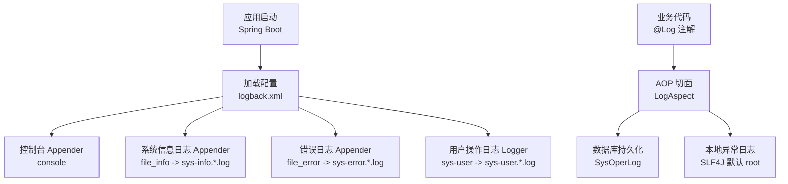
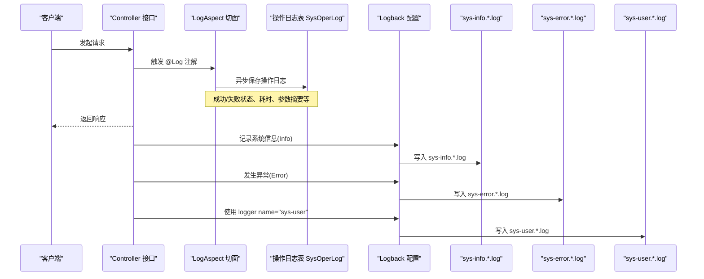
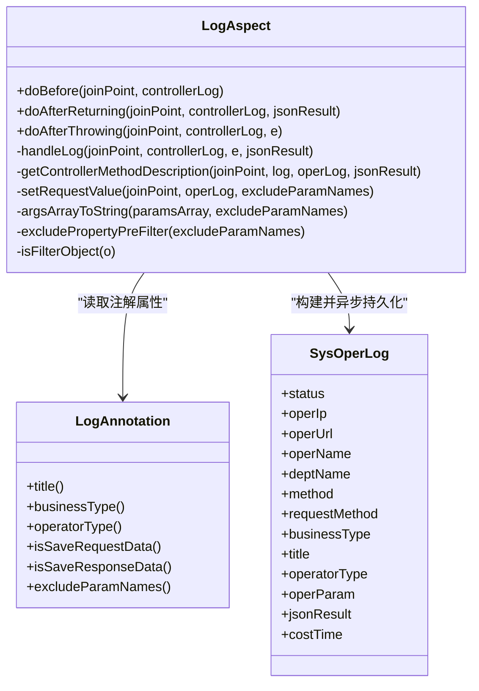
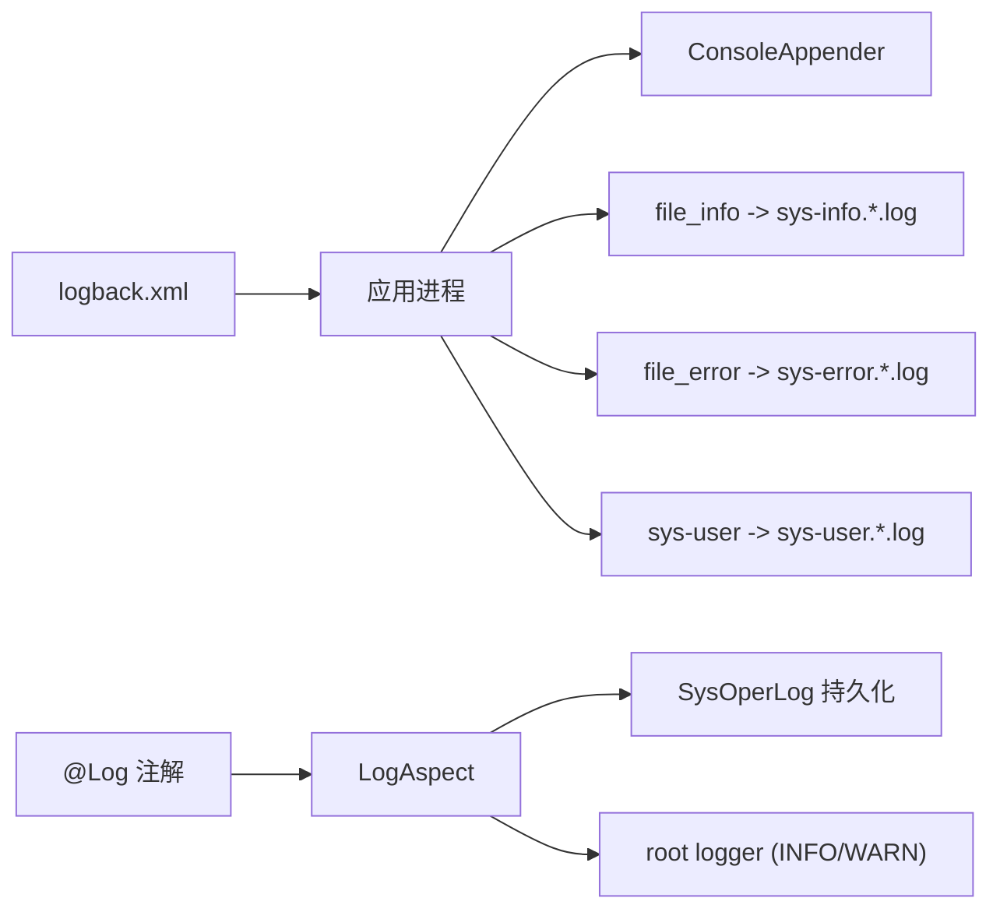

# 应用日志管理

<cite>
**本文引用的文件**
- [logback.xml](file://PezMax-Backend/ruoyi-admin/src/main/resources/logback.xml)
- [LogAspect.java](file://PezMax-Backend/ruoyi-framework/src/main/java/com/ruoyi/framework/aspectj/LogAspect.java)
- [Log.java](file://PezMax-Backend/ruoyi-common/src/main/java/com/ruoyi/common/annotation/Log.java)
- [LogUtils.java](file://PezMax-Backend/ruoyi-common/src/main/java/com/ruoyi/common/utils/LogUtils.java)
</cite>

## 目录
1. [简介](#简介)
2. [项目结构](#项目结构)
3. [核心组件](#核心组件)
4. [架构总览](#架构总览)
5. [详细组件分析](#详细组件分析)
6. [依赖关系分析](#依赖关系分析)
7. [性能与优化建议](#性能与优化建议)
8. [故障排查指南](#故障排查指南)
9. [结论](#结论)
10. [附录](#附录)

## 简介
本文件面向后端应用的日志管理与运维，聚焦于 logback.xml 配置项、日志输出格式、滚动策略、级别控制以及三类核心日志文件的用途与使用方式：sys-info.log（系统信息日志）、sys-error.log（错误日志）、sys-user.log（用户操作日志）。同时提供日志收集与分析的最佳实践，包括轮转策略、存储空间管理、查询技巧，并给出自定义格式、异步化与性能优化的进阶建议。

## 项目结构
本项目采用多模块结构，日志配置位于 ruoyi-admin 模块的资源目录下，由 Spring Boot 启动时加载。日志切面在框架层实现，注解驱动记录业务操作日志。

图表来源
- [logback.xml:1-99](file://PezMax-Backend/ruoyi-admin/src/main/resources/logback.xml#L1-L99)
- [LogAspect.java:1-265](file://PezMax-Backend/ruoyi-framework/src/main/java/com/ruoyi/framework/aspectj/LogAspect.java#L1-L265)
- [Log.java:1-52](file://PezMax-Backend/ruoyi-common/src/main/java/com/ruoyi/common/annotation/Log.java#L1-L52)

章节来源
- [logback.xml:1-99](file://PezMax-Backend/ruoyi-admin/src/main/resources/logback.xml#L1-L99)

## 核心组件
- 日志根配置与属性
  - 日志路径：通过变量定义统一存放目录。
  - 输出格式：统一的 pattern 包含时间、线程、级别、类名、方法行号、消息等。
- Appender 与滚动策略
  - console：控制台输出。
  - file_info：按天滚动，仅记录 INFO 级别，输出到 sys-info.*.log。
  - file_error：按天滚动，仅记录 ERROR 级别，输出到 sys-error.*.log。
  - sys-user：按天滚动，用于“sys-user”命名空间的日志，输出到 sys-user.*.log。
- 级别控制
  - com.ruoyi 包下日志级别为 info。
  - org.springframework 包下日志级别为 warn。
  - root 默认 info，附加 console。
  - “sys-user” logger 单独附加 sys-user appender。
- 用户操作日志链路
  - 通过 @Log 注解标注接口，AOP 切面 LogAspect 拦截前后处理，将操作信息写入数据库；同时异常会落盘到本地错误日志。

章节来源
- [logback.xml:1-99](file://PezMax-Backend/ruoyi-admin/src/main/resources/logback.xml#L1-L99)
- [LogAspect.java:1-265](file://PezMax-Backend/ruoyi-framework/src/main/java/com/ruoyi/framework/aspectj/LogAspect.java#L1-L265)
- [Log.java:1-52](file://PezMax-Backend/ruoyi-common/src/main/java/com/ruoyi/common/annotation/Log.java#L1-L52)

## 架构总览
下图展示了从业务调用到日志落盘的完整流程，涵盖系统信息、错误与用户操作三类日志的生成与路由。

图表来源
- [LogAspect.java:1-265](file://PezMax-Backend/ruoyi-framework/src/main/java/com/ruoyi/framework/aspectj/LogAspect.java#L1-L265)
- [logback.xml:1-99](file://PezMax-Backend/ruoyi-admin/src/main/resources/logback.xml#L1-L99)

## 详细组件分析

### logback.xml 配置详解
- 全局属性
  - 日志路径：集中管理日志文件目录。
  - 输出格式：包含时间戳、线程名、级别、logger 名称、方法名与行号、消息体。
- ConsoleAppender
  - 开发调试阶段快速查看日志。
- RollingFileAppender（系统信息）
  - 滚动策略：TimeBasedRollingPolicy，按天滚动。
  - 文件名模式：sys-info.%d{yyyy-MM-dd}.log。
  - 历史保留：maxHistory=60（天）。
  - 级别过滤：LevelFilter 仅接受 INFO。
- RollingFileAppender（错误日志）
  - 当前文件：sys-error.log。
  - 滚动策略：TimeBasedRollingPolicy，按天滚动。
  - 文件名模式：sys-error.%d{yyyy-MM-dd}.log。
  - 历史保留：maxHistory=60（天）。
  - 级别过滤：LevelFilter 仅接受 ERROR。
- RollingFileAppender（用户操作日志）
  - 当前文件：sys-user.log。
  - 滚动策略：TimeBasedRollingPolicy，按天滚动。
  - 文件名模式：sys-user.%d{yyyy-MM-dd}.log。
  - 历史保留：maxHistory=60（天）。
- Logger 与 Root
  - com.ruoyi 包：info。
  - org.springframework：warn。
  - root：info，附加 console。
  - 自定义 logger name="sys-user"：附加 sys-user appender。

章节来源
- [logback.xml:1-99](file://PezMax-Backend/ruoyi-admin/src/main/resources/logback.xml#L1-L99)

### 日志文件用途与使用方法
- sys-info.log（系统信息日志）
  - 用途：记录系统运行过程中的 INFO 级别事件，便于日常巡检与问题回溯。
  - 生成方式：com.ruoyi 包下的日志默认走该文件（受 LevelFilter 限制为 INFO）。
  - 查看建议：结合日期后缀定位当天日志，关注关键业务流程节点。
- sys-error.log（错误日志）
  - 用途：集中记录 ERROR 级别异常与错误，便于快速定位故障。
  - 生成方式：所有 ERROR 级别日志均落入该文件。
  - 查看建议：优先检索堆栈信息与上下文参数，结合时间窗口缩小范围。
- sys-user.log（用户操作日志）
  - 用途：记录用户操作相关日志，便于审计与行为追踪。
  - 生成方式：使用 logger name="sys-user" 输出的日志进入该文件。
  - 查看建议：结合用户名、操作类型、IP 进行筛选，配合时间范围分析。

章节来源
- [logback.xml:1-99](file://PezMax-Backend/ruoyi-admin/src/main/resources/logback.xml#L1-L99)

### 用户操作日志链路（注解 + AOP）
- 注解定义
  - @Log 支持标题、业务类型、操作人类别、是否保存请求/响应数据、排除字段等。
- 切面实现
  - 前置：记录开始时间。
  - 后置：组装操作日志对象（URL、方法、请求方式、耗时、结果摘要等），异步写入数据库。
  - 异常：捕获异常并记录本地错误日志。
- 数据脱敏
  - 排除敏感字段（如密码相关），避免泄露。

图表来源
- [Log.java:1-52](file://PezMax-Backend/ruoyi-common/src/main/java/com/ruoyi/common/annotation/Log.java#L1-L52)
- [LogAspect.java:1-265](file://PezMax-Backend/ruoyi-framework/src/main/java/com/ruoyi/framework/aspectj/LogAspect.java#L1-L265)

章节来源
- [Log.java:1-52](file://PezMax-Backend/ruoyi-common/src/main/java/com/ruoyi/common/annotation/Log.java#L1-L52)
- [LogAspect.java:1-265](file://PezMax-Backend/ruoyi-framework/src/main/java/com/ruoyi/framework/aspectj/LogAspect.java#L1-L265)

### 日志格式与自定义
- 现有格式要素
  - 时间戳、线程名、级别、logger 名称、方法名与行号、消息内容。
- 自定义建议
  - 增加 traceId/correlationId 以便跨服务关联。
  - 增加环境标识（如 env、instanceId）。
  - 对大对象或长字符串做截断，避免单条日志过大影响 IO。
- 参考位置
  - 日志格式变量定义处。

章节来源
- [logback.xml:1-99](file://PezMax-Backend/ruoyi-admin/src/main/resources/logback.xml#L1-L99)

### 异步日志配置现状与建议
- 现状
  - 当前未启用 AsyncAppender/AsyncLogger，日志为同步写入。
  - 用户操作日志的数据库写入已异步执行（通过任务管理器），但文件落盘仍为同步。
- 建议
  - 引入 AsyncAppender 包裹 file_info/file_error/sys-user，降低主线程阻塞。
  - 合理设置队列容量与丢弃策略，避免高并发下丢日志。
  - 监控队列堆积情况，必要时扩容磁盘 IO 或调整批大小。

章节来源
- [LogAspect.java:1-265](file://PezMax-Backend/ruoyi-framework/src/main/java/com/ruoyi/framework/aspectj/LogAspect.java#L1-L265)
- [logback.xml:1-99](file://PezMax-Backend/ruoyi-admin/src/main/resources/logback.xml#L1-L99)

## 依赖关系分析
- 配置与运行时
  - Spring Boot 启动时加载 logback.xml，初始化各 Appender 与 Logger。
  - com.ruoyi 包日志默认 INFO，org.springframework 默认 WARN。
- 业务与日志
  - 业务接口通过 @Log 注解声明需要记录的操作日志。
  - LogAspect 解析注解并构造 SysOperLog，异步持久化。
  - 异常通过 SLF4J 记录到 root，最终落到错误日志文件。

图表来源
- [logback.xml:1-99](file://PezMax-Backend/ruoyi-admin/src/main/resources/logback.xml#L1-L99)
- [LogAspect.java:1-265](file://PezMax-Backend/ruoyi-framework/src/main/java/com/ruoyi/framework/aspectj/LogAspect.java#L1-L265)
- [Log.java:1-52](file://PezMax-Backend/ruoyi-common/src/main/java/com/ruoyi/common/annotation/Log.java#L1-L52)

章节来源
- [logback.xml:1-99](file://PezMax-Backend/ruoyi-admin/src/main/resources/logback.xml#L1-L99)
- [LogAspect.java:1-265](file://PezMax-Backend/ruoyi-framework/src/main/java/com/ruoyi/framework/aspectj/LogAspect.java#L1-L265)

## 性能与优化建议
- 滚动策略
  - 当前按天滚动，适合大多数场景；若日增量较大，可考虑基于大小的滚动策略组合，或拆分更细粒度的日志文件。
- 历史保留
  - maxHistory=60 天，可根据合规要求与磁盘容量调整。
- 级别控制
  - 生产环境建议保持 com.ruoyi=info，org.springframework=warn；仅在排障时临时提升级别。
- 异步化
  - 为文件 Appender 添加异步包装，减少主线程阻塞；注意队列容量与背压策略。
- 格式化开销
  - 避免在高频路径中拼接复杂对象；必要时使用占位符与条件日志。
- 存储与清理
  - 定期评估磁盘占用，结合 maxHistory 与归档压缩策略。
- 观测与告警
  - 监控错误日志增长速率与文件大小，设置阈值告警。

[本节为通用指导，不直接分析具体文件]

## 故障排查指南
- 常见问题
  - 权限不足：Java 进程对日志目录无写入或重命名权限。
  - 文件被占用：外部工具锁定日志文件导致滚动失败。
  - 跨文件系统：源与目标不在同一分区，renameTo 不支持跨分区。
  - 目录不存在：日志目录未创建或路径拼写错误。
  - 配置冲突：file 与滚动策略逻辑不一致导致重命名异常。
- 定位步骤
  - 检查日志目录是否存在且可写。
  - 确认是否有其他进程占用日志文件。
  - 核对 fileNamePattern 与 file 配置的一致性。
  - 观察滚动后文件命名是否符合预期。
- 参考位置
  - 配置文件中关于滚动策略与常见问题的注释说明。

章节来源
- [logback.xml:1-99](file://PezMax-Backend/ruoyi-admin/src/main/resources/logback.xml#L1-L99)

## 结论
本项目通过 logback.xml 实现了清晰的日志分层与滚动策略，结合 @Log 注解与 AOP 切面完成了用户操作日志的结构化采集。建议在现有基础上引入异步日志、统一 traceId、完善监控与告警，进一步提升可观测性与稳定性。

[本节为总结性内容，不直接分析具体文件]

## 附录
- 常用查询技巧
  - 按日期定位：根据文件名中的日期后缀快速定位当天日志。
  - 按级别筛选：ERROR 集中在错误日志文件，INFO 集中在系统信息日志文件。
  - 按用户维度：在 sys-user.log 中结合用户名、操作类型与 IP 进行检索。
- 最佳实践清单
  - 明确日志级别与输出目标，避免重复输出。
  - 控制单条日志大小，避免大对象序列化。
  - 定期清理历史日志，结合归档压缩节省空间。
  - 建立日志健康度指标（错误率、延迟、吞吐）。

[本节为通用指导，不直接分析具体文件]