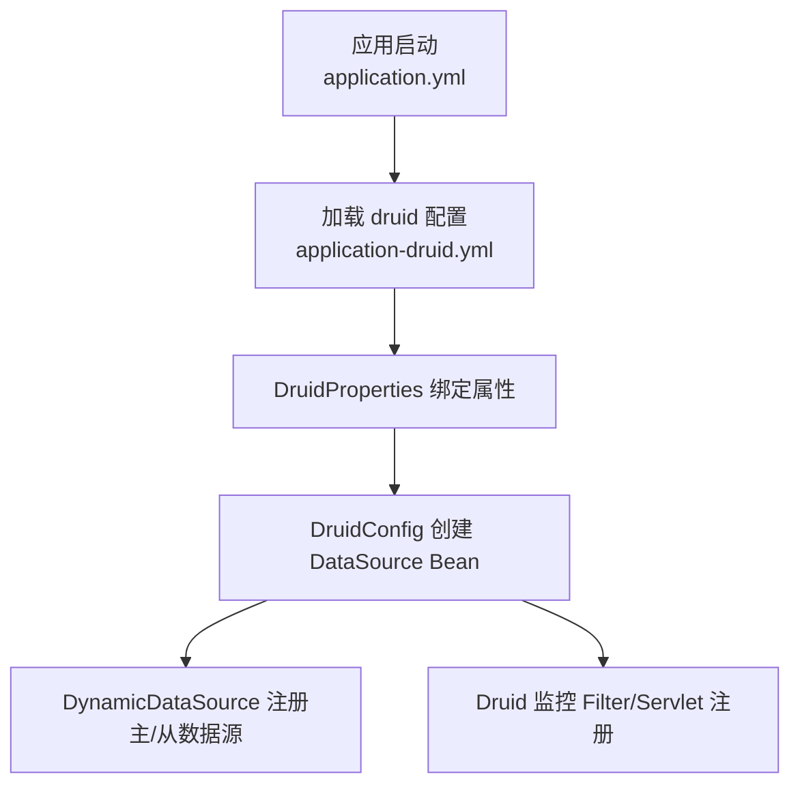
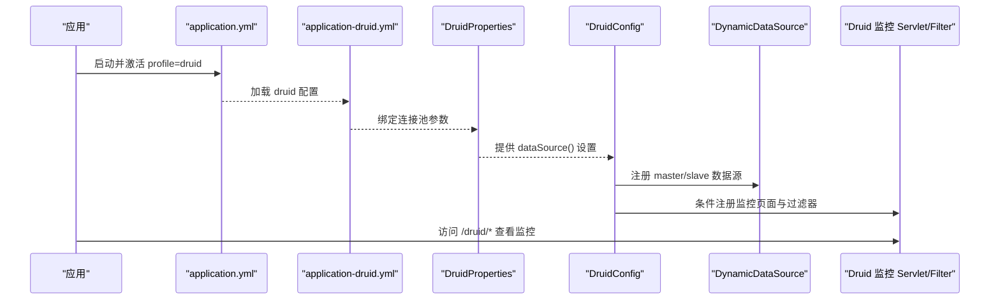
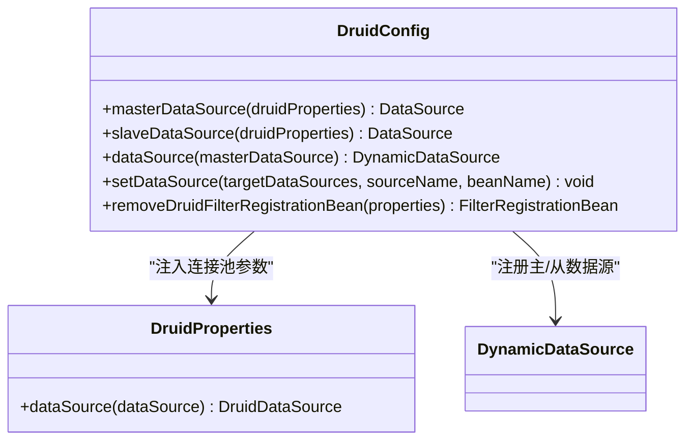
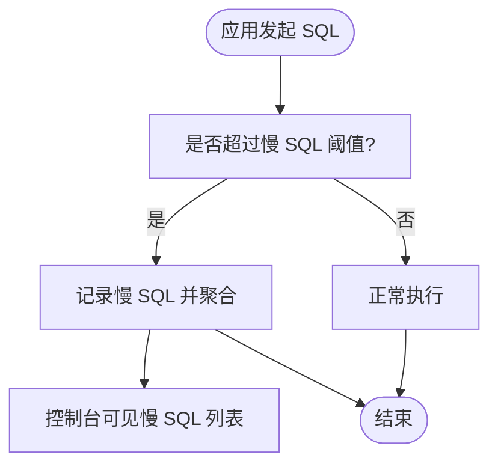
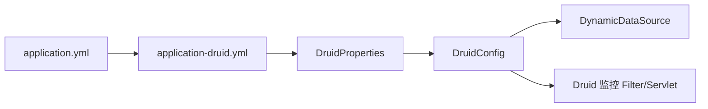

# 数据库监控

<cite>
**本文引用的文件**   
- [DruidConfig.java](file://PezMax-Backend/ruoyi-framework/src/main/java/com/ruoyi/framework/config/DruidConfig.java)
- [application-druid.yml](file://PezMax-Backend/ruoyi-admin/src/main/resources/application-druid.yml)
- [DruidProperties.java](file://PezMax-Backend/ruoyi-framework/src/main/java/com/ruoyi/framework/config/properties/DruidProperties.java)
- [DynamicDataSource.java](file://PezMax-Backend/ruoyi-framework/src/main/java/com/ruoyi/framework/datasource/DynamicDataSource.java)
- [DynamicDataSourceContextHolder.java](file://PezMax-Backend/ruoyi-framework/src/main/java/com/ruoyi/framework/datasource/DynamicDataSourceContextHolder.java)
- [application.yml](file://PezMax-Backend/ruoyi-admin/src/main/resources/application.yml)
</cite>

## 目录
1. [简介](#简介)
2. [项目结构](#项目结构)
3. [核心组件](#核心组件)
4. [架构总览](#架构总览)
5. [详细组件分析](#详细组件分析)
6. [依赖关系分析](#依赖关系分析)
7. [性能与容量规划](#性能与容量规划)
8. [故障排查指南](#故障排查指南)
9. [结论](#结论)
10. [附录：配置项速查](#附录配置项速查)

## 简介
本文件面向运维与研发人员，系统化说明本项目中基于 Druid 的数据库连接池监控方案，包括：
- SQL 监控、慢查询统计与分析
- 连接池状态监控（主从多数据源）
- 健康检查与故障恢复机制
- 可视化控制台接入与安全加固
- 告警规则建议与常见性能瓶颈定位方法

## 项目结构
本项目采用 Spring Boot + MyBatis + Druid 的典型后端架构。数据库连接池与监控相关的关键位置如下：
- 配置类：DruidConfig、DruidProperties
- 动态数据源：DynamicDataSource、DynamicDataSourceContextHolder
- 配置文件：application.yml（激活 druid 环境）、application-druid.yml（Druid 参数与监控开关）

图表来源
- [application.yml:54-55](file://PezMax-Backend/ruoyi-admin/src/main/resources/application.yml#L54-L55)
- [application-druid.yml:1-62](file://PezMax-Backend/ruoyi-admin/src/main/resources/application-druid.yml#L1-L62)
- [DruidProperties.java:14-88](file://PezMax-Backend/ruoyi-framework/src/main/java/com/ruoyi/framework/config/properties/DruidProperties.java#L14-L88)
- [DruidConfig.java:35-60](file://PezMax-Backend/ruoyi-framework/src/main/java/com/ruoyi/framework/config/DruidConfig.java#L35-L60)

章节来源
- [application.yml:54-55](file://PezMax-Backend/ruoyi-admin/src/main/resources/application.yml#L54-L55)
- [application-druid.yml:1-62](file://PezMax-Backend/ruoyi-admin/src/main/resources/application-druid.yml#L1-L62)
- [DruidProperties.java:14-88](file://PezMax-Backend/ruoyi-framework/src/main/java/com/ruoyi/framework/config/properties/DruidProperties.java#L14-L88)
- [DruidConfig.java:35-60](file://PezMax-Backend/ruoyi-framework/src/main/java/com/ruoyi/framework/config/DruidConfig.java#L35-L60)

## 核心组件
- DruidProperties：集中读取 application-druid.yml 中的连接池参数并注入到 DruidDataSource。
- DruidConfig：构建主/从 DruidDataSource，装配 DynamicDataSource，并可选注册监控页面过滤以去除广告。
- DynamicDataSource / DynamicDataSourceContextHolder：实现多数据源路由与上下文切换。
- application-druid.yml：定义连接池大小、超时、空闲回收、验证、Web 监控与 SQL 监控等关键指标。

章节来源
- [DruidProperties.java:14-88](file://PezMax-Backend/ruoyi-framework/src/main/java/com/ruoyi/framework/config/properties/DruidProperties.java#L14-L88)
- [DruidConfig.java:35-79](file://PezMax-Backend/ruoyi-framework/src/main/java/com/ruoyi/framework/config/DruidConfig.java#L35-L79)
- [application-druid.yml:20-62](file://PezMax-Backend/ruoyi-admin/src/main/resources/application-druid.yml#L20-L62)

## 架构总览
下图展示了从应用启动到连接池与监控的装配流程，以及请求访问监控页面的路径。

图表来源
- [application.yml:54-55](file://PezMax-Backend/ruoyi-admin/src/main/resources/application.yml#L54-L55)
- [application-druid.yml:1-62](file://PezMax-Backend/ruoyi-admin/src/main/resources/application-druid.yml#L1-L62)
- [DruidProperties.java:54-88](file://PezMax-Backend/ruoyi-framework/src/main/java/com/ruoyi/framework/config/properties/DruidProperties.java#L54-L88)
- [DruidConfig.java:35-60](file://PezMax-Backend/ruoyi-framework/src/main/java/com/ruoyi/framework/config/DruidConfig.java#L35-L60)

## 详细组件分析

### Druid 连接池配置与参数说明
- 连接池规模
  - initialSize：初始连接数
  - minIdle：最小空闲连接数
  - maxActive：最大连接数
- 超时与等待
  - maxWait：获取连接的等待超时时间
  - connectTimeout：驱动建立连接的超时
  - socketTimeout：网络读写超时
- 空闲回收与健康检查
  - timeBetweenEvictionRunsMillis：空闲检测周期
  - minEvictableIdleTimeMillis/maxEvictableIdleTimeMillis：连接最小/最大存活时间
  - validationQuery：连接有效性校验 SQL
  - testWhileIdle/testOnBorrow/testOnReturn：不同时机执行校验
- 监控与过滤
  - webStatFilter.enabled：开启 Web 监控
  - statViewServlet.enabled/url-pattern/login-username/password：控制台访问控制
  - filter.stat.log-slow-sql/slow-sql-millis/merge-sql：慢 SQL 记录与合并
  - filter.wall.config.multi-statement-allow：是否允许批量语句

章节来源
- [application-druid.yml:20-62](file://PezMax-Backend/ruoyi-admin/src/main/resources/application-druid.yml#L20-L62)
- [DruidProperties.java:14-88](file://PezMax-Backend/ruoyi-framework/src/main/java/com/ruoyi/framework/config/properties/DruidProperties.java#L14-L88)

### DruidConfig 装配逻辑
- 通过 @ConfigurationProperties 分别绑定 master 与 slave 数据源前缀，按需启用从库。
- 使用 DruidProperties.dataSource() 统一注入连接池参数。
- 将主/从数据源注册到 DynamicDataSource，作为默认 Primary 数据源。
- 当 statViewServlet.enabled=true 时，注册 Filter 对监控页面 common.js 进行内容替换，移除底部广告信息。

图表来源
- [DruidConfig.java:35-79](file://PezMax-Backend/ruoyi-framework/src/main/java/com/ruoyi/framework/config/DruidConfig.java#L35-L79)
- [DruidProperties.java:54-88](file://PezMax-Backend/ruoyi-framework/src/main/java/com/ruoyi/framework/config/properties/DruidProperties.java#L54-L88)

章节来源
- [DruidConfig.java:35-79](file://PezMax-Backend/ruoyi-framework/src/main/java/com/ruoyi/framework/config/DruidConfig.java#L35-L79)
- [DruidConfig.java:85-125](file://PezMax-Backend/ruoyi-framework/src/main/java/com/ruoyi/framework/config/DruidConfig.java#L85-L125)
- [DruidProperties.java:54-88](file://PezMax-Backend/ruoyi-framework/src/main/java/com/ruoyi/framework/config/properties/DruidProperties.java#L54-L88)

### 动态数据源与多数据源监控
- 主库始终注册；从库在 enabled=true 时注册。
- DynamicDataSource 作为默认数据源，内部维护 targetDataSources 映射。
- 监控控制台会按数据源维度展示连接池状态与 SQL 统计。

章节来源
- [DruidConfig.java:43-60](file://PezMax-Backend/ruoyi-framework/src/main/java/com/ruoyi/framework/config/DruidConfig.java#L43-L60)
- [DynamicDataSource.java](file://PezMax-Backend/ruoyi-framework/src/main/java/com/ruoyi/framework/datasource/DynamicDataSource.java)
- [DynamicDataSourceContextHolder.java](file://PezMax-Backend/ruoyi-framework/src/main/java/com/ruoyi/framework/datasource/DynamicDataSourceContextHolder.java)

### SQL 监控与慢查询分析
- 启用方式：filter.stat.enabled=true，log-slow-sql=true，slow-sql-millis 阈值设定。
- 监控范围：webStatFilter.enabled=true 后，所有经 Web 的请求 SQL 将被采集。
- 慢查询识别：超过 slow-sql-millis 的 SQL 会被记录并可聚合（merge-sql）。
- 控制台查看：访问 /druid/* 进入“SQL 监控”、“慢 SQL 统计”等页面。

图表来源
- [application-druid.yml:53-59](file://PezMax-Backend/ruoyi-admin/src/main/resources/application-druid.yml#L53-L59)

章节来源
- [application-druid.yml:43-59](file://PezMax-Backend/ruoyi-admin/src/main/resources/application-druid.yml#L43-L59)

### 连接池健康检查与故障恢复
- 空闲检测：timeBetweenEvictionRunsMillis 周期性扫描空闲连接。
- 连接有效性：validationQuery 配合 testWhileIdle/testOnBorrow/testOnReturn 保证可用连接。
- 连接回收：minEvictableIdleTimeMillis/maxEvictableIdleTimeMillis 控制连接生命周期。
- 获取失败保护：maxWait 限制等待时间，避免线程长时间阻塞。

章节来源
- [application-druid.yml:20-42](file://PezMax-Backend/ruoyi-admin/src/main/resources/application-druid.yml#L20-L42)
- [DruidProperties.java:54-88](file://PezMax-Backend/ruoyi-framework/src/main/java/com/ruoyi/framework/config/properties/DruidProperties.java#L54-L88)

### 监控控制台与安全加固
- 访问地址：/druid/*（可配置 url-pattern）。
- 登录认证：login-username/login-password。
- 白名单：allow 配置仅放行指定 IP（留空表示允许全部）。
- 广告去除：DruidConfig 在启用监控时自动过滤 common.js 并移除底部广告。

章节来源
- [application-druid.yml:45-52](file://PezMax-Backend/ruoyi-admin/src/main/resources/application-druid.yml#L45-L52)
- [DruidConfig.java:85-125](file://PezMax-Backend/ruoyi-framework/src/main/java/com/ruoyi/framework/config/DruidConfig.java#L85-L125)

## 依赖关系分析
- application.yml 激活 druid profile，从而引入 application-druid.yml。
- DruidProperties 读取 druid.* 配置并应用到 DruidDataSource。
- DruidConfig 根据属性创建主/从数据源，并装配 DynamicDataSource。
- 监控相关 Filter/Servlet 由 Druid 自动装配，DruidConfig 额外处理监控页面资源。

图表来源
- [application.yml:54-55](file://PezMax-Backend/ruoyi-admin/src/main/resources/application.yml#L54-L55)
- [application-druid.yml:1-62](file://PezMax-Backend/ruoyi-admin/src/main/resources/application-druid.yml#L1-L62)
- [DruidProperties.java:14-88](file://PezMax-Backend/ruoyi-framework/src/main/java/com/ruoyi/framework/config/properties/DruidProperties.java#L14-L88)
- [DruidConfig.java:35-60](file://PezMax-Backend/ruoyi-framework/src/main/java/com/ruoyi/framework/config/DruidConfig.java#L35-L60)

章节来源
- [application.yml:54-55](file://PezMax-Backend/ruoyi-admin/src/main/resources/application.yml#L54-L55)
- [application-druid.yml:1-62](file://PezMax-Backend/ruoyi-admin/src/main/resources/application-druid.yml#L1-L62)
- [DruidProperties.java:14-88](file://PezMax-Backend/ruoyi-framework/src/main/java/com/ruoyi/framework/config/properties/DruidProperties.java#L14-L88)
- [DruidConfig.java:35-60](file://PezMax-Backend/ruoyi-framework/src/main/java/com/ruoyi/framework/config/DruidConfig.java#L35-L60)

## 性能与容量规划
- 连接池规模
  - 经验公式：maxActive ≈ CPU 核数 × 2 ~ 4（I/O 密集型可适当提高），结合业务 QPS 与平均响应时间评估。
  - minIdle 建议不低于 5~10，避免冷启动抖动。
  - initialSize 建议接近 minIdle，缩短启动期等待。
- 超时与等待
  - maxWait 建议 30~60s，避免线程长期阻塞。
  - connectTimeout/socketTimeout 需与数据库网络状况匹配，避免误判。
- 空闲回收
  - timeBetweenEvictionRunsMillis 建议 60s 左右，过小会增加开销。
  - minEvictableIdleTimeMillis 建议 5~10 分钟，maxEvictableIdleTimeMillis 建议 15~30 分钟。
- 监控与慢 SQL
  - slow-sql-millis 建议 500~2000ms，视业务 SLA 调整。
  - merge-sql 开启有助于聚合重复 SQL，降低统计噪声。
- 安全
  - 生产务必配置 allow 白名单与强密码，避免暴露监控入口。

[本节为通用指导，不直接分析具体文件]

## 故障排查指南
- 无法访问监控页面
  - 确认 statViewServlet.enabled=true 且 url-pattern 正确。
  - 检查 login-username/login-password 是否正确。
  - 若配置了 allow 白名单，确保当前 IP 在白名单内。
- 连接获取超时或频繁等待
  - 检查 maxActive 是否过小，观察高峰期连接占用。
  - 检查 maxWait 是否合理，必要时提升并发上限或优化 SQL。
  - 关注慢 SQL 列表，定位长事务与全表扫描。
- 连接泄漏或堆积
  - 开启 testWhileIdle/testOnBorrow/testOnReturn 并结合 validationQuery。
  - 检查业务代码是否正确归还连接（框架通常已代理，但仍需避免异常分支未释放）。
- 慢 SQL 过多
  - 调整 slow-sql-millis 阈值，结合索引与执行计划优化。
  - 使用控制台“SQL 监控”查看 Top SQL 与执行耗时分布。
- 多数据源问题
  - 确认从库 enabled=true 且连接信息正确。
  - 检查动态数据源切换逻辑是否与业务注解/上下文一致。

章节来源
- [application-druid.yml:45-62](file://PezMax-Backend/ruoyi-admin/src/main/resources/application-druid.yml#L45-L62)
- [DruidConfig.java:85-125](file://PezMax-Backend/ruoyi-framework/src/main/java/com/ruoyi/framework/config/DruidConfig.java#L85-L125)

## 结论
本项目通过 Druid 提供了完善的连接池与 SQL 监控能力，结合动态数据源支持主从场景。通过合理的连接池参数、慢 SQL 阈值与监控安全策略，可有效保障数据库稳定性与可观测性。建议在上线前完成容量评估与告警规则配置，并在日常运维中持续跟踪慢 SQL 与连接池水位。

[本节为总结性内容，不直接分析具体文件]

## 附录：配置项速查
- 连接池规模
  - spring.datasource.druid.initialSize
  - spring.datasource.druid.minIdle
  - spring.datasource.druid.maxActive
- 超时与等待
  - spring.datasource.druid.maxWait
  - spring.datasource.druid.connectTimeout
  - spring.datasource.druid.socketTimeout
- 空闲回收与健康检查
  - spring.datasource.druid.timeBetweenEvictionRunsMillis
  - spring.datasource.druid.minEvictableIdleTimeMillis
  - spring.datasource.druid.maxEvictableIdleTimeMillis
  - spring.datasource.druid.validationQuery
  - spring.datasource.druid.testWhileIdle
  - spring.datasource.druid.testOnBorrow
  - spring.datasource.druid.testOnReturn
- 监控与过滤
  - spring.datasource.druid.webStatFilter.enabled
  - spring.datasource.druid.statViewServlet.enabled
  - spring.datasource.druid.statViewServlet.url-pattern
  - spring.datasource.druid.statViewServlet.login-username
  - spring.datasource.druid.statViewServlet.login-password
  - spring.datasource.druid.filter.stat.enabled
  - spring.datasource.druid.filter.stat.log-slow-sql
  - spring.datasource.druid.filter.stat.slow-sql-millis
  - spring.datasource.druid.filter.stat.merge-sql
  - spring.datasource.druid.filter.wall.config.multi-statement-allow

章节来源
- [application-druid.yml:20-62](file://PezMax-Backend/ruoyi-admin/src/main/resources/application-druid.yml#L20-L62)
- [DruidProperties.java:14-88](file://PezMax-Backend/ruoyi-framework/src/main/java/com/ruoyi/framework/config/properties/DruidProperties.java#L14-L88)