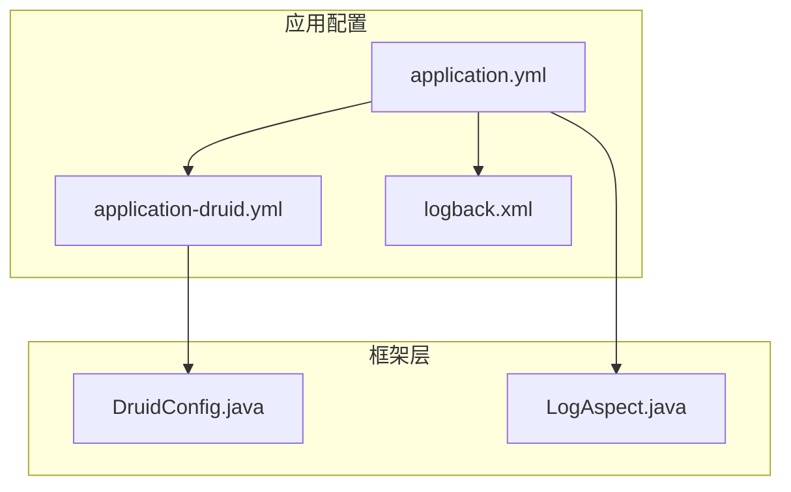
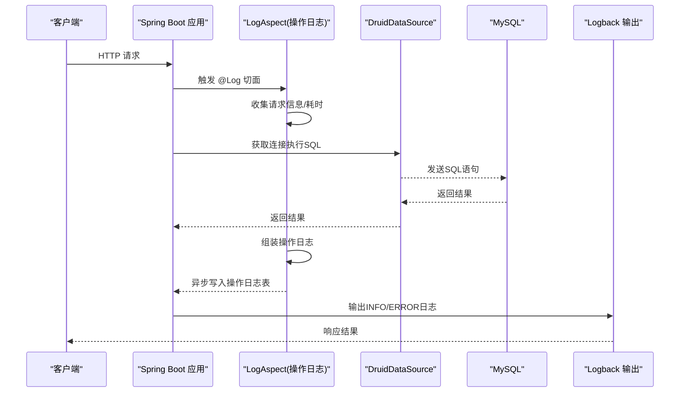
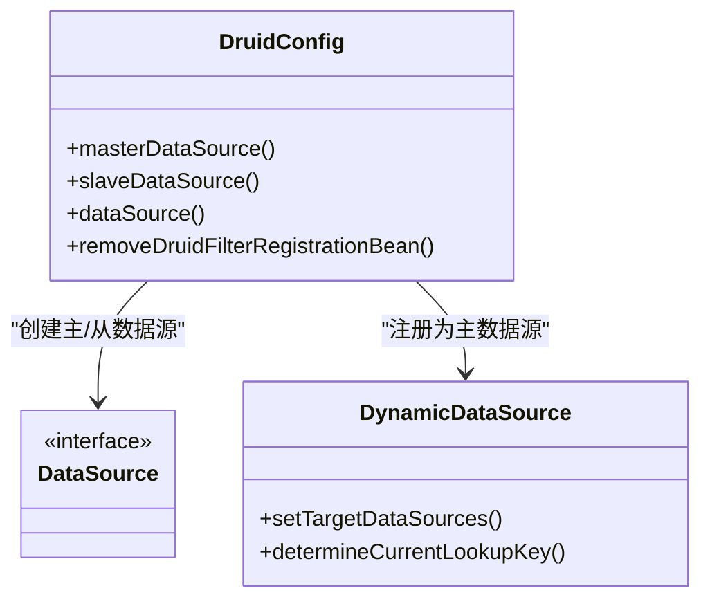
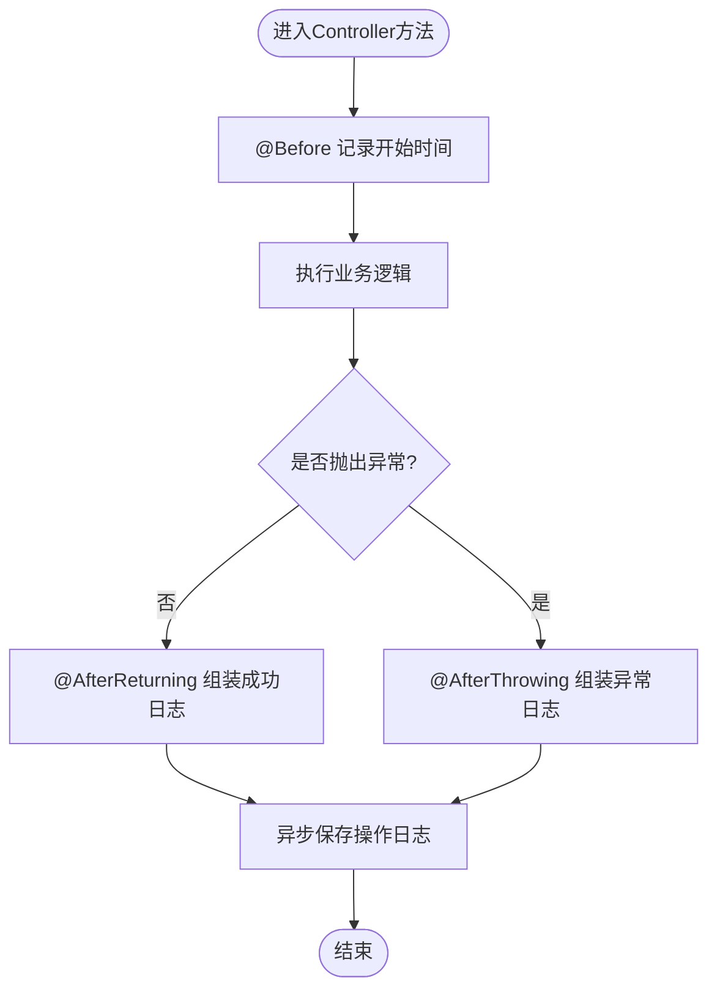
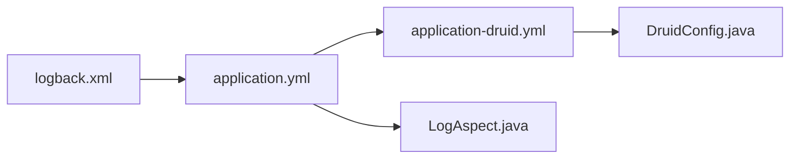

# 监控与日志

<cite>
**本文引用的文件**   
- [logback.xml](file://PezMax-Backend/ruoyi-admin/src/main/resources/logback.xml)
- [application-druid.yml](file://PezMax-Backend/ruoyi-admin/src/main/resources/application-druid.yml)
- [application.yml](file://PezMax-Backend/ruoyi-admin/src/main/resources/application.yml)
- [DruidConfig.java](file://PezMax-Backend/ruoyi-framework/src/main/java/com/ruoyi/framework/config/DruidConfig.java)
- [LogAspect.java](file://PezMax-Backend/ruoyi-framework/src/main/java/com/ruoyi/framework/aspectj/LogAspect.java)
</cite>

## 目录
1. [简介](#简介)
2. [项目结构](#项目结构)
3. [核心组件](#核心组件)
4. [架构总览](#架构总览)
5. [详细组件分析](#详细组件分析)
6. [依赖关系分析](#依赖关系分析)
7. [性能考虑](#性能考虑)
8. [故障排查指南](#故障排查指南)
9. [结论](#结论)
10. [附录](#附录)

## 简介
本指南面向运维与研发人员，聚焦于应用日志管理、数据库监控（Druid）、系统性能指标采集与分析，以及常见监控与告警工具集成方案。文档基于仓库中现有配置与代码实现进行说明，并提供可操作的实践建议，帮助快速搭建稳定可靠的监控与日志体系。

## 项目结构
本项目采用多模块结构，后端以 Spring Boot 为基础，使用 Logback 输出结构化日志，通过 Druid 提供数据源连接池与 SQL 监控能力；操作日志通过 AOP 切面统一采集并异步落库。

图表来源
- [application.yml:1-162](file://PezMax-Backend/ruoyi-admin/src/main/resources/application.yml#L1-L162)
- [application-druid.yml:1-62](file://PezMax-Backend/ruoyi-admin/src/main/resources/application-druid.yml#L1-L62)
- [logback.xml:1-99](file://PezMax-Backend/ruoyi-admin/src/main/resources/logback.xml#L1-L99)
- [DruidConfig.java:1-127](file://PezMax-Backend/ruoyi-framework/src/main/java/com/ruoyi/framework/config/DruidConfig.java#L1-L127)
- [LogAspect.java:1-265](file://PezMax-Backend/ruoyi-framework/src/main/java/com/ruoyi/framework/aspectj/LogAspect.java#L1-L265)

章节来源
- [application.yml:1-162](file://PezMax-Backend/ruoyi-admin/src/main/resources/application.yml#L1-L162)
- [application-druid.yml:1-62](file://PezMax-Backend/ruoyi-admin/src/main/resources/application-druid.yml#L1-L62)
- [logback.xml:1-99](file://PezMax-Backend/ruoyi-admin/src/main/resources/logback.xml#L1-L99)
- [DruidConfig.java:1-127](file://PezMax-Backend/ruoyi-framework/src/main/java/com/ruoyi/framework/config/DruidConfig.java#L1-L127)
- [LogAspect.java:1-265](file://PezMax-Backend/ruoyi-framework/src/main/java/com/ruoyi/framework/aspectj/LogAspect.java#L1-L265)

## 核心组件
- 日志子系统：基于 Logback 控制台与滚动文件输出，按级别分离 INFO/ERROR，支持用户访问日志独立输出。
- 数据库监控：基于 Druid 的 WebStatFilter 与 StatViewServlet，提供 SQL 监控、慢查询统计、SQL 合并等能力。
- 操作日志：基于 AOP 注解拦截 Controller 方法，记录请求参数、响应结果、耗时、IP、用户信息等，并异步持久化。

章节来源
- [logback.xml:1-99](file://PezMax-Backend/ruoyi-admin/src/main/resources/logback.xml#L1-L99)
- [application-druid.yml:1-62](file://PezMax-Backend/ruoyi-admin/src/main/resources/application-druid.yml#L1-L62)
- [LogAspect.java:1-265](file://PezMax-Backend/ruoyi-framework/src/main/java/com/ruoyi/framework/aspectj/LogAspect.java#L1-L265)

## 架构总览
下图展示了从请求进入、AOP 操作日志采集、数据库连接池与 SQL 监控、到日志输出的整体链路。

图表来源
- [LogAspect.java:1-265](file://PezMax-Backend/ruoyi-framework/src/main/java/com/ruoyi/framework/aspectj/LogAspect.java#L1-L265)
- [application-druid.yml:1-62](file://PezMax-Backend/ruoyi-admin/src/main/resources/application-druid.yml#L1-L62)
- [logback.xml:1-99](file://PezMax-Backend/ruoyi-admin/src/main/resources/logback.xml#L1-L99)

## 详细组件分析

### 日志子系统（Logback）
- 输出目标
  - 控制台：便于本地调试与容器标准输出收集。
  - 文件：按天滚动，INFO 与 ERROR 分别输出，用户访问日志独立文件。
- 关键配置项
  - 日志路径、格式、滚动策略（按天）、保留天数、级别过滤。
- 注意事项
  - 滚动重命名失败常见原因包括权限不足、文件被占用、跨文件系统、目录不存在、配置冲突等。

章节来源
- [logback.xml:1-99](file://PezMax-Backend/ruoyi-admin/src/main/resources/logback.xml#L1-L99)

### 数据库监控（Druid）
- 功能概览
  - Web 监控页面：开启后暴露 /druid/* 接口，支持登录鉴权与白名单。
  - SQL 监控：统计 SQL 执行次数、耗时、慢查询、合并重复 SQL 等。
  - 连接池参数：初始大小、最小空闲、最大活跃、超时、空闲回收、有效性校验等。
- 关键配置项
  - webStatFilter.enabled、statViewServlet.enabled/url-pattern/login-username/login-password、filter.stat.log-slow-sql/slow-sql-millis/merge-sql、wall 相关开关。
- 动态去广告 Filter
  - 通过自定义 Filter 重写 common.js，移除监控页底部广告。

图表来源
- [DruidConfig.java:1-127](file://PezMax-Backend/ruoyi-framework/src/main/java/com/ruoyi/framework/config/DruidConfig.java#L1-L127)

章节来源
- [application-druid.yml:1-62](file://PezMax-Backend/ruoyi-admin/src/main/resources/application-druid.yml#L1-L62)
- [DruidConfig.java:1-127](file://PezMax-Backend/ruoyi-framework/src/main/java/com/ruoyi/framework/config/DruidConfig.java#L1-L127)

### 操作日志（AOP 切面）
- 工作流程
  - 在 Controller 方法前后拦截，记录 IP、URL、方法名、请求方式、参数、响应、耗时等。
  - 异常时记录错误信息，成功/失败状态写入操作日志。
  - 使用异步管理器将操作日志持久化，避免影响主流程性能。
- 敏感字段过滤
  - 默认排除密码等敏感属性，支持注解扩展排除字段。
- 参数长度限制
  - 对请求参数与响应结果进行截断，防止日志过大。

图表来源
- [LogAspect.java:1-265](file://PezMax-Backend/ruoyi-framework/src/main/java/com/ruoyi/framework/aspectj/LogAspect.java#L1-L265)

章节来源
- [LogAspect.java:1-265](file://PezMax-Backend/ruoyi-framework/src/main/java/com/ruoyi/framework/aspectj/LogAspect.java#L1-L265)

### 系统配置要点（application.yml）
- 日志级别：覆盖 com.ruoyi 与 org.springframework 的默认级别。
- Tomcat 线程：max/min-spare 控制并发处理能力。
- Redis 连接池：min-idle/max-idle/max-active/max-wait 等。
- 其他：上传大小、国际化、Swagger、防盗链、XSS 过滤、MinIO 等。

章节来源
- [application.yml:1-162](file://PezMax-Backend/ruoyi-admin/src/main/resources/application.yml#L1-L162)

## 依赖关系分析
- application.yml 激活 druid 配置文件，从而启用 Druid 数据源与监控。
- DruidConfig 根据配置构建主/从数据源，并注册为动态数据源。
- LogAspect 通过 AOP 与异步机制完成操作日志采集与落库。
- logback.xml 负责最终日志落地与输出。

图表来源
- [application.yml:1-162](file://PezMax-Backend/ruoyi-admin/src/main/resources/application.yml#L1-L162)
- [application-druid.yml:1-62](file://PezMax-Backend/ruoyi-admin/src/main/resources/application-druid.yml#L1-L62)
- [DruidConfig.java:1-127](file://PezMax-Backend/ruoyi-framework/src/main/java/com/ruoyi/framework/config/DruidConfig.java#L1-L127)
- [LogAspect.java:1-265](file://PezMax-Backend/ruoyi-framework/src/main/java/com/ruoyi/framework/aspectj/LogAspect.java#L1-L265)
- [logback.xml:1-99](file://PezMax-Backend/ruoyi-admin/src/main/resources/logback.xml#L1-L99)

## 性能考虑
- 日志
  - 合理设置日志级别，生产环境建议 INFO 及以上；避免在高频路径打印大对象或全量参数。
  - 使用滚动策略与保留天数控制磁盘增长。
- 数据库
  - 调整连接池大小与超时参数匹配业务峰值；开启慢 SQL 统计与合并，便于定位热点 SQL。
  - 定期清理历史监控数据，避免监控表膨胀。
- 线程与并发
  - 结合 Tomcat 线程数与队列容量评估吞吐上限；关注 GC 与 CPU 使用率。
- 监控面板
  - 利用 Druid 监控页面观察连接池、SQL 执行分布与慢查询趋势。

[本节为通用指导，不直接分析具体文件]

## 故障排查指南
- 日志滚动失败
  - 检查日志目录权限、文件占用情况、是否跨分区、目录是否存在、配置是否冲突。
- 监控页面无法访问
  - 确认 statViewServlet.enabled 与 url-pattern 配置；核对登录用户名/密码与白名单。
- 慢查询过多
  - 调整 slow-sql-millis 阈值；查看合并后的 SQL 列表，优化索引与语句。
- 操作日志丢失
  - 检查异步任务是否正常执行；确认数据库连接与表结构完整。

章节来源
- [logback.xml:1-99](file://PezMax-Backend/ruoyi-admin/src/main/resources/logback.xml#L1-L99)
- [application-druid.yml:1-62](file://PezMax-Backend/ruoyi-admin/src/main/resources/application-druid.yml#L1-L62)
- [LogAspect.java:1-265](file://PezMax-Backend/ruoyi-framework/src/main/java/com/ruoyi/framework/aspectj/LogAspect.java#L1-L265)

## 结论
本项目已内置完善的日志与数据库监控基础能力：Logback 提供分层日志输出，Druid 提供 SQL 监控与连接池可视化，AOP 操作日志保障可追溯性。在此基础上，建议结合外部监控系统（如 ELK、Prometheus+Grafana）完善指标采集与告警闭环，形成从“采集—存储—分析—告警—处置”的完整运维体系。

[本节为总结性内容，不直接分析具体文件]

## 附录

### 日志收集与分析工具集成示例（概念性指引）
- ELK Stack
  - Filebeat 采集应用日志文件（按天滚动），发送至 Logstash 解析与清洗，再写入 Elasticsearch；Kibana 进行检索与可视化。
  - 建议：为不同日志类型（info/error/user）建立独立索引模板与保留策略。
- Prometheus + Grafana
  - 通过 Micrometer 暴露 JVM 与应用指标（JVM 内存、GC、线程、HTTP 请求延迟与错误率）。
  - 使用 Grafana 面板展示关键指标，并结合 Alertmanager 配置告警规则（如 CPU/内存/错误率/慢查询阈值）。
- 告警规则建议
  - 应用错误率突增、慢查询比例上升、连接池耗尽、线程阻塞、磁盘空间不足等。
- 异常处理机制
  - 全局异常处理器统一返回错误码与消息；操作日志记录异常堆栈摘要；必要时触发告警。

[本节为概念性内容，不直接分析具体文件]