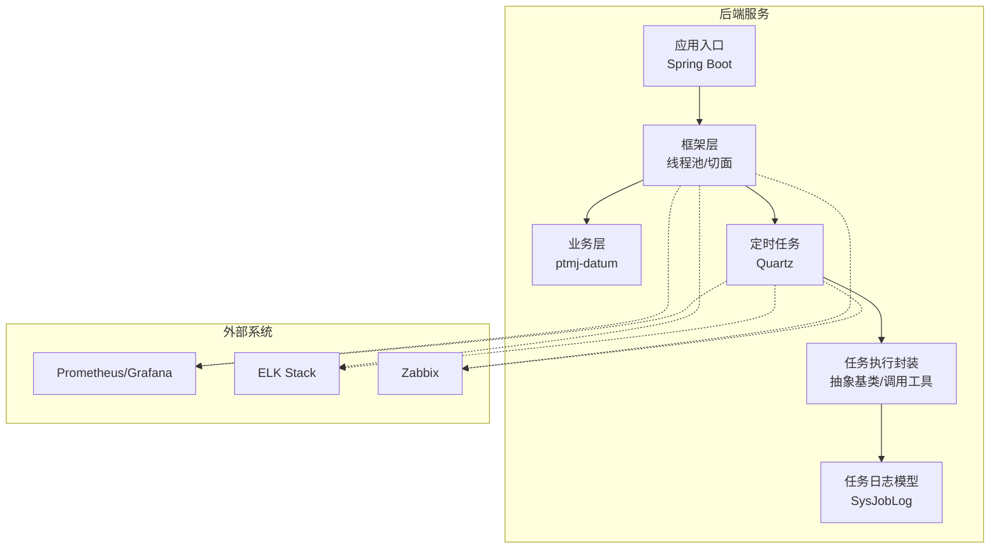
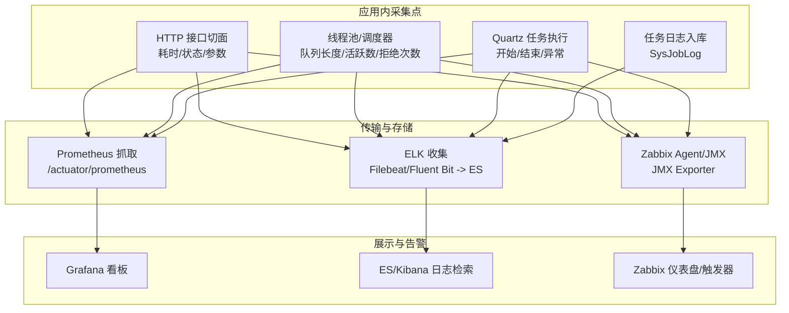
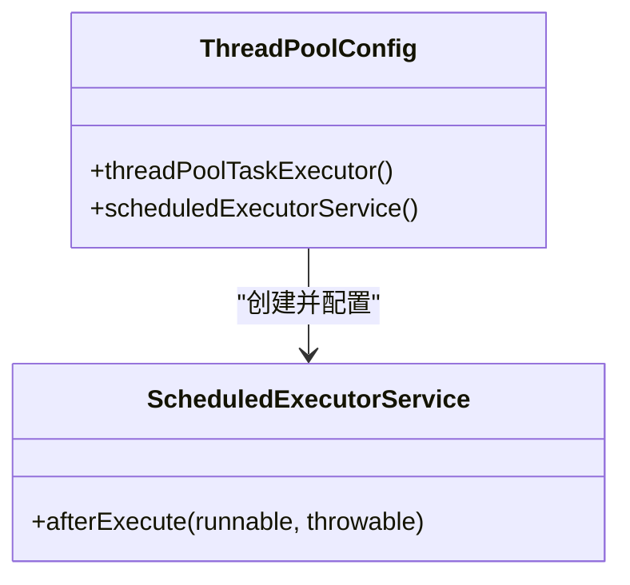
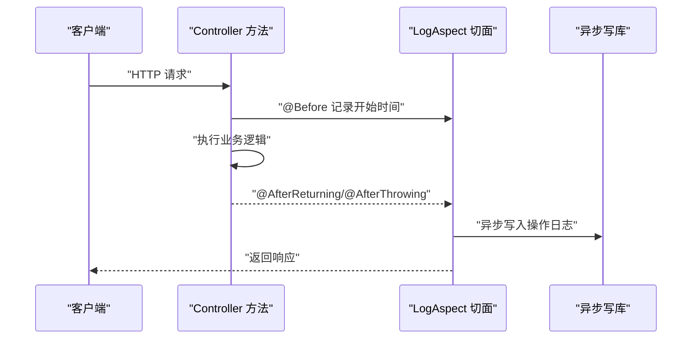
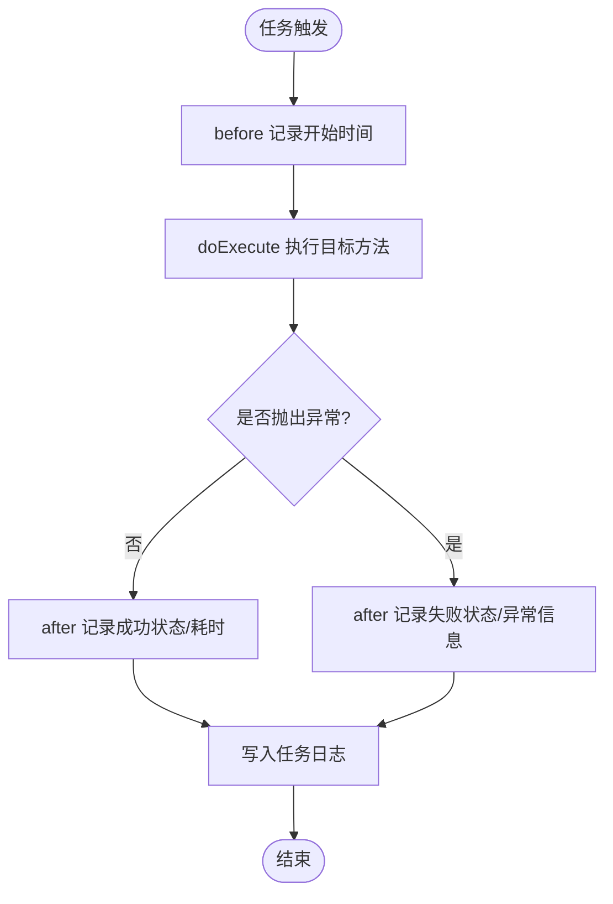
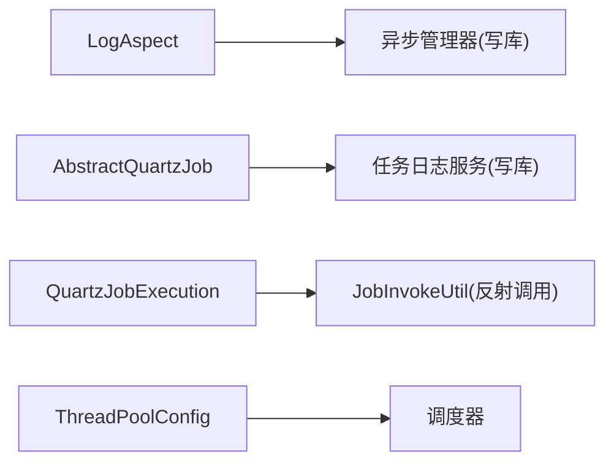

# 监控告警集成

<cite>
**本文引用的文件**   
- [README.md](file://PezMax-Backend/README.md)
- [ThreadPoolConfig.java](file://PezMax-Backend/ruoyi-framework/src/main/java/com/ruoyi/framework/config/ThreadPoolConfig.java)
- [LogAspect.java](file://PezMax-Backend/ruoyi-framework/src/main/java/com/ruoyi/framework/aspectj/LogAspect.java)
- [AbstractQuartzJob.java](file://PezMax-Backend/ruoyi-quartz/src/main/java/com/ruoyi/quartz/util/AbstractQuartzJob.java)
- [QuartzJobExecution.java](file://PezMax-Backend/ruoyi-quartz/src/main/java/com/ruoyi/quartz/util/QuartzJobExecution.java)
- [JobInvokeUtil.java](file://PezMax-Backend/ruoyi-quartz/src/main/java/com/ruoyi/quartz/util/JobInvokeUtil.java)
- [RyTask.java](file://PezMax-Backend/ruoyi-quartz/src/main/java/com/ruoyi/quartz/task/RyTask.java)
- [SysJobLog.java](file://PezMax-Backend/ruoyi-quartz/src/main/java/com/ruoyi/quartz/domain/SysJobLog.java)
</cite>

## 目录
1. [简介](#简介)
2. [项目结构](#项目结构)
3. [核心组件](#核心组件)
4. [架构总览](#架构总览)
5. [详细组件分析](#详细组件分析)
6. [依赖关系分析](#依赖关系分析)
7. [性能考虑](#性能考虑)
8. [故障排查指南](#故障排查指南)
9. [结论](#结论)
10. [附录](#附录)

## 简介
本文件面向“监控告警集成”目标，结合仓库现有能力，给出与 Prometheus + Grafana、ELK Stack、Zabbix 等主流监控方案对接的落地方案。内容覆盖：
- 指标采集、传输、存储与展示的全链路配置建议
- 告警规则定义与示例（阈值告警、异常告警、性能降级告警）
- 异步任务与定时任务的监控机制（执行状态、失败重试、日志记录）
- 故障排查与应急响应流程，保障系统高可用

说明：
- 当前后端未内置 Micrometer/Prometheus 客户端或 ELK/Zabbix 客户端，本文提供“最小侵入式”接入路径与最佳实践，确保在不破坏既有架构的前提下完成集成。
- 所有涉及代码的分析均基于仓库现有实现，并在需要处给出“扩展点”建议。

## 项目结构
后端采用多模块分层架构，关键与监控相关的模块与文件如下：
- ruoyi-framework：线程池配置、操作日志切面（用于请求级耗时、错误统计等指标埋点）
- ruoyi-quartz：定时任务调度、任务执行封装、任务日志持久化
- ptmj-datum：业务域（书签、文件、用户等），可在此埋点业务指标
- 根 README：部署端口、技术栈概览

图表来源
- [README.md:1-105](file://PezMax-Backend/README.md#L1-L105)
- [ThreadPoolConfig.java:1-64](file://PezMax-Backend/ruoyi-framework/src/main/java/com/ruoyi/framework/config/ThreadPoolConfig.java#L1-L64)
- [LogAspect.java:1-265](file://PezMax-Backend/ruoyi-framework/src/main/java/com/ruoyi/framework/aspectj/LogAspect.java#L1-L265)
- [AbstractQuartzJob.java:1-107](file://PezMax-Backend/ruoyi-quartz/src/main/java/com/ruoyi/quartz/util/AbstractQuartzJob.java#L1-L107)
- [QuartzJobExecution.java:1-20](file://PezMax-Backend/ruoyi-quartz/src/main/java/com/ruoyi/quartz/util/QuartzJobExecution.java#L1-L20)
- [JobInvokeUtil.java:1-183](file://PezMax-Backend/ruoyi-quartz/src/main/java/com/ruoyi/quartz/util/JobInvokeUtil.java#L1-L183)
- [SysJobLog.java:1-159](file://PezMax-Backend/ruoyi-quartz/src/main/java/com/ruoyi/quartz/domain/SysJobLog.java#L1-L159)

章节来源
- [README.md:1-105](file://PezMax-Backend/README.md#L1-L105)

## 核心组件
- 线程池与调度器
  - 提供通用线程池与定时调度器 Bean，支持拒绝策略与异常打印，便于采集线程池指标与异常事件。
- 操作日志切面
  - 通过注解切面统一采集接口耗时、入参出参、IP、方法名、成功/失败状态等，适合导出为指标与日志。
- 定时任务执行链
  - 抽象基类负责生命周期钩子（before/after）、耗时计算、异常捕获与任务日志落库；具体执行由子类委托到反射调用工具。
- 任务日志模型
  - 包含任务名称、组、调用目标、消息、状态、异常信息、起止时间等字段，可用于可视化与告警。

章节来源
- [ThreadPoolConfig.java:1-64](file://PezMax-Backend/ruoyi-framework/src/main/java/com/ruoyi/framework/config/ThreadPoolConfig.java#L1-L64)
- [LogAspect.java:1-265](file://PezMax-Backend/ruoyi-framework/src/main/java/com/ruoyi/framework/aspectj/LogAspect.java#L1-L265)
- [AbstractQuartzJob.java:1-107](file://PezMax-Backend/ruoyi-quartz/src/main/java/com/ruoyi/quartz/util/AbstractQuartzJob.java#L1-L107)
- [QuartzJobExecution.java:1-20](file://PezMax-Backend/ruoyi-quartz/src/main/java/com/ruoyi/quartz/util/QuartzJobExecution.java#L1-L20)
- [JobInvokeUtil.java:1-183](file://PezMax-Backend/ruoyi-quartz/src/main/java/com/ruoyi/quartz/util/JobInvokeUtil.java#L1-L183)
- [SysJobLog.java:1-159](file://PezMax-Backend/ruoyi-quartz/src/main/java/com/ruoyi/quartz/domain/SysJobLog.java#L1-L159)

## 架构总览
下图展示了从“应用内部采集”到“外部监控系统”的数据流向，以及在本项目中可落地的采集点。

图表来源
- [LogAspect.java:1-265](file://PezMax-Backend/ruoyi-framework/src/main/java/com/ruoyi/framework/aspectj/LogAspect.java#L1-L265)
- [ThreadPoolConfig.java:1-64](file://PezMax-Backend/ruoyi-framework/src/main/java/com/ruoyi/framework/config/ThreadPoolConfig.java#L1-L64)
- [AbstractQuartzJob.java:1-107](file://PezMax-Backend/ruoyi-quartz/src/main/java/com/ruoyi/quartz/util/AbstractQuartzJob.java#L1-L107)
- [SysJobLog.java:1-159](file://PezMax-Backend/ruoyi-quartz/src/main/java/com/ruoyi/quartz/domain/SysJobLog.java#L1-L159)

## 详细组件分析

### 组件一：线程池与调度器（指标采集与异常上报）
- 职责
  - 暴露通用线程池与调度器 Bean，设置核心/最大线程数、队列容量、空闲回收、拒绝策略。
  - 在调度器 afterExecute 中打印异常，便于被日志收集器抓取。
- 监控接入建议
  - Prometheus：引入 Micrometer + Spring Boot Actuator，将线程池指标暴露为 /actuator/prometheus，Grafana 拉取并绘制。
  - ELK：通过 Filebeat/Fluent Bit 收集应用日志，过滤线程池相关异常堆栈。
  - Zabbix：使用 JMX Exporter 暴露 JVM/线程池指标，Zabbix Server 抓取并配置触发器。
- 关键扩展点
  - 在 ThreadPoolConfig 中新增自定义 MeteredExecutor 或使用 Micrometer 提供的 TaskExecutorMetrics。
  - 在 scheduledExecutorService.afterExecute 中增加结构化日志输出（JSON），便于 ELK 解析。

图表来源
- [ThreadPoolConfig.java:1-64](file://PezMax-Backend/ruoyi-framework/src/main/java/com/ruoyi/framework/config/ThreadPoolConfig.java#L1-L64)

章节来源
- [ThreadPoolConfig.java:1-64](file://PezMax-Backend/ruoyi-framework/src/main/java/com/ruoyi/framework/config/ThreadPoolConfig.java#L1-L64)

### 组件二：操作日志切面（HTTP 指标与审计日志）
- 职责
  - 在 Controller 方法前后拦截，记录 IP、URL、方法名、耗时、请求/响应摘要、成功/失败状态。
  - 通过异步管理器写入数据库，避免阻塞主流程。
- 监控接入建议
  - Prometheus：对“耗时分布”、“成功率/失败率”、“QPS”、“按 URL/方法维度”的计数与时序进行埋点。
  - ELK：将结构化日志（JSON）投递至 ES，构建 Kibana 看板与告警。
  - Zabbix：通过 JMX/Agent 采集 HTTP 端点健康度，结合日志关键字匹配做告警。
- 关键扩展点
  - 在 handleLog 中增加指标计数器与直方图（如 http_request_duration_seconds）。
  - 对大对象/敏感字段进行脱敏后再输出。

图表来源
- [LogAspect.java:1-265](file://PezMax-Backend/ruoyi-framework/src/main/java/com/ruoyi/framework/aspectj/LogAspect.java#L1-L265)

章节来源
- [LogAspect.java:1-265](file://PezMax-Backend/ruoyi-framework/src/main/java/com/ruoyi/framework/aspectj/LogAspect.java#L1-L265)

### 组件三：定时任务执行链（状态监控、失败重试、日志记录）
- 职责
  - AbstractQuartzJob 作为统一入口，负责 before/after 钩子、耗时计算、异常捕获与任务日志落库。
  - QuartzJobExecution 继承抽象类，委托 JobInvokeUtil 动态反射调用目标 Bean 方法。
  - SysJobLog 持久化任务执行结果，包括状态、异常信息与耗时。
- 监控接入建议
  - Prometheus：在 after 中根据状态与耗时发布指标（如 job_exec_total、job_duration_seconds）。
  - ELK：将任务执行日志以 JSON 格式输出，包含任务标识、耗时、异常堆栈。
  - Zabbix：基于任务日志表或指标触发器，实现“连续失败 N 次”、“超时”等告警。
- 失败重试建议
  - 在 after 中判断异常时，将失败任务投递到延迟队列/重试主题（如 Redis Stream、RocketMQ），由消费者按退避策略重试。
  - 或在 Quartz 层面维护“失败次数/下次重试时间”，由调度器周期性重试。

图表来源
- [AbstractQuartzJob.java:1-107](file://PezMax-Backend/ruoyi-quartz/src/main/java/com/ruoyi/quartz/util/AbstractQuartzJob.java#L1-L107)
- [QuartzJobExecution.java:1-20](file://PezMax-Backend/ruoyi-quartz/src/main/java/com/ruoyi/quartz/util/QuartzJobExecution.java#L1-L20)
- [JobInvokeUtil.java:1-183](file://PezMax-Backend/ruoyi-quartz/src/main/java/com/ruoyi/quartz/util/JobInvokeUtil.java#L1-L183)
- [SysJobLog.java:1-159](file://PezMax-Backend/ruoyi-quartz/src/main/java/com/ruoyi/quartz/domain/SysJobLog.java#L1-L159)

章节来源
- [AbstractQuartzJob.java:1-107](file://PezMax-Backend/ruoyi-quartz/src/main/java/com/ruoyi/quartz/util/AbstractQuartzJob.java#L1-L107)
- [QuartzJobExecution.java:1-20](file://PezMax-Backend/ruoyi-quartz/src/main/java/com/ruoyi/quartz/util/QuartzJobExecution.java#L1-L20)
- [JobInvokeUtil.java:1-183](file://PezMax-Backend/ruoyi-quartz/src/main/java/com/ruoyi/quartz/util/JobInvokeUtil.java#L1-L183)
- [SysJobLog.java:1-159](file://PezMax-Backend/ruoyi-quartz/src/main/java/com/ruoyi/quartz/domain/SysJobLog.java#L1-L159)

### 组件四：示例任务（RyTask）
- 作用：演示无参/有参/多参方法的调度方式，便于验证监控链路。
- 监控建议：为该任务添加专属标签（如 task_name=ry_task），以便在 Grafana/ES/Zabbix 中区分。

章节来源
- [RyTask.java:1-29](file://PezMax-Backend/ruoyi-quartz/src/main/java/com/ruoyi/quartz/task/RyTask.java#L1-L29)

## 依赖关系分析
- 低耦合设计
  - 切面与业务解耦，仅关注横切关注点（日志、耗时、异常）。
  - 任务执行链通过抽象基类统一处理生命周期，具体业务通过反射注入，降低硬编码依赖。
- 外部依赖
  - 当前未见直接引入 Micrometer/ELK/Zabbix SDK，需按需引入对应依赖并通过 Actuator/JMX/日志管道对接。

图表来源
- [LogAspect.java:1-265](file://PezMax-Backend/ruoyi-framework/src/main/java/com/ruoyi/framework/aspectj/LogAspect.java#L1-L265)
- [AbstractQuartzJob.java:1-107](file://PezMax-Backend/ruoyi-quartz/src/main/java/com/ruoyi/quartz/util/AbstractQuartzJob.java#L1-L107)
- [QuartzJobExecution.java:1-20](file://PezMax-Backend/ruoyi-quartz/src/main/java/com/ruoyi/quartz/util/QuartzJobExecution.java#L1-L20)
- [JobInvokeUtil.java:1-183](file://PezMax-Backend/ruoyi-quartz/src/main/java/com/ruoyi/quartz/util/JobInvokeUtil.java#L1-L183)
- [ThreadPoolConfig.java:1-64](file://PezMax-Backend/ruoyi-framework/src/main/java/com/ruoyi/framework/config/ThreadPoolConfig.java#L1-L64)

## 性能考虑
- 指标采集开销控制
  - 使用采样与聚合（如直方图分桶、计数器滑动窗口）降低时序数据量。
  - 对高频接口指标采用采样率，避免过度采集。
- 日志体积控制
  - 限制请求/响应体大小，脱敏敏感字段，避免大对象序列化导致 GC 压力。
- 任务执行优化
  - 合理设置线程池与队列容量，避免背压导致堆积；必要时启用背压与限流。
  - 任务失败重试采用指数退避与抖动，避免雪崩。

[本节为通用指导，不直接分析具体文件]

## 故障排查指南
- 常见问题定位
  - 接口慢/超时：查看操作日志切面记录的耗时与方法签名，结合线程池队列长度与活跃线程数定位瓶颈。
  - 任务失败：检查任务日志中的异常信息与堆栈，确认目标 Bean 是否存在、方法签名是否匹配、参数类型是否正确。
  - 资源耗尽：观察线程池拒绝次数与队列积压，评估是否需要扩容或优化任务粒度。
- 快速恢复步骤
  - 临时降级：关闭非关键定时任务或降低采样率。
  - 重启隔离：对问题实例滚动重启，配合灰度发布。
  - 回滚变更：若因新版本引发异常，优先回滚版本并恢复稳定态。

章节来源
- [LogAspect.java:1-265](file://PezMax-Backend/ruoyi-framework/src/main/java/com/ruoyi/framework/aspectj/LogAspect.java#L1-L265)
- [AbstractQuartzJob.java:1-107](file://PezMax-Backend/ruoyi-quartz/src/main/java/com/ruoyi/quartz/util/AbstractQuartzJob.java#L1-L107)
- [JobInvokeUtil.java:1-183](file://PezMax-Backend/ruoyi-quartz/src/main/java/com/ruoyi/quartz/util/JobInvokeUtil.java#L1-L183)

## 结论
本项目已具备完善的“日志+任务执行”基础能力，结合线程池与调度器配置，可在最小改动前提下完成与 Prometheus/Grafana、ELK、Zabbix 的集成。建议在以下位置补齐指标埋点与结构化日志：
- 操作日志切面：补充 HTTP 指标（QPS、耗时、错误率）
- 线程池/调度器：补充线程池指标与异常事件
- 定时任务：补充任务执行指标与失败重试策略
- 日志管道：统一 JSON 格式，提升 ELK 解析效率

[本节为总结性内容，不直接分析具体文件]

## 附录

### 与 Prometheus + Grafana 集成要点
- 采集
  - 引入 Micrometer + Actuator，暴露 /actuator/prometheus
  - 在切面与任务执行后发布自定义指标（如 http_*、job_*）
- 存储与查询
  - Prometheus 拉取指标，Grafana 连接 Prometheus 构建看板
- 告警
  - 在 Grafana Alerting 或 Alertmanager 中定义阈值/异常/降级规则

[本节为概念性说明，不直接分析具体文件]

### 与 ELK Stack 集成要点
- 采集
  - 应用侧输出结构化 JSON 日志（含 traceId、taskName、status、duration 等）
  - 使用 Filebeat/Fluent Bit 收集并转发至 ES
- 存储与查询
  - ES 索引按天滚动，Kibana 建立索引模式与看板
- 告警
  - 基于 Kibana 或外部告警平台（如 Alertmanager）对关键字/阈值触发告警

[本节为概念性说明，不直接分析具体文件]

### 与 Zabbix 集成要点
- 采集
  - 使用 JMX Exporter 暴露 JVM/线程池指标，Zabbix Server 抓取
  - 或通过 Zabbix Agent 采集本地指标（如磁盘、CPU、内存）
- 告警
  - 在 Zabbix 中定义触发器（如 CPU>80%、任务失败次数>N、接口错误率>阈值）

[本节为概念性说明，不直接分析具体文件]

### 告警规则示例（概念性）
- 阈值告警
  - HTTP 接口错误率 > 5%（5 分钟）
  - 接口 P95 耗时 > 1s（10 分钟）
  - 线程池队列长度 > 800（持续 5 分钟）
- 异常告警
  - 任务连续失败次数 ≥ 3
  - 出现特定异常关键字（如 “OutOfMemoryError”）
- 性能降级告警
  - 缓存命中率 < 80%（10 分钟）
  - 下游依赖平均响应时间 > 500ms（5 分钟）

[本节为概念性说明，不直接分析具体文件]