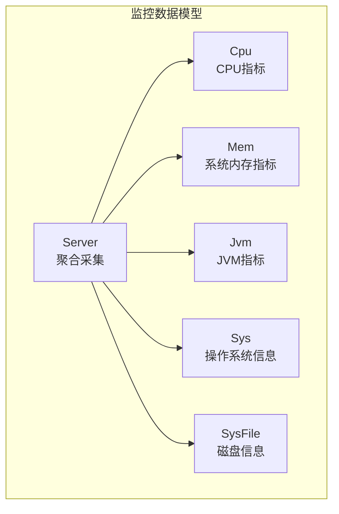
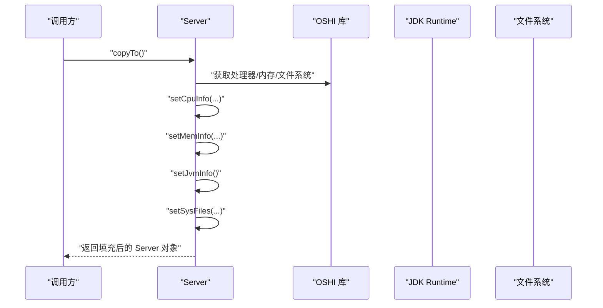
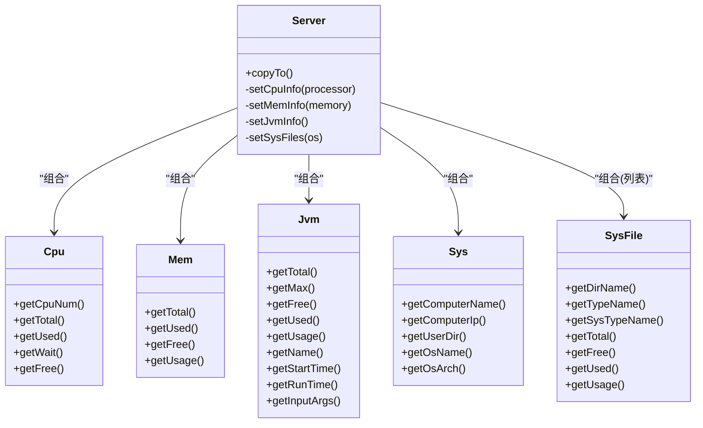

# 系统性能监控

<cite>
**本文引用的文件**   
- [Server.java](file://PezMax-Backend/ruoyi-framework/src/main/java/com/ruoyi/framework/web/domain/Server.java)
- [Cpu.java](file://PezMax-Backend/ruoyi-framework/src/main/java/com/ruoyi/framework/web/domain/server/Cpu.java)
- [Mem.java](file://PezMax-Backend/ruoyi-framework/src/main/java/com/ruoyi/framework/web/domain/server/Mem.java)
- [Jvm.java](file://PezMax-Backend/ruoyi-framework/src/main/java/com/ruoyi/framework/web/domain/server/Jvm.java)
- [Sys.java](file://PezMax-Backend/ruoyi-framework/src/main/java/com/ruoyi/framework/web/domain/server/Sys.java)
- [SysFile.java](file://PezMax-Backend/ruoyi-framework/src/main/java/com/ruoyi/framework/web/domain/server/SysFile.java)
</cite>

## 目录
1. [简介](#简介)
2. [项目结构](#项目结构)
3. [核心组件](#核心组件)
4. [架构总览](#架构总览)
5. [详细组件分析](#详细组件分析)
6. [依赖关系分析](#依赖关系分析)
7. [性能考量](#性能考量)
8. [故障排查指南](#故障排查指南)
9. [结论](#结论)
10. [附录](#附录)

## 简介
本文件面向后端服务运维与研发人员，系统化阐述本项目中的“系统性能监控”能力。内容覆盖：
- JVM 监控指标：内存使用、运行参数、启动时间等
- 服务器资源监控：CPU 使用率、系统内存占用、磁盘空间与使用率、操作系统信息
- 监控数据模型与采集流程
- 常见性能瓶颈识别思路与定位方法（结合现有实现）
- 工具链建议与最佳实践（JConsole、VisualVM、Arthas 等）

说明：
- 当前仓库已实现 CPU、系统内存、JVM 内存、磁盘空间与使用率、操作系统信息等基础监控能力；线程状态与垃圾回收统计未在本仓库中直接暴露为独立接口或模型，但可通过外部诊断工具进行观测与分析。

## 项目结构
本项目采用模块化分层组织，监控相关的数据模型集中在框架层的 web domain 子包中，由统一的聚合类负责采集并组装各子系统指标。

图表来源
- [Server.java:29-122](file://PezMax-Backend/ruoyi-framework/src/main/java/com/ruoyi/framework/web/domain/Server.java#L29-L122)
- [Cpu.java:10-101](file://PezMax-Backend/ruoyi-framework/src/main/java/com/ruoyi/framework/web/domain/server/Cpu.java#L10-L101)
- [Mem.java:10-61](file://PezMax-Backend/ruoyi-framework/src/main/java/com/ruoyi/framework/web/domain/server/Mem.java#L10-L61)
- [Jvm.java:12-130](file://PezMax-Backend/ruoyi-framework/src/main/java/com/ruoyi/framework/web/domain/server/Jvm.java#L12-L130)
- [Sys.java:8-84](file://PezMax-Backend/ruoyi-framework/src/main/java/com/ruoyi/framework/web/domain/server/Sys.java#L8-L84)
- [SysFile.java:8-114](file://PezMax-Backend/ruoyi-framework/src/main/java/com/ruoyi/framework/web/domain/server/SysFile.java#L8-L114)

章节来源
- [Server.java:29-122](file://PezMax-Backend/ruoyi-framework/src/main/java/com/ruoyi/framework/web/domain/Server.java#L29-L122)

## 核心组件
- Server：统一入口，封装对 CPU、系统内存、JVM、操作系统、磁盘的采集逻辑，提供 copyTo() 一次性填充所有指标。
- Cpu：记录 CPU 核心数、用户态/内核态/等待/空闲等时间片，计算使用率。
- Mem：记录系统总内存、已用、剩余，并提供使用率。
- Jvm：记录 JVM 总内存、最大内存、空闲内存、版本、路径、启动时间、运行时长、输入参数等。
- Sys：记录主机名、IP、OS 名称与架构、工作目录等。
- SysFile：记录每个挂载点的类型、名称、总容量、已用、剩余与使用率。

章节来源
- [Server.java:29-122](file://PezMax-Backend/ruoyi-framework/src/main/java/com/ruoyi/framework/web/domain/Server.java#L29-L122)
- [Cpu.java:10-101](file://PezMax-Backend/ruoyi-framework/src/main/java/com/ruoyi/framework/web/domain/server/Cpu.java#L10-L101)
- [Mem.java:10-61](file://PezMax-Backend/ruoyi-framework/src/main/java/com/ruoyi/framework/web/domain/server/Mem.java#L10-L61)
- [Jvm.java:12-130](file://PezMax-Backend/ruoyi-framework/src/main/java/com/ruoyi/framework/web/domain/server/Jvm.java#L12-L130)
- [Sys.java:8-84](file://PezMax-Backend/ruoyi-framework/src/main/java/com/ruoyi/framework/web/domain/server/Sys.java#L8-L84)
- [SysFile.java:8-114](file://PezMax-Backend/ruoyi-framework/src/main/java/com/ruoyi/framework/web/domain/server/SysFile.java#L8-L114)

## 架构总览
下图展示了监控数据的采集时序与对象装配过程。Server 作为协调者，依次调用 CPU、系统内存、JVM、文件系统等信息的采集方法，最终形成完整的运行时快照。

图表来源
- [Server.java:108-122](file://PezMax-Backend/ruoyi-framework/src/main/java/com/ruoyi/framework/web/domain/Server.java#L108-L122)
- [Server.java:127-148](file://PezMax-Backend/ruoyi-framework/src/main/java/com/ruoyi/framework/web/domain/Server.java#L127-L148)
- [Server.java:153-158](file://PezMax-Backend/ruoyi-framework/src/main/java/com/ruoyi/framework/web/domain/Server.java#L153-L158)
- [Server.java:176-184](file://PezMax-Backend/ruoyi-framework/src/main/java/com/ruoyi/framework/web/domain/Server.java#L176-L184)
- [Server.java:189-208](file://PezMax-Backend/ruoyi-framework/src/main/java/com/ruoyi/framework/web/domain/Server.java#L189-L208)

## 详细组件分析

### 组件：Server（聚合采集器）
职责
- 通过 OSHI 获取硬件与 OS 信息，计算 CPU 使用率、系统内存占用、磁盘空间与使用率
- 通过 JDK 运行时 API 获取 JVM 内存与运行参数
- 将结果写入对应领域对象，供上层展示或导出

关键流程
- copyTo()：创建 SystemInfo 与 HardwareAbstractionLayer，依次设置 CPU、内存、JVM、文件系统信息
- setCpuInfo()：基于两次 tick 差值计算用户态、内核态、IO 等待、空闲等时间片，汇总得到总时间并计算使用率
- setMemInfo()：从 GlobalMemory 读取总量与可用量，推导已用量
- setJvmInfo()：从 Runtime 读取 total/max/free 与系统属性 java.version/java.home
- setSysFiles()：遍历文件系统存储，计算每个挂载点的使用率与格式化大小

复杂度与性能
- CPU 采样包含一次固定时延（秒级），用于计算负载差值，属于 I/O 与系统调用密集操作
- 磁盘遍历为轻量级元数据查询，开销较小
- 整体适合周期性定时采集（如 1s~5s 间隔）

优化建议
- 可考虑缓存最近一次 CPU ticks，避免每次重复初始化 SystemInfo
- 对于高频采集场景，可将 CPU 采样周期与其他指标解耦

章节来源
- [Server.java:108-122](file://PezMax-Backend/ruoyi-framework/src/main/java/com/ruoyi/framework/web/domain/Server.java#L108-L122)
- [Server.java:127-148](file://PezMax-Backend/ruoyi-framework/src/main/java/com/ruoyi/framework/web/domain/Server.java#L127-L148)
- [Server.java:153-158](file://PezMax-Backend/ruoyi-framework/src/main/java/com/ruoyi/framework/web/domain/Server.java#L153-L158)
- [Server.java:176-184](file://PezMax-Backend/ruoyi-framework/src/main/java/com/ruoyi/framework/web/domain/Server.java#L176-L184)
- [Server.java:189-208](file://PezMax-Backend/ruoyi-framework/src/main/java/com/ruoyi/framework/web/domain/Server.java#L189-L208)

### 组件：Cpu（CPU 指标）
字段与含义
- cpuNum：逻辑处理器数量
- total/sys/used/wait/free：不同时间片累计值，getters 会转换为百分比

算法要点
- 使用两次 tick 差值计算各类时间片增量，再除以总时间得到占比
- 使用 Arith 工具进行四舍五入与精度控制

适用场景
- 观察 CPU 总体使用率、用户态/内核态分布、IO 等待占比，辅助判断是否受 IO 阻塞或上下文切换影响

章节来源
- [Cpu.java:10-101](file://PezMax-Backend/ruoyi-framework/src/main/java/com/ruoyi/framework/web/domain/server/Cpu.java#L10-L101)
- [Server.java:127-148](file://PezMax-Backend/ruoyi-framework/src/main/java/com/ruoyi/framework/web/domain/Server.java#L127-L148)

### 组件：Mem（系统内存）
字段与含义
- total/used/free：以字节为单位存储，getters 转换为 GB 显示
- usage：已用/总计的百分比

适用场景
- 评估系统整体内存压力，结合 JVM 内存使用情况区分“系统内存紧张”还是“堆外/元空间占用高”

章节来源
- [Mem.java:10-61](file://PezMax-Backend/ruoyi-framework/src/main/java/com/ruoyi/framework/web/domain/server/Mem.java#L10-L61)
- [Server.java:153-158](file://PezMax-Backend/ruoyi-framework/src/main/java/com/ruoyi/framework/web/domain/Server.java#L153-L158)

### 组件：Jvm（JVM 指标）
字段与含义
- total/max/free：JVM 堆内存相关（单位 MB）
- used/usage：已用与使用率
- version/home：JDK 版本与安装路径
- name/startTime/runTime/inputArgs：虚拟机名称、启动时间、运行时长、启动参数

数据来源
- Runtime.getRuntime() 与 ManagementFactory/RuntimeMXBean

适用场景
- 监控堆使用趋势、GC 触发前的峰值、JDK 版本一致性、启动参数是否正确生效

注意
- 当前模型未直接暴露 GC 次数、耗时、分代统计等指标，需借助外部工具观测

章节来源
- [Jvm.java:12-130](file://PezMax-Backend/ruoyi-framework/src/main/java/com/ruoyi/framework/web/domain/server/Jvm.java#L12-L130)
- [Server.java:176-184](file://PezMax-Backend/ruoyi-framework/src/main/java/com/ruoyi/framework/web/domain/Server.java#L176-L184)

### 组件：Sys（操作系统信息）
字段与含义
- computerName/computerIp：主机名与 IP
- osName/osArch：操作系统名称与架构
- userDir：应用工作目录

章节来源
- [Sys.java:8-84](file://PezMax-Backend/ruoyi-framework/src/main/java/com/ruoyi/framework/web/domain/server/Sys.java#L8-L84)
- [Server.java:163-171](file://PezMax-Backend/ruoyi-framework/src/main/java/com/ruoyi/framework/web/domain/Server.java#L163-L171)

### 组件：SysFile（磁盘信息）
字段与含义
- dirName/typeName/sysTypeName：挂载点、文件系统类型与名称
- total/free/used：格式化后的大小字符串
- usage：使用率百分比

采集逻辑
- 遍历文件系统存储，计算已用=总-可用，并格式化输出

章节来源
- [SysFile.java:8-114](file://PezMax-Backend/ruoyi-framework/src/main/java/com/ruoyi/framework/web/domain/server/SysFile.java#L8-L114)
- [Server.java:189-208](file://PezMax-Backend/ruoyi-framework/src/main/java/com/ruoyi/framework/web/domain/Server.java#L189-L208)

## 依赖关系分析
- Server 依赖 OSHI 库访问 CPU、内存、文件系统
- Server 依赖 JDK 运行时 API 获取 JVM 信息
- 各领域对象仅承载数据与简单格式化计算，耦合度低、内聚度高

图表来源
- [Server.java:29-122](file://PezMax-Backend/ruoyi-framework/src/main/java/com/ruoyi/framework/web/domain/Server.java#L29-L122)
- [Cpu.java:10-101](file://PezMax-Backend/ruoyi-framework/src/main/java/com/ruoyi/framework/web/domain/server/Cpu.java#L10-L101)
- [Mem.java:10-61](file://PezMax-Backend/ruoyi-framework/src/main/java/com/ruoyi/framework/web/domain/server/Mem.java#L10-L61)
- [Jvm.java:12-130](file://PezMax-Backend/ruoyi-framework/src/main/java/com/ruoyi/framework/web/domain/server/Jvm.java#L12-L130)
- [Sys.java:8-84](file://PezMax-Backend/ruoyi-framework/src/main/java/com/ruoyi/framework/web/domain/server/Sys.java#L8-L84)
- [SysFile.java:8-114](file://PezMax-Backend/ruoyi-framework/src/main/java/com/ruoyi/framework/web/domain/server/SysFile.java#L8-L114)

章节来源
- [Server.java:29-122](file://PezMax-Backend/ruoyi-framework/src/main/java/com/ruoyi/framework/web/domain/Server.java#L29-L122)

## 性能考量
- CPU 采样延迟：CPU 使用率计算需要两次 tick 采样并等待固定时长，频繁采集会增加系统调用开销。建议根据业务需求调整采集频率。
- 磁盘遍历：文件系统遍历开销较低，但在大量挂载点或网络盘环境下仍需关注。
- 数值精度：使用统一算术工具进行四舍五入与除法运算，避免浮点误差累积。
- 扩展性：如需增加线程、GC、类加载等指标，可在 Server 中新增采集方法并扩展对应领域对象。

[本节为通用指导，不直接分析具体文件]

## 故障排查指南
- 热点代码定位
  - 使用 Arthas 的 profiler 或 trace 命令定位慢方法与调用链
  - 结合 CPU 使用率与 wait 占比判断是否为 IO 或锁竞争导致
- 内存泄漏检测
  - 观察 Jvm.used/Jvm.usage 持续上升且无法回落，配合 VisualVM 或 jmap 生成堆快照分析
  - 关注大对象、集合持续增长、静态引用持有长生命周期对象
- 线程死锁排查
  - 使用 jstack 抓取线程栈，或使用 Arthas 的 thread --deadlock 查看死锁
  - 结合 CPU 使用率与 wait 占比判断是否存在长时间锁等待
- 磁盘 IO 问题
  - 关注 Cpu.wait 升高与磁盘使用率接近阈值，检查日志与备份任务
- 系统内存不足
  - 对比 Mem.used 与 Jvm.used，若系统内存紧张而堆使用不高，可能为堆外内存或本地缓存占用过高

[本节为通用指导，不直接分析具体文件]

## 结论
本项目已具备完善的系统级与 JVM 基础监控能力，涵盖 CPU、系统内存、JVM 内存、磁盘空间与使用率、操作系统信息等关键指标。通过 Server 聚合采集与各领域对象的清晰分工，便于后续扩展更多高级指标（如线程、GC、类加载等）。在生产环境中，建议结合外部诊断工具（JConsole、VisualVM、Arthas）进行深度分析与问题定位，并建立合理的采集频率与告警策略。

[本节为总结性内容，不直接分析具体文件]

## 附录
- 常用指标解读
  - CPU.used：用户态使用率，反映应用计算压力
  - CPU.sys：内核态使用率，反映系统调用与调度开销
  - CPU.wait：IO 等待占比，偏高通常意味着磁盘或网络 IO 成为瓶颈
  - Mem.used：系统内存使用，结合 JVM.used 可区分堆内外压力
  - Jvm.usage：堆使用率，接近上限时需关注 GC 行为与对象分配速率
  - SysFile.usage：磁盘使用率，接近阈值需清理或扩容
- 工具使用建议
  - JConsole：连接本地或远程 JVM，观察内存、线程、类加载、MBean
  - VisualVM：堆/线程快照、CPU 火焰图、GC 统计
  - Arthas：在线诊断，支持热更新、方法追踪、线程与锁分析

[本节为通用指导，不直接分析具体文件]