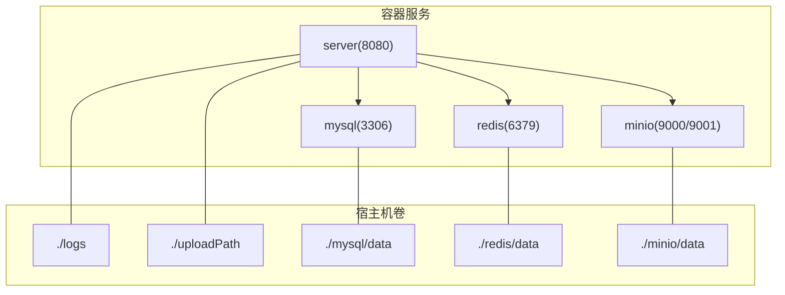
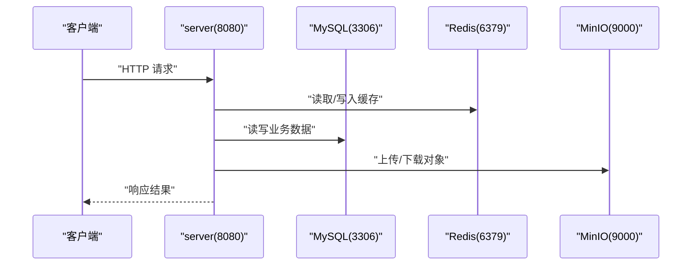
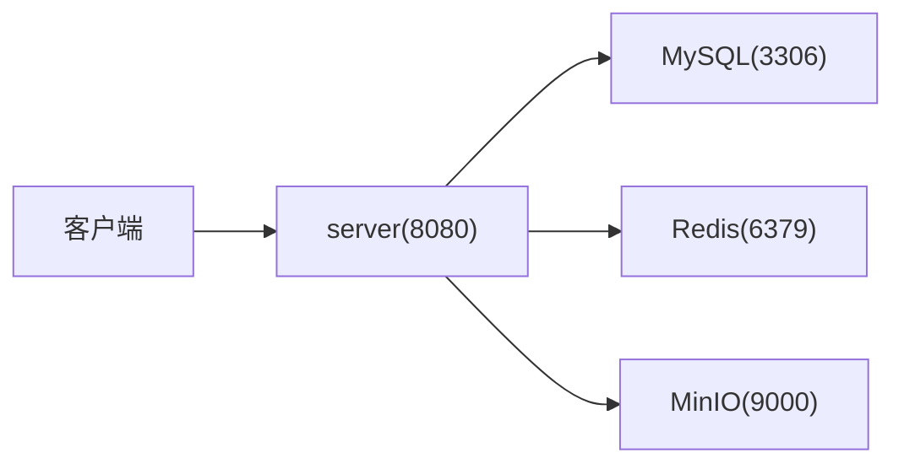

# 部署运维

<cite>
**本文引用的文件**   
- [README.md](file://PezMax-Backend/README.md)
- [compose.yaml](file://PezMax-Backend/compose.yaml)
- [Dockerfile](file://PezMax-Backend/Dockerfile)
- [application.yml](file://PezMax-Backend/ruoyi-admin/src/main/resources/application.yml)
- [application-druid.yml](file://PezMax-Backend/ruoyi-admin/src/main/resources/application-druid.yml)
- [logback.xml](file://PezMax-Backend/ruoyi-admin/src/main/resources/logback.xml)
- [pezmax.sql](file://PezMax-Backend/sql/pezmax.sql)
</cite>

## 目录
1. [简介](#简介)
2. [项目结构](#项目结构)
3. [核心组件](#核心组件)
4. [架构总览](#架构总览)
5. [详细组件分析](#详细组件分析)
6. [依赖关系分析](#依赖关系分析)
7. [性能考虑](#性能考虑)
8. [故障排查指南](#故障排查指南)
9. [结论](#结论)
10. [附录](#附录)

## 简介
本指南面向生产环境，提供 PezMax 后端服务的完整部署与运维方案。内容覆盖：
- Docker Compose 容器化部署（推荐）
- 单机部署（本地开发/测试）
- 集群部署建议（多实例、外部化配置、持久化与高可用）
- 环境配置管理（数据库、Redis、MinIO、对象存储策略等）
- 日志收集、监控告警、性能调优最佳实践
- 健康检查、备份恢复操作手册
- 安全加固建议（SSL、防火墙、最小权限）
- 自动化部署脚本与 CI/CD 流水线示例

## 项目结构
后端采用模块化 Spring Boot 工程，关键目录与职责如下：
- ptmj-datum：核心业务模块（书签、文件、用户等）
- ruoyi-admin：Web 入口与控制器
- ruoyi-common：公共工具与通用组件
- ruoyi-framework：框架配置与安全拦截（Spring Security）
- ruoyi-generator：代码生成工具
- ruoyi-quartz：定时任务
- ruoyi-system：系统基础管理（用户、角色、菜单、字典）
- compose.yaml：Docker Compose 编排定义
- Dockerfile：镜像构建与运行配置
- application.yml / application-druid.yml：应用与环境相关配置
- logback.xml：日志输出与滚动策略
- sql/pezmax.sql：数据库初始化脚本

图示来源
- [compose.yaml:1-84](file://PezMax-Backend/compose.yaml#L1-L84)
- [Dockerfile:80-114](file://PezMax-Backend/Dockerfile#L80-L114)

章节来源
- [README.md:76-89](file://PezMax-Backend/README.md#L76-L89)

## 核心组件
- 应用服务（server）
  - 端口：8080
  - 环境变量：SPRING_PROFILES_ACTIVE、DB_HOST、REDIS_HOST、UPLOAD_PATH、JAVA_OPTS
  - 依赖启动顺序：MySQL、Redis、MinIO 健康检查通过后启动
  - 数据卷：/home/ruoyi/logs、/home/ruoyi/uploadPath
- 数据库（MySQL 8.0）
  - 端口：3306（仅调试暴露）
  - 初始化：自动执行 docker-entrypoint-initdb.d 下的 SQL 脚本
  - 数据卷：./mysql/data
- 缓存（Redis）
  - 端口：6379（仅调试暴露）
  - 数据卷：./redis/data
- 对象存储（MinIO）
  - API 端口：9000；控制台端口：9001
  - 默认凭据：minioadmin/minioadmin
  - 数据卷：./minio/data

章节来源
- [compose.yaml:1-84](file://PezMax-Backend/compose.yaml#L1-L84)
- [application.yml:149-155](file://PezMax-Backend/ruoyi-admin/src/main/resources/application.yml#L149-L155)
- [application-druid.yml:1-62](file://PezMax-Backend/ruoyi-admin/src/main/resources/application-druid.yml#L1-L62)

## 架构总览
整体为“单进程微服务 + 外部依赖”的轻量架构，适合中小规模生产场景。通过 Docker Compose 将应用与 MySQL、Redis、MinIO 编排在一起，实现一键拉起与可观测性（日志、健康检查）。

图示来源
- [compose.yaml:55-79](file://PezMax-Backend/compose.yaml#L55-L79)
- [application.yml:72-93](file://PezMax-Backend/ruoyi-admin/src/main/resources/application.yml#L72-L93)
- [application.yml:149-155](file://PezMax-Backend/ruoyi-admin/src/main/resources/application.yml#L149-L155)

## 详细组件分析

### 容器化部署（Docker Compose）
- 一键启动
  - 使用 compose.yaml 启动所有服务，包含健康检查与依赖顺序控制
- 端口说明
  - server: 8080（必须对外）
  - minio: 9000（API）、9001（控制台）
  - mysql: 3306（仅调试）
  - redis: 6379（仅调试）
- 数据持久化
  - MySQL、Redis、MinIO 均映射到宿主机目录，避免容器重建导致数据丢失
- 日志与上传路径
  - 应用日志与上传文件通过卷挂载至宿主机，便于采集与归档

章节来源
- [compose.yaml:1-84](file://PezMax-Backend/compose.yaml#L1-L84)
- [README.md:47-68](file://PezMax-Backend/README.md#L47-L68)

### 镜像构建与运行（Dockerfile）
- 多阶段构建
  - 依赖解析 -> 打包 -> 分层提取 -> 运行镜像
- 运行时依赖
  - 安装 LibreOffice 与中文字体，支持文档预览与转换
- 非特权用户
  - 以 appuser 运行，降低安全风险
- 工作目录与端口
  - 工作目录 /home/ruoyi，暴露 8080

章节来源
- [Dockerfile:1-114](file://PezMax-Backend/Dockerfile#L1-L114)

### 单机部署（本地开发/测试）
- 环境要求
  - JDK 17、Maven 3.6+、MySQL 8.0、Redis
- 数据库初始化
  - 执行 sql/pezmax.sql 完成表结构与初始数据
- 修改连接配置
  - 编辑 application-druid.yml 中的数据库连接参数
- 启动方式
  - 直接运行主类或打包后 java -jar 启动

章节来源
- [README.md:69-74](file://PezMax-Backend/README.md#L69-L74)
- [application-druid.yml:1-62](file://PezMax-Backend/ruoyi-admin/src/main/resources/application-druid.yml#L1-L62)
- [pezmax.sql:1-799](file://PezMax-Backend/sql/pezmax.sql#L1-L799)

### 集群部署建议
- 应用多实例
  - 通过容器编排平台（Kubernetes/Docker Swarm）部署多个 server 实例，共享外部依赖
- 外部化配置
  - 使用环境变量或配置中心注入 DB_HOST、REDIS_HOST、MINIO_URL 等
- 持久化与高可用
  - MySQL 使用主从或托管云数据库；Redis 使用哨兵或集群模式；MinIO 使用分布式桶
- 负载均衡
  - 在网关层对 8080 进行反向代理与健康检查

[本节为概念性指导，不直接分析具体文件]

### 环境配置管理
- 数据库（Druid）
  - 主库 URL、用户名、密码、连接池大小、慢 SQL 记录等
- Redis
  - 地址、端口、数据库索引、密码、连接池参数
- MinIO
  - 服务地址、访问密钥、桶名
- 其他
  - 文件上传路径、Tomcat 线程数、XSS 过滤开关、Referer 白名单、Swagger 开关等

章节来源
- [application-druid.yml:1-62](file://PezMax-Backend/ruoyi-admin/src/main/resources/application-druid.yml#L1-L62)
- [application.yml:17-33](file://PezMax-Backend/ruoyi-admin/src/main/resources/application.yml#L17-L33)
- [application.yml:72-93](file://PezMax-Backend/ruoyi-admin/src/main/resources/application.yml#L72-L93)
- [application.yml:149-155](file://PezMax-Backend/ruoyi-admin/src/main/resources/application.yml#L149-L155)
- [application.yml:133-148](file://PezMax-Backend/ruoyi-admin/src/main/resources/application.yml#L133-L148)

### 日志收集与滚动策略
- 日志级别
  - com.ruoyi: info；org.springframework: warn
- 输出目标
  - 控制台、系统信息日志、错误日志、用户操作日志
- 滚动策略
  - 按天滚动，保留最近 60 天
- 日志路径
  - /home/ruoyi/logs（容器内），可通过卷挂载到宿主机

章节来源
- [logback.xml:1-99](file://PezMax-Backend/ruoyi-admin/src/main/resources/logback.xml#L1-L99)
- [compose.yaml:76-78](file://PezMax-Backend/compose.yaml#L76-L78)

### 健康检查与就绪探针
- MySQL
  - 使用 mysqladmin ping 探测
- Redis
  - 使用 redis-cli ping 探测
- MinIO
  - 使用 HTTP 健康端点探测
- 应用服务
  - 依赖上述服务健康后再启动

章节来源
- [compose.yaml:15-20](file://PezMax-Backend/compose.yaml#L15-L20)
- [compose.yaml:30-34](file://PezMax-Backend/compose.yaml#L30-L34)
- [compose.yaml:49-53](file://PezMax-Backend/compose.yaml#L49-L53)
- [compose.yaml:69-75](file://PezMax-Backend/compose.yaml#L69-L75)

### 备份与恢复
- MySQL
  - 定期 mysqldump 导出 ptmj-platform 库，或使用云数据库快照
- Redis
  - 启用 AOF/RDB 持久化，定期拷贝数据目录
- MinIO
  - 定期同步 ./minio/data 到异地存储（如对象存储生命周期策略）
- 应用日志与上传文件
  - 通过卷挂载到宿主机，纳入统一备份策略

章节来源
- [compose.yaml:12-14](file://PezMax-Backend/compose.yaml#L12-L14)
- [compose.yaml:28-29](file://PezMax-Backend/compose.yaml#L28-L29)
- [compose.yaml:46-47](file://PezMax-Backend/compose.yaml#L46-L47)
- [compose.yaml:76-78](file://PezMax-Backend/compose.yaml#L76-L78)

### 安全加固建议
- 网络与端口
  - 仅对外暴露 8080；MySQL/Redis/MinIO 控制台端口仅在调试时暴露
- 身份认证
  - 修改 MinIO 默认凭据；为数据库设置强密码；限制 Drud 控制台访问白名单
- 传输加密
  - 在网关层配置 SSL 终止（Nginx/Traefik），后端保持 HTTP
- 最小权限
  - 容器以非特权用户运行；文件系统只读挂载（除日志与上传目录）
- 输入校验
  - 开启 XSS 过滤与 Referer 防盗链（按需）

章节来源
- [compose.yaml:10-11](file://PezMax-Backend/compose.yaml#L10-L11)
- [compose.yaml:26-27](file://PezMax-Backend/compose.yaml#L26-L27)
- [compose.yaml:43-45](file://PezMax-Backend/compose.yaml#L43-L45)
- [application-druid.yml:43-52](file://PezMax-Backend/ruoyi-admin/src/main/resources/application-druid.yml#L43-L52)
- [application.yml:133-148](file://PezMax-Backend/ruoyi-admin/src/main/resources/application.yml#L133-L148)
- [Dockerfile:89-98](file://PezMax-Backend/Dockerfile#L89-L98)

### 自动化部署脚本与 CI/CD 示例
- 本地脚本
  - 使用 compose.yaml 一键拉起/停止服务，查看状态与日志
- CI/CD 流水线建议
  - 触发条件：push/PR
  - 步骤：拉取代码 -> 构建镜像（Dockerfile）-> 推送镜像仓库 -> 更新 compose 或 K8s 配置 -> 滚动重启
  - 质量门禁：单元测试、静态扫描、镜像漏洞扫描
  - 发布策略：蓝绿/金丝雀（结合编排平台）

[本节为概念性指导，不直接分析具体文件]

## 依赖关系分析
- 应用服务依赖
  - MySQL：业务数据存储
  - Redis：缓存与会话
  - MinIO：对象存储（文件、图片、文档）
- 数据流
  - 上传流程：客户端 -> server -> MinIO；元数据落库
  - 下载流程：客户端 -> server -> MinIO
  - 鉴权与缓存：登录态、权限、字典等缓存于 Redis

图示来源
- [compose.yaml:55-79](file://PezMax-Backend/compose.yaml#L55-L79)
- [application.yml:72-93](file://PezMax-Backend/ruoyi-admin/src/main/resources/application.yml#L72-L93)
- [application.yml:149-155](file://PezMax-Backend/ruoyi-admin/src/main/resources/application.yml#L149-L155)

章节来源
- [compose.yaml:1-84](file://PezMax-Backend/compose.yaml#L1-L84)

## 性能考虑
- JVM 与线程
  - 通过 JAVA_OPTS 调整堆大小；根据 CPU 核数与 QPS 调整 Tomcat 最大线程数
- 数据库连接池
  - 合理设置 initialSize、minIdle、maxActive、maxWait，避免连接耗尽
- 缓存命中率
  - 热点数据优先走 Redis，减少数据库压力
- 对象存储
  - 大文件分片上传与断点续传；CDN 加速静态资源
- 日志与 I/O
  - 生产环境关闭 debug 日志；合理设置日志滚动策略，避免磁盘写放大

[本节为通用优化建议，不直接分析具体文件]

## 故障排查指南
- 启动失败
  - 检查依赖服务健康状态与端口占用
  - 查看 server 日志：/home/ruoyi/logs/sys-info.log、sys-error.log
- 数据库连接异常
  - 核对 application-druid.yml 的连接参数与时区设置
  - 确认 MySQL 已初始化并存在 ptmj-platform 库
- Redis 连接异常
  - 核对 application.yml 中 Redis 地址、端口、密码
- MinIO 上传失败
  - 检查 MinIO 凭据与桶策略；确认 API 端口可达
- 文档预览异常
  - 确认镜像已安装 LibreOffice 与中文字体；office-home 路径正确

章节来源
- [compose.yaml:69-75](file://PezMax-Backend/compose.yaml#L69-L75)
- [logback.xml:1-99](file://PezMax-Backend/ruoyi-admin/src/main/resources/logback.xml#L1-L99)
- [application-druid.yml:1-62](file://PezMax-Backend/ruoyi-admin/src/main/resources/application-druid.yml#L1-L62)
- [application.yml:72-93](file://PezMax-Backend/ruoyi-admin/src/main/resources/application.yml#L72-L93)
- [application.yml:149-155](file://PezMax-Backend/ruoyi-admin/src/main/resources/application.yml#L149-L155)
- [Dockerfile:82-87](file://PezMax-Backend/Dockerfile#L82-L87)

## 结论
本项目提供了开箱即用的容器化部署能力与完善的配置项，适合快速上线与迭代。在生产环境中，建议结合外部化配置、负载均衡、监控告警与备份恢复策略，形成稳定可靠的运维体系。

[本节为总结性内容，不直接分析具体文件]

## 附录

### 常用命令参考
- 启动/停止/查看状态/日志
  - 使用 compose 命令管理服务生命周期与日志
- 进入容器调试
  - 使用 exec 进入 server 容器，检查配置与日志

章节来源
- [README.md:47-68](file://PezMax-Backend/README.md#L47-L68)