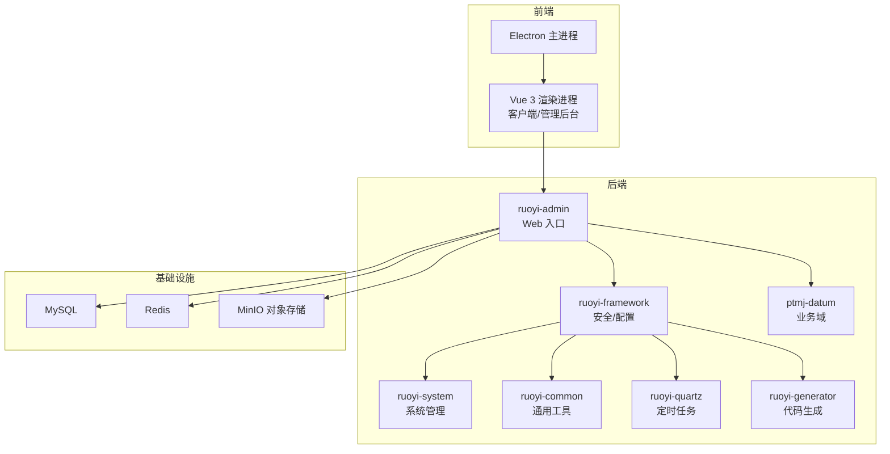
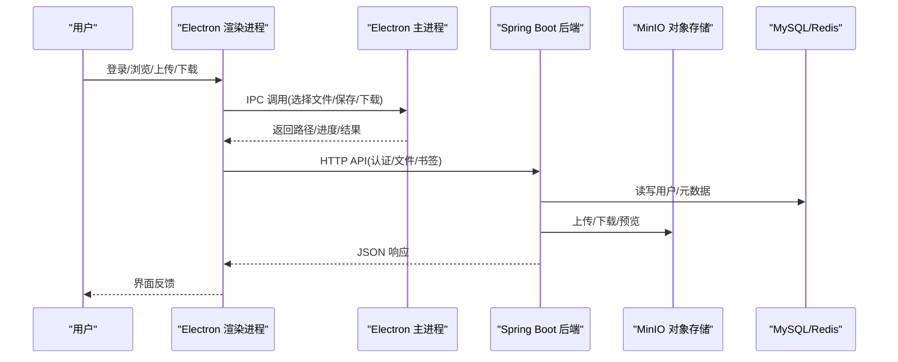
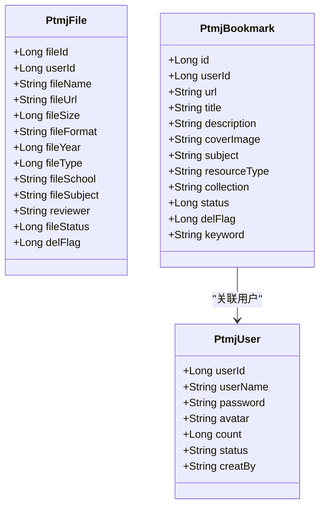
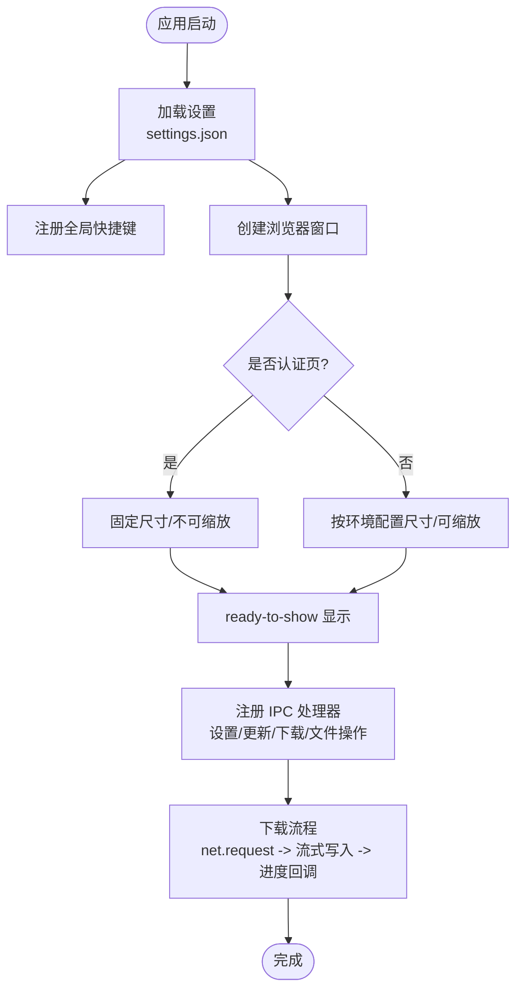
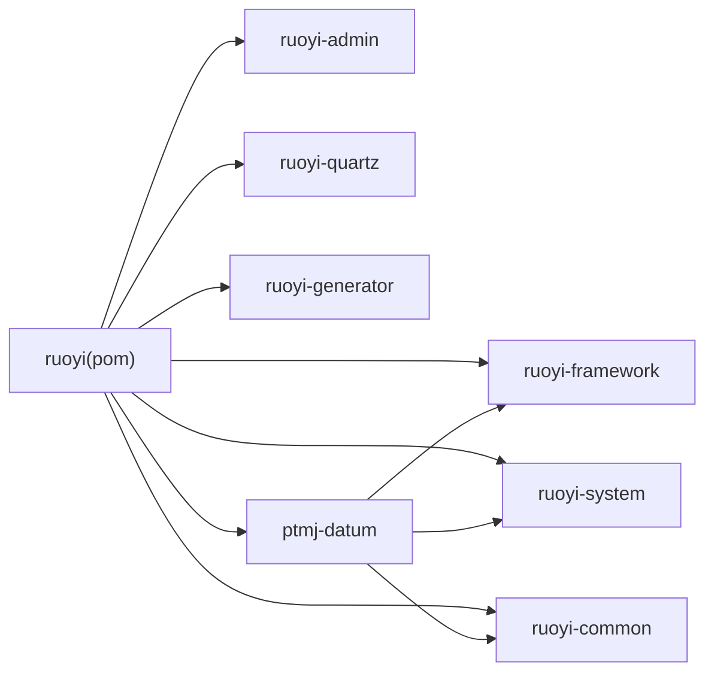

# 项目概述

<cite>
**本文引用的文件列表**
- [PezMax-Backend/README.md](file://PezMax-Backend/README.md)
- [PezMax-Desktop/README.md](file://PezMax-Desktop/README.md)
- [PezMax-Backend/pom.xml](file://PezMax-Backend/pom.xml)
- [PezMax-Backend/ptmj-datum/pom.xml](file://PezMax-Backend/ptmj-datum/pom.xml)
- [PezMax-Backend/ruoyi-admin/src/main/java/com/ruoyi/RuoYiApplication.java](file://PezMax-Backend/ruoyi-admin/src/main/java/com/ruoyi/RuoYiApplication.java)
- [PezMax-Backend/ptmj-datum/src/main/java/com/ptmj/datum/domain/PtmjUser.java](file://PezMax-Backend/ptmj-datum/src/main/java/com/ptmj/datum/domain/PtmjUser.java)
- [PezMax-Backend/ptmj-datum/src/main/java/com/ptmj/datum/domain/PtmjFile.java](file://PezMax-Backend/ptmj-datum/src/main/java/com/ptmj/datum/domain/PtmjFile.java)
- [PezMax-Backend/ptmj-datum/src/main/java/com/ptmj/datum/domain/PtmjBookmark.java](file://PezMax-Backend/ptmj-datum/src/main/java/com/ptmj/datum/domain/PtmjBookmark.java)
- [PezMax-Desktop/src/main/index.js](file://PezMax-Desktop/src/main/index.js)
- [PezMax-Desktop/package.json](file://PezMax-Desktop/package.json)
</cite>

## 目录
1. [简介](#简介)
2. [项目结构](#项目结构)
3. [核心组件](#核心组件)
4. [架构总览](#架构总览)
5. [详细组件分析](#详细组件分析)
6. [依赖关系分析](#依赖关系分析)
7. [性能与可扩展性](#性能与可扩展性)
8. [快速开始](#快速开始)
9. [故障排查指南](#故障排查指南)
10. [结论](#结论)

## 简介
PezMax-One 是一个面向教育资料管理的全栈项目，包含后端 Spring Boot 服务、桌面应用（Electron + Vue 3）以及 Web 管理后台。项目聚焦于学习资料的高效组织与共享，提供文件上传下载、用户认证与权限控制、书签管理等核心能力，并通过 MinIO 对象存储支撑海量资源。整体采用“后端微模块化 + 前端多端复用”的架构思路，兼顾开发效率与运行稳定性。

## 项目结构
仓库采用前后端分离的多模块工程：
- 后端（PezMax-Backend）
  - ptmj-datum：业务领域模块（用户、文件、书签等）
  - ruoyi-admin：Web 入口与控制器
  - ruoyi-common：通用工具与常量
  - ruoyi-framework：框架配置与安全拦截
  - ruoyi-system：系统基础管理（用户、角色、菜单、字典等）
  - ruoyi-quartz：定时任务
  - ruoyi-generator：代码生成器
- 桌面端（PezMax-Desktop）
  - Electron 主进程负责窗口管理、IPC、自动更新、本地下载记录等
  - Vue 3 渲染进程承载 UI，支持客户端与管理后台两种模式切换

图表来源
- [PezMax-Backend/README.md:76-89](file://PezMax-Backend/README.md#L76-L89)
- [PezMax-Desktop/README.md:80-94](file://PezMax-Desktop/README.md#L80-L94)

章节来源
- [PezMax-Backend/README.md:76-89](file://PezMax-Backend/README.md#L76-L89)
- [PezMax-Desktop/README.md:80-94](file://PezMax-Desktop/README.md#L80-L94)

## 核心组件
- 后端核心
  - 启动入口：RuoYiApplication，扫描 com.ruoyi 与 com.ptmj 包，排除数据源自动配置以适配动态数据源。
  - 业务域：ptmj-datum 提供用户、文件、书签等实体与服务。
  - 安全与权限：基于 Spring Security + JWT + Redis 实现无状态鉴权与缓存。
  - 对象存储：集成 MinIO，支持大文件与直链访问。
- 桌面端核心
  - 主进程：窗口生命周期、全局快捷键、设置持久化、自动更新、本地下载记录（SQLite）、IPC 桥接。
  - 渲染进程：Vue 3 + Element Plus，支持客户端与管理后台双模式，路由与权限由环境变量驱动。

章节来源
- [PezMax-Backend/ruoyi-admin/src/main/java/com/ruoyi/RuoYiApplication.java:13-20](file://PezMax-Backend/ruoyi-admin/src/main/java/com/ruoyi/RuoYiApplication.java#L13-L20)
- [PezMax-Backend/ptmj-datum/pom.xml:19-49](file://PezMax-Backend/ptmj-datum/pom.xml#L19-L49)
- [PezMax-Desktop/src/main/index.js:11-90](file://PezMax-Desktop/src/main/index.js#L11-L90)
- [PezMax-Desktop/package.json:8-26](file://PezMax-Desktop/package.json#L8-L26)

## 架构总览
后端采用分层与模块化设计：Controller → Service → Mapper → DB；通过框架层统一处理鉴权、日志、限流、异常等横切关注点。桌面端通过 IPC 暴露系统能力（文件系统、网络、窗口），渲染进程专注 UI 与业务交互。

图表来源
- [PezMax-Desktop/src/main/index.js:292-305](file://PezMax-Desktop/src/main/index.js#L292-L305)
- [PezMax-Backend/README.md:13-22](file://PezMax-Backend/README.md#L13-L22)

## 详细组件分析

### 后端领域模型与业务边界
- PtmjUser：平台用户，含账号、头像、上传计数、状态等字段，密码仅写入不输出。
- PtmjFile：文件元数据，含名称、URL、大小、格式、年份、类型、学校、科目、审核状态等。
- PtmjBookmark：外部书签，含链接、标题、描述、封面、学科、资源类型、专栏、状态等。

图表来源
- [PezMax-Backend/ptmj-datum/src/main/java/com/ptmj/datum/domain/PtmjUser.java:17-138](file://PezMax-Backend/ptmj-datum/src/main/java/com/ptmj/datum/domain/PtmjUser.java#L17-L138)
- [PezMax-Backend/ptmj-datum/src/main/java/com/ptmj/datum/domain/PtmjFile.java:16-224](file://PezMax-Backend/ptmj-datum/src/main/java/com/ptmj/datum/domain/PtmjFile.java#L16-L224)
- [PezMax-Backend/ptmj-datum/src/main/java/com/ptmj/datum/domain/PtmjBookmark.java:13-218](file://PezMax-Backend/ptmj-datum/src/main/java/com/ptmj/datum/domain/PtmjBookmark.java#L13-L218)

章节来源
- [PezMax-Backend/ptmj-datum/src/main/java/com/ptmj/datum/domain/PtmjUser.java:17-138](file://PezMax-Backend/ptmj-datum/src/main/java/com/ptmj/datum/domain/PtmjUser.java#L17-L138)
- [PezMax-Backend/ptmj-datum/src/main/java/com/ptmj/datum/domain/PtmjFile.java:16-224](file://PezMax-Backend/ptmj-datum/src/main/java/com/ptmj/datum/domain/PtmjFile.java#L16-L224)
- [PezMax-Backend/ptmj-datum/src/main/java/com/ptmj/datum/domain/PtmjBookmark.java:13-218](file://PezMax-Backend/ptmj-datum/src/main/java/com/ptmj/datum/domain/PtmjBookmark.java#L13-L218)

### 桌面端主进程关键流程
- 设置与开机自启：加载/保存 settings.json，注册全局快捷键，同步更新源配置。
- 窗口模式：根据环境变量在客户端/管理后台之间切换窗口尺寸与可缩放策略。
- 下载与保存：支持静默下载与对话框选择，使用 net 模块直写磁盘并上报进度。
- 本地下载记录：SQLite 增删查与批量刷盘，避免频繁 IO。

图表来源
- [PezMax-Desktop/src/main/index.js:11-90](file://PezMax-Desktop/src/main/index.js#L11-L90)
- [PezMax-Desktop/src/main/index.js:154-213](file://PezMax-Desktop/src/main/index.js#L154-L213)
- [PezMax-Desktop/src/main/index.js:292-305](file://PezMax-Desktop/src/main/index.js#L292-L305)
- [PezMax-Desktop/src/main/index.js:527-608](file://PezMax-Desktop/src/main/index.js#L527-L608)

章节来源
- [PezMax-Desktop/src/main/index.js:11-90](file://PezMax-Desktop/src/main/index.js#L11-L90)
- [PezMax-Desktop/src/main/index.js:154-213](file://PezMax-Desktop/src/main/index.js#L154-L213)
- [PezMax-Desktop/src/main/index.js:292-305](file://PezMax-Desktop/src/main/index.js#L292-L305)
- [PezMax-Desktop/src/main/index.js:527-608](file://PezMax-Desktop/src/main/index.js#L527-L608)

### 技术栈概览与选型理由
- Java 17 + Spring Boot 4.0.3：长期支持版本，生态成熟，结合 RuoYi 脚手架提升开发效率。
- Spring Security + JWT + Redis：无状态鉴权与高性能缓存，适合分布式与跨端场景。
- MyBatis + Druid：灵活 SQL 控制与连接池监控，便于性能调优。
- MySQL 8.0 + Redis：稳定关系型存储与高速缓存/队列。
- MinIO：兼容 S3 的对象存储，适合海量教育资源与直链访问。
- LibreOffice：文档转换与在线预览能力。
- Docker Compose：一键拉起数据库、缓存、对象存储与应用，降低部署复杂度。
- Electron + Vue 3 + Vite：桌面端现代化构建与运行时，配合 Element Plus 打造高颜值 UI。

章节来源
- [PezMax-Backend/README.md:31-44](file://PezMax-Backend/README.md#L31-L44)
- [PezMax-Backend/pom.xml:15-35](file://PezMax-Backend/pom.xml#L15-L35)
- [PezMax-Desktop/README.md:42-54](file://PezMax-Desktop/README.md#L42-L54)

## 依赖关系分析
后端为多模块 Maven 工程，顶层 pom 统一管理版本与依赖，子模块按需引入。

图表来源
- [PezMax-Backend/pom.xml:177-185](file://PezMax-Backend/pom.xml#L177-L185)
- [PezMax-Backend/ptmj-datum/pom.xml:23-49](file://PezMax-Backend/ptmj-datum/pom.xml#L23-L49)

章节来源
- [PezMax-Backend/pom.xml:177-185](file://PezMax-Backend/pom.xml#L177-L185)
- [PezMax-Backend/ptmj-datum/pom.xml:23-49](file://PezMax-Backend/ptmj-datum/pom.xml#L23-L49)

## 性能与可扩展性
- 对象存储直链：MinIO 直链减少后端转发压力，适合大文件分发。
- 缓存与限流：Redis 作为热点数据与令牌缓存，配合限流注解保护接口。
- 流式下载：桌面端使用 net 模块流式写入磁盘，避免内存峰值。
- 异步与批处理：下载记录批量写入与刷盘，降低磁盘 IO 次数。
- 容器化编排：Docker Compose 一键部署，便于横向扩展与灰度发布。

[本节为通用建议，无需源码引用]

## 快速开始

### 后端（推荐 Docker Compose）
- 启动所有服务（MySQL、Redis、MinIO、Server）
- 查看运行状态与后端日志
- 端口说明：后端 API 8080、MinIO API 9000、MinIO Console 9001、MySQL 3306、Redis 6379

章节来源
- [PezMax-Backend/README.md:47-67](file://PezMax-Backend/README.md#L47-L67)

### 后端（本地开发）
- 环境要求：JDK 17、Maven 3.6+、MySQL 8.0、Redis
- 初始化数据库：执行 sql/pezmax.sql
- 修改数据库连接：ruoyi-admin/src/main/resources/application-druid.yml
- 启动服务：运行 com.ruoyi.RuoYiApplication

章节来源
- [PezMax-Backend/README.md:69-74](file://PezMax-Backend/README.md#L69-L74)
- [PezMax-Backend/ruoyi-admin/src/main/java/com/ruoyi/RuoYiApplication.java:17-20](file://PezMax-Backend/ruoyi-admin/src/main/java/com/ruoyi/RuoYiApplication.java#L17-L20)

### 桌面端（Electron + Vue 3）
- 安装依赖：npm install
- 启动开发服务器：npm run dev
- 打包构建：npm run build:win / npm run build:mac / npm run build:linux

章节来源
- [PezMax-Desktop/README.md:56-76](file://PezMax-Desktop/README.md#L56-L76)
- [PezMax-Desktop/package.json:8-26](file://PezMax-Desktop/package.json#L8-L26)

## 故障排查指南
- 匿名访问限制：部分查询接口已开放匿名访问，若出现 401/403，检查接口是否标注匿名或是否需要携带 Token。
- 文件存储：确保 MinIO 容器正常且桶策略允许公开读；若无法预览，检查 URL 替换逻辑与网络可达性。
- 构建问题：Docker 构建前需执行 mvn clean package 保证依赖最新。
- 桌面端下载失败：确认静默下载开关与默认下载路径；检查 net 请求头（如 Authorization）是否正确传递。
- 窗口模式异常：认证页与主页面的窗口尺寸/可缩放策略不同，检查环境变量与 IPC 模式切换。

章节来源
- [PezMax-Backend/README.md:91-95](file://PezMax-Backend/README.md#L91-L95)
- [PezMax-Desktop/src/main/index.js:527-608](file://PezMax-Desktop/src/main/index.js#L527-L608)
- [PezMax-Desktop/src/main/index.js:154-213](file://PezMax-Desktop/src/main/index.js#L154-L213)

## 结论
PezMax-One 以成熟的 RuoYi 底座为基础，结合现代前端与桌面端技术，构建了覆盖“资料上传—管理—分享—消费”的完整闭环。后端强调安全与可扩展，桌面端注重体验与性能，二者通过清晰的 API 与 IPC 契约协同工作，适合在教育资料管理与协作场景中落地。