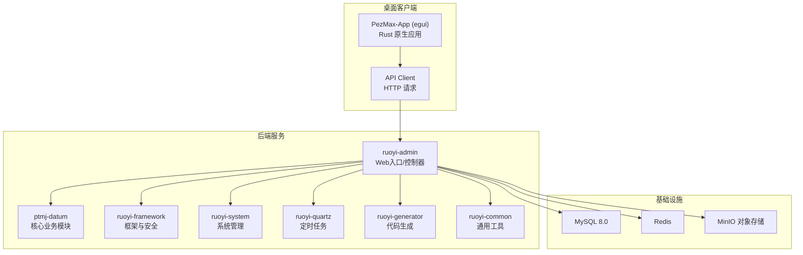
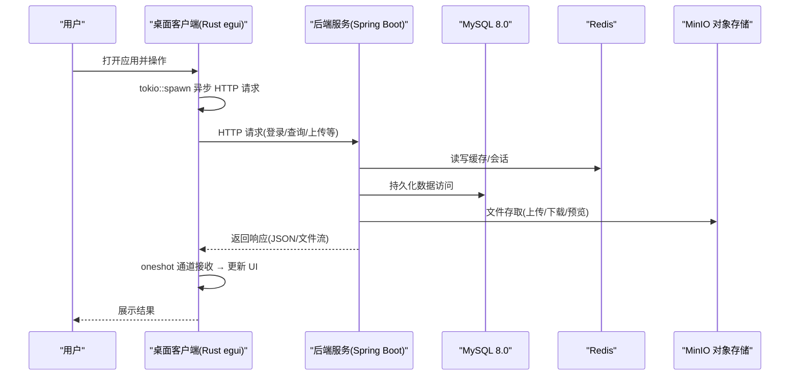
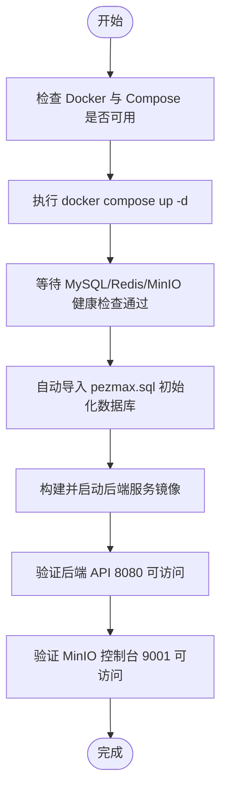
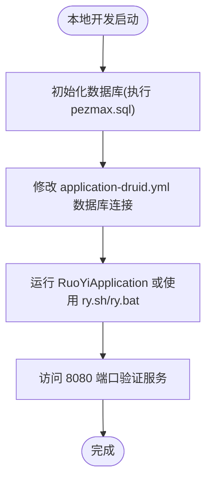
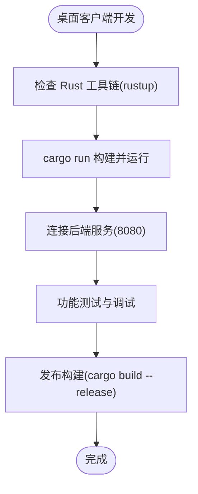
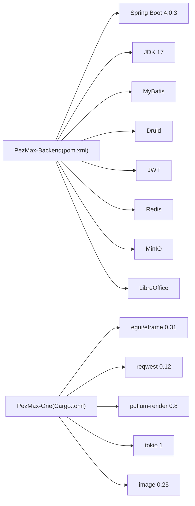

# 快速开始

<cite>
**本文引用的文件**   
- [PezMax-Backend/README.md](file://PezMax-Backend/README.md)
- [PezMax-Backend/pom.xml](file://PezMax-Backend/pom.xml)
- [PezMax-Backend/compose.yaml](file://PezMax-Backend/compose.yaml)
- [PezMax-Backend/Dockerfile](file://PezMax-Backend/Dockerfile)
- [PezMax-Backend/ruoyi-admin/src/main/resources/application.yml](file://PezMax-Backend/ruoyi-admin/src/main/resources/application.yml)
- [PezMax-Backend/ruoyi-admin/src/main/resources/application-druid.yml](file://PezMax-Backend/ruoyi-admin/src/main/resources/application-druid.yml)
- [PezMax-Backend/sql/pezmax.sql](file://PezMax-Backend/sql/pezmax.sql)
- [PezMax-Backend/ry.sh](file://PezMax-Backend/ry.sh)
- [PezMax-Backend/ry.bat](file://PezMax-Backend/ry.bat)
- [Cargo.toml](file://PezMax-One/Cargo.toml)
- [src/main.rs](file://PezMax-One/src/main.rs)
</cite>

## 目录
1. [简介](#简介)
2. [项目结构](#项目结构)
3. [核心组件](#核心组件)
4. [架构总览](#架构总览)
5. [详细组件分析](#详细组件分析)
6. [依赖分析](#依赖分析)
7. [性能考虑](#性能考虑)
8. [故障排除指南](#故障排除指南)
9. [结论](#结论)
10. [附录](#附录)

## 简介
本指南面向新手开发者，帮助你在最短时间内成功运行 PezMax-One 项目。你将了解：
- 环境准备要求（JDK 17、Maven、MySQL 8.0、Redis、Rust 工具链）
- Docker Compose 一键部署的完整步骤（含数据库初始化、配置说明、服务启动与验证）
- 后端服务本地开发流程（依赖安装、配置调整、调试运行）
- 桌面应用本地开发流程（Rust 环境搭建、构建、调试运行）
- 常见问题与排错建议

## 项目结构
本项目由"后端服务"和"桌面客户端"两部分组成：
- 后端服务：基于 Spring Boot + RuoYi 架构，提供 REST API、权限控制、对象存储集成、定时任务等能力
- 桌面客户端：基于 Rust + egui（eframe），原生即时模式渲染，零运行时开销

## 核心组件
- 后端服务
  - 技术栈：Spring Boot 4.0.3 / JDK 17、Spring Security + JWT + Redis、MyBatis、Druid、MinIO、LibreOffice
  - 关键模块：ptmj-datum（书签、文件、用户等）、ruoyi-admin（Web 入口）、ruoyi-framework（安全与拦截）、ruoyi-system（系统基础）、ruoyi-quartz（定时任务）、ruoyi-generator（代码生成）、ruoyi-common（通用工具）
- 桌面客户端
  - 技术栈：Rust + egui 0.31 + reqwest + pdfium-render + Sokuou Engine
  - 功能：资源管理、PDF 预览（Grid/Line 双模式）、云端书签、收藏下载、社区排行、Metro Design 主题系统

## 架构总览
下图展示了从桌面客户端到后端服务的请求链路，以及后端对 MySQL、Redis、MinIO 的依赖关系。

## 详细组件分析

### 环境准备
- 后端服务
  - JDK 17
  - Maven 3.6+
  - MySQL 8.0
  - Redis
  - MinIO（可选，默认使用容器）
  - LibreOffice（可选，用于文档转换）
- 桌面客户端
  - Rust 工具链（rustup、cargo）
  - 可选：pdfium.dll（PDF 预览，放置于可执行文件同目录）

### Docker Compose 一键部署（推荐）
- 前置条件
  - 已安装 Docker 与 Docker Compose
- 启动所有服务
  - 在项目根目录执行：docker compose up -d
- 查看运行状态
  - docker compose ps
- 查看后端日志
  - docker compose logs -f server
- 端口说明
  - 后端 API: 8080
  - MinIO API: 9000
  - MinIO Console: 9001
  - MySQL: 3306
  - Redis: 6379
- 数据库初始化
  - 通过 compose.yaml 将 sql/pezmax.sql 挂载至 MySQL 初始化目录，首次启动会自动执行
- 配置文件说明
  - 后端通过环境变量注入 DB_HOST、REDIS_HOST、UPLOAD_PATH 等
  - application.yml 中 minio.url 指向容器内地址
  - application-druid.yml 中数据库连接使用 ${DB_HOST} 占位符
- 服务启动验证
  - 浏览器访问 http://localhost:8080 确认后端启动
  - 访问 http://localhost:9001 进入 MinIO 控制台（账号密码见 compose.yaml）
  - 使用 redis-cli ping 检查 Redis 连通性
  - 使用 mysql -u root -p 连接 MySQL 并验证数据库 ptmj-platform 存在

### 后端服务本地开发
- 环境要求
  - JDK 17、Maven 3.6+、MySQL 8.0、Redis
- 数据库初始化
  - 在本地 MySQL 中创建数据库 ptmj-platform，并执行 sql/pezmax.sql
- 修改配置
  - 编辑 ruoyi-admin/src/main/resources/application-druid.yml，设置正确的数据库连接信息
  - 如需调整 Redis、MinIO、上传路径等，可在 application.yml 中修改
- 启动服务
  - 方式一：IDE 直接运行 com.ruoyi.RuoYiApplication
  - 方式二：命令行使用脚本 ry.sh 或 ry.bat 启动
- 验证
  - 访问 http://localhost:8080 确认服务正常

### 桌面客户端本地开发（Rust egui 原生应用）
- 环境要求
  - Rust 工具链（rustup、cargo）
- 构建运行
  - 在 PezMax-One 根目录执行 `cargo run`
  - 首次构建会自动下载所有依赖，可能需要较长时间
- 类型检查（快速，不生成二进制）
  - `cargo check`
- 发布构建
  - `cargo build --release`
- 注意事项
  - 确保后端服务已启动并可访问（默认 http://154.8.139.48:8080）
  - PDF 预览需要 pdfium.dll，可从 https://github.com/bblanchon/pdfium-binaries/releases 下载
  - 将 pdfium.dll 放置于可执行文件同目录下
  - 应用自动在 %APPDATA%/PezMax/ 下保存凭证和头像缓存

## 依赖分析
- 后端服务依赖
  - Spring Boot 4.0.3、JDK 17、MyBatis、Druid、JWT、Redis、MinIO、LibreOffice
- 桌面客户端依赖
  - egui 0.31 / eframe 0.31、reqwest 0.12、pdfium-render 0.8、tokio 1、image 0.25、sled 0.34、chrono 0.4、serde 1

## 性能考虑
- 后端
  - 合理设置 JVM 内存参数，避免频繁 GC
  - 根据并发量调整 Tomcat 线程池与连接池大小
  - 开启 Druid 慢 SQL 日志，定位瓶颈
- 桌面端
  - egui immediate mode 仅重绘变化的区域，CPU/GPU 占用低
  - 异步 HTTP 请求通过 tokio 后台任务，不阻塞 UI 帧循环
  - PDF 渲染限制并发数（3 个），保持 UI 响应
- 存储
  - 大文件上传建议使用分片与断点续传
  - 对象存储桶策略设置为公开读，减少鉴权开销

## 故障排除指南
- 后端无法连接数据库
  - 检查 application-druid.yml 中的数据库 URL、用户名、密码是否正确
  - 确认 MySQL 服务已启动且端口 3306 可达
  - 确认数据库 ptmj-platform 已创建并导入 pezmax.sql
- 后端无法连接 Redis
  - 检查 application.yml 中 Redis 配置
  - 确认 Redis 服务已启动且端口 6379 可达
- MinIO 不可用
  - 检查 compose.yaml 中 MinIO 配置
  - 访问 http://localhost:9001 确认控制台可登录
- 后端启动失败
  - 检查 JDK 版本是否为 17
  - 查看日志输出，定位异常堆栈
- **桌面端编译失败**
  - 确保 Rust 工具链为最新：`rustup update`
  - 检查 Cargo.toml 依赖版本兼容性
  - 清理缓存后重试：`cargo clean && cargo build`
- **PDF 预览不可用**
  - 将 pdfium.dll 放置于可执行文件同目录下
  - 下载地址：https://github.com/bblanchon/pdfium-binaries/releases
- **桌面端无法连接后端**
  - 确认后端服务已启动且地址 154.8.139.48:8080 可达
  - 检查网络代理与防火墙设置

## 结论
通过本指南，你可以：
- 使用 Docker Compose 一键拉起全部基础设施与后端服务
- 在本地搭建后端与桌面客户端的开发环境并进行调试
- 快速定位常见环境问题并完成基本验证
建议在熟悉流程后，进一步阅读各模块源码与配置，逐步深入定制与扩展。

## 附录
- 常用命令速查
  - 后端（Docker）：docker compose up -d / docker compose ps / docker compose logs -f server
  - 后端（本地）：执行 ry.sh 或 ry.bat，或在 IDE 运行 RuoYiApplication
  - 桌面（开发）：cargo run / cargo check
  - 桌面（发布）：cargo build --release
- 关键端口
  - 后端 API: 8080
  - MinIO API: 9000
  - MinIO Console: 9001
  - MySQL: 3306
  - Redis: 6379