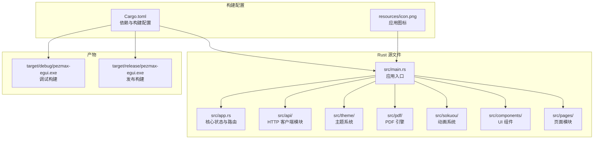
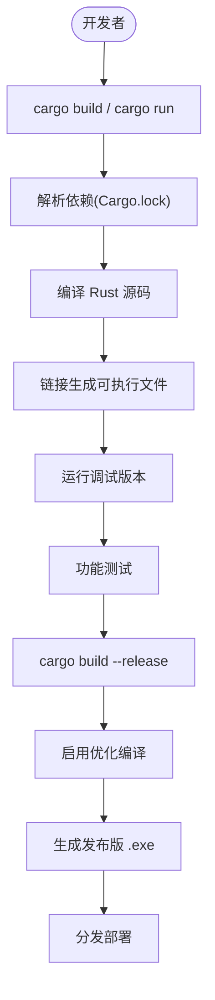
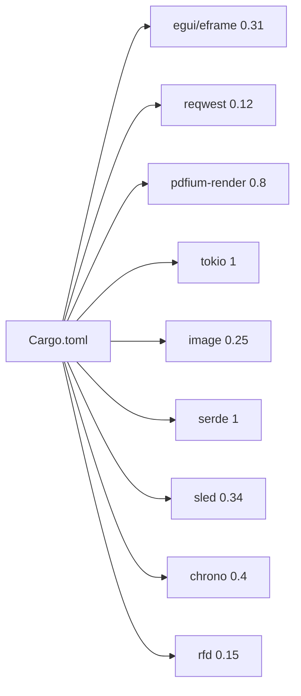

# 构建与部署

<cite>
**本文引用的文件**
- [Cargo.toml](file://PezMax-One/Cargo.toml)
- [src/main.rs](file://PezMax-One/src/main.rs)
- [src/app.rs](file://PezMax-One/src/app.rs)
</cite>

## 目录
1. [简介](#简介)
2. [项目结构](#项目结构)
3. [核心组件](#核心组件)
4. [架构总览](#架构总览)
5. [详细组件分析](#详细组件分析)
6. [依赖分析](#依赖分析)
7. [性能考虑](#性能考虑)
8. [故障排除指南](#故障排除指南)
9. [结论](#结论)
10. [附录](#附录)

## 简介
本指南面向使用 Rust 构建的原生桌面应用 PezMax-One，覆盖从开发环境搭建、调试运行，到发布构建、跨平台编译、部署分发的最佳实践。文档以仓库中的实际配置与实现为依据，提供可操作的步骤与排错要点。

> **参考**：PezMax-Desktop 目录下保留有旧版桌面应用（Electron + Vite）的构建与部署文档，作为架构参考。

## 项目结构
本项目采用 Rust 单 crate 架构，使用 cargo 作为构建系统，无外部构建工具链。

## 核心组件
- **构建系统**：cargo，Rust 官方构建工具，自动管理依赖下载与编译
- **依赖管理**：Cargo.toml 声明所有依赖及版本，Cargo.lock 锁定版本确保可复现构建
- **调试构建**：`cargo build` / `cargo run`，含调试符号，编译速度快
- **发布构建**：`cargo build --release`，启用优化（-O2），产物更小更快
- **类型检查**：`cargo check`，仅检查类型不生成二进制，速度最快
- **自动修复**：`cargo fix`，自动修复编译器警告

## 架构总览
下图展示从开发到产出的完整构建流程。

## 详细组件分析

### 开发环境搭建
- **环境要求**
  - Rust 工具链：通过 `rustup` 安装（https://rustup.rs）
  - 最低 Rust 版本：2021 edition（edition = "2021"）
- **首次构建**
  - 在 PezMax-One 根目录执行 `cargo run`
  - 首次构建会自动下载所有依赖并编译，可能需要 5-15 分钟
  - 后续构建仅编译修改的文件，速度快得多
- **IDE 支持**
  - 推荐使用 VS Code + rust-analyzer 插件
  - 或使用 JetBrains RustRover / IntelliJ + Rust 插件
- **调试**
  - 使用 `env_logger` 控制日志级别：`RUST_LOG=debug cargo run`
  - 默认日志级别为 Info
  - 使用 `eprintln!` 或 `log::info!` 输出调试信息

### 构建流程
- **调试构建**：`cargo build`
  - 输出到 `target/debug/pezmax-egui.exe`
  - 编译速度快，含调试符号
  - 适合开发迭代
- **类型检查**：`cargo check`
  - 仅检查类型正确性，不生成二进制
  - 比完整构建快 2-3 倍
  - 适合频繁的"代码→检查"循环
- **发布构建**：`cargo build --release`
  - 输出到 `target/release/pezmax-egui.exe`
  - 启用优化：速度优化、体积优化
  - 产物更小、运行更快
  - 构建时间较长（可能需要 5-10 分钟）
- **自动修复**：`cargo fix`
  - 自动修复编译器警告（如未使用的导入、变量等）
  - 建议在提交前运行

### 部署分发
- **可执行文件**：`target/release/pezmax-egui.exe`
  - 单文件分发，无需额外运行时
  - Rust 是静态编译，所有依赖链接到二进制中
- **依赖文件**：
  - pdfium.dll：PDF 预览引擎，放置于可执行文件同目录
  - 下载地址：https://github.com/bblanchon/pdfium-binaries/releases
  - 选择与 Rust 编译目标一致的架构（x86_64）
- **本地数据目录**：%APPDATA%/PezMax/
  - credentials.json：登录凭证
  - avatar_cache/：头像图片缓存
  - 应用首次运行自动创建
- **分发方式**：
  - 直接分发可执行文件 + pdfium.dll
  - 可使用 NSIS / Inno Setup 制作安装包
  - 支持压缩打包（UPX）减小体积

### 跨平台编译
Rust 支持交叉编译，但 egui 在不同平台需对应的原生依赖：

- **Windows（目标平台）**：原生支持，Windows Subsystem for Graphics (WGL)
- **macOS**：需 Metal 后端，通过 `cargo build --target` 交叉编译
- **Linux**：需 X11/Wayland + OpenGL 后端

跨平台注意事项：
- 字体路径在 theme/mod.rs 中按平台配置
- CJK 字体加载：Windows 用 msyh.ttc，macOS 用 PingFang.ttc，Linux 用 NotoSansCJK
- 文件路径使用 `std::path` 处理，避免硬编码分隔符

## 依赖分析
所有依赖在 Cargo.toml 中声明，主要依赖分类：

**GUI 框架**：
- egui 0.31：即时模式 GUI 库
- eframe 0.31：egui 的框架层（窗口、事件循环）

**网络**：
- reqwest 0.12（features: json, multipart）：HTTP 客户端

**PDF 渲染**：
- pdfium-render 0.8（features: thread_safe, sync）：Chrome 同款 PDF 引擎

**异步**：
- tokio 1（features: full）：异步运行时

**媒体**：
- image 0.25：图片解码（PNG、JPEG、GIF 等）

**序列化**：
- serde 1 + serde_json 1：JSON 序列化/反序列化

**持久化**：
- sled 0.34：嵌入式 KV 数据库
- confy 0.6：配置文件持久化

**其他**：
- chrono 0.4：日期时间
- log 0.4 + env_logger 0.11：日志
- rfd 0.15：原生文件对话框
- arboard 3：剪贴板

## 性能考虑
- **调试构建**：含大量调试符号，产物较大（~200MB），运行较慢
- **发布构建**：启用优化，产物较小（~20MB），运行更快
- **增量编译**：cargo 默认启用增量编译，修改后仅重新编译受影响文件
- **链接优化**：发布构建默认启用 LTO（链接时优化），提升运行时性能
- **代码生成单元**：可通过 Cargo.toml 的 `codegen-units` 调整编译速度与优化程度

## 故障排除指南
- **编译失败：无法找到依赖**
  - 确保网络连接正常
  - 尝试 `cargo update` 更新依赖
  - 如果使用代理，配置 cargo 代理：`set HTTP_PROXY=http://proxy:port`
- **编译失败：链接错误**
  - 安装 Visual Studio Build Tools 或 C++ 运行时
  - 对于 Windows，确保安装了"适用于 Windows 的 C++ 生成工具"
- **编译失败：rustc 版本过低**
  - 执行 `rustup update` 更新 Rust 工具链
- **运行时崩溃：pdfium 未找到**
  - 将 pdfium.dll 放置于可执行文件同目录下
  - 检查 pdfium.dll 的架构（32/64 位）是否与 Rust 编译目标一致
- **运行时崩溃：中文显示为方块**
  - 字体加载失败，检查系统是否有 CJK 字体
  - 手动指定字体路径：在 theme/mod.rs 中添加字体路径
- **构建过大**
  - 发布构建使用 `cargo build --release`
  - 可在 Cargo.toml 中添加 `[profile.release] opt-level = "z"` 优化体积
  - 使用 UPX 压缩可执行文件

## 结论
本项目基于 Rust cargo 构建体系，实现了高效的开发迭代与可靠的发布构建流程。通过 `cargo build` 和 `cargo run` 即可完成开发全流程，无需额外构建工具链。建议在 CI/CD 中集成 `cargo check` 和 `cargo test` 保证代码质量，并在发布前使用 `cargo build --release` 生成优化版本。

## 附录
- 常用命令参考
  - 开发运行：`cargo run`
  - 类型检查：`cargo check`
  - 调试构建：`cargo build`
  - 发布构建：`cargo build --release`
  - 自动修复：`cargo fix`
  - 更新依赖：`cargo update`
  - 清理：`cargo clean`
  - 查看文档：`cargo doc --open`
- 编译产物
  - 调试：`target/debug/pezmax-egui.exe`
  - 发布：`target/release/pezmax-egui.exe`
- 环境变量
  - `RUST_LOG=debug`：设置日志级别
  - `HTTP_PROXY`：HTTP 代理配置
  - `RUST_BACKTRACE=1`：panic 时打印完整堆栈