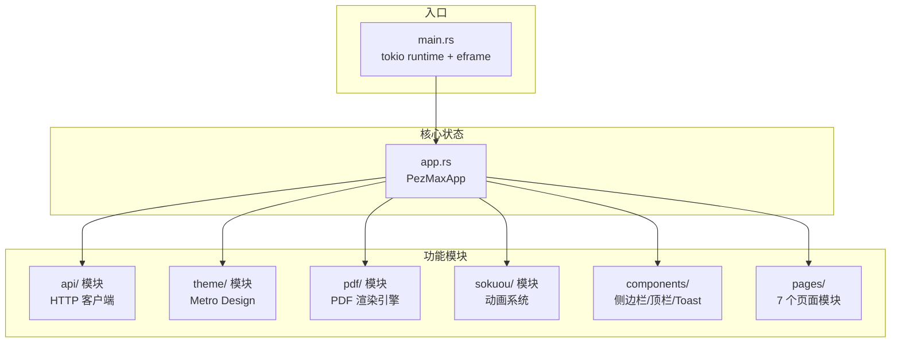
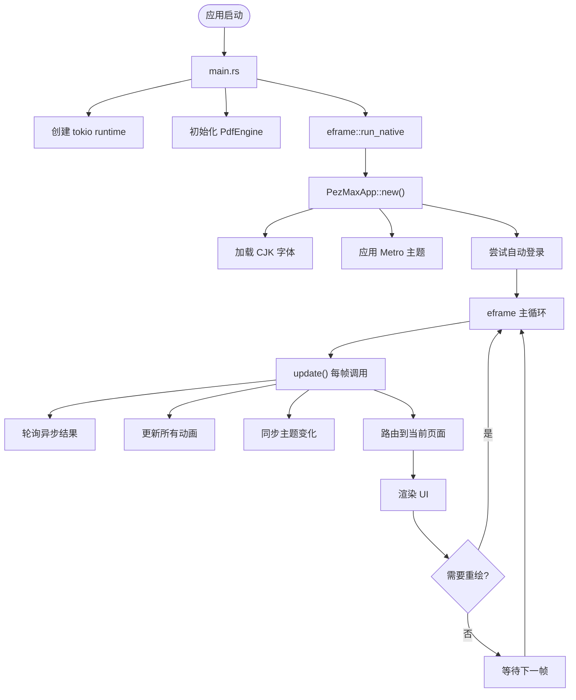
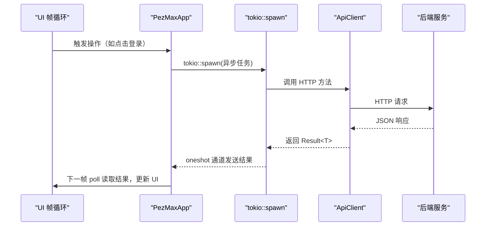
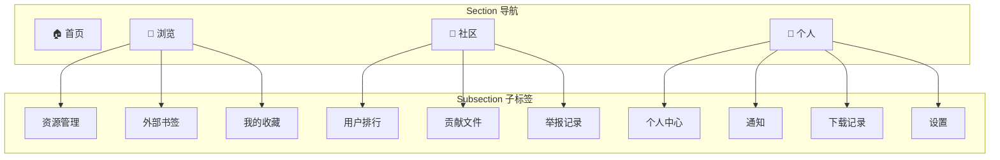

# 桌面应用开发

<cite>
**本文引用的文件**
- [Cargo.toml](file://PezMax-One/Cargo.toml)
- [src/main.rs](file://PezMax-One/src/main.rs)
- [src/app.rs](file://PezMax-One/src/app.rs)
- [src/api/client.rs](file://PezMax-One/src/api/client.rs)
- [src/api/models.rs](file://PezMax-One/src/api/models.rs)
- [src/theme/mod.rs](file://PezMax-One/src/theme/mod.rs)
- [src/pdf/mod.rs](file://PezMax-One/src/pdf/mod.rs)
- [src/sokuou/mod.rs](file://PezMax-One/src/sokuou/mod.rs)
- [src/sokuou/spring.rs](file://PezMax-One/src/sokuou/spring.rs)
- [src/sokuou/progress.rs](file://PezMax-One/src/sokuou/progress.rs)
- [src/sokuou/uwp.rs](file://PezMax-One/src/sokuou/uwp.rs)
- [src/components/sidebar.rs](file://PezMax-One/src/components/sidebar.rs)
- [src/components/toast.rs](file://PezMax-One/src/components/toast.rs)
- [src/components/action_bar.rs](file://PezMax-One/src/components/action_bar.rs)
</cite>

## 目录
1. [简介](#简介)
2. [项目结构](#项目结构)
3. [核心组件](#核心组件)
4. [架构总览](#架构总览)
5. [详细组件分析](#详细组件分析)
6. [依赖分析](#依赖分析)
7. [性能考虑](#性能考虑)
8. [故障排查指南](#故障排查指南)
9. [结论](#结论)
10. [附录](#附录)

## 简介
本指南面向使用 Rust + egui 构建的原生桌面应用 PezMax-One，围绕单进程架构、即时模式渲染、Sokuou Engine 动画系统、Metro Design 主题、PDF 预览引擎、异步数据加载模式进行系统化说明。文档同时提供开发调试技巧、性能优化建议与常见问题解决方案，帮助开发者快速上手并稳定交付高质量的桌面产品。

> **参考**：PezMax-Desktop（Electron + Vue 3）目录下保留有旧版桌面应用的技术文档（Electron 架构设计/、Vue 3 前端集成/、IPC 进程间通信/、桌面系统集成/），作为架构参考。

## 项目结构
本项目采用 Rust 单进程架构，单一 crate 包含所有模块：
- 入口：`main.rs` 初始化日志、tokio 运行时、PDF 引擎、eframe 窗口
- 核心状态：`app.rs` 定义 PezMaxApp 结构体（所有状态集中管理）和 eframe::App 实现
- API 客户端：`api/` 模块按领域文件拆分（auth, file, bookmark, user, download, notification, report, favorite）
- 主题系统：`theme/` 模块定义 Metro Design 颜色、字体、深浅色过渡、强调色预设
- UI 组件：`components/` 目录包含侧边栏、顶栏、Toast 通知、底部操作栏
- 页面：`pages/` 目录包含 7 个页面模块（login, register, forget_password, home, browse, community, profile）
- PDF 引擎：`pdf/` 模块封装 pdfium-render，提供 PdfEngine + PdfViewer
- 动画引擎：`sokuou/` 模块实现 Sokuou Engine（SpringAnim, Progress, MetroAnim, easing）



## 核心组件
- **PezMaxApp 主状态**：约 100 个字段统一管理，涵盖登录、导航、异步数据、动画、PDF、主题、设置、Toast 等
- **API 客户端**：`ApiClient` 结构体封装 reqwest，提供 GET/POST/PUT/DELETE/upload/download，按领域文件拆分实现
- **异步数据加载器**：`AsyncData<T>` 模式封装 tokio::spawn + oneshot 通道，每帧 poll 结果
- **二级导航系统**：Section（Home/Browse/Community/Profile）+ Subsection（子标签），SpringAnim 驱动平滑过渡
- **Sokuou Engine**：三原语动画系统，所有动效统一在每帧 update 中推进
- **PDF 预览引擎**：PdfEngine（全局单例）+ PdfViewer（文档状态），Grid/Line 双模式
- **Metro Design 主题**：深浅色过渡 + 5 种强调色预设，运行时颜色插值
- **Toast 通知系统**：入场/离场动画（Progress 驱动），自动 4 秒消失

## 架构总览
下图展示桌面应用从启动到运行的核心流程。



### 数据流

桌面端与后端的所有交互通过 HTTP REST API 完成。异步数据流采用统一的模式：



## 详细组件分析

### 入口与窗口管理（main.rs）
- 初始化 `env_logger`，日志级别 Info
- 创建 tokio 运行时，`rt.enter()` 设为当前线程默认运行时
- 初始化 `PdfEngine`（pdfium-render），检测 pdfium 库是否可用
- 创建 eframe 窗口：1400×900 初始大小，800×600 最小大小
- 加载应用图标（resources/icon.png）

### 核心状态与路由（app.rs）

PezMaxApp 结构体是应用的中心枢纽，所有状态集中管理：

**认证状态**：
- `is_logged_in`、`auth_page`（Login/Register/ForgetPassword）
- 登录表单字段：用户名、密码、验证码、记住我
- 自动登录：`auto_login_rx` 异步验证已保存凭证

**导航状态**：
- `current_section`：Home / Browse / Community / Profile
- `current_subsection`：每个 Section 下的子标签
- 侧边栏折叠动画：`sidebar_anim`（SpringAnim 48↔200px）
- 页面入场动画：`page_enter_anim`（SpringAnim 透明度+位移）

**异步数据**：
- 11 个 `AsyncData<T>` 字段覆盖所有 API 数据加载
- 额外的 oneshot 通道：验证码、登录、PDF 字节、头像、收藏 ID

**动画状态**：
- 9 个 SpringAnim 实例 + 1 个 Progress 实例 + 2 个 MetroAnim 实例（主题）
- 每帧在 `update()` 中统一推进，`!is_steady()` 时请求重绘

**PDF 查看器**：
- `pdf_viewer: PdfViewer` 文档状态、页码、缩放、纹理缓存
- `pdf_loading`、`pdf_bytes_rx` PDF 字节异步加载

### 导航系统



导航切换带有 SpringAnim 驱动的平滑过渡：
- 侧边栏高亮滑块：`sidebar_indicator_anim` 在 4 个 Section 索引间弹簧插值
- 子标签下划线：`subtab_indicator_anim` 在子标签位置间弹簧插值
- 页面内容：`page_enter_anim` 控制透明度 + 垂直位移（0.4s, damping 0.8）

### Sokuou Engine 动画系统

所有动画必须使用 Sokuou Engine。三种动画原语：

| 类型 | 类 | 适用场景 | 参数 |
|------|-----|---------|------|
| 弹簧 | `SpringAnim` | 位置、尺寸、面板滑动、页面切换 | response(0.3-0.5s), damping_ratio(0.8-0.85) |
| 缓动 | `Progress` | 透明度、颜色淡入淡出、定时序列 | duration(0.2-0.3s), Easing |
| UWP | `MetroAnim` | 主题过渡（强调色/深色模式切换） | UwpEasing + EasingMode, 0.3s |

每帧统一更新模式（在 `app.rs` 的 `update()` 中）：
```rust
let dt = ctx.input(|i| i.stable_dt) as f64;
self.sidebar_anim.update(dt);
self.preview_anim.update(dt);
// ... 所有动画实例
theme::update_accent_transition(dt);
theme::update_dark_transition(dt);
// 有动画进行中 → 请求重绘
if !self.sidebar_anim.is_steady() { ctx.request_repaint(); }
```

### 主题系统（theme/）

- **深浅色模式**：Light / Dark / System（跟随系统）
- **强调色预设**：5 种（钴蓝、云杉、绯红、琥珀、堇紫）
- **过渡动画**：强调色和深色模式切换均通过 MetroAnim 驱动 0.3s 颜色插值
- **颜色函数**：`colors::primary()`、`colors::text_primary()`、`colors::bg_white()` 等均从运行时插值状态读取
- **CJK 字体**：自动检测 Windows/macOS/Linux 系统字体

### PDF 预览引擎（pdf/）

- **PdfEngine**：全局单例，持有 Arc<Pdfium>，提供后台渲染能力
- **PdfViewer**：每个 PDF 文档的查看状态（页码、缩放、纹理缓存、视图模式）
- **视图模式**：
  - Grid：缩略图网格，点击切换至 Line 模式并跳转
  - Line：连续纵向滚动 + 左侧可折叠总览面板
- **渲染管线**：后台线程渲染，限制并发数（3 个），结果通过 oneshot 通道回传
- **缩放**：SpringAnim 驱动的平滑缩放过渡（`display_scale_anim`）

### Toast 通知（components/toast.rs）

- 右下角叠层显示，最多同时显示 3 条
- 入场：0.25s EaseOutCubic（淡入 + 右滑入）
- 离场：0.25s EaseInCubic（淡出 + 右滑出）
- 4 秒后自动触发离场，4.7 秒后移除

### 底部操作栏（components/action_bar.rs）

预览模式下的底部操作栏，提供以下按钮：
- Back（退出阅读/返回阅读）
- Download（下载文件）
- Favorite（收藏/取消收藏）
- Report（举报文件）
- ToggleInfo（查看文件信息）

## 依赖分析
- GUI 框架：egui 0.31 / eframe 0.31
- HTTP 客户端：reqwest 0.12（json, multipart）
- PDF 渲染：pdfium-render 0.8（thread_safe, sync）
- 异步运行时：tokio 1（full features）
- 图片解码：image 0.25
- 序列化：serde 1 / serde_json 1
- 日期时间：chrono 0.4（serde feature）
- 错误处理：anyhow 1 / thiserror 2
- 嵌入式 KV：sled 0.34
- 文件对话框：rfd 0.15
- 日志：log 0.4 / env_logger 0.11
- 其他：base64 0.22, url 2, arboard 3, webbrowser 1, confy 0.6

## 性能考虑
- **即时模式渲染**：egui 仅重绘变化的区域，通过 ctx.request_repaint() 按需驱动
- **异步非阻塞**：所有 HTTP 请求通过 tokio::spawn 在后台执行，不阻塞 UI 帧循环
- **后台 PDF 渲染**：pdfium 在后台线程渲染，限制并发数（3 个），保持 UI 响应
- **动画系统**：SpringAnim 使用阻尼振荡器解析解，帧率无关，dt 再大也不会发散
- **主题过渡**：颜色插值在每帧 update 中计算，无额外开销
- **头像缓存**：排行头像支持 GIF 动图，带磁盘缓存和 60fps 帧动画

## 故障排查指南
- **编译失败**
  - 确保 Rust 工具链为最新：`rustup update`
  - 检查 Cargo.toml 依赖版本兼容性
  - 清理缓存后重试：`cargo clean && cargo build`
- **PDF 预览不可用**
  - 将 pdfium.dll 放置于可执行文件同目录下
  - 下载地址：https://github.com/bblanchon/pdfium-binaries/releases
  - 确保使用 64 位版本（与 Rust 编译目标一致）
- **网络连接失败**
  - 确认后端服务已启动且端口 8080 可达
  - 检查网络代理与防火墙设置
  - 默认后端地址：http://154.8.139.48:8080
- **自动登录失败**
  - 删除 %APPDATA%/PezMax/credentials.json 后重新登录
  - 检查本地证书是否过期
- **UI 渲染异常**
  - 检查 `ctx.request_repaint()` 调用是否正确
  - 确认动画状态在每帧 update 中推进
  - 检查是否有 panic 在渲染函数中

## 结论
PezMax-One 桌面端采用 Rust + egui 原生架构，通过单进程状态管理、Sokuou Engine 动画系统、Metro Design 主题和 PDF 原生渲染引擎，实现了高性能、低资源占用的桌面体验。建议在后续迭代中持续完善异步数据加载、主题系统扩展和 PDF 渲染性能优化。

## 附录
- 常用命令
  - 开发运行：`cargo run`
  - 类型检查：`cargo check`
  - 发布构建：`cargo build --release`
  - 清理：`cargo clean`
- 本地数据目录
  - 凭证：%APPDATA%/PezMax/credentials.json
  - 头像缓存：%APPDATA%/PezMax/avatar_cache/
- 相关文档
  - SOKUOU_ENGINE.md：Sokuou Engine 完整设计书
  - SOKUOU_USAGE.md：Sokuou Engine 调用手册
  - 后端接口列表.md：完整 API 合约