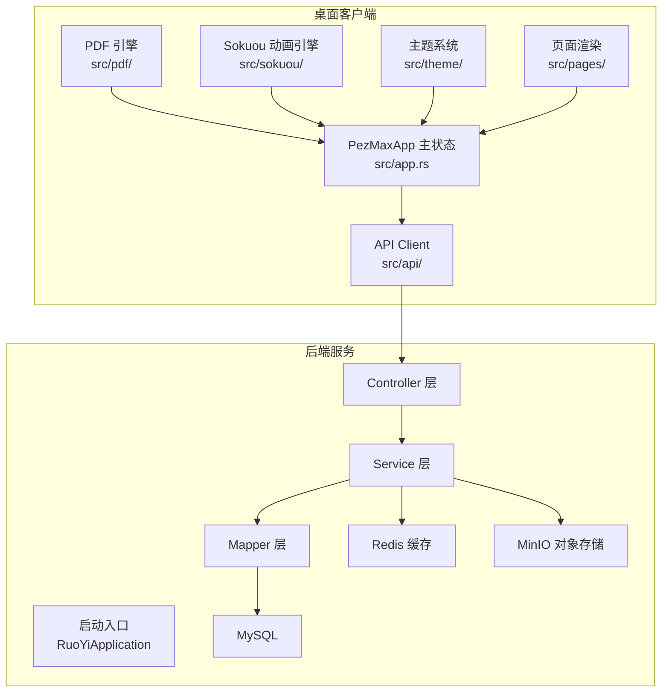
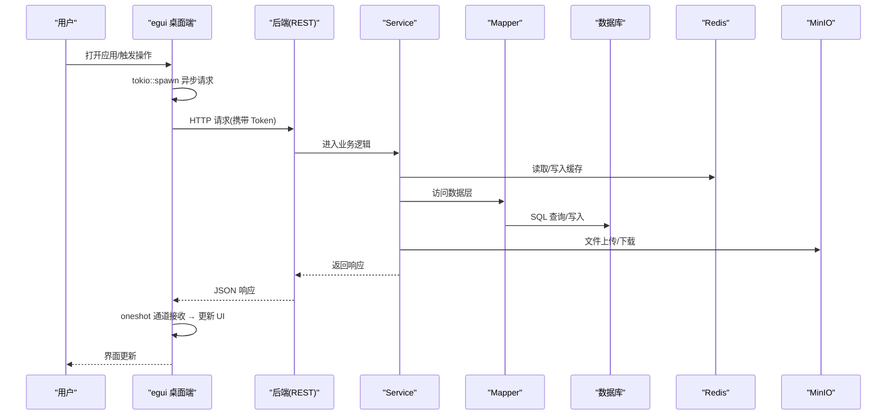
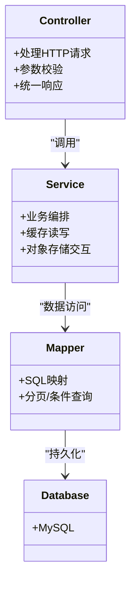
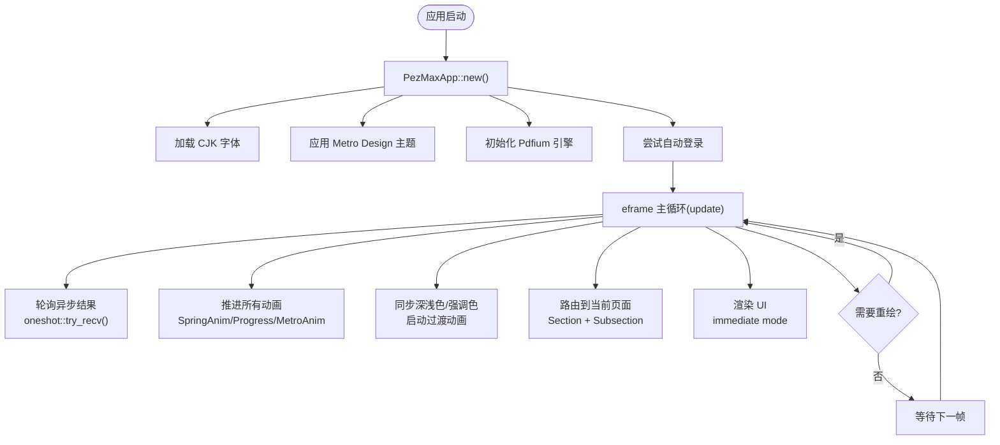
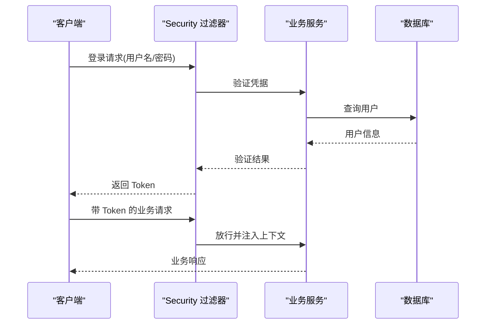
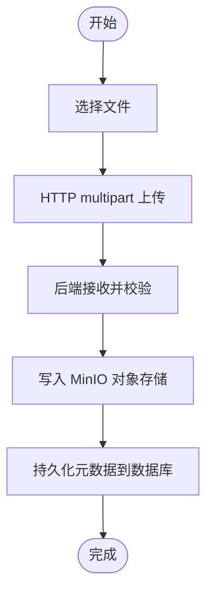
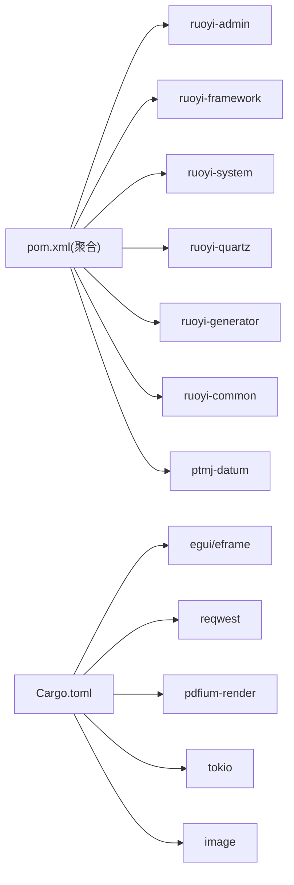

# 整体架构概览

<cite>
**本文引用的文件列表**
- [PezMax-Backend/pom.xml](file://PezMax-Backend/pom.xml)
- [RuoYiApplication.java](file://PezMax-Backend/ruoyi-admin/src/main/java/com/ruoyi/RuoYiApplication.java)
- [application.yml](file://PezMax-Backend/ruoyi-admin/src\main\resources\application.yml)
- [SecurityConfig.java](file://PezMax-Backend/ruoyi-framework/src/main/java/com/ruoyi/framework/config/SecurityConfig.java)
- [ResourcesConfig.java](file://PezMax-Backend/ruoyi-framework/src/main/java/com/ruoyi/framework/config/ResourcesConfig.java)
- [MyBatisConfig.java](file://PezMax-Backend/ruoyi-framework/src/main/java/com/ruoyi/framework/config/MyBatisConfig.java)
- [PtmjFileServiceImpl.java](file://PezMax-Backend/ptmj-datum/src/main/java/com/ptmj/datum/service/impl/PtmjFileServiceImpl.java)
- [PtmjFileMapper.xml](file://PezMax-Backend/ptmj-datum/src/main/resources/mapper/datum/PtmjFileMapper.xml)
- [Cargo.toml](file://PezMax-One/Cargo.toml)
- [src/main.rs](file://PezMax-One/src/main.rs)
- [src/app.rs](file://PezMax-One/src/app.rs)
</cite>

## 目录
1. [简介](#简介)
2. [项目结构](#项目结构)
3. [核心组件](#核心组件)
4. [架构总览](#架构总览)
5. [详细组件分析](#详细组件分析)
6. [依赖关系分析](#依赖关系分析)
7. [性能与可扩展性](#性能与可扩展性)
8. [故障排查指南](#故障排查指南)
9. [结论](#结论)

## 简介
本文件为 PezMax-One 系统的整体架构概览，围绕两层架构进行说明：后端 Spring Boot 微服务层、桌面 Rust 原生应用层。文档重点阐述各层职责划分、前后端分离交互模式、Rust 单进程架构设计，并解释技术栈选型原因（Spring Boot + MyBatis、Rust + egui）。同时给出系统启动流程、模块加载顺序、异步数据流等关键信息，并提供架构图与数据流向图，帮助开发者快速理解系统整体结构。

## 项目结构
仓库由两个子系统构成：
- 后端服务（PezMax-Backend，独立仓库）：基于 Spring Boot 的模块化单体（多模块 Maven），提供 REST API、权限与安全、对象存储集成、定时任务、代码生成等能力。
- 桌面客户端（PezMax-One，本仓库）：基于 Rust + egui，原生即时模式渲染，单进程架构，通过 HTTP 直接调用后端 API。

## 核心组件
- 后端启动与扫描
  - 启动类排除默认数据源自动配置，统一由框架配置；组件扫描覆盖 com.ruoyi 与 com.ptmj 包，确保业务模块被加载。
- 安全与跨域
  - 启用方法级安全注解；无状态会话策略；JWT 过滤器前置；CORS 全局放行；匿名访问白名单包含登录、注册、验证码及静态资源。
- 资源与拦截器
  - 静态资源映射、重复提交拦截器、跨域过滤器 Bean 定义。
- 持久化与 SQL
  - MyBatis 动态别名包解析、mapper XML 路径扫描、全局配置加载；业务 Mapper XML 定义文件查询、插入、更新、删除与搜索逻辑。
- 业务实现
  - 文件上传、格式校验、LibreOffice 转换、MinIO 存储、文件树构建、排行榜缓存清理等。
- 桌面应用（Rust egui）
  - 单进程架构：PezMaxApp 结构体持有所有状态，页面为纯函数 `fn render(&mut PezMaxApp, &mut Ui)`。
  - 异步数据加载：`AsyncData<T>` 模式封装 tokio::spawn + oneshot 通道，每帧轮询结果。
  - 二级导航：Section（首页/浏览/社区/个人）→ Subsection（子标签栏），SpringAnim 驱动平滑过渡。
  - Sokuou Engine：三种动画原语（SpringAnim 物理弹簧、Progress 缓动、MetroAnim UWP 风格）覆盖所有动效。
  - PDF 预览：pdfium-render 后台渲染，Grid/Line 双视图模式，支持缩放与缩略图总览。
  - Metro Design 主题：深浅色平滑过渡 + 5 种强调色预设，配色每帧插值实现无闪烁切换。

## 架构总览
下图展示从用户交互到数据存储的端到端流程，包括认证、业务处理、缓存与对象存储。

## 详细组件分析

### 后端分层架构（Controller → Service → Mapper → Database）
- 职责划分
  - Controller：接收 HTTP 请求，参数校验，返回统一响应体。
  - Service：编排业务逻辑，协调缓存、对象存储、外部服务。
  - Mapper：数据访问抽象，映射 SQL 与实体。
  - Database：MySQL 持久化。
- 典型数据流
  - 桌面端发起 REST 请求 → Spring MVC 控制器 → 业务服务 → 缓存/对象存储 → 数据映射器 → 数据库。
- 关键特性
  - 匿名访问：部分查询接口支持未登录访问。
  - 对象存储：MinIO 用于海量文件存储，支持公开读策略。
  - 缓存：Redis 作为热点数据缓存与分布式会话支撑。
  - 安全：Spring Security + JWT + Redis 实现无状态鉴权与权限控制。

### 桌面端单进程架构（Rust egui）

桌面端采用 Rust + egui 原生单进程架构，与 PezMax-Desktop（Electron + Vue 3 参考 repo）是两套独立的实现。核心设计要点：

- **状态统一管理**：PezMaxApp 结构体持有所有页面状态，无 per-page 状态碎片
- **即时模式渲染**：UI 每帧重建，通过条件匹配（match）决定渲染内容
- **异步数据流**：HTTP 请求通过 tokio::spawn 在后台执行，结果通过 oneshot 通道回传，每帧轮询
- **动画系统**：Sokuou Engine 提供三种动画原语，所有动效统一管理
- **主题系统**：Metro Design 颜色体系，深浅色/强调色切换通过 MetroAnim 插值实现平滑过渡

### 桌面端模块职责

| 模块 | 职责 |
|------|------|
| `app.rs` | PezMaxApp 状态结构体、eframe::App 实现、导航路由、异步数据管理 |
| `api/` | 基于 reqwest 的 HTTP 客户端，按领域拆分（auth、file、bookmark、user、download 等） |
| `theme/` | Metro Design 颜色系统、深浅色过渡动画、强调色预设、CJK 字体加载 |
| `components/` | 侧边栏（SpringAnim 折叠动画）、顶栏、Toast 通知、底部操作栏 |
| `pages/` | 登录、注册、忘记密码、仪表盘、资源管理、社区、个人中心等功能页面 |
| `pdf/` | PdfEngine 全局单例 + PdfViewer 文档状态，后台线程渲染，Grid/Line 双模式 |
| `sokuou/` | Sokuou Engine 动画系统，SpringAnim（弹簧）、Progress（缓动）、MetroAnim（UWP 风格） |

### 认证与安全流程（JWT + Spring Security）
- 客户端在登录后获取 Token，后续请求携带 Authorization 头。
- 后端通过 Spring Security 过滤器链进行令牌校验与权限判定。
- 部分接口标注匿名访问，允许未登录浏览资源列表等。

### 文件与书签业务流程
- 文件上传
  - 桌面端选择文件，通过 HTTP multipart 上传到后端。
  - 后端接收后落盘至 MinIO，并记录元数据到数据库。
- 文件下载/预览
  - 桌面端发起下载请求，后端返回文件流。
  - PDF 文件通过 pdfium 引擎在后台渲染，支持 Grid/Line 双视图模式。
- 书签管理
  - 支持封面图直传 MinIO，URL 自动修复。

## 依赖分析
- 后端模块依赖（Maven 多模块）
  - 顶层聚合模块声明子模块：ruoyi-admin、ruoyi-framework、ruoyi-system、ruoyi-quartz、ruoyi-generator、ruoyi-common、ptmj-datum。
  - 版本管理与依赖集中声明，便于统一升级。
- 桌面端依赖（Rust crate）
  - GUI 框架：egui 0.31 / eframe 0.31
  - HTTP 客户端：reqwest 0.12（features: json, multipart）
  - PDF 渲染：pdfium-render 0.8（features: thread_safe, sync）
  - 异步运行时：tokio 1（features: full）
  - 图片解码：image 0.25
  - 序列化：serde 1 / serde_json 1
  - 日期时间：chrono 0.4（features: serde）
  - 嵌入式 KV 存储：sled 0.34
  - 文件对话框：rfd 0.15

## 性能与可扩展性
- 后端
  - 连接池：Druid 提升数据库连接复用与监控能力。
  - 缓存：Redis 承载热点数据与分布式会话，降低数据库压力。
  - 对象存储：MinIO 支持高吞吐文件存取，适合大文件与切片场景。
  - 异步与限流：结合注解与切面实现日志、限流、重复提交拦截等横切关注点。
- 桌面端
  - 即时模式渲染：egui 仅重绘变化的区域，CPU/GPU 占用低。
  - 异步非阻塞：tokio 运行时处理所有 HTTP 请求，不阻塞 UI 帧循环。
  - 后台 PDF 渲染：限制并发数（3 个），保持 UI 响应。
  - 动画系统：SpringAnim 使用阻尼振荡器解析解，帧率无关，无条件稳定。

## 故障排查指南
- 后端
  - 启动失败：检查数据源配置与端口占用；确认 MySQL、Redis、MinIO 容器可用。
  - 权限异常：核对 JWT 配置与白名单接口；确认 @Anonymous 使用位置。
  - 文件问题：确认 MinIO 桶策略为公开读；检查上传大小限制与类型白名单。
- 桌面端
  - 编译失败：确保 Rust 工具链为最新（`rustup update`），检查 Cargo.toml 依赖兼容性。
  - PDF 预览不可用：将 pdfium.dll 放置于可执行文件同目录下。
  - 网络连接失败：确认后端服务已启动且端口 8080 可达；检查网络代理。
  - 认证失败：检查本地凭证文件（%APPDATA%/PezMax/credentials.json）是否损坏。

## 结论
PezMax-One 采用"后端模块化单体 + Rust 原生桌面客户端"的组合架构，既具备企业级后端的高内聚低耦合与可扩展性，又发挥 Rust 在桌面端的性能优势（零运行时开销、即时模式渲染、低内存占用）。通过 Controller → Service → Mapper → Database 的分层模式、JWT 安全体系、Redis 缓存与 MinIO 对象存储，系统在性能、可靠性与可维护性方面达到良好平衡。

## 附录
- 技术选型依据
  - Spring Boot：成熟生态、快速开发、云原生友好。
  - Rust + egui：原生性能、零运行时、即时模式低功耗。
  - MyBatis + Druid：灵活 SQL 与高性能连接池。
  - Redis：高性能缓存与会话共享。
  - MinIO：兼容 S3 的对象存储，适合海量文件场景。
- 系统边界
  - 后端边界：对外暴露 REST API，内部通过模块划分职责。
  - 桌面边界：单进程架构，所有状态在 PezMaxApp 中统一管理。
- 扩展点
  - 新增业务模块：在 ptmj-datum 中按 Controller/Service/Mapper 分层扩展。
  - 新增桌面功能：在 app.rs 中添加状态字段，在 pages/ 中添加 render 函数。