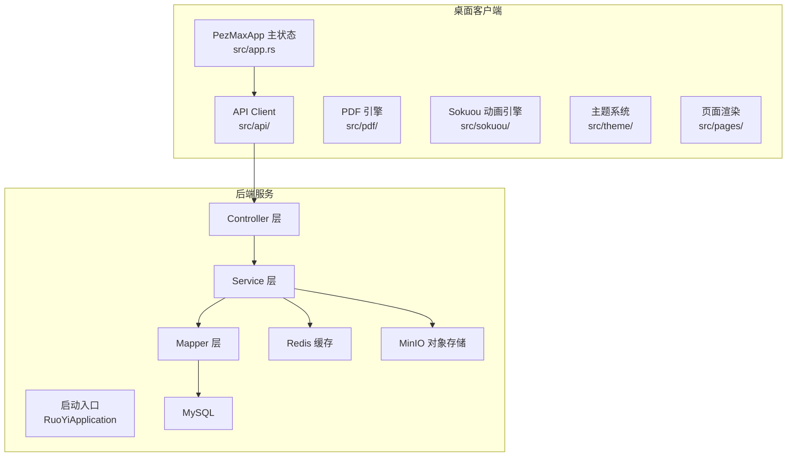
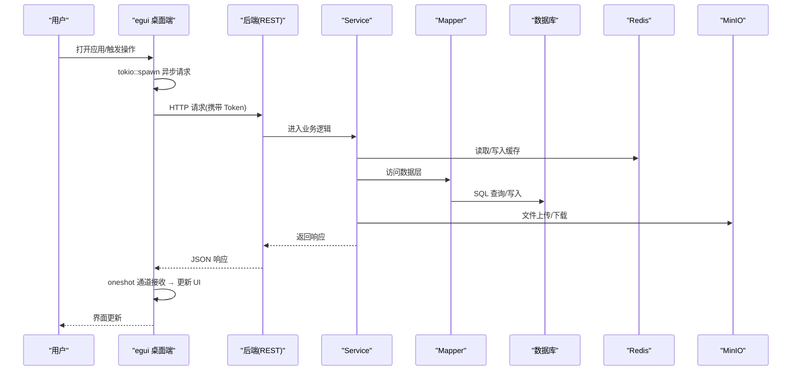
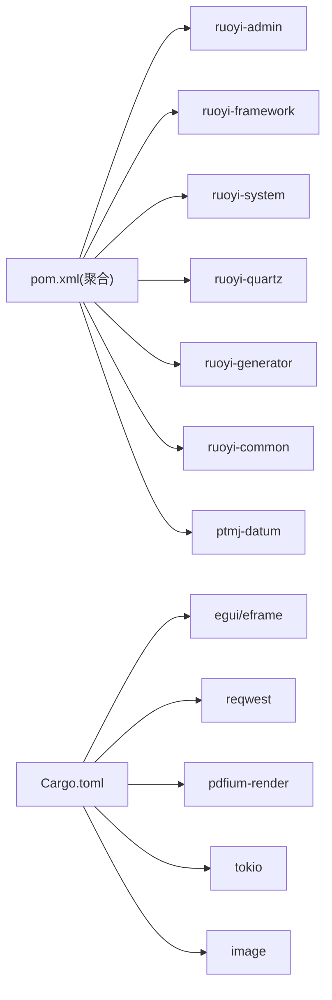

# 系统架构设计

<cite>
**本文引用的文件**   
- [PezMax-Backend/README.md](file://PezMax-Backend/README.md)
- [PezMax-Backend/pom.xml](file://PezMax-Backend/pom.xml)
- [PezMax-Backend/ruoyi-admin/src/main/java/com/ruoyi/RuoYiApplication.java](file://PezMax-Backend/ruoyi-admin/src/main/java/com/ruoyi/RuoYiApplication.java)
- [Cargo.toml](file://PezMax-One/Cargo.toml)
- [src/app.rs](file://PezMax-One/src/app.rs)
- [src/main.rs](file://PezMax-One/src/main.rs)
</cite>

## 目录
1. [引言](#引言)
2. [项目结构](#项目结构)
3. [核心组件](#核心组件)
4. [架构总览](#架构总览)
5. [详细组件分析](#详细组件分析)
6. [依赖分析](#依赖分析)
7. [性能考虑](#性能考虑)
8. [故障排查指南](#故障排查指南)
9. [结论](#结论)
10. [附录](#附录)

## 引言
本架构文档面向 PezMax-One 系统，覆盖后端微服务化与模块化、Rust 桌面原生应用单进程架构、前后端分离设计，以及 Controller → Service → Mapper → Database 的分层模式。同时说明技术选型依据（Spring Boot 微服务、Rust + egui 桌面框架）、数据流向、API 通信协议、缓存策略、安全认证机制、系统边界、扩展点与性能优化建议。

## 项目结构
整体由两大子系统构成：
- 后端服务（PezMax-Backend，独立仓库）：基于 Spring Boot 的模块化单体（多模块 Maven），提供 REST API、权限与安全、对象存储集成、定时任务、代码生成等能力。
- 桌面客户端（PezMax-One，本仓库）：基于 Rust + egui 的原生桌面应用，单进程架构，通过 HTTP 直接调用后端 API。

## 核心组件
- 后端启动与扫描
  - 启动类排除默认数据源自动配置，统一使用自定义数据源；组件扫描范围包含业务包 com.ptmj，确保业务模块可被装配。
- 桌面单进程架构
  - PezMaxApp 结构体持有所有状态（登录表单、导航、动画、异步数据、PDF 查看器等），页面为纯函数。
  - 异步数据加载使用 `AsyncData<T>` 模式（tokio::spawn + oneshot 通道），每帧轮询结果。
  - 所有动画统一由 Sokuou Engine 管理（SpringAnim/Progress/MetroAnim），无 CSS 或 JS 动画。
- 前后端通信
  - 桌面端通过 HTTP 直接调用后端 REST API，无中间代理层。

## 架构总览
下图展示从用户交互到数据存储的端到端流程。

## 详细组件分析

### 后端分层架构（Controller → Service → Mapper → Database）
- 职责划分
  - Controller：接收 HTTP 请求，参数校验，返回统一响应体。
  - Service：编排业务逻辑，协调缓存、对象存储、外部服务。
  - Mapper：数据访问抽象，映射 SQL 与实体。
  - Database：MySQL 持久化。
- 关键特性
  - 匿名访问：部分查询接口支持未登录访问。
  - 对象存储：MinIO 用于海量文件存储，支持公开读策略。
  - 缓存：Redis 作为热点数据缓存与分布式会话支撑。
  - 安全：Spring Security + JWT + Redis 实现无状态鉴权与权限控制。

### 桌面端单进程架构（Rust egui）

桌面端采用 Rust + egui 原生单进程架构，与 PezMax-Desktop（Electron + Vue 3 参考 repo）是两套独立的实现。核心差异：

| 维度 | PezMax-Desktop（Electron + Vue 3） | PezMax-One（Rust + egui，当前产品） |
|------|------------------------|-------------------|
| 语言 | JavaScript/TypeScript | Rust |
| 进程模型 | 主进程 + 渲染进程 + preload | 单进程 |
| 状态管理 | Pinia store（Vue） | PezMaxApp 结构体 |
| UI 渲染 | DOM + CSS | immediate mode（每帧重建） |
| 动画 | CSS/JS 动画 | Sokuou Engine |
| 构建 | npm / electron-vite / electron-builder | cargo |
| 异步 | axios（Promise） | tokio + oneshot 通道 |
| 主题 | CSS 变量 | 运行时颜色插值 |

桌面端关键设计：

- **状态统一管理**：PezMaxApp 结构体持有约 100 个字段，涵盖登录表单、导航、异步数据、动画、PDF 查看器、主题、设置等。
- **异步数据加载**：`AsyncData<T>` 封装 tokio::spawn + oneshot，提供 load/poll/is_loaded/is_loading/reset 接口。
- **二级导航**：Section（Home/Browse/Community/Profile）+ Subsection（子标签），SpringAnim 驱动侧边栏指针和子标签下划线平滑过渡。
- **Sokuou Engine**：三原语动画系统，所有动效统一管理，每帧集中更新，通过 `ctx.request_repaint()` 驱动重绘。
- **PDF 预览**：pdfium-render 后台渲染，Grid（缩略图网格）/Line（连续滚动）双模式，支持缩放和总览面板。
- **Metro Design 主题**：深浅色 + 5 种强调色，切换时通过 MetroAnim 0.3s 插值，每帧重算颜色。

### 认证与安全流程（JWT + Spring Security）
- 客户端在登录后获取 Token，后续请求携带 Authorization 头。
- 后端通过 Spring Security 过滤器链进行令牌校验与权限判定。
- 部分接口标注匿名访问，允许未登录浏览资源列表等。
- 桌面端凭证保存在 %APPDATA%/PezMax/credentials.json，支持"记住我"自动登录。

### 文件与书签业务流程
- 文件上传：桌面端选择文件，通过 HTTP multipart 上传到后端 → 格式校验 → 可选 LibreOffice 转换 → MinIO 存储 → 数据库记录元数据。
- 文件下载/预览：桌面端发起下载请求 → 后端返回文件流 → PDF 文件通过 pdfium 引擎后台渲染。
- 书签管理：支持封面图上传、URL 自动修复、分类管理。

## 依赖分析
- 后端模块依赖（Maven 多模块）
  - 顶层聚合模块声明子模块：ruoyi-admin、ruoyi-framework、ruoyi-system、ruoyi-quartz、ruoyi-generator、ruoyi-common、ptmj-datum。
- 桌面端依赖（Rust crate）
  - egui 0.31 / eframe 0.31：GUI 框架
  - reqwest 0.12：HTTP 客户端（json, multipart）
  - pdfium-render 0.8：PDF 渲染引擎（thread_safe, sync）
  - tokio 1：异步运行时
  - image 0.25：图片解码
  - serde 1 / serde_json 1：序列化
  - chrono 0.4：日期时间
  - sled 0.34：嵌入式 KV 存储
  - rfd 0.15：文件对话框

## 性能考虑
- 后端
  - 连接池：Druid 提升数据库连接复用与监控能力。
  - 缓存：Redis 承载热点数据与分布式会话，降低数据库压力。
  - 对象存储：MinIO 支持高吞吐文件存取，适合大文件与切片场景。
  - 异步与限流：结合注解与切面实现日志、限流、重复提交拦截等横切关注点。
- 桌面端
  - 即时模式渲染：egui 仅重绘变化的区域，CPU/GPU 占用低。
  - 异步非阻塞：tokio 运行时处理所有 HTTP 请求，不阻塞 UI 帧循环。
  - 后台 PDF 渲染：pdfium 在后台线程渲染，限制并发数（3 个），保持 UI 响应。
  - 动画系统：SpringAnim 使用阻尼振荡器解析解，帧率无关，无条件稳定。

## 故障排查指南
- 后端
  - 启动失败：检查数据源配置与端口占用；确认 MySQL、Redis、MinIO 容器可用。
  - 权限异常：核对 JWT 配置与白名单接口；确认 @Anonymous 使用位置。
  - 文件问题：确认 MinIO 桶策略为公开读；检查上传大小限制与类型白名单。
- 桌面端
  - 编译失败：确保 Rust 工具链为最新（`rustup update`），检查 Cargo.toml 依赖兼容性。
  - PDF 预览不可用：将 pdfium.dll 放置于可执行文件同目录下。
  - 网络连接失败：确认后端服务已启动且端口 8080 可达。
  - 自动登录失败：删除 %APPDATA%/PezMax/credentials.json 后重新登录。

## 结论
PezMax-One 采用"后端模块化单体 + Rust 原生桌面客户端"的组合架构，既具备企业级后端的高内聚低耦合与可扩展性，又发挥 Rust 在桌面端的性能优势。通过 Controller → Service → Mapper → Database 的分层模式、JWT 安全体系、Redis 缓存与 MinIO 对象存储，系统在性能、可靠性与可维护性方面达到良好平衡。

## 附录
- 技术选型依据
  - Spring Boot：成熟生态、快速开发、云原生友好。
  - Rust + egui：原生性能、零运行时、即时模式低功耗。
  - MyBatis + Druid：灵活 SQL 与高性能连接池。
  - Redis：高性能缓存与会话共享。
  - MinIO：兼容 S3 的对象存储，适合海量文件场景。
- 系统边界
  - 后端边界：对外暴露 REST API，内部通过模块划分职责。
  - 桌面边界：单进程架构，所有状态在 PezMaxApp 中统一管理。
- 扩展点
  - 新增业务模块：在 ptmj-datum 中按 Controller/Service/Mapper 分层扩展。
  - 新增桌面功能：在 app.rs 中添加状态字段，在 pages/ 中添加 render 函数。