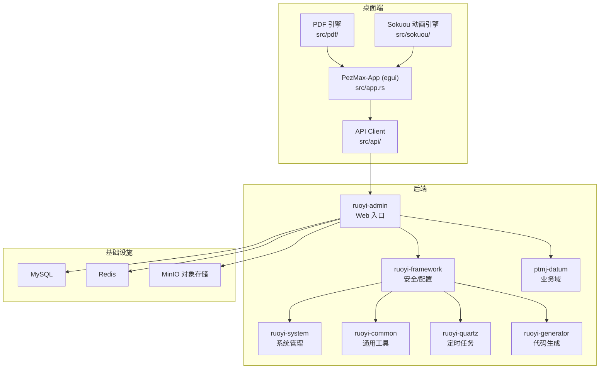
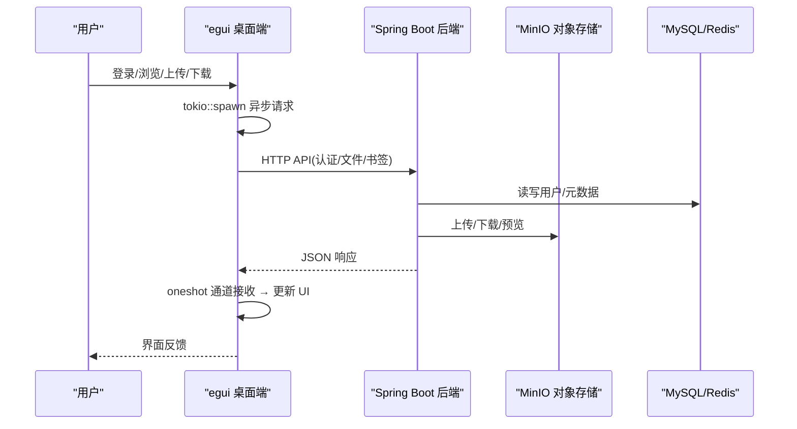
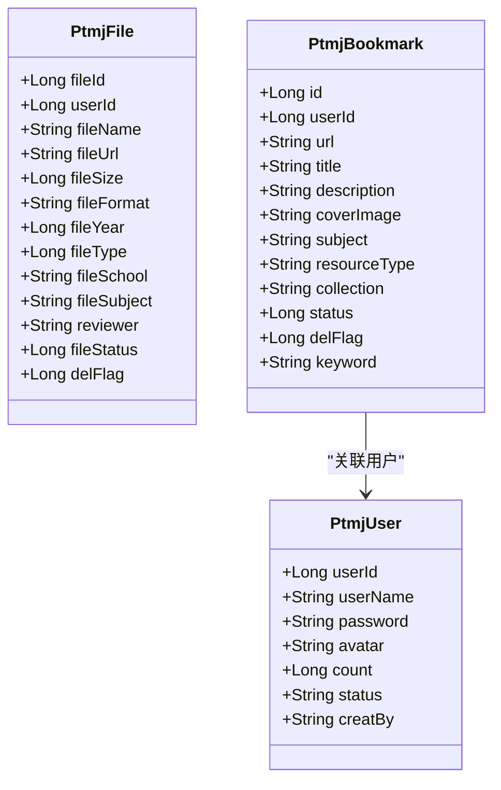
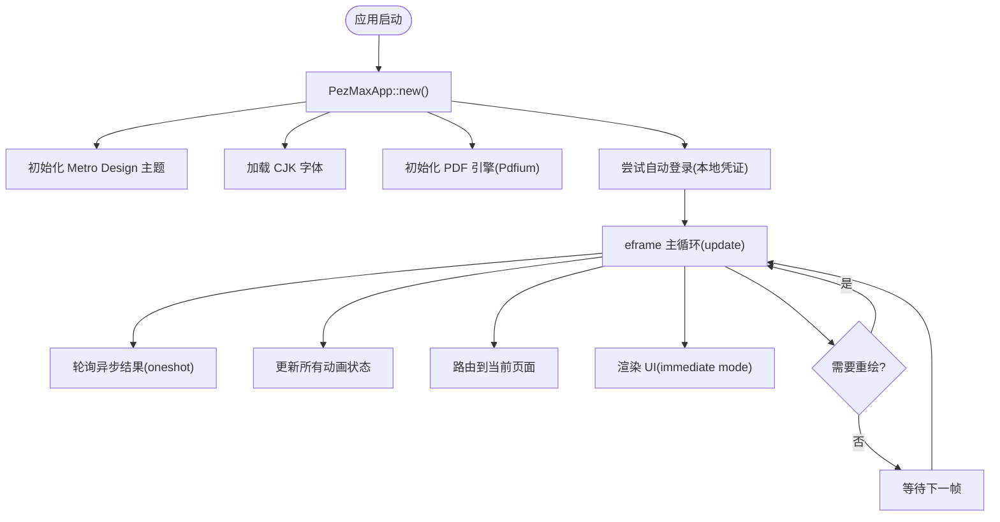
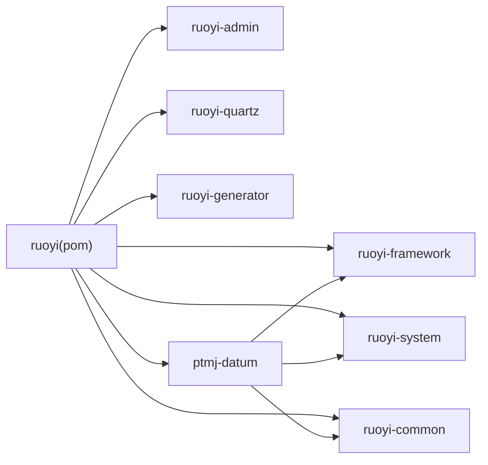

# 项目概述

<cite>
**本文引用的文件列表**
- [PezMax-Backend/README.md](file://PezMax-Backend/README.md)
- [PezMax-Backend/pom.xml](file://PezMax-Backend/pom.xml)
- [PezMax-Backend/ptmj-datum/pom.xml](file://PezMax-Backend/ptmj-datum/pom.xml)
- [PezMax-Backend/ruoyi-admin/src/main/java/com/ruoyi/RuoYiApplication.java](file://PezMax-Backend/ruoyi-admin/src/main/java/com/ruoyi/RuoYiApplication.java)
- [PezMax-Backend/ptmj-datum/src/main/java/com/ptmj/datum/domain/PtmjUser.java](file://PezMax-Backend/ptmj-datum/src/main/java/com/ptmj/datum/domain/PtmjUser.java)
- [PezMax-Backend/ptmj-datum/src/main/java/com/ptmj/datum/domain/PtmjFile.java](file://PezMax-Backend/ptmj-datum/src/main/java/com/ptmj/datum/domain/PtmjFile.java)
- [PezMax-Backend/ptmj-datum/src/main/java/com/ptmj/datum/domain/PtmjBookmark.java](file://PezMax-Backend/ptmj-datum/src/main/java/com/ptmj/datum/domain/PtmjBookmark.java)
- [Cargo.toml](file://PezMax-One/Cargo.toml)
- [src/main.rs](file://PezMax-One/src/main.rs)
- [src/app.rs](file://PezMax-One/src/app.rs)
</cite>

## 目录
1. [简介](#简介)
2. [项目结构](#项目结构)
3. [核心组件](#核心组件)
4. [架构总览](#架构总览)
5. [详细组件分析](#详细组件分析)
6. [依赖关系分析](#依赖关系分析)
7. [性能与可扩展性](#性能与可扩展性)
8. [快速开始](#快速开始)
9. [故障排查指南](#故障排查指南)
10. [结论](#结论)

## 简介
PezMax-One 是一个面向教育资料管理的全栈项目，包含后端 Spring Boot 服务、Rust 原生桌面客户端（egui）以及 Web 管理后台。项目聚焦于学习资料的高效组织与共享，提供文件上传下载、用户认证与权限控制、书签管理、PDF 预览等核心能力，并通过 MinIO 对象存储支撑海量资源。整体采用"后端微模块化 + Rust 原生桌面客户端"的架构，兼顾运行性能与资源占用。

## 项目结构
仓库采用前后端分离的多模块工程：
- 后端（PezMax-Backend，独立仓库）
  - ptmj-datum：业务领域模块（用户、文件、书签等）
  - ruoyi-admin：Web 入口与控制器
  - ruoyi-common：通用工具与常量
  - ruoyi-framework：框架配置与安全拦截
  - ruoyi-system：系统基础管理（用户、角色、菜单、字典等）
  - ruoyi-quartz：定时任务
  - ruoyi-generator：代码生成器
- 桌面端（PezMax-One，本仓库）
  - Rust + egui 原生桌面应用，immediate mode 即时渲染
  - 单进程架构，所有状态在 PezMaxApp 结构体中统一管理
  - 异步 HTTP 客户端通过 tokio::spawn + oneshot 通道与 UI 帧循环通信
  - 内置 Sokuou Engine 动画系统（SpringAnim + Progress + MetroAnim）
  - PDF 预览引擎（pdfium-render，Chrome 同款渲染引擎）
  - Metro Design 设计语言，支持深浅色平滑过渡与强调色切换

## 核心组件
- 后端核心
  - 启动入口：RuoYiApplication，扫描 com.ruoyi 与 com.ptmj 包，排除数据源自动配置以适配动态数据源。
  - 业务域：ptmj-datum 提供用户、文件、书签等实体与服务。
  - 安全与权限：基于 Spring Security + JWT + Redis 实现无状态鉴权与缓存。
  - 对象存储：集成 MinIO，支持大文件与直链访问。
- 桌面端核心
  - 单进程架构：PezMaxApp 结构体持有所有状态，页面为纯函数 `fn render(&mut PezMaxApp, &mut Ui)`。
  - 异步数据加载：`AsyncData<T>` 模式封装 tokio::spawn + oneshot，每帧轮询结果。
  - 二级导航：Section（首页/浏览/社区/个人）→ Subsection（子标签栏），SpringAnim 驱动平滑过渡。
  - Sokuou Engine：三种动画原语（SpringAnim 物理弹簧、Progress 缓动、MetroAnim UWP 风格）覆盖所有动效需求。
  - PDF 预览：pdfium-render 后台渲染，Grid/Line 双视图模式，支持缩放与缩略图总览。
  - Metro Design 主题：深浅色平滑过渡 + 5 种强调色预设，配色每帧插值实现无闪烁切换。

## 架构总览
后端采用分层与模块化设计：Controller → Service → Mapper → DB；通过框架层统一处理鉴权、日志、限流、异常等横切关注点。桌面端通过 HTTP 直接调用后端 API，UI 使用 egui immediate mode 每帧重建，异步 IO 通过 tokio 后台任务 + 消息通道回传。

## 详细组件分析

### 后端领域模型与业务边界
- PtmjUser：平台用户，含账号、头像、上传计数、状态等字段，密码仅写入不输出。
- PtmjFile：文件元数据，含名称、URL、大小、格式、年份、类型、学校、科目、审核状态等。
- PtmjBookmark：外部书签，含链接、标题、描述、封面、学科、资源类型、专栏、状态等。

### 桌面端单进程架构

桌面端采用 Rust + egui 原生架构，与 PezMax-Desktop（Electron + Vue 3 参考 repo）是两套独立的实现，核心差异：

- **UI 框架**：从 Electron 双进程（主进程/渲染进程）改为 egui immediate mode 单进程
- **语言**：从 JavaScript/TypeScript 改为 Rust
- **构建**：从 npm/electron-vite 改为 cargo
- **动画**：从 CSS/JS 动画改为 Sokuou Engine（SpringAnim + Progress + MetroAnim）
- **PDF 预览**：从浏览器内嵌 PDF 改为 pdfium-render 原生渲染
- **主题**：从 CSS 变量改为 Rust 运行时颜色插值（深浅色平滑过渡）

### 桌面端关键模块职责

- **app.rs**：PezMaxApp 状态结构体、eframe::App 实现、导航路由、异步数据管理
- **api/ 模块**：基于 reqwest 的 HTTP 客户端，按领域拆分（auth、file、bookmark、user、download 等）
- **theme/ 模块**：Metro Design 颜色系统、深浅色过渡动画、强调色预设、CJK 字体加载
- **components/**：侧边栏（SpringAnim 折叠动画）、顶栏、Toast 通知、底部操作栏
- **pages/**：登录、注册、忘记密码、仪表盘、资源管理、社区、个人中心等功能页面
- **pdf/ 模块**：PdfEngine 全局单例 + PdfViewer 文档状态，后台线程渲染，Grid/Line 双模式
- **sokuou/ 模块**：Sokuou Engine 动画系统，提供 SpringAnim（弹簧）、Progress（缓动）、MetroAnim（UWP 风格）三种原语

### 技术栈概览与选型理由
- Java 17 + Spring Boot 4.0.3：长期支持版本，生态成熟，结合 RuoYi 脚手架提升开发效率。
- Spring Security + JWT + Redis：无状态鉴权与高性能缓存，适合分布式与跨端场景。
- MyBatis + Druid：灵活 SQL 控制与连接池监控，便于性能调优。
- MySQL 8.0 + Redis：稳定关系型存储与高速缓存/队列。
- MinIO：兼容 S3 的对象存储，适合海量教育资源与直链访问。
- LibreOffice：文档转换与在线预览能力。
- Docker Compose：一键拉起数据库、缓存、对象存储与应用，降低部署复杂度。
- **Rust + egui**：原生桌面应用，零运行时开销，即时模式渲染，低内存占用。
- **Sokuou Engine**：自研动画系统，阻尼振荡器解析解，帧率无关，可中断。

## 依赖关系分析
后端为多模块 Maven 工程，顶层 pom 统一管理版本与依赖，子模块按需引入。

桌面端为单一 Rust crate，主要依赖：
- egui 0.31 / eframe 0.31：GUI 框架
- reqwest 0.12：HTTP 客户端
- pdfium-render 0.8：PDF 渲染引擎
- sled 0.34：嵌入式 KV 存储（本地缓存）
- image 0.25：图片解码
- tokio 1：异步运行时
- chrono 0.4：日期时间

## 性能与可扩展性
- 对象存储直链：MinIO 直链减少后端转发压力，适合大文件分发。
- 缓存与限流：Redis 作为热点数据与令牌缓存，配合限流注解保护接口。
- 桌面端即时模式：egui 仅重绘变化的区域，CPU/GPU 占用低。
- 异步非阻塞：tokio 运行时处理所有 HTTP 请求，不阻塞 UI 帧循环。
- 后台 PDF 渲染：pdfium 在后台线程渲染，限制并发数（3 个），保持 UI 响应。
- 容器化编排：Docker Compose 一键部署，便于横向扩展与灰度发布。

## 快速开始

### 后端（推荐 Docker Compose）
- 启动所有服务（MySQL、Redis、MinIO、Server）
- 查看运行状态与后端日志
- 端口说明：后端 API 8080、MinIO API 9000、MinIO Console 9001、MySQL 3306、Redis 6379

### 后端（本地开发）
- 环境要求：JDK 17、Maven 3.6+、MySQL 8.0、Redis
- 初始化数据库：执行 sql/pezmax.sql
- 修改数据库连接：ruoyi-admin/src/main/resources/application-druid.yml
- 启动服务：运行 com.ruoyi.RuoYiApplication

### 桌面端（Rust egui 原生应用）
- 环境要求：Rust 工具链（rustup、cargo）
- 构建运行：在 PezMax-One 根目录执行 `cargo run`
- 发布构建：`cargo build --release`
- 类型检查：`cargo check`
- 确保后端服务已启动并可访问（默认 http://154.8.139.48:8080）
- 可选依赖：pdfium.dll（PDF 预览，放在可执行文件目录）

## 故障排查指南
- 匿名访问限制：部分查询接口已开放匿名访问，若出现 401/403，检查接口是否标注匿名或是否需要携带 Token。
- 文件存储：确保 MinIO 容器正常且桶策略允许公开读；若无法预览，检查 URL 替换逻辑与网络可达性。
- 构建问题：Docker 构建前需执行 mvn clean package 保证依赖最新。
- **桌面端编译失败**：确保 Rust 工具链为最新（`rustup update`），检查 Cargo.toml 依赖版本兼容性。
- **PDF 预览不可用**：将 pdfium.dll 放置于可执行文件同目录下，或安装系统级 pdfium 库。
- **桌面端无法连接后端**：确认后端服务已启动且地址 154.8.139.48:8080 可达；检查网络代理与防火墙。

## 结论
PezMax-One 以成熟的 RuoYi 底座为基础，结合 Rust 原生桌面端技术，构建了覆盖"资料上传—管理—分享—预览—消费"的完整闭环。后端强调安全与可扩展，桌面端注重性能与交互体验（Sokuou Engine 动画系统、Metro Design 主题、PDF 原生渲染），二者通过清晰的 REST API 契约协同工作，适合在教育资料管理与协作场景中落地。